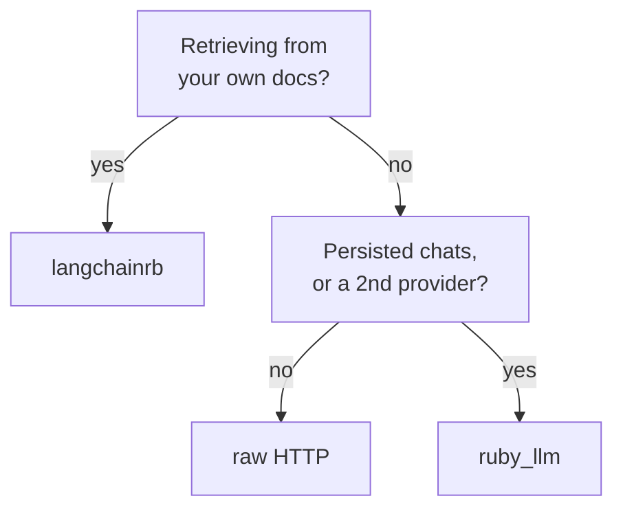

`ruby_llm` 1.16.0 ships `chat.rb`, `agent.rb`, `embedding.rb`, `cost.rb`, a model registry and an ActiveRecord integration. `langchainrb` 0.19.5 ships `vectorsearch/`, `chunker/`, `loader.rb`, `output_parsers/` and `evals/`.

`ruby_llm` talks to models; `langchainrb` finds the documents first and then hands them to a model. Most of the rest follows from which of those you need.



## What each one ships

| | ruby_llm 1.16.0 | langchainrb 0.19.5 |
|---|---|---|
| Providers shipped | 13 | 13 |
| Rails integration | generators, `acts_as`, Railtie | `langchainrb_rails`, a second gem |
| Cost in money | yes, per token class | token counts only |
| Vector search | no | 9 backends |
| Document loading + chunking | no | yes |

Raw HTTP is the third option and it is not in that table, because every cell would read "you write it". Its section is below.

Providers are a tie at thirteen each, so that row settles nothing.

Neither gem promises you a quiet upgrade, either. `langchainrb` at 0.19.5 makes no compatibility guarantee at all, and `ruby_llm` is past 1.0 but has shipped four schema upgrades inside minor releases - it ships `upgrade_to_v1_7`, `v1_9`, `v1_10` and `v1_14` generators to run them, plus an `acts_as_legacy` shim keeping the pre-1.7 API alive. Budget for migrations on either.

## The Rails gap

`ruby_llm` ships `lib/generators/ruby_llm/` with `install`, `agent`, `chat_ui`, `schema` and `tool`, plus an `acts_as` concern and a Railtie. The install generator writes five migrations and four model classes, because a persisted chat needs `Model`, `Message` and `ToolCall` records behind it. Once they exist, marking the model is two lines:

```ruby
class Chat < ApplicationRecord
  acts_as_chat
end

chat = Chat.create!(model: "claude-sonnet-4-5")
chat.ask("Summarise this ticket")   # persisted, with messages
```

langchainrb's Rails story lives in a second gem, `langchainrb_rails` 0.1.12, and it is worth opening rather than guessing at from the version number. It ships four generators - `pgvector`, `pinecone`, `chroma` and `prompt` - plus an ActiveRecord hook and a Railtie.

Look at what those generators are for. `ruby_llm`'s scaffold a conversation; `langchainrb_rails`' scaffold a vector store. Both gems brought their own centre of gravity into Rails, and neither is trying to cover the other's ground.

## Cost tracking, by token class

`ruby_llm`'s `Cost` object breaks spend down by token class - input, output, `cache_read`, `cache_write`, and `thinking`. Cached prompts and reasoning tokens bill at different rates from ordinary completion tokens.

That matters when a bill moves and you need to know which call changed. A single total tells you spend went up; a per-class breakdown tells you a prompt edit stopped your prompts hitting cache.

langchainrb gives you the counts but not the money - `prompt_tokens`, `completion_tokens` and `total_tokens` on every response, and running totals on `Assistant`. It has no notion of price, or of the cache and thinking classes that bill differently. You supply the price table and the arithmetic.

## When langchainrb wins

If the job is answering from your own documents, langchainrb ships what you would otherwise assemble by hand: loaders, chunkers, output parsers, an evals module, and vector search that already speaks pgvector, with eight other backends behind it if you outgrow it.

Reaching for `ruby_llm` and then hand-rolling chunking and a pgvector wrapper is how you end up maintaining a worse copy of a gem that already exists. Our [LangChain in Ruby guide](/blog/getting-started-langchain-ruby-complete-guide/) covers that path in depth.

## When raw HTTP wins

You are making one call to one provider, and you have no plans to add a second. A `Net::HTTP` POST against the endpoint is about fifteen lines with no upgrade path to worry about.

What you keep writing yourself is the boring layer: retries, streaming chunk parsing, token accounting, and a provider swap that touches every call site. Ship it for one feature. Do not build a product's model layer on it.

## Using both

They compose. langchainrb handles retrieval, `ruby_llm` handles the conversation and the cost accounting.

Let one gem own the model call. If both build requests to the same provider you get two retry policies and two streaming parsers, and when the payload shape changes you debug both.

That failure is quieter than it sounds. We moved all nine schemas in one pipeline onto a different schema library, and every request body changed shape - [all 1549 tests stayed green](/blog/debugging-rubyllm-agents-rails/), because VCR's default matcher is `[:method, :uri]` and neither of those changed. A second gem constructing its own requests doubles the surface where that can happen.

Put an eval harness in front of it early. [Scoring agent output](/blog/evaluating-rubyllm-agents-rails/) is what tells you whether a retrieval change helped or hurt. Without one, you tune a chunk size and grade the result by reading four answers and deciding they look better.

## Sources

- [ruby_llm on GitHub](https://github.com/crmne/ruby_llm) - source, changelog, provider list
- [ruby_llm documentation](https://rubyllm.com/) - guides and the Rails integration
- [langchainrb on GitHub](https://github.com/patterns-ai-core/langchainrb) - source and the vectorsearch modules
- [langchainrb_rails](https://github.com/patterns-ai-core/langchainrb_rails) - the Rails companion gem
- [RubyGems: ruby_llm](https://rubygems.org/gems/ruby_llm) - released versions
- [RubyGems: langchainrb](https://rubygems.org/gems/langchainrb) - released versions

<!-- Reference cadence: thoughtbot -->
