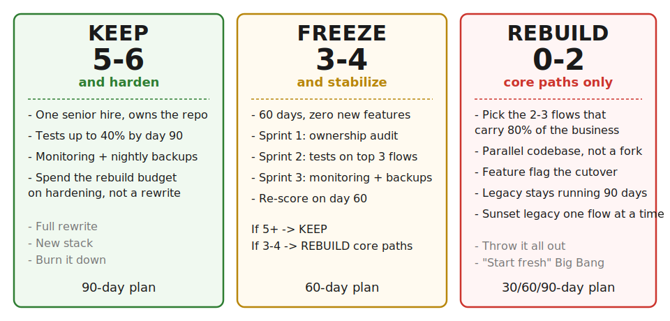
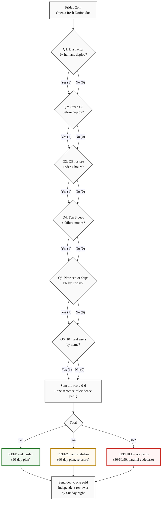
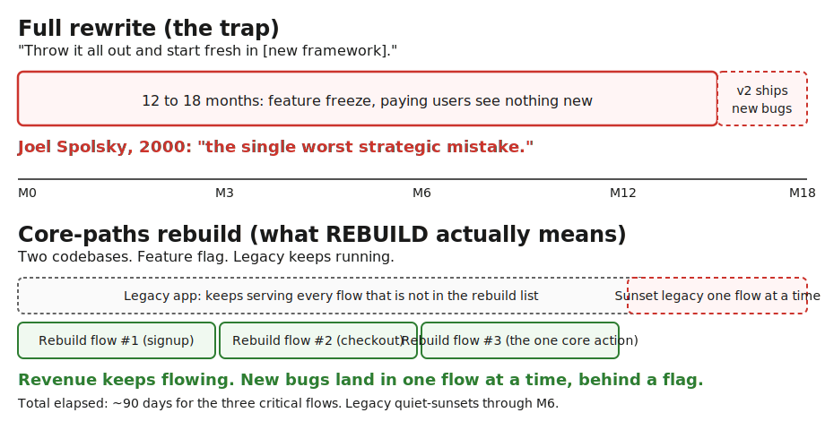

> **Module 6 · Step 1 of 2** · [Tech for Non-Technical Founders 2026](/blog/tech-for-non-technical-founders-2026/) free course.
> Input: a failed Friday demo / dropped milestone / runaway invoice. Output: a documented KEEP / FREEZE / REBUILD decision with a 30/60/90 day plan.

What if the codebase that scored a zero on Friday is the one you keep, and the codebase that scored a five is the one you rebuild? It happens. A vertical-SaaS founder running a clinic-scheduling app finished the six-question audit at a 5 - tests, backups, two deployers, the works - and still chose REBUILD because question six (real users) came back as a hard zero. A B2B founder running an inventory tool scored a 1 on the same audit and chose KEEP because every question that came back zero was a one-week fix and her users were paying. The score is the diagnostic. The verdict is the conversation the score forces you to have.

The verdict is also not the part that costs money. The paralysis is.

## Why founders stay stuck mid-decision

Two forces pin a non-technical founder at the salvage-vs-rebuild crossroad for weeks at a time. The first is sunk cost. You are looking at $80K and twelve months of your name attached to the previous shop's work. Walking away from that codebase feels like walking away from the year. The brain treats the decision as a confession instead of a triage step. [Daniel Kahneman's prospect theory](https://en.wikipedia.org/wiki/Prospect_theory) names exactly this asymmetry - losses sting roughly twice as much as equivalent gains, so the founder who has burned $80K resists any verdict that closes the loss.

The second force is no framework. The three consultants you call all give you a different answer because each is selling a different thing - one wants to lead the rebuild, one wants to retain the existing team, one wants to insert a fractional CTO between you and the work. Without a shared rubric the conversation never converges. The 6-question tree is the rubric. It does not pick the answer for you. It forces every consultant, including you, to argue from the same six numbers.

## The 6 questions (one line each)

Full text, scoring, evidence rules, and the independent-reviewer protocol live in the [Salvage vs Rebuild Decision Tree](/blog/salvage-vs-rebuild-decision-tree/) artifact. Here is the one-line version, in the order you score them:

1. **Bus factor.** Can two or more humans deploy production today without help?
2. **Test coverage signal.** Is there any green CI pipeline that runs before a deploy?
3. **Database health.** Can someone restore last night's database to staging in under four hours?
4. **Architecture sanity.** Can you name the top three external services and what breaks when each goes down?
5. **Onboarding time.** Would a senior engineer hired Monday ship one PR to staging by Friday?
6. **Customer signal.** Are 10+ paying or weekly-engaged real users using the app, by name?

One Notion doc. Six rows. Score each 0 or 1 with one sentence of evidence. Total time: 30 minutes. The doc goes to one independent reviewer for a 30-minute paid second opinion before you commit.

## The 3 verdicts in practice

The score lands you in one of three columns. Each column is a 30/60/90 day plan, not a label.

**KEEP and harden (5-6).** The codebase is salvageable. The rebuild budget you were about to write a check for goes into one senior hire who owns the repo, raising test coverage to 40% by day 90, and turning on monitoring. You do not rewrite. The B2B inventory founder above scored a 1 the first time she ran the audit and a 5 sixty days later, after one stabilization sprint and a paid 30-minute review with a fractional CTO. Her plan: keep the existing app, fix the three things that scored zero, ship her next feature on top. Total cash: about $18K over two months. The checklist version of KEEP is in the [decision tree artifact](/blog/salvage-vs-rebuild-decision-tree/) under "What to do after."

**FREEZE and stabilize (3-4).** No new features for 60 days. Three sprints: one on access ownership (run the [GitHub / AWS / database checklist](/blog/ownership-checklist/) the same Friday), one on adding tests around the top three flows, one on monitoring and backups. Re-score on day 60. Climb to 5+, you keep. Stay at 3-4, you rebuild the core paths. FREEZE is the most common verdict on the first pass. It is also the verdict that buys you the most optionality - sixty days of stabilization is cheap insurance against committing to either direction prematurely.

**REBUILD core paths (0-2).** Not a full rewrite. Identify the two or three highest-traffic flows your users repeat - signup, checkout, the one core action - and rebuild THOSE on a parallel codebase. Migrate users behind a feature flag. Keep the legacy system running for everything else for 90 days, then sunset it one flow at a time. The clinic-scheduling founder above scored a 5 on the audit but still picked REBUILD because her customer-signal answer was zero - the 38,000 lines of code were healthy and unused. Healthy unused code is not a salvage candidate. It is a museum.

A score of 0 is not a "burn it down" verdict. The legacy code keeps running while you carve out the parts that matter and rebuild them with tests, monitoring, and one engineer who owns them. The math behind that rule is in the next section.

## The mistake: REBUILD does not mean full rewrite

The most expensive misreading of a 0-2 score is "we are starting fresh in [new framework] and throwing the old code away." [Joel Spolsky called the full-rewrite trap](https://www.joelonsoftware.com/2000/04/06/things-you-should-never-do-part-i/) "the single worst strategic mistake any software company can make" in 2000, and the math has not changed in twenty-six years. A full rewrite buys you a 12 to 18 month feature freeze in exchange for a new codebase with its own undiscovered bugs and the same business logic re-implemented from scratch. The bugs you fixed in the old code are now back, hidden, waiting for a customer to find them. Meanwhile your paying users see nothing new for a year and a half.

REBUILD in the verdict above means the two or three flows that carry the business, on a parallel codebase, behind a feature flag, with the legacy app still running. The vertical-SaaS founder who scored a 5 and still picked REBUILD did not throw out 38,000 lines of code. She picked the three flows her future paying users would touch - signup, the one scheduling action, and the appointment-confirmation email - rebuilt them on a fresh repo over ten weeks, then redirected new signups to the new app while the legacy app served the seven existing pilot accounts for ninety more days. By day 100 the legacy app was off. Total downtime for any user: zero.

The honest test for "is this a rebuild or a rewrite?": after you ship, do paying users still have the legacy app available for the flows you did not touch this sprint? If yes, it is a rebuild. If no, it is a rewrite, and Spolsky's math is about to find you.

## The Rails / Django / Laravel angle

Most non-technical founders who reach Module 6 reach it carrying a Vibe-coded prototype - something a junior generated in a weekend with Cursor or Lovable, plus three months of patches by an agency that pretended the prototype was a foundation. The prototype is rarely the thing you rebuild on. The prototype is what taught you the user flow. That is its job. When the audit fires REBUILD, the production rebuild usually lands on Rails, Django, or Laravel for the same reasons [DHH made the One Person Framework argument](https://world.hey.com/dhh/the-one-person-framework-711e6318): one full-stack engineer can own the whole stack, the framework defaults solve the boring problems, and the cost-per-shipped-feature stays small enough for a founder-led team to absorb.

The clinic-scheduling rebuild above moved from a Next.js + tRPC + Supabase prototype that nobody on the team could deploy without two-hour onboarding to a Rails app that the new senior engineer deployed end-to-end on day three. The user flow she carried over from the prototype was the only artifact that mattered. The prototype's code did not survive. Its lessons did. [Stack Overflow's 2024 Developer Survey](https://survey.stackoverflow.co/2024/technology#most-popular-technologies-webframe) still ranks Rails and Django in the top half of web frameworks by satisfaction precisely because the framework absorbs the decisions a small team should not be making. Pick the framework that the next hire can ship inside on day three, not the framework that won last year's HackerNews thread.

If your team's argument is "we should rebuild it in [microservices/event-driven/serverless]," ask the same question Module 2.3 asks of every spec: which user-facing outcome from the next 90 days demands that architecture this sprint? If the team cannot name an outcome, the architecture is the resume talking. The framework default is the right answer until the outcome shows up.

> The score is the diagnostic. The verdict is the conversation it forces. Run the audit alone Friday afternoon, send the score to one independent reviewer, and the two-week paralysis collapses into a 30-minute call.

## What to do tomorrow

- **Block 30 minutes on your calendar this Friday afternoon.** Title it *Salvage decision*. Bring the five inputs the artifact lists - latest code-health note, bug backlog count, test coverage percent (write 0 if nobody tracks it), AWS or Heroku bill trend, and the original SOW.
- **Email one fractional CTO or independent reviewer today** asking for a 30-minute paid review on Monday or Tuesday. Budget: $300-$500. The reviewer must not be on the team that wrote the code or the agency you are about to hire to rebuild it.
- **Download the [Salvage vs Rebuild Decision Tree](/blog/salvage-vs-rebuild-decision-tree/) and run it Friday alone.** Score the six questions in a fresh Notion doc, paste the score into the Monday review email Sunday night, and you have the verdict + the second opinion before next week's standup.

If the verdict comes back FREEZE or REBUILD and the previous team is still around, the next reads are the [dev shop red flags checklist](/blog/dev-shop-red-flags-checklist/) and the [step-by-step exit guide](/blog/fire-dev-shop-guide/). If the verdict is KEEP, run the [GitHub / AWS / database ownership checklist](/blog/ownership-checklist/) the same Friday to confirm you actually own what you just decided to harden.

## Continue the course

This is **Module 6 · Step 1 of 2** in the free [Tech for Non-Technical Founders 2026](/blog/tech-for-non-technical-founders-2026/) course - 8 modules from idea to first paying users. Module 6 (When Things Break) opens with this post. Step 2 closes the module.

| # | Module | Output you walk away with |
|---|---|---|
| 0 | Where Are You? | Self-assessment + your starting module |
| 1 | Validate the Problem | One-page validated problem statement |
| 2 | Design the Solution | One-page Product Brief (Vibe PRD) |
| 3 | Choose Your Build Path | Build decision: self-serve or hire |
| 4A | Ship Self-Serve (branch) | Live MVP at a staging URL |
| 4B | Hire & Ship (branch) | Signed SOW, kickoff scheduled |
| 5 | Manage Your Build | Weekly oversight rhythm |
| **6** | **When Things Break** ← you are here | **Salvage / rebuild decision** |
| 7 | Manage AI-Era Risks | AI interrogation system |

**In Module 6 · When Things Break**: 6.1 **Salvage or Rebuild? A 6-Question Decision Tree** ← you are here · 6.2 The Recovery Sprint - Your First 30 Days After REBUILD (next).

## Further reading

- Joel Spolsky, [Things You Should Never Do, Part I](https://www.joelonsoftware.com/2000/04/06/things-you-should-never-do-part-i/) (2000) - the canonical full-rewrite warning. Twenty-six years on, the math still holds: the rewrite gets you a 12-18 month feature freeze in exchange for a fresh batch of undiscovered bugs.
- DHH, [The One Person Framework](https://world.hey.com/dhh/the-one-person-framework-711e6318) - the argument for staying inside framework defaults so a single full-stack engineer can own the whole stack. The yardstick for "is this rebuild small enough for our team?"
- Martin Fowler, [Strangler Fig Application](https://martinfowler.com/bliki/StranglerFigApplication.html) - the architectural pattern for rebuilding flows on a parallel codebase while the legacy app keeps serving traffic. Names the technique the REBUILD verdict uses.
- Daniel Kahneman, [Prospect Theory: An Analysis of Decision under Risk](https://en.wikipedia.org/wiki/Prospect_theory) (1979) - the loss-aversion math behind the sunk-cost paralysis that keeps founders stuck for weeks. Loss stings ~2x more than equivalent gain, so the $80K already spent feels like the verdict, not the input.
- Michael Feathers, [Working Effectively with Legacy Code](https://www.oreilly.com/library/view/working-effectively-with/0131177052/) (2004) - the source of the "characterization tests" technique most senior engineers use when they pick up a 0-coverage codebase you scored as a 0 on Q2. The first move on KEEP and FREEZE.
- Stack Overflow, [Developer Survey 2024 - Most Popular Web Frameworks](https://survey.stackoverflow.co/2024/technology#most-popular-technologies-webframe) - Rails, Django, and Laravel rank in the top half of frameworks by developer satisfaction. The signal for "this framework absorbs the boring decisions a small team should not be making."
- Basecamp / Ryan Singer, [Shape Up - Appetite, Not Estimates](https://basecamp.com/shapeup/1.2-chapter-03) - the framing that lets you cap the rebuild at 90 days instead of letting it expand into a full rewrite. The circuit breaker that turns REBUILD into a fixed-time bet.

---

*Built by JetThoughts as part of the free Tech for Non-Technical Founders 2026 curriculum. See the full curriculum at [/blog/tech-for-non-technical-founders-2026/](/blog/tech-for-non-technical-founders-2026/).*
