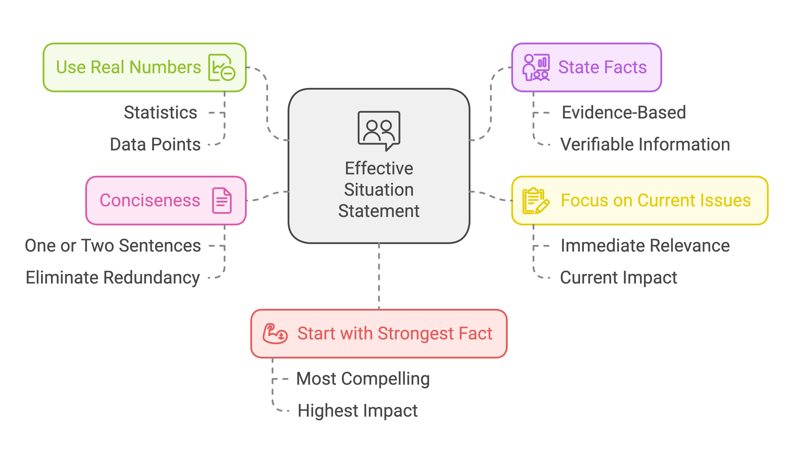
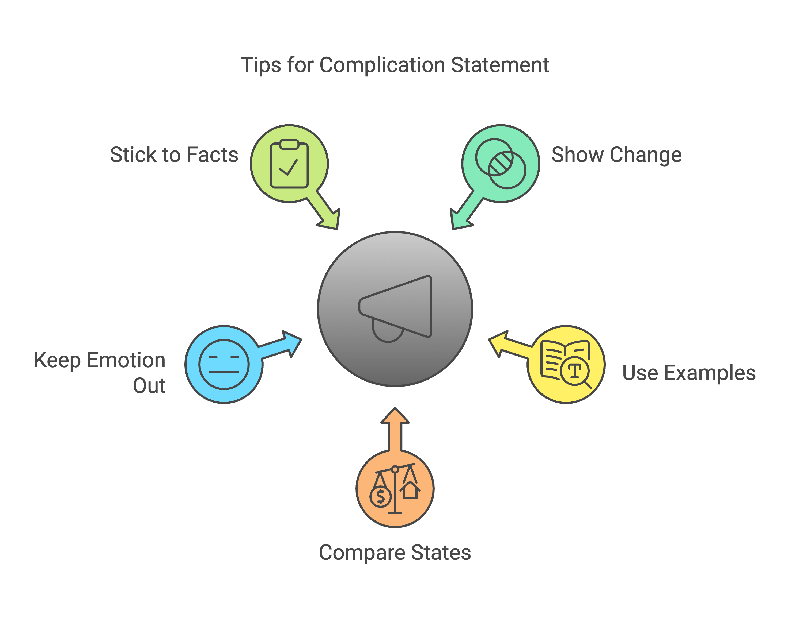
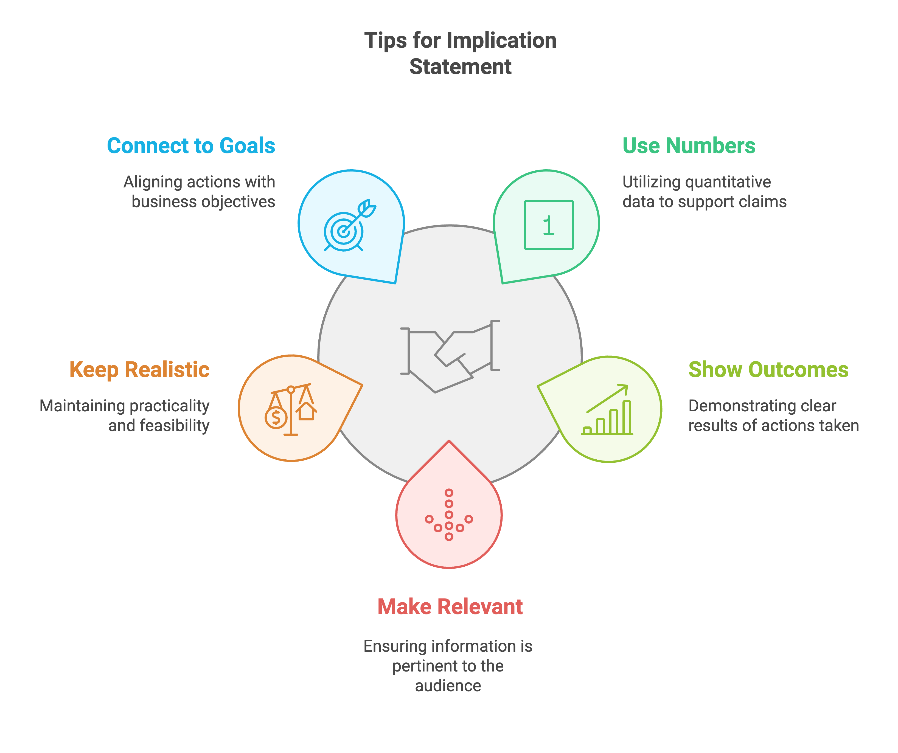

## What is SCIPAB?

SCIPAB helps you make your point fast. Think of it as a recipe for clear business communication. Each letter stands for a step in your message. Business moves fast. Your communication must keep up. SCIPAB cuts through noise and gets to the point.

Many leaders struggle with clear communication. Messages get lost. Meetings run long. Decisions stall. SCIPAB fixes these problems.

## Why SCIPAB Works

Your brain loves stories. SCIPAB turns business messages into mini-stories. Each part builds on the last. This makes your message stick. Your audience follows along. They remember what matters.

Good stories move people to act. SCIPAB builds these stories step by step. No guessing. No confusion. Just clear paths to decisions.

## The Six Steps in Detail

### S = Situation

Start with what's happening now. Paint the picture. Use facts. Keep it short.

Strong Examples:

- "Our app has 10,000 users."
- "Sales hit $1M last quarter."
- "Customer support handles 100 tickets daily."

Weak Examples:

- "Things are going well." (too vague)
- "We have lots of users." (no numbers)
- "The situation is complex." (says nothing)

Tips for Situation:

1. Use real numbers
2. State facts, not opinions
3. Focus on what matters now
4. Keep to one or two sentences
5. Start with your strongest fact

### C = Complication

Share what's changed. Show the problem. Make it real.

Strong Examples:

- "A new competitor cut their prices by 50%."
- "Server costs doubled this month."
- "Three key developers quit."

Weak Examples:

- "Things got harder." (too vague)
- "We face challenges." (what challenges?)
- "The market changed." (how?)

Tips for Complication:

1. Show the change clearly
2. Use specific examples
3. Compare before and after
4. Keep emotion out
5. Stick to facts

### I = Implication

Show what happens if nothing changes. Paint the future. Make it matter.

Strong Examples:

- "We'll lose 30% of our customers."
- "Costs will eat all our profit."
- "Product launch will delay six months."

Weak Examples:

- "Things will get worse." (how?)
- "We'll have problems." (what kind?)
- "It won't be good." (why not?)

Tips for Implication:

1. Use numbers when possible
2. Show clear outcomes
3. Make it relevant
4. Keep it realistic
5. Connect to business goals

### P = Position

Tell them your fix. Be clear. Show confidence.

Strong Examples:

- "Let's launch the mobile app now."
- "We need to hire three developers."
- "We should change our pricing."

Weak Examples:

- "We should do something." (what?)
- "Let's make changes." (which ones?)
- "We need to improve." (how?)

Tips for Position:

1. One clear solution
2. Keep it simple
3. Make it actionable
4. Show why it works
5. Link to the problem

### A = Action

Tell them what to do next. Be specific. Make it clear.

Strong Examples:

- "Sign the contract today."
- "Approve the $50K budget."
- "Join the planning meeting Tuesday."

Weak Examples:

- "Think about it." (too vague)
- "Let me know." (no timeline)
- "We should move forward." (how?)

Tips for Action:

1. One clear ask
2. Set deadlines
3. Name owners
4. Show next steps
5. Make it easy to say yes

### B = Benefit

Show them the payoff. Make it count. End strong.

Strong Examples:

- "Sales will grow 40%."
- "Save $100K per month."
- "Launch two months faster."

Weak Examples:

- "Things will improve." (how much?)
- "We'll do better." (at what?)
- "It will help." (how?)

Tips for Benefit:

1. Use numbers
2. Show clear wins
3. Link to goals
4. Make it matter
5. End with impact

## Real Examples in Different Settings

### Board Meeting Example

Situation:
"We have 100,000 active users. Growth is 10% monthly."

Complication:
"Amazon just launched a competing product at half our price."

Implication:
"We could lose 40% of our users in six months."

Position:
"We need to launch our mobile app now, not next year."

Action:
"Approve $200K for three mobile developers today."

Benefit:
"We'll keep our users and grow 20% faster than planned."

### Sales Team Update

Situation:
"Our sales team hits quota 80% of the time."

Complication:
"Deal cycles stretched from 30 to 45 days this quarter."

Implication:
"We'll miss our yearly target by $2M at this pace."

Position:
"We need to update our sales process."

Action:
"Roll out new training next week."

Benefit:
"Close deals 30% faster by Q4."

### Customer Email

Situation:
"You've been our customer for two years."

Complication:
"Our costs rose 30% this year."

Implication:
"We can't maintain current service levels at this price."

Position:
"We're updating our pricing structure."

Action:
"Choose your new plan by June 1."

Benefit:
"Get more features and faster support."

## Tips for Different Formats

### Meetings

1. Write key points first
2. Time yourself
3. Bring visuals
4. Leave time for questions
5. Send follow-up notes

### Emails

1. Clear subject lines
2. Short paragraphs
3. Bold key points
4. Use bullet lists
5. End with actions

### Presentations

1. One idea per slide
2. Big, clear text
3. Simple charts
4. Real examples
5. Strong close

## Common Mistakes to Avoid

### Don't Hide Bad News

- Share problems early
- Show real numbers
- Offer solutions
- Stay professional
- Follow up fast

### Don't Skip Steps

- Use all six parts
- Keep them in order
- Give each part time
- Make each part clear
- Check your work

### Don't Overcomplicate

- Skip the jargon
- Use simple words
- Keep sentences short
- Make points clear
- End with action

## Success Metrics

Know if your SCIPAB works by checking:

1. Time to decision
2. Questions asked
3. Action taken
4. Results achieved
5. Feedback received

## Getting Started

### Week One

1. Write one SCIPAB
2. Time yourself
3. Get feedback
4. Make changes
5. Try again

### Month One

1. Use in three meetings
2. Write five emails
3. Make one presentation
4. Check results
5. Adjust your style

### Quarter One

1. Make it natural
2. Train your team
3. Track results
4. Share wins
5. Keep improving

## Key Takeaways

1. SCIPAB makes messages clear
2. Practice makes perfect
3. Keep it simple
4. Use real numbers
5. End with action

## Next Steps

1. Pick one meeting this week
2. Write your SCIPAB
3. Time yourself
4. Give it a try
5. Get feedback

SCIPAB turns good ideas into clear messages. Start small. Use it once. See what works. Build from there.
