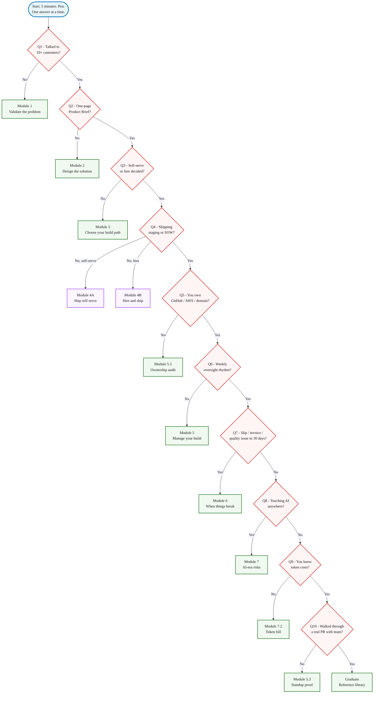

📋 Template companion to the [Module 0 entry post](/blog/course-map-self-assessment-non-technical-founder-2026/). Print, fill in 5 minutes, write your starting module at the top of a Notion doc.

# Where Are You in the Founder Journey? The 10-Question Self-Assessment

*Five minutes alone with a checklist tells you which module to start with.*

## Why this exists

Three founders we picked up in Q2 2026 all opened their first call with the same sentence: "help my team ship." We ran each of them through the 10 questions below and they routed to three different modules. A HealthTech founder needed Module 5 - her team was shipping, she just had no way to see it. A consumer-app founder needed Module 1 - her problem wasn't validated and the team was building the wrong thing. A B2B SaaS founder needed Module 6 - her team had quietly missed three milestones and was lying to her face about progress. Same sentence on the phone, $29K of monthly burn between them, three different starting points. None of them had taken 5 minutes alone with a worksheet before paying the next agency invoice. This worksheet is what they should have done first.

## How to use it

Run the diagnostic on a **Friday afternoon, alone**, with a pen and a printed copy of this sheet. 5 minutes if you're honest, longer if you're stalling. No laptop in the room. No co-founder yet, no agency on the call.

For each question, mark **Y** or **N** in the checkbox, then follow the routing line. The first question you answer N or Yes-to-trouble is your starting module. Stop the diagnostic there - the rest of the questions assume you've already passed the earlier ones.

When you're done, write your **starting module + next deliverable** at the top of a fresh Notion doc. That sentence is your course contract. Re-take this quiz in 60 days to confirm you progressed.

## The 10 questions

| # | ☐ | Question | Routing |
|---|---|---|---|
| 1 | ☐ Y / ☐ N | Have you talked to 10+ potential customers about the problem you want to solve? | **N** → Module 1. **Y** → Q2. |
| 2 | ☐ Y / ☐ N | Do you have a one-page written Product Brief (what you're building, for whom, why now)? | **N** → Module 2. **Y** → Q3. |
| 3 | ☐ Y / ☐ N | Have you decided whether to ship self-serve or hire a team? | **N** → Module 3. **Y** → Q4. |
| 4 | ☐ Y / ☐ N | Are you actively shipping software (you have a staging URL real users can click, OR a signed contract with a team)? | **N** → Module 4A (self-serve) or 4B (hire) based on Q3. **Y** → Q5. |
| 5 | ☐ Y / ☐ N | Do you own the GitHub org, AWS root account, domain registrar, and database under your company email? | **N** → Module 5 (start with 5.5 Ownership Audit). **Y** → Q6. |
| 6 | ☐ Y / ☐ N | Are you running a weekly oversight rhythm (Friday demo + standup with the 3 questions + plain-English weekly report)? | **N** → Module 5. **Y** → Q7. |
| 7 | ☐ Y / ☐ N | In the last 30 days, has your team had a milestone slip, a runaway invoice, or a quality issue you can't diagnose? | **Y** → Module 6. **N** → Q8. |
| 8 | ☐ Y / ☐ N | Does your product or team touch AI (Cursor, ChatGPT, vibe coding, AI agents, LLM calls in production)? | **Y** → Module 7. **N** → Q9. |
| 9 | ☐ Y / ☐ N | Do you understand the AI token costs your team is passing through to your invoice? | **N** → Module 7.2. **Y** → Q10. |
| 10 | ☐ Y / ☐ N | Have you ever asked your team to walk you through a real PR they reviewed last week? | **N** → Module 5.3. **Y** → graduate; the curriculum is your reference library now. |

## Routing summary

Questions 1-3 catch founders who are pre-build. Most early-stage readers stop there and route to Module 1, 2, or 3. Question 4 splits the build path: self-serve goes to Module 4A, hire goes to Module 4B. Questions 5-7 catch founders mid-build whose oversight is missing. Questions 8-10 catch founders with AI risks layered on top of an otherwise healthy build.

## What good looks like vs what bad looks like

**Q1 - have you talked to 10+ potential customers?**

> Bad: "I asked three friends and my co-founder and they said it sounds cool. Two said they'd buy it."
> Good: "I talked to 10 people who match the ICP I sketched. Eight described a real workaround they currently use; three offered to pre-pay. I have notes for each conversation."

Friends-saying-it's-cool is a polite agreement, not validation. The number 10 is the floor that lets you see the pattern - what they currently do, where they get stuck, what they would actually pay for. If you can't list 10 names today, the answer is N and Module 1 is your starting point. The [stop-AI-obsession validation post](/blog/stop-ai-obsession-smart-way-validate-your-startup-idea-product-bootstrap/) covers the texture of a real conversation.

**Q5 - do you own the GitHub org, AWS root, domain, database?**

> Bad: "My contractor created the GitHub org under his Gmail because that was faster on Day 1. We were going to fix it later."
> Good: "I own the GitHub org under `founder@mycompany.com`. AWS root is the same email. Stripe is in my name. The domain is in my Cloudflare account. Database password lives in my 1Password vault."

If the agency or contractor owns the accounts, you don't have a company - you have a project they can lock you out of in 10 minutes. The bad answer here is so common that we wrote [a 12-item ownership audit](/blog/engineering-org-chart-non-technical-founder/) for it. The 14-day domain-transfer window under ICANN rules means by the time you discover it, you can't fix it quickly. N on Q5 means start Module 5 with the Ownership Audit before anything else in Module 5.

## What to do after

- **Write your starting module + next deliverable** at the top of a fresh Notion doc. Example: *"Starting Module 1. Next deliverable: 10 customer interviews booked by Friday."* That sentence is your contract with yourself.
- **Read that module's first post tonight.** One post, 15 minutes. The course works because each module's first post tells you the next thing to do this week, not all the things to do over a quarter.
- **Re-take this quiz in 60 days.** If you moved one module forward, the course is working. If you stayed put, the issue is the time you are not giving yourself, not the curriculum.

---

Built by JetThoughts as part of the free Tech for Non-Technical Founders 2026 curriculum. See the full curriculum at [/blog/tech-for-non-technical-founders-2026/](/blog/tech-for-non-technical-founders-2026/).
