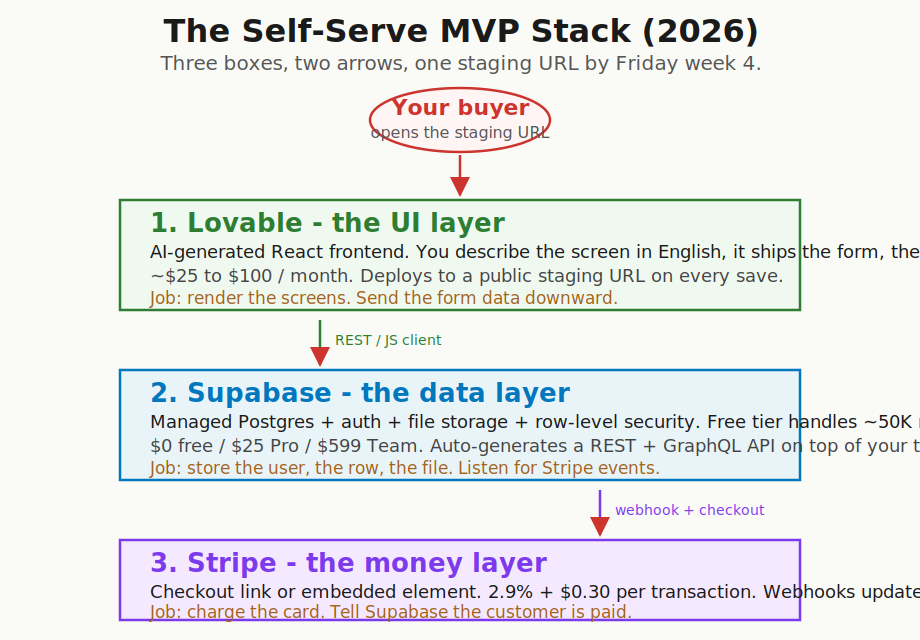
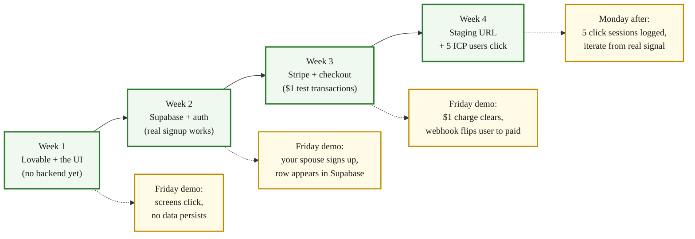

> **Module 4A · Step 1 of 2** · [Tech for Non-Technical Founders 2026](/blog/tech-for-non-technical-founders-2026/) free course.
> Input: a Module 3.1 decision pointing to "self-serve" + a Vibe PRD. Output: a live MVP at a staging URL real users can click, by Friday week 4.

"I shipped my MVP in four weeks for $87. Three customers paid before I built the second feature." That was a B2B SaaS founder I spoke with last month. She had never written a line of code. She had spent two months running [Mom Test calls](/blog/mom-test-ask-about-past-not-future/) before she touched a single tool. The four weeks she counts started after the [Vibe PRD](/blog/vibe-prd-template/) was signed by two advisors and the [build-path decision tree](/blog/should-you-hire-2026-decision-tree/) routed her to Path 2. The stack she used is the one this post is about.



## Why this matters in 2026

[Y Combinator's 2026 stance](https://www.ycombinator.com/library/) is direct: validate without code, then ship the simplest version with AI tools. The Lovable + Supabase + Stripe stack is the dominant 2026 path for self-serve founders because all three tools were built AI-first, the documentation is exhaustive, and the integrations between them are templated to the point of being boring. Boring is what you want for an MVP. The boring path also lets one non-technical founder ship the full loop (signup, paid onboarding, the one feature that solves the validated problem) without ever opening a terminal. The cost to disprove your hypothesis is one weekend and $87. The cost to prove it is the same.

## What each tool does (in plain English)

Pre-seed founders ask "which framework" before they ask "which job." Three tools, three jobs. The boundaries between them are the only architecture you need to know on day one.

### Lovable - the UI layer

Lovable is an AI-powered builder for the screens. You describe an app in English: *"a dashboard for fitness coaches to log client check-ins, with a weekly export to CSV"*, and Lovable generates a working web frontend with proper component structure, routing, and form validation. Every save deploys to a public staging URL you can paste into a Slack message. [Lovable's pricing tiers in 2026](https://lovable.dev/pricing) run $0 (Free, capped messages), $25/mo (Pro), $50/mo (Business), and $100/mo (Scale, the tier most paying-MVP founders settle on after the first month). The key thing it does not do well: heavy backend logic, complex auth flows, anything custom on the database side. That is what Supabase is for.

### Supabase - the data layer

Supabase is managed Postgres + auth + file storage + row-level security in one console. Lovable's built-in storage is fine for a prototype; Supabase is what you connect when you have real users whose data has to survive a redeploy. The free tier handles up to 50,000 monthly active users and 500MB of database before you have to upgrade. Pro is $25/month and most pre-seed founders never outgrow it before they hit the architectural ceiling. Supabase auto-generates a REST API and a JavaScript client on top of any table you create, which is what Lovable calls when it needs to read or write a row. [Supabase's 2026 pricing](https://supabase.com/pricing) lists the bands clearly. The auth product replaces 80% of what founders used to pay Auth0 or Clerk for; the row-level security policies replace what a contractor would have hand-coded over two weeks.

### Stripe - the money layer

Stripe processes the payment. The 2026 default integration for a Lovable app is [Stripe Checkout](https://docs.stripe.com/payments/checkout) (a hosted page Lovable can link to with one line) plus a webhook into Supabase that updates the user's subscription status when the charge succeeds. The fee is the standard [2.9% + $0.30 per transaction](https://stripe.com/pricing) for cards in the US; international, Klarna, ACH, and other rails have their own bands. There is nothing custom about this in 2026. Every founder hits the same Checkout integration; the documentation has been refined over a decade of pre-seed founders running the exact same setup.

### GitHub for version control

Free for solo founders on the Free plan. You will not write much code yourself, but Lovable can sync to a GitHub repo on every save, which means: (a) you have a backup if Lovable goes down or you cancel the subscription, (b) when you eventually hire a contractor or a Fractional CTO, the code is already in a place they can read. Set this up in Lovable's Settings on day one. Skipping this is the most common reason founders we pick up six months later cannot retrieve the source.

## The 4-week ship plan

Four weeks, one founder, the Vibe PRD already signed. Each week ends with one demo to one human (a friend, an advisor, your spouse, the dog if necessary - someone who has not seen the build). Friday week 4 ends with five real ICP users on the staging URL.



### Week 1 - write your prompts, set up Lovable, ship the UI

Monday morning, open the Vibe PRD. The "what you're building" section becomes your first three Lovable prompts. Lovable's prompt style is conversational; you describe the screen, the components, the rough behavior. Examples:

```text
Build a dashboard for a fitness coach. Top-level view shows
a list of clients (name, last check-in date, status: green
if checked in this week, red if not). Click a client to open
their detail page with a check-in form (date, weight, notes,
3-photo upload).
```

Lovable generates the screens. You iterate by chatting with it: "make the status badges bigger, move the check-in form to the right side." By Friday you have a clickable UI on a public staging URL. No data persists yet. That is fine. The Friday demo is to your spouse: do the screens make sense without any explanation? If the screens need a tour to understand, the design is wrong, not the build. Rewrite the prompts.

### Week 2 - set up Supabase, connect, real signup works

Monday morning, create a Supabase project on the free tier. Define your three or four core tables in the SQL editor (or in the Table Editor UI; both work for an MVP). For the fitness coach example: `coaches`, `clients`, `check_ins`. Enable [Row-Level Security](https://supabase.com/docs/guides/database/postgres/row-level-security) from the start. RLS is the difference between a coach seeing their own clients and a coach seeing every coach's clients in a single bug. Skipping it is the most common security mistake we see in vibe-coded MVPs.

In Lovable, install the Supabase integration. Lovable will add the Supabase JS client and store the keys for you. Wire your signup screen to `supabase.auth.signUp()` and your data screens to `supabase.from('clients').select()`. By Friday: your spouse signs up via the staging URL, you watch a row appear in the Supabase console in real time. That is the demo.

### Week 3 - add Stripe, wire checkout, $1 test transactions

Monday morning, create a Stripe account in test mode. Build one product (your monthly plan) at one price (the price your Vibe PRD locked in). Use [Stripe Checkout](https://docs.stripe.com/payments/checkout/quickstart) for the simplest possible integration: one URL Lovable links to, one webhook back to Supabase that flips the `coaches.subscription_status` column to `active` when the charge clears.

Spend the rest of the week running $1 test transactions through the flow: signup, hit the paywall, pay $1 in test mode, land in the paid view. Use Stripe's [test card numbers](https://docs.stripe.com/testing) to simulate failures (declined card, 3D Secure challenge, dispute). The Friday demo is to yourself: you sign up as a fake coach, you pay $1, you land on the paid dashboard, you check Supabase, the row says paid. Webhook works.

### Week 4 - deploy, send to 5 ICP users, iterate Friday

Monday morning, switch Stripe out of test mode. Buy a domain ($14/year on [Porkbun](https://porkbun.com/) or your registrar of choice; never let a tool hold your domain). Point the domain at the Lovable staging URL. Take final screenshots, write a 3-line cold email or LinkedIn DM, and send to 5 ICP prospects from your [Module 1 outreach list](/blog/outreach-sequence-template/).

> "Hey [name] - the workflow you described last month (logging client check-ins by hand on a spreadsheet) is now a tool. 5-minute first-use, $29/month after a 14-day trial. URL: [staging URL]. Honest reactions only."

Watch what happens. If 0 of 5 click, the cold message is wrong, not the product (yet). If 5 click and 0 sign up, the landing screen is wrong, not the product. If 5 sign up and 0 pay, the paywall position or the price is wrong. Each failure shape tells you what to fix in the next week. The Friday demo is the data, not the screens.

## What "ship the shed" means in practice

The [Module 3.1 post](/blog/should-you-hire-2026-decision-tree/) walked through Rob Walling's [shed-vs-skyscraper warning](https://podcast.creatorscience.com/rob-walling/). The Lovable + Supabase + Stripe stack is the shed. It is the right shape for: a single workflow, a single persona, a single happy path, no real-time, no compliance scope, no AI inference cost above pennies per request, no third-party integrations beyond the three already in the stack. Inside that envelope, the shed holds. Outside it, the shed is the wrong building and you are about to put load on it the engineering was never meant to carry.

The trade-off is honest. The shed cannot host every business. It can host yours through the first 10 paying customers, which is the only data point that earns you the right to argue about the next building.

## The Rails / Django / Laravel angle

The Lovable + Supabase + Stripe stack handles roughly 80% of pre-seed B2B SaaS MVPs without ANY traditional framework. The other 20% (backend-heavy, integration-rich, real-time, AI inference at scale, regulated data) need real engineering on day one. Those founders graduate to [Module 4B](/blog/reading-sow-clause-by-clause/) (hire a team) or hire a [Fractional CTO](/blog/fractional-cto-bridge-5-hours-week/) immediately. When they do, the production app moves to Rails, Django, or Laravel - the [one-person frameworks](https://world.hey.com/dhh/the-one-person-framework-711e6318) that one engineer can ship and operate end-to-end, the same stack pattern that survives the rewrite from a vibe-coded MVP. The shed never converts to a skyscraper. The skyscraper is a different building, planned by a structural engineer, with a different set of materials. We covered the shape of the bad rewrite (microservices for an app with 18 paying users) in [Five Tech Words to Stop Nodding At](/blog/five-tech-words-stop-nodding-at/).

For most pre-seed B2B SaaS, you stay on the shed long enough to know whether the building is worth putting up at all.

## Communities that replace a co-founder

You are about to hit a wall: a Lovable prompt that produces the wrong component, a Supabase RLS policy that locks out your own admin user, a Stripe webhook that fires twice for one charge. Five communities answer most of these in under an hour, free.

- **[Lovable Discord](https://lovable.dev/community)** - 160K+ members in 2026. Real-time troubleshooting, hosts hackathons most months, and the Lovable team itself answers in some channels. The single most useful community for the UI layer.
- **[Indie Hackers](https://www.indiehackers.com/)** - bootstrap-focused. Free tier and a paid tier ($X/month, varies). Founders posting honest revenue numbers and shipping logs. Best for the Friday-demo accountability rhythm.
- **[No Code Founders (NCF Slack)](https://www.nocodefounders.com/)** - covers the full no-code adjacent stack (Bubble, Webflow, Glide, Softr) in case Lovable is wrong for your specific UI shape. Worth a free membership even if you stay on Lovable.
- **r/nocode + r/vibecoding on Reddit** - lower signal-to-noise than the Slack communities, but free and indexable. Search before you post.
- **Buildspace + Maven cohorts** - paid alternatives if accountability is your blocker. [Drew Falkman's *Vibe Coding Data-Enabled AI Apps*](https://maven.com/) cohort costs around $1,000 and gives you a peer cohort plus office hours. Worth it for founders who ship more under a deadline than on their own.

None of these is JetThoughts. None of them sells you a service. They are the founder peer pool the YC stance on co-founders [now points at](https://www.ycombinator.com/library/) instead of the 50%-equity hire.

## The architectural ceiling - what's coming in Module 4A.2

The shed holds until it doesn't. Five specific signals tell you the ceiling is close. The next chapter ([Module 4A.2 - Vibe Coding Done Right](/blog/tech-for-non-technical-founders-2026/)) walks through each one with the threshold to watch. Quick preview: scale beyond roughly 10,000 users, complex data model that no longer fits a single Supabase project, real-time features the auto-generated REST API cannot serve, security or compliance scope that needs an external audit, AI inference at scale where per-request cost crosses pennies. When you see two of these, route to Module 4B (hire a team) or to a [Fractional CTO](/blog/fractional-cto-bridge-5-hours-week/) for the architecture call. The shed does not collapse overnight; the warning shows up in the metrics three weeks before the customer sees it. Module 4A.2 names the metrics.


## What to do tomorrow

Three actions, in order. The first two cost $0.

- **Sign up for Lovable + Supabase free tiers.** [lovable.dev](https://lovable.dev) and [supabase.com](https://supabase.com), both with a Google sign-in. Connect the GitHub sync inside Lovable so your code lives somewhere that survives the cancellation of the subscription.
- **Pick ONE feature from your Vibe PRD's "what you're building" section.** Not three. One. The smallest workflow that, on its own, solves the validated problem for one persona. Write a single prompt for Lovable in the shape of "build a [screen] for [persona] to [outcome from the PRD]." Paste it.
- **Generate the UI in Lovable using your outcome-shaped spec from [Module 2.3](/blog/stop-specifying-features-start-outcomes/).** Iterate by chatting with the model: rename, resize, reposition. The first Friday demo is the screens clicking, with nothing persisted. Show it to one human who has not read the PRD and watch them try to use it without a tour.

> Build the shed first. Lovable + Supabase + Stripe + a $14 domain ships your validated problem to a staging URL in four weeks for under $90. The skyscraper is a different building, and you have not earned the right to argue about it yet.

The [Self-Serve Stack Walkthrough](/blog/self-serve-stack-walkthrough/) artifact is the day-by-day version of this post. Print it Monday morning of week 1. Each day has one small task; each Friday has one demo. Founders who ship the four weeks tend to do it because the artifact removes the "what do I do next" question.

Founders who skip the four weeks and try to design the perfect first version are the founders who, six months later, post in the [salvage-or-rebuild](/blog/salvage-vs-rebuild-decision-tree/) thread about a 12,000-line vibe-coded codebase that grew faster than the architecture could hold. The four-week shed never grows that large because by the time it would, you have either reached the architectural ceiling on real users (good problem) or you have learned the demand is not there (cheap problem). Both outcomes beat the half-built thing.

## Continue the course

This is **Module 4A · Step 1 of 2** in the free [Tech for Non-Technical Founders 2026](/blog/tech-for-non-technical-founders-2026/) course - 8 modules from idea to first paying users. Module 3 closed last week. Module 4A (the self-serve build branch) opens here. If your Module 3.1 verdict pointed at Path 4 (hire a team), skip ahead to Module 4B; the [SOW reading guide](/blog/reading-sow-clause-by-clause/) is the right starting page over there.

| # | Module | Output you walk away with |
|---|---|---|
| 0 | Where Are You? | Self-assessment + your starting module |
| 1 | Validate the Problem | One-page validated problem statement |
| 2 | Design the Solution | One-page Product Brief (Vibe PRD) rewritten in outcome shape |
| 3 | Choose Your Build Path | Build decision: validate / self-serve / fractional CTO / hire |
| **4A** | **Ship Self-Serve (branch)** ← you are here | **Live MVP at a staging URL** |
| 4B | Hire & Ship (branch) | Signed SOW, kickoff scheduled |
| 5 | Manage Your Build | Weekly oversight rhythm |
| 6 | When Things Break | Salvage / rebuild decision |
| 7 | Manage AI-Era Risks | AI interrogation system |

**In Module 4A · Ship Self-Serve**: 4A.1 **The Self-Serve MVP Stack: Lovable + Supabase + Stripe** ← you are here · 4A.2 Vibe Coding Done Right - The 5 Ceiling Signals (next).

The full course landing page (with all 11 artifacts) publishes after Module 5 ships. Until then, bookmark this post.

## Further reading

- Y Combinator, [Startup School Library + 2026 Founder Resources](https://www.ycombinator.com/library/) - the YC stance on validating without code and the changing role of the technical co-founder. Read before any framework decision.
- Rob Walling, [Vibe Coding interview on Creator Science](https://podcast.creatorscience.com/rob-walling/) - the shed vs skyscraper analogy that frames the architectural ceiling. 35-minute listen.
- Lovable, [Pricing tiers](https://lovable.dev/pricing) and [community Discord](https://lovable.dev/community) - the official price tiers (Free / Pro $25 / Business $50 / Scale $100) and the 160K-member peer community for troubleshooting.
- Supabase, [Pricing tiers](https://supabase.com/pricing) and [Row-Level Security guide](https://supabase.com/docs/guides/database/postgres/row-level-security) - the Postgres + auth platform powering the data layer; RLS is the security model you must enable from day one.
- Stripe, [Checkout quickstart](https://docs.stripe.com/payments/checkout/quickstart) and [Pricing page](https://stripe.com/pricing) - the canonical hosted-checkout integration plus the 2.9% + $0.30 fee structure most pre-seed B2B SaaS founders run on.
- DHH, [The One-Person Framework](https://world.hey.com/dhh/the-one-person-framework-711e6318) - the Rails case for keeping the architecture small enough that one engineer can operate end-to-end. The framework argument the Fractional CTO will eventually make on your behalf.
- Drew Falkman, [Vibe Coding Data-Enabled AI Apps on Maven](https://maven.com/) - the $1,000 cohort if accountability is your blocker on the four-week ship plan.
- Veracode, [GenAI Code Security Report 2025](https://www.veracode.com/blog/genai-code-security-report/) - 45% of LLM-generated code shipped at least one exploitable security flaw. The data behind why a one-hour-a-month architecture review pays for itself.

---

Built by JetThoughts as part of the free Tech for Non-Technical Founders 2026 curriculum. See the full curriculum at [/blog/tech-for-non-technical-founders-2026/](/blog/tech-for-non-technical-founders-2026/).
