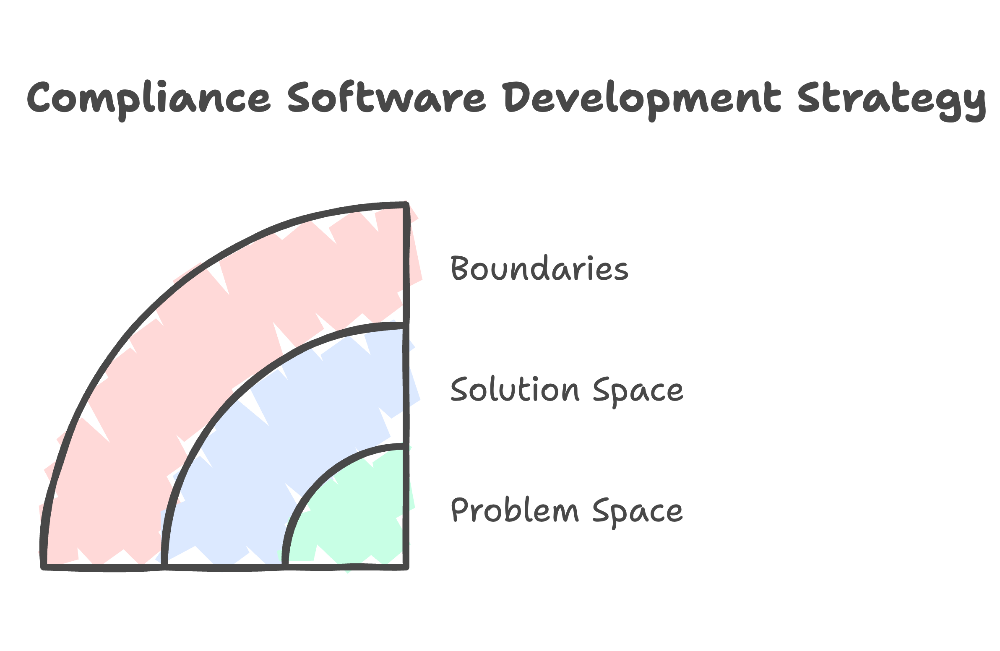
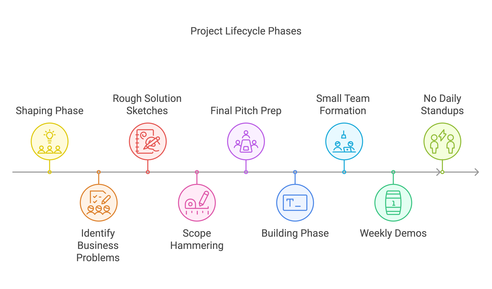

Last month, a founder called me in panic mode. "Paul, we've burned through half our seed round, and our MVP isn't even close to done. What are we doing wrong?"

I see this all too often. You have a brilliant idea, some funding, and endless enthusiasm. Then reality hits: building software is messy, timelines slip, and suddenly, your runway looks more like a short pier.

Look, I get it. I've been there too. After 20 years of building products and watching startups struggle, I've picked up a few tricks. Last year, we got Agent Inbox from whiteboard to working software in just 60 days. Not because we pulled all-nighters or hired an army of developers. We just changed how we thought about building.

## Why Your Two-Week Sprints Might Be Killing Your Startup

Remember when Agile was the answer to everything? I do. I also remember watching startups churn through endless sprints, building features nobody wanted.

At Agent Inbox, we faced this exact problem. The team had spent a year trying to build their MVP using traditional sprints. They were busy, but not productive. Sound familiar?

The issue? Traditional Agile methods were designed for established products with known customers. As a startup, you're still searching for product-market fit. You need something different.

## Enter Shape Up: Think Seasons, Not Sprints

Here's what makes Shape Up different: forget those never-ending two-week sprints. Instead, we work in bigger chunks - six weeks of focused building, followed by two weeks to catch our breath and plan. But hold on, there's more to it than just changing up the calendar.

The real magic is in the "shaping" phase. Before any coding starts, you spend time shaping the work. Think of it like a sketch artist working with the police. You're not drawing every detail - you're capturing the essential elements that matter.

## How to Shape Work (Without Drowning in Details)

When I helped OrchestrateCS build their compliance software, we started with shaping. Here's what it looked like:

1. Problem Space: We identified the core problem - compliance officers needed a way to track requirements across multiple jurisdictions.
1. Solution Space: Instead of detailed specs, we outlined the key elements:
   - Dashboard showing compliance status
   - Alert system for upcoming deadlines
   - Document storage system
1. Boundaries: We explicitly stated what we wouldn't build:
   - No integration with external systems (yet)
   - No custom reporting
   - No mobile app

This focused approach helped us launch in 60 days instead of 6 months.

## The Six-Week Sweet Spot

"But Paul," you might say, "six weeks sounds like an eternity when you're racing against the clock!"

Actually, it's perfect for startups. Here's why:

1. It's long enough to build something meaningful
2. Short enough to maintain urgency
3. Forces tough decisions about what really matters

This timeframe allows teams to rebuild entire systems systematically. Each six-week cycle delivers complete, shippable functionality. No half-finished features, no technical debt piling up.

## Real Talk: What This Looks Like in Practice

Let me walk you through a typical cycle:

### Week 1-2: Shaping

- Monday: List top three business problems
- Tuesday-Wednesday: Rough solution sketches
- Thursday: Scope hammering (my favorite part)
- Friday: Final pitch prep

### Weeks 3-8: Building

- Small team (2-3 people max)
- No daily standups (yes, really)
- Weekly demos only
- Code ships when it's ready

### Weeks 9-10: Cooldown

- Bug fixes
- Small improvements
- Planning next cycle

## Common Pitfalls (And How to Avoid Them)

I've seen many teams stumble with Shape Up. Here are the big ones:

1. Over-shaping: "But what if the user wants to..."
   Solution: Stop at good enough. Perfect is the enemy of shipped.
2. Too many cooks: "The whole team should give input..."
   Solution: Limit shaping to 2-3 key decision makers.
3. Scope creep: "While we're at it..."
   Solution: Write down what you're NOT doing.

## Is Shape Up Right for Your Startup?

Shape Up might be right for you if:

- You're pre-product market fit
- Have limited runway
- Need to move fast without breaking things
- Want to avoid building features nobody uses

It might not be right if:

- You have a large existing customer base
- Need to maintain multiple product versions
- Have strict regulatory requirements

## Getting Started Tomorrow

Want to try Shape Up? Here's your homework:

1. Pick your biggest current challenge
2. Spend 2 hours sketching a solution
3. List what you won't build
4. Share with one key stakeholder

## The Bottom Line

Building a startup is hard enough. Your development process shouldn't make it harder.

Shape Up isn't perfect - nothing is. But after helping dozens of startups find their footing, I can tell you it's the best approach I've found for getting from idea to market without burning through your runway.

Want to know how this plays out in real life? When Agent Inbox came to us, they were spinning their wheels. Two months later, they had paying customers using their product. No magic, just a better way to build.

Thinking about giving Shape Up a shot? I've made pretty much every mistake you can imagine (and then some). Head over to jetthoughts.com - let's chat about how to dodge those same bullets in your startup.
