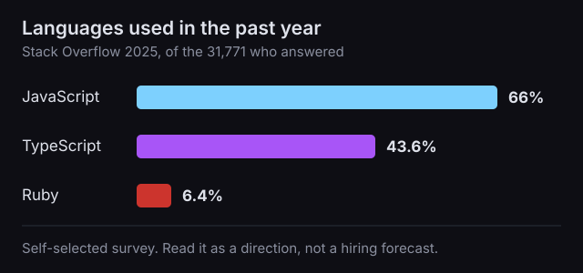
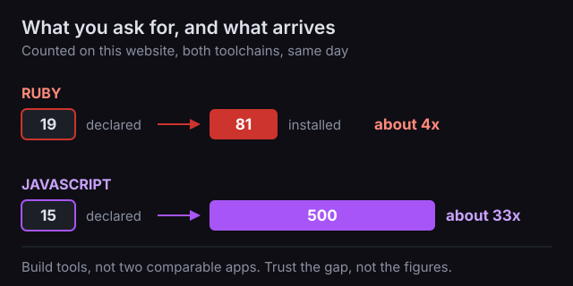

Somebody has proposed building your product in Ruby on Rails. You cannot evaluate that recommendation yourself, and the person making it has an interest in your saying yes.

We are a Rails shop, so we have that interest too. Here is the answer we would give you anyway.

You are not going to be able to judge the framework. Nobody sells you a stack decision you can verify, and the comparisons that circulate are mostly unusable, including the ones that favour us.

What you can judge is the thing you actually need, which is not really maintainability. You need to ship features fast enough to find customers, and you need this month's features not to make next quarter's slower. Those are answerable questions and you are qualified to ask them.

## Four questions, before anything else

Take these to whoever made the proposal. None of them is about the framework, and each has an answer you can judge on the spot.

| Ask them | What a good answer sounds like |
|---|---|
| Show me a feature you shipped for someone else last month, and how long it took. | A specific one, with a number of days attached. **Vagueness here predicts vagueness about your roadmap.** |
| When you add a feature to an app like this, how many places do you have to change? | One or two, with an example. **"It depends" and no example means nobody has looked.** |
| How much of this will be your own invention rather than the framework's defaults? | As little as possible, and they can say where and why they departed. **Bespoke structure is what makes year two expensive.** |
| If you stopped working on it tomorrow, how long before someone else could add a feature? | Days, with a reason. **This is a question about conventions, not loyalty.** |

A team that answers those four well is worth hiring whatever they build in. The rest of this is where the questions come from, and why we stopped trusting the argument we were about to make for Rails.

## The argument you were probably given, and why we dropped it

Most pitches for Rails run like this: the JavaScript world reinvents itself constantly, Rails is mature and stable, so your product stays maintainable. It is the wrong argument, and we know because we tried to write it.

Evil Martians published the best-known version, [The Long Game](https://evilmartians.com/chronicles/the-long-game-why-rails-survived-the-hype-cycle-and-what-it-means-for-your-startup), in August 2025. It calls Rails "the framework that once powered 90% of Y Combinator batches." We set out to write our own version of that post.

Then we went looking for where the 90% comes from. The only place we could find it is that post. Several revenue and funding figures alongside it have the same problem. That does not make them false, but nobody reading can check them, and neither could we.

So we tried to build the argument properly, comparing Rails against the JavaScript frameworks, and it fell apart for a duller reason: the things people put on either side of that comparison are not the same kind of thing. Rails decides your database layer, your page rendering, your background jobs and your file uploads. Most of what it gets compared to decides one of those. Release cadences measured across that gap tell you almost nothing, in either direction.

What is left is Rails on its own terms, which is checkable. And a better version of the original complaint, which is not about anything reinventing itself.

The real difference is where your application's shape comes from. A JavaScript project is assembled: somebody picks the routing, the data layer, the folder structure, the testing approach, and those choices belong to that project. A Rails project inherits most of them. That is a genuine trade, and the cost of it lands on the second developer rather than the first. It is also what question three is asking about, which is why the answer you want is that they invented as little as possible.

## Rails moves more than the pitch admits

Here is how Rails has answered one question, how an app should handle its JavaScript, since 2011.

| Rails version | The new default answer |
|---|---|
| 3.1, August 2011 | Sprockets |
| 5.1, April 2017 | Webpacker, optional |
| 6.0, August 2019 | **Webpacker becomes the default** |
| 7.0, December 2021 | **importmaps; Webpacker retired** |
| 8.0, November 2024 | **Propshaft replaces Sprockets** |

Four of the five land from 2017 on.

In August 2019 Rails made a tool called Webpacker the standard way every new app handled its JavaScript. Twenty-nine months later the Rails team put a heading at the top of it: "Webpacker has been retired." They committed to fixing security problems "on the Ruby side of the gem" and said they "will not be updating the gem to include newer versions of the JavaScript libraries." Read that qualifier twice. A tool whose job is bundling JavaScript depends on a great deal of JavaScript, and that half is the half they stopped updating. Continued development passed to a project run by someone outside the Rails team.

If an agency built your app in 2020 by following the defaults, that is your app. Nobody did anything wrong.

None of that is a problem while somebody is actively working on your product. A team shipping features every week upgrades as it goes, and each step is small. The churn only bites when development stops.

That is worth knowing because it is the common failure, not a rare one. Rails gives each release [one year of bug fixes and two years of security fixes](https://guides.rubyonrails.org/maintenance_policy.html), and we have [written about what happens](/blog/rails-7-eol-unpatched-security-exposure/) when the clock runs out: Rails 7.1 lost security support in October 2025, so when a vulnerability scored 9.5 out of 10 arrived in July 2026, apps on that version got nothing. A product parked for two years, because funding got tight or the team moved on, comes back unsupported and expensive.

## What Rails does promise

The same policy makes one commitment that is worth more to you than the stability story: "Breaking changes are paired with deprecation notices in the previous minor or major release."

In plain terms, Rails warns before it removes. A team that upgrades regularly sees the warning a release before the thing disappears, which turns a break into a scheduled chore. A team that skips four years of upgrades gets the removals with none of the warnings, all at once, and calls it a rewrite.

That promise is worth nothing on its own. It pays out only for a team that keeps shipping, which is the same team that answers question one well.

Last December we moved one of our own applications from Rails 8.0 to 8.1. The changed files were dependency versions, generated configuration, migrations Rails wrote itself, and stock error pages: nothing under the directories holding code we wrote by hand. You cannot check that, so do not take it on trust. Anyone can reproduce the shape of it by generating an empty app on two Rails versions and comparing the two, which takes about five minutes and needs no access to us.

## Hiring is the cost nobody volunteers

This decides what happens the day your developer resigns.

The [2025 Stack Overflow Developer Survey](https://survey.stackoverflow.co/2025/technology) asked developers which languages they had used that year. Of the 31,771 who answered, 66% named JavaScript and 43.6% named TypeScript. Ruby, the language Rails is written in, came back at 6.4%.

That survey is self-selected and measures what people used rather than what employers are hiring for, so treat it as a direction. The direction is that Ruby is a small pool and JavaScript is a large one, and no argument about framework quality changes that. Price it, or pick something else.

## What Rails actually does for delivery

The honest case for Rails has nothing to do with stability. It is about how quickly a small team can add the next thing, and it is easier to argue than to prove.

Rails apps are arranged the same way as each other. Where the database code lives, how a form reaches a table, where background work goes: the framework decides, not whoever set up your project. A developer who has never seen your product knows where to look on the first day, and there is less of your own invented structure for them to learn.

The cost of an assembled project is easy to miss, because you only pay it the second time. On an assembled project, each new developer learns the arrangement that this team invented, finds out which parts of it have quietly broken, and cannot carry any of it to the next project. On a conventional one, someone who has worked on any Rails app has already met most of yours. That is what question four is testing. You are not buying better code. You are buying a shorter answer to "how does this thing work".

That changes who has to be involved in a feature. Splitting work between a front-end specialist and a back-end specialist is normal on JavaScript projects and unusual on Rails ones, where one person can carry a feature from the database to the screen. One person shipping end to end is faster than two coordinating.

Ruby also says things in less code, and that part has been measured: a [study of 7,087 programs](https://arxiv.org/abs/1409.0252) across eight languages, Ruby among them, found scripting languages more concise than the procedural and object-oriented ones. Ruby's solutions came out around twice as short as Java's and C's.

Read that paper to the end, though, because it also counted which languages produced programs that ran without failing, and the scripting languages came last. Ruby managed 86% where Go managed 98%. Shorter is not automatically safer, and the study we are citing for the first half says so in the second.

Dependency counts run the same way in our experience. Every installed package is maintained by somebody else, on their schedule, and can be abandoned without asking you.

What nobody seems to have measured is whether any of this actually makes you faster. We went looking for a study comparing Rails against a TypeScript stack on delivery speed, or on the cost of running the same application for five years, and did not find one. When a vendor quotes you a productivity multiplier, they are quoting a feeling, and so are we when we tell you Rails suits this.

The most useful thing we found while checking is also the least convenient. Comparing programs written in seven languages, Lutz Prechelt reported that "the performance variability that derives from differences among programmers of the same language ... is on average as large or larger than the variability found among the different languages." He was careful that his results held for the one problem he tested. Take it as a caution rather than a law: who you hire looks like it matters more than what they build it in.

## When to say yes

Say yes without much worry if the team answered the four questions, if Rails is genuinely what they are fastest in, and if your product is the ordinary shape of a business application: accounts, payments, records, reports, an admin screen.

Push back if what you were sold was the stability story, because that story does not survive Rails' own release history and the person telling it has not looked. Push back harder if the answer to any of the four is a shrug, because every one of them is about how they work rather than about Rails.

If the answers come back bad, the answer is not a different framework. It is a different team, while this is still a proposal rather than a codebase somebody has to [rescue](/services/vibe-code-rescue/).

## Sources

- Rails, [Maintenance Policy](https://guides.rubyonrails.org/maintenance_policy.html) - the support windows and the deprecation commitment quoted above.
- [Webpacker README](https://github.com/rails/webpacker) - the retirement notice and its security scope.
- Stack Overflow, [2025 Developer Survey: Technology](https://survey.stackoverflow.co/2025/technology) - language usage, 31,771 responses.
- Nanz and Furia, [A Comparative Study of Programming Languages in Rosetta Code](https://arxiv.org/abs/1409.0252), ICSE 2015 - both the conciseness finding and the runtime-failure finding that complicates it.
- Lutz Prechelt, [An Empirical Comparison of Seven Programming Languages](https://www.cs.tufts.edu/~nr/cs257/archive/lutz-prechelt/comparison.pdf), IEEE Computer, October 2000 - the programmer-variability finding.
