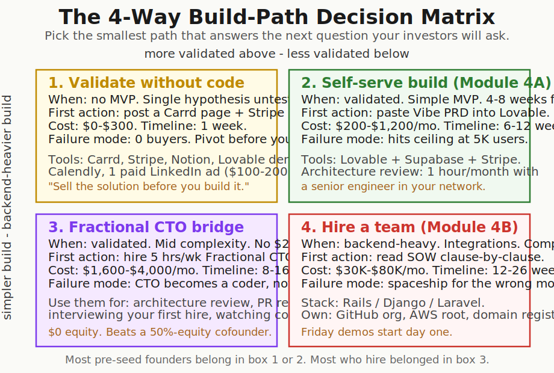
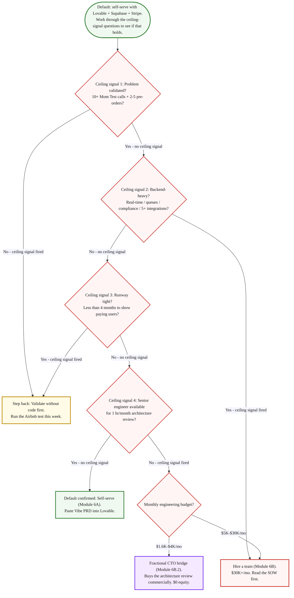

> **Module 5 · Step 1 of 1** · [Tech for Non-Technical Founders 2026](/blog/tech-for-non-technical-founders-2026/) course.
> Input: a Vibe PRD + outcome-shaped feature spec (from Module 4). Output: a 4-way build-path decision (validate / self-serve / fractional-CTO / hire) + the [Build Path Decision Worksheet](/blog/build-path-decision-worksheet/).

Self-serve with Lovable + Supabase + Stripe is the default for a non-technical founder in 2026. Hiring is what you do when you hit a specific ceiling signal - not the first decision after the Brief. This chapter is the decision tree: when does the default end, and what triggers the switch?

We have watched dozens of pre-seed B2B SaaS founders hire engineering before they had a single paying customer. Most of them ran out of money before the third feature shipped. The pattern is so common it should have a name. The brief was right (we taught the brief in [The One-Page Product Brief](/blog/one-page-product-brief-vibe-prd/) and rewrote it as outcomes in [Stop Specifying Features](/blog/stop-specifying-features-start-outcomes/)). The hire was the thing that broke the founder. They skipped the cheaper experiment that would have told them whether they needed to build at all.

## Why this matters in 2026

Y Combinator's official position for the 2026 batch is that tools and business models now let founders turn an idea into a production-quality product in weeks without giving 50% equity to a technical co-founder. Read that sentence twice. The argument is not "hire later." The argument is *prove the concept without code first.* Most founders skip this and burn 6 to 9 months learning their problem was not real. The hardest decision in this chapter is not "code or no-code." It is "what evidence do I have that I need to build at all?" If you cannot answer that with a list of buyers who have already paid you, the answer is: not yet. Stay one box left of where you were about to start.

## The Airbnb test

Brian Chesky and Joe Gebbia did not write code first. They blew up an air mattress in their living room, took photos with a digital camera, posted three nights at $80 on a hand-rolled WordPress page, and waited. Three guests showed up. They made $240. The product was a website with a payment link. The validation was three strangers paying real money. Paul Graham later wrote about the same instinct in [*Do things that don't scale*](https://paulgraham.com/ds.html): the founders who win are the ones who do the unscalable, manual experiment that proves demand before they industrialize it.

The 2026 version of the Airbnb test takes one afternoon. You build a Carrd page. You add a Stripe checkout for an annual plan. You write a Notion FAQ that explains exactly what the buyer gets. You send the link to 35 ICP prospects from your [Find 10 People With the Problem](/blog/find-10-people-with-problem-outreach-2026/) outreach list. You watch what happens.

The signal you are looking for is small. Two paying buyers from 35 cold outreach hits is enough to flip the build switch. Two refundable deposits beat 200 LinkedIn likes. We know a B2B SaaS founder who sold five annual contracts at $1,800 each via a Stripe link and a Notion doc before she wrote a line of code. By the time her contractor delivered the v1 web app eight weeks later, she had $9,000 in pre-revenue and a customer-feedback loop already running. The build was constrained by what she had already promised the five buyers, which is the cheapest scope-control mechanism that exists.

The test is brutal in the other direction too. Zero clicks from 35 prospects means the problem might be real (you validated it in [Decide What's Next](/blog/mom-test-ask-about-past-not-future/#synthesis-write-down-what-you-heard-decide-whats-next)) but your pitch is wrong, your price is wrong, or the timing is wrong. Find out for $200 instead of $30,000.

## The Rob Walling warning

Rob Walling has been building and selling SaaS companies for two decades. On a 2025 podcast he framed the vibe-coding question with a construction analogy that has stuck: two people with no carpentry experience can [build a shed](https://podcast.creatorscience.com/rob-walling/) and figure it out as they go. The shed will be a bit crooked but it will hold. Try to build a two-story house with the same approach and you will hurt someone. Try a multi-story commercial building or a skyscraper without a structural engineer and the building falls down on the people inside.

The same is true of vibe-coded apps. A 200-line Chrome plugin? A WordPress plugin that rewrites titles? A Notion-to-Slack bridge that runs nightly? Build those with Cursor or Lovable in an afternoon and ship them. They are sheds. The model handles the load. You will rewrite them in six months when you outgrow them, and the rewrite cost is one weekend.

A real B2B product at scale is a different building. Multi-tenant data, role-based permissions, audit logs, integration webhooks under retry pressure, queues, race conditions, eventual-consistency bugs, security hardening for compliance review, observability for the on-call rotation. None of these read as load-bearing in the brief. All of them appear by month four. A vibe-coded codebase that crossed 8,000 lines and 30 routes without an engineer thinking about the data model has hit the architectural ceiling. The team we picked up in Q1 2026 inherited exactly this kind of codebase: a fitness-coaching SaaS, ~11,000 lines, no migrations strategy, no foreign keys, every model named in the singular by Lovable's default, three customer accounts already corrupted because a webhook had retried a Stripe charge update four times. Salvage cost more than the original build. The founder had built a shed and asked it to carry a roof it was never designed to hold.

The decision matrix in this post is the structural-engineer step. Before you commit to building, you decide which building you are putting up. A shed has a different cost ceiling, a different talent profile, and a different exit strategy than a commercial building. The mistake is treating them as the same.

## The 4-way decision matrix

Most build-vs-hire posts give you one answer. The honest answer is four answers, and the right one depends on five inputs the post cannot know about you. Pick the smallest box that answers the next question your investors will ask.

### 1. Validate without code

**Choose this when**: still early. No MVP. A single hypothesis untested. You are not sure the problem is worth paying for.

**First action this week**: ship a Carrd page + Stripe checkout + Notion FAQ + Lovable demo loom video. Send the link to 35 ICP prospects from your [Find 10 People With the Problem](/blog/find-10-people-with-problem-outreach-2026/) outreach list.

**Cost**: $0 to $300 in tools (Carrd $19/yr, Stripe free, Notion free, Lovable trial). Optional $100 to $200 in paid LinkedIn or Google ads.

**Timeline**: one week.

**Failure mode**: zero buyers. The good news: you found out in a week, not a quarter. Re-write the pitch or pivot the problem before you lose runway.

### 2. Self-serve build ([The Self-Serve MVP Stack](/blog/self-serve-mvp-stack-lovable-supabase-stripe-2026/))

**Choose this when**: validated problem (10+ Mom Test interviews + 2 to 5 pre-orders or paid pilots). Simple MVP scope (one workflow, one persona, one happy path). Founder has 4 to 8 weeks to ship. Backend complexity is low (no real-time, no payments-with-refund-flows, no compliance scope).

**First action this week**: paste your [Vibe PRD](/blog/vibe-prd-template/) into Lovable, Bolt, or v0 and ship the smallest end-to-end thing it generates. Hook a Supabase Postgres + Stripe + Resend on top.

**Cost**: $200 to $1,200 per month in tools (Lovable $20-$100, Supabase $25, Stripe transaction fees, domain, Vercel).

**Timeline**: 6 to 12 weeks to first 5 paying users.

**Failure mode**: hits the architectural ceiling at ~5,000 users or your second integration. [5 Ceiling Signals](/blog/vibe-coding-ceiling-signals/) covers when the self-serve stack stops holding. When you see two of them, route to [Hire Track Supplementary Reference](/blog/hire-track-supplementary-reference/) for the next layer.

### 3. Fractional CTO bridge ([The Fractional CTO Bridge](/blog/hire-track-supplementary-reference/#the-fractional-cto-bridge))

**Choose this when**: validated. Mid complexity (you know there is a queue, an integration, or a data model that needs thinking). Founder needs guardrails, not a builder. You do not have $200K+ in runway dedicated to engineering.

**First action this week**: hire a Fractional CTO for 5 hours per week. Use them for: architecture review on the Lovable build, PR review on contractor commits, interviewing your first hire, watching the AWS and OpenAI bills.

**Cost**: $1,600 to $4,000 per month ($80-$200/hour, 5-10 hrs/week). $0 equity.

**Timeline**: 8 to 16 weeks.

**Failure mode**: the Fractional CTO drifts into being a coder instead of a guard. You wanted a structural engineer; you got a carpenter who codes well. Set a 90-day review and check whether the hours go to "architecture, hiring, oversight" or "shipping features."

### 4. Hire a team ([Who You're Hiring in 2026](/blog/hire-track-supplementary-reference/#where-to-find-developers-in-2026))

**Choose this when**: backend-heavy build (real-time, queues, AI inference at scale, multi-tenant data). Integration-rich (5+ third-party APIs). Security or compliance scope (HIPAA, SOC 2, PCI). Founder has $30K+ per month to spend for at least 6 months.

**First action this week**: read your draft SOW [clause by clause](/blog/hire-track-supplementary-reference/#reading-the-sow). Confirm GitHub org, AWS root, domain registrar, and database all sit under your company email before kickoff.

**Cost**: $30K to $80K per month for a team of 3 to 5. Plus tooling ($1K-$3K/mo).

**Timeline**: 12 to 26 weeks to first paying users.

**Failure mode**: the team builds you a [spaceship for the wrong moon](/blog/stop-specifying-features-start-outcomes/). You shipped the brief but missed the job. The Friday demo rule and the [Org Chart audit](/blog/engineering-org-chart-non-technical-founder/) are how you catch this in week three instead of month three.

## The 5 questions that route you

The matrix needs inputs. The five questions below take 30 minutes alone with a printed worksheet. Answer them honestly, write the result at the top of your Notion doc, and the matrix picks for you.

The five questions, verbatim, in the order you answer them on the worksheet:

- **Q1. Is the problem validated?** Counts as yes only if you have 10 or more [Mom Test](/blog/mom-test-ask-about-past-not-future/) interviews showing strong past-behavior signal AND 2 to 5 pre-orders, paid pilots, or annual deposits. LinkedIn likes do not count. "They said they would buy" does not count. Money on the table or a calendar invite for a procurement call counts.
- **Q2. How backend-heavy is the build?** Counts as heavy if any one of these is true: real-time updates (WebSockets, server-sent events), background queues with retry logic, AI inference inside the request path with cost above $0.01 per call, multi-tenant data with row-level security, 5+ third-party API integrations, regulated data (HIPAA, SOC 2, PCI scope).
- **Q3. What is your runway?** Months of cash until you must show paying customers. Less than 4 months: route to Path 1 regardless of how validated you think you are. The Airbnb test is the only one that fits in the runway window. 4-12 months: Paths 1, 2, 3 are all on the table. 12+ months: Path 4 becomes safe to consider.
- **Q4. What is your monthly engineering budget?** $0 to $400/week of your own time = Path 2. $1,600-$4,000/mo for a Fractional CTO = Path 3. $5,000-$30,000/mo for a team = Path 4. Skip the path you cannot fund for 6 months.
- **Q5. Do you have a senior engineer in your network for 1 hour of architecture review per month?** This is the cheap insurance. Even on Path 2 (self-serve with Lovable), one hour a month with a senior backend engineer who will read your data model and your worst route catches the architectural ceiling 3 months before you hit it. Yes: stay on Path 2. No: route to Path 3 to buy the same insurance commercially.

The worksheet at [/blog/build-path-decision-worksheet/](/blog/build-path-decision-worksheet/) prints these five questions in checkbox form and writes your verdict at the top of the page. Print it. Fill it in 30 minutes. Take the result to one peer or advisor for a 20-minute sanity check.

### The Series-A off-ramp: when the model itself changes

> The four paths above (validate without code / self-serve / fractional CTO / hire a team) all assume the same operating model: you hand a Vibe PRD to engineers (whether AI or human) and they build it. That is the feature-factory pattern Marty Cagan has spent 20 years criticizing. It is the right model for a non-technical founder running a half-built MVP with $4K-$80K of monthly burn. It is the wrong model the moment you can afford a real product team.
>
> The off-ramp activates around Series A (~$2-5M raised, 6-15 person team). The shift: stop handing specs, start handing problems. The product team owns discovery and delivery. You own outcomes and strategy. If you crossed that line and you are still writing Vibe PRDs week to week, you are paying senior engineering rates for junior product-manager work.
>
> The reading list when you reach the off-ramp: Cagan's [Inspired](https://www.svpg.com/inspired-how-to-create-products-customers-love/) for the model, [Empowered](https://www.svpg.com/empowered/) for the team-charter shift, Teresa Torres's [Continuous Discovery Habits](https://www.producttalk.org/continuous-discovery-habits/) for the weekly customer cadence the empowered team needs to keep running. None of this is in scope for the rest of this course; you have graduated past it.

## What to do tomorrow

Three actions, in order.

- **Print the [Build Path Decision Worksheet](/blog/build-path-decision-worksheet/) tonight.** One side of paper. Bring it to coffee tomorrow morning with your filled-in [Vibe PRD](/blog/vibe-prd-template/) and your [Validated Problem Statement](/blog/validated-problem-statement-template/). 30 minutes alone, pen on paper.
- **Answer the 5 questions and write the verdict at the top.** If you spill past 30 minutes you are negotiating with yourself. The five questions are factual: number of interviews, number of pre-orders, months of runway, monthly budget, senior engineer in your network. Read the matrix row that matches your verdict.
- **Pick your next chapter by the verdict.** Path 1 (Validate): start the Airbnb test this week. Ship the Carrd + Stripe + Notion stack by Friday. Path 2 (Self-serve): go to [The Self-Serve MVP Stack](/blog/self-serve-mvp-stack-lovable-supabase-stripe-2026/). Path 3 (Fractional CTO): read [The Fractional CTO Bridge](/blog/hire-track-supplementary-reference/#the-fractional-cto-bridge) next, hire by end of month. Path 4 (Hire a team): read [The Hiring Interview](/blog/hire-track-supplementary-reference/#interviews-that-catch-ai-theater) and [the SOW guide](/blog/hire-track-supplementary-reference/#reading-the-sow) before any kickoff.

**Default verdict: self-serve.** Continue to [Module 5: Build It Yourself](/blog/self-serve-mvp-stack-lovable-supabase-stripe-2026/). The [ceiling-signal monitoring chapter](/blog/vibe-coding-ceiling-signals/) tells you when to revisit the hire decision. If a ceiling signal has already fired before you start building, the [hire-track supplementary reference](/blog/hire-track-supplementary-reference/) covers where to find developers, the Fractional CTO bridge, interviews, and SOW reading.

## Further reading

- Paul Graham, [*Do Things That Don't Scale*](https://paulgraham.com/ds.html) - the YC essay that named the Airbnb-style validation pattern. The first section is the Airbnb story; the rest is the manual that founders skip.
- Paul Graham, [*The Airbnbs*](https://www.paulgraham.com/airbnbs.html) - PG's own short note on the Airbnb founders' early experiments. 6-minute read.
- Rob Walling, [Vibe Coding interview on Creator Science](https://podcast.creatorscience.com/rob-walling/) - the "shed vs skyscraper" interview, plus the structural argument for why vibe-coded SaaS hits the architectural ceiling.
- Sophia Matveeva, [*The Non-Technical Founder's Guide to Hiring*](https://www.amazon.com/Non-Technical-Founders-Guide-Hiring-Product-ebook/dp/B0B7WRLBZF) - the long-form companion to this post. Heavy on hiring, light on the validate-without-code path that comes first.
- Drew Falkman, [*Vibe Coding Data-Enabled AI Apps* on Maven](https://maven.com/) - the $1,000 cohort that teaches the self-serve stack (Path 2). Recommended if accountability is your blocker.
- Y Combinator, [Startup School: Customer Discovery](https://www.ycombinator.com/library/) - YC's distilled take on validating before building. The path-1 reading list.
- DHH, [The One Person Framework](https://world.hey.com/dhh/the-one-person-framework-711e6318) - the Rails case for keeping the architecture small enough that one developer can ship outcomes end-to-end. Reading for Path 2 and Path 3 founders.
- Veracode, [GenAI Code Security Report 2025](https://www.veracode.com/blog/genai-code-security-report/) - 45% of LLM-generated code shipped at least one exploitable security flaw. Context for why Path 2 needs the 1-hour-a-month architecture review.

---

*Built by [JetThoughts](https://jetthoughts.com) as part of the [Tech for Non-Technical Founders 2026](/blog/tech-for-non-technical-founders-2026/) curriculum.*
