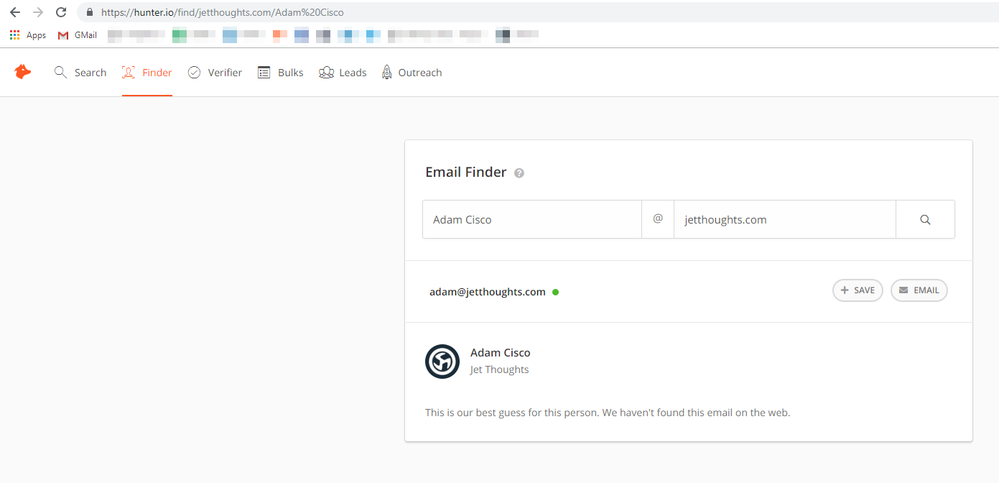
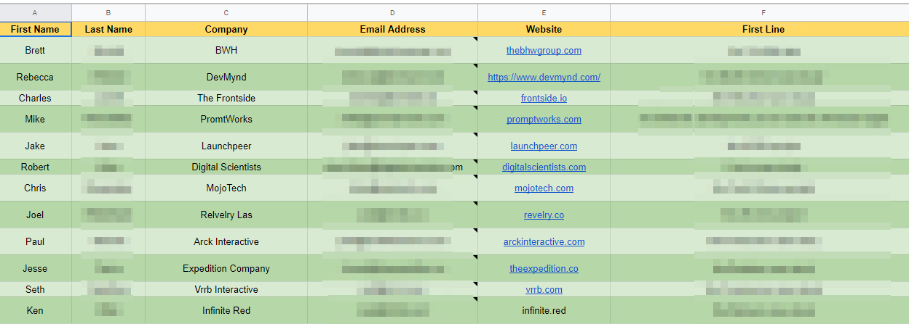
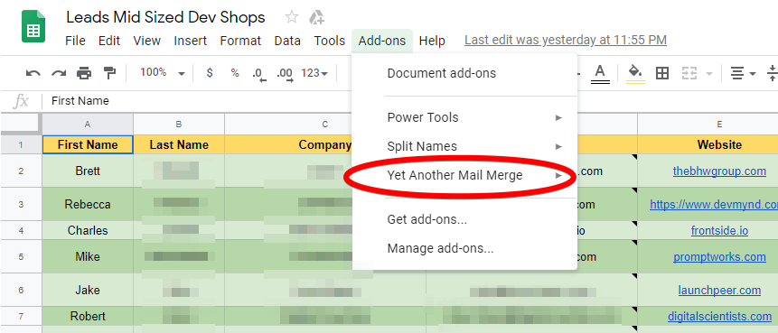
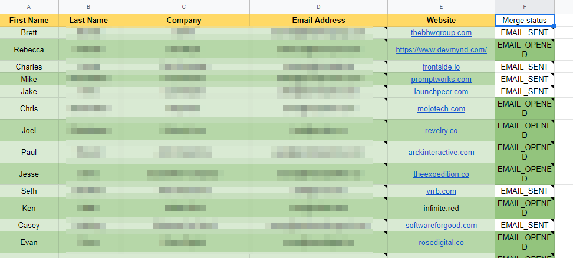

 on [Unsplash](https://unsplash.com/search/photos/roads?utm_source=unsplash&utm_medium=referral&utm_content=creditCopyText)](file_0.jpeg)

How to build the Lead Generation workflow? Which tools should be used?

In [JetThoughts](https://www.jetthoughts.com), we build our own process, which could be easily maintained by one person and scalable at the same time, allowing to attract more and more leads.

In our [previous article](https://jtway.co/5-free-tools-to-make-the-sales-process-easier-9e1368d41bf0), we talked about the tools which help to generate leads, and this is a second part where we will touch on the process we built around these tools to get the lead generation automated and easily trackable. We are using different channels like [LinkedIn](https://www.linkedin.com/), [Angel.co](http://angel.co/), [Behance](https://www.behance.net/), [Dribble](https://dribbble.com/) etc. to take the leads data.

To get the work email of the lead you’d like to reach out to, there are two things to find out — the person’s first and last name and his/her company website. To guess the email, you’d need to put that data into [hunter.io](https://hunter.io/) (it gives you 100 searches/month for free)

Then the email would pop up, which you should fill into a cell of your spreadsheet. Here is the example of how such spreadsheets might look like:

This structure allows you to fill out all the necessary data in your email mockup to be sent and make such cold emails less generic and more personal. Once it’s done, start writing your email, and from here — you are now able to make it super specific by autocomplete <<>> so that each lead would get a highly personalized message from you, which increase the chance of getting the answer.

Here is the email example where we use most of the data pulled from the lead table (you can also use it to personalize the subj line of each email). Tip: the <<First Line>> is usually some kind of warm-up line like a compliment, where the info about their business is used:
> # Hey <<First name>>,
> # <<First Line>>
> # I helped digital agencies like Agency 1 and Agency 2 with professional web development we did for them.
> # Figured <<Company Name>> might need an extra pair of hands working on it.
> # Ping me if that’s something you might be interested in.
> # Thanks,
> #Adam

As a result, your email is super personal and tailored, now, it’s time to send it to your leads. To do that, [Yet Another Mail Merge](https://yet-another-mail-merge.com/) comes to help.

[Power tools](https://chrome.google.com/webstore/detail/power-tools/dofhceeoedodcaheeoacmadcpegkjobi?hl=en) along with [Split Name](https://chrome.google.com/webstore/detail/split-names/omjobieogknhhlogiaeofbdpipihaanb?hl=en) add-on would help to deal with a lot of leads while organizing the table.

Now, you are ready to send your first cold email. *Yet Another Mail Merge* would gather the statistics for you on every step of your email sequence.

Good luck with your first email campaign! If you have any questions — feel free to comment and ask.

**Paul Keen** is an Open Source Contributor and a Chief Technology Officer at [JetThoughts](https://www.jetthoughts.com). Follow him on [LinkedIn](https://www.linkedin.com/in/paul-keen/) or [GitHub](https://github.com/pftg).
>  *If you enjoyed this story, we recommend reading our[ latest tech stories](https://jtway.co/latest) and trending [tech stories](https://jtway.co/trending).*
