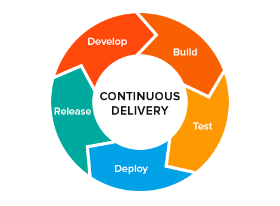
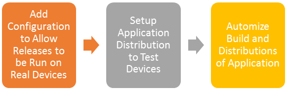

## Introduction

Delivering mobile application’s updates is not as simple as in the case of a web application. From all currently available tools, we have found a working solution which is easy to integrate into a React Native Application.

And you definitely need to have an automated delivery. Today it’s one of the basic business requirements.

For a new React Native project, it is crucial to building a clear working process which will involve a business owner.

Usually, a business owner is in a different time zone or has a limited amount of time to spend on a project. Therefore, you need to establish a reliable asynchronous communication mechanism. There should be an agreed way of regular verbal or written communication.



Still, that’s only a part of a good workflow. Business owner’s involvement in the development process is vital. They should have a way to see the current status of the project and app. In this way, they can give relevant and timely feedback to your developers’ team and manage the project in general. This is an easy and convenient way for a business owner to enjoy full control over a project and achieve the desired result.

What you need to do is to deliver the latest version of the app and update it each time after making changes. The best way is to automate this task and that’s where Continuous Deployment comes in.

It solves the following problems and even more:

* A business owner can quickly check our progress and see the latest updates right away.

* We can easily test our application on real devices with a different OS, screen sizes, etc.

* We can get instant feedback from our test group on any bugs or just UI/UX enhancements.

* Developers don’t have to waste time on this tedious routine.

With this in mind, our team formulated these basic requirements for Continuous Deployment:

* Every time we push changes to our master branch on Github we want the CI process to build the code, run any tests, and then build and publish release-mode apps to be distributed to the internal team of testers.

* We want a notification to be sent out to all testers when a new build is available.

In this article, we are going to provide simple and detailed step-by-step instruction on how to set up Continuous Delivery for your React Native Android application by using [Fabric](https://get.fabric.io/) and [CircleCI 2.0](https://circleci.com/).

***This article only covers the Android part. Right now CircleCI 2.0 has no Continuous Delivery for iOS.***

## Instruction Plan



Here is quick overview of the instruction:

 1. **Add Configuration to Allow Releases to be Run on Real Devices**. In this section we will show you how to generate secret signing files and constants, add them to the project and release signed application.

 2. **Setup Application Distribution to Test Devices.** This section shows you how to create command-line task that builds release application and uses distribution service to deliver it to devices.

 3. **Automize Build and Distributions of Application.** The last section shows you how to distribute new release version of the application automatically when the new commit is pushed to the master branch of your Github project.

## Add Configuration to Allow Releases to be Run on Real Devices


Android requires that all applications should be digitally signed with a certificate before they can be installed (at least release version), so to distribute your Android applications to mobile devices, you’ll need to generate signed release file.

The process of signing a React Native Android application is rather simple and straightforward. Follow an official instruction [Generating Signed APK](https://facebook.github.io/react-native/docs/signed-apk-android.html).

In the end you should have:

* *android/app/my-release-key.keystore* — keystore file inside the project.

* *~/.gradle/gradle.properties* — file with constants that are associated with your keystore.

* Modified *android/app/build.gradle* to use release constants.

To check that your release is actually signed run this command:

```bash
cd android && ./gradlew assembleRelease
```

It generates, signs and saves release file to *android/app/build/outputs/apk/app-release.apk. *If the signing process is not successful then you get *app-release-unsigned.apk*.

## Setup Application Distribution


There are many distribution services. We have chosen [Fabric Kit](https://get.fabric.io/). It is one of the most popular, allows distribution both to iOS and Android and has many other features in its Kit. To integrate Fabric to your application you need to complete the next two steps.

The first one is registration of our account and registration of application.

The second one is a configuration of scripts in your project that is run on CircleCI and trigger distribution.

### Integrate with Distribution Service from Fabric Kit

First, you need to [register on Fabric](https://fabric.io/sign_up). Then you need to [install Fabric IDE plugin](https://fabric.io/downloads/android) and follow its wizard to integrate Fabric with your application. During this integration, you need to choose Crashlytics Kit. Once that is done, you should have access to Dashboard of your application on Fabric site.

To run distribution you’ll need secret keys. You can find you key and secret by visiting your [organization’s settings page](https://www.fabric.io/settings/organizations) and clicking on the respective links under the organization’s name.


### Install Fastlane as Fabric Kit CLI

Fastlane is an automation tool that you call as a console command to build and deploy from your machine. It is connected with Fabric Kit but it is installed separately.

[Fastlane](https://github.com/fastlane/fastlane) is a ruby gem so it is installed accordingly. Use Gemfile to [add it to the project](ttps://docs.fastlane.tools/getting-started/android/setup/#use-a-gemfile).

Then you need to set it up to your project. Open */android* folder and run

```bash

bundle exec fastlane init
```

It will generate fastlane folder and config files. You need to update Fastfile **file:

```ruby
desc "Submit a new Beta Build to Crashlytics Beta"
  lane :beta do
    # need to use `react-native bundle` instead of bundleReleaseJsAndAssets from grdale
    # because it causes 134 error (out of memory) on Circle CI
    sh "cd ../.. && react-native bundle --platform android --dev false --entry-file index.android.js --bundle-output android/app/src/main/assets/index.android.bundle --assets-dest android/app/src/main/res/"
    gradle(
      task: "assembleRelease",
      flags: "-x bundleReleaseJsAndAssets"
    )
    crashlytics(
      api_token: ENV['CRASHLYTICS_API_TOKEN'],
      build_secret: ENV['CRASHLYTICS_BUILD_SECRET'],
      groups: 'main'
    )
  end
```

Let’s analyze it step by step:

* Gradle command builds release:

```ruby
gradle(task: “assembleRelease”)
```

However, we have custom build in two steps to resolve memory error on CircleCI.

* Crashlytics command deploys the release. You need to provide a token and secret from Fabric that we showed earlier. Group is a set of tester accounts that are going to get this release. Tester’s emails are added on Fabric site in [beta configurations](https://docs.fabric.io/apple/beta/tester-management.html).

```ruby

crashlytics(
  api_token: ENV[‘CRASHLYTICS_API_TOKEN’],
  build_secret: ENV[‘CRASHLYTICS_BUILD_SECRET’],
  groups: ‘main’
)
```

To test that distribution to your mobile is set up correctly you need to run your lane:

```bash
cd android && bundle exec fastlane android beta
```

And in a few minutes, you should have an email with download link to a new version in every tester’s email box. This email has instruction on how to install app on your mobile.

## Automize Build and Distributions of Application


Here comes the main part — how to make [CircleCI 2.0](https://circleci.com/) do deploy for you.

### Add docker image

First of all, we need to setup our environment in a similar way we have locally and install quite a few programs and instruments. CircleCI 2.0 runs our commands in docker. So we need to write Dokcerfile with all dependencies, build and image from it and provide this image to CircleCI.

Here is our Dockerfile. It’s a good practice to put your Dockerfile next to config file in your application:

```ruby
FROM arian/android-react-native

# Install Ruby
RUN apt-get install -y ruby
RUN gem install bundler
RUN echo y | apt-get install libmysqlclient-dev ruby-dev
RUN echo y | apt-get install make
RUN echo y | apt-get install g++

# Install react native
RUN npm install -g react-native-cli@2.0.1
```

Let’s take a look at the list of our main dependencies that this Dockerfile contains:

* gradle, Android SDK— to build release apk.

* Nodejs, yarn — to install all packages.

* react-native— to be used in the beta lane to build assets.

* ruby, bundler — to run fastlane.

To this end, we could take ready android image from CircleCI like this one [*circleci/android:api-25-alpha](https://hub.docker.com/r/circleci/android/)*. And build our Dockerfile on this basis. You can see what’s inside [here](https://github.com/circleci/circleci-images/blob/master/android/Dockerfile.m4). Basically, there is gradle and Android SDK. But we are even lazier. So we borrowed container from this [nice guy](https://hub.docker.com/r/arian/android-react-native/~/dockerfile/). It has gradle, Android SDK, Nodejs, Yarn. Not bad at all, huh? And then we build our Dockerfile on top of that and add a few remaining dependencies.

To make it usable by CircleCI you need to build an image and push it to your docker repository. Here is an [instruction](https://docs.docker.com/get-started/part2/) to build and distribute your image. Alternatively, you can use our [image](https://hub.docker.com/r/jetthoughts/android-react-native/).

### Add Circle CI 2.0 config to run distribution commands

Add this configuration file to your project:

```

version: 2
jobs:
  build:
    working_directory: /opt/workspace
    docker:
      - image: jetthoughts/android-react-native:1.0
    steps:
      - checkout
      - run:
          name: Install dependencies
          command: yarn
      - run: yarn run test:ci
      - run: yarn run lint
      - deploy:
          name: Build and Deploy Master to Android Crashlytics
          command: |
            if [ "${CIRCLE_BRANCH}" == "master" ]; then
              mkdir -p ~/.gradle && cp config/gradle.properties ~/.gradle/gradle.properties
              echo "API_URL=$API_URL" >> .env
              echo "APP_NAME=$APP_NAME" >> .env
              bundle install
              cd android && bundle exec fastlane android beta
            fi
```

Let’s analyze this file:

* We use our image from the Dockerhub:

```
- image: jetthoughts/android-react-native:1.0
```

* Install npm packages

```
- run:
    name: Install dependencies
    command: yarn
```

* Run tests and linter

```
- run: yarn run test:ci
- run: yarn run lint
```

* Do deploy if we are in master.

```
if [ “${CIRCLE_BRANCH}” == “master” ]; then
```

* Now, before making a deploy we need to configure few more things. First of all, we need to provide keystore and its constants to sign our release apk. We saved gradle file with constants in our project in *`config/gradle.properties*`. So we copy it to *~/.gradle/gradle.properties.* But if you are obsessed with security then you can store them in CircleCI environment variables and write a file from scratch instead.

```
mkdir -p ~/.gradle && cp config/gradle.properties ~/.gradle/gradle.properties
```

* Also you need to provide *android/app/therentfiles-release-key.keystore* file that you generated before. We just committed it to our project. So it’s not mentioned in CircleCI config file. But you can do it in a more secure way: put it in some secure place and download it from CI each time.

* Next step is kinda optional. We add our app url and name. We can’t use our environment variables from CircleCI directly. It works only from *.env* file for react native project. These variables allow us to customize deploy. I.e. you can deploy to staging or to production. Or have one application name in beta testing and another in production.

```
echo “API_URL=$API_URL” >> .env
echo “APP_NAME=$APP_NAME” >> .env
```

* Then we run *bundle *to install fastlane.

```
bundle install
```

* And then (at last) we run fastlane script that deploys beta release

```
cd android && bundle exec fastlane android beta
```

Don’t forget that this script uses fabric keys from environment variables so you need to add env vars to circle ci. Here is the list of environment variables:


To test it out you need to add CircleCI to your repository on Github. And then you need to push a commit to the master branch. CircleCI should run build based on the config script and deploy your app.

And that’s all! A piece of cake!

## Conclusion

Hopefully, we were able to give you an exhaustive tutorial. It should provide you with an understanding of the basic requirements for the delivery process and instruments to resolve them.

Of course, automatic delivery is a very typical task and it would be nice to have a more established and simplified solution. One of such solutions for the web is [Heroku Review](https://devcenter.heroku.com/articles/github-integration-review-apps) where most of the configuration is done for you and yet it is a very flexible and functional tool. Please, let us know if you know something similar for mobile development!

This instruction has quite a lot of steps. I decided not to elaborate it here but rather give links to other articles or official tutorials with installation and configuration instructions. You will find full instructions for every part and up-to-date documentation from official sources there. Moreover, our article does not mean to overwhelm you and therefore covers the essentials only. However, if you feel like something is missing or is not clear feel free to ask questions in the comments section below.

In the next article, we will cover the same thing but for iOS.

Stay tuned!

## List of recommended articles:

 1. [Beta Testing React Native Android Applications with Crashlytics](https://medium.com/komenco/beta-testing-your-react-native-android-application-with-crashlytics-483c7e66a423)

 2. [Continuous Integration for React Native with TestFlight and TestFairy deployment](https://hiddentao.com/archives/2017/02/17/continuous-integration-for-react-native-with-testfairy-testflight-deploy/)

 3. [Preparing a React Native Android App for Production](https://android.jlelse.eu/preparing-a-reach-native-android-app-for-production-f063413d5633)

 4. [Fabric Integration for React Native on Android](http://blog.mojotech.com/fabric-integration-for-react-native-on-android/)

**Paul Keen** is an Open Source Contributor and a Chief Technology Officer at [JetThoughts](https://www.jetthoughts.com). Follow him on [LinkedIn](https://www.linkedin.com/in/paul-keen/) or [GitHub](https://github.com/pftg).
>  If you enjoyed this story, we recommend reading our [latest tech stories](https://jtway.co/latest) and [trending tech stories](https://jtway.co/trending).
