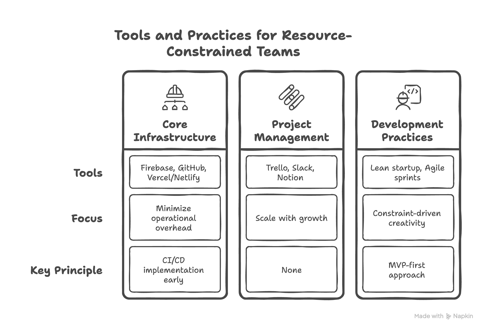

*Navigating the counterintuitive relationship between technical complexity and business velocity in resource-constrained environments*

The most fascinating paradox in startup ecosystems isn't about funding or market timing—it's about technology. The companies generating millions from elegant Ruby on Rails applications, while venture-backed startups burn through cash on sophisticated architectures, reveal something profound about the relationship between technical elegance and business outcomes.

Let's explore this complexity-performance inversion and unpack why radical simplicity often creates the most sustainable competitive advantages.

## Key Insights

- Technical sophistication and business velocity operate as inverse functions in early-stage environments
- Decision paralysis emerges from misaligned evaluation criteria, not capability gaps
- Simplicity creates adaptive capacity during high-uncertainty phases
- Communication frameworks matter more than technical frameworks for non-technical founders

## Deconstructing the Technical Decision Paralysis Loop 🕳️

**The paralysis isn't about intelligence—it's about incongruent mental models.** Non-technical founders approach technology decisions using business evaluation frameworks, while technical options are presented through engineering optimization lenses. This creates a fundamental translation gap.

**Visual Metaphors:**
🎯 Choosing technology is like selecting tools without knowing the project scope
🗺️ Navigation without understanding whether you're building a city or crossing a desert
⚖️ Weighing options using different measurement scales simultaneously

The research reveals a predictable 3-6 month delay pattern, not due to poor decisions, but rather from misalignment in the evaluation framework. Founders should optimize for learning velocity and adaptation capacity, rather than scalability and elegance.

**Case Study: The Instagram Moment**
When Instagram's servers were overwhelmed 6 hours after the iPhone launch, their simple Django and PostgreSQL stack enabled real-time AWS migration. A complex microservices architecture would have created coordination overhead, preventing rapid adaptation during their most critical inflection point.

The insight: **Simplicity creates option value during uncertainty phases.**

## The Business Value Translation Framework 📈

The most effective technical leaders operate as cognitive translators, converting engineering trade-offs into business impact models. This isn't simplification—it's sophisticated reframing that maintains technical rigor while enabling strategic decision-making.

**Framework Elements:**
• **Context Mapping**: What is the business environment in which we are operating?
• **Constraint Analysis**: What are our actual limiting factors?
• **Option Modeling**: How do technical choices create different possibility spaces?
• **Impact Measurement**: What metrics connect technical decisions to business outcomes?

**Visual Metaphors:**
🔬 Technical architecture as experiment design
🌊 Business impact as emergent system behavior  
🧭 Decision frameworks as navigation instruments

Werner Vogels exemplifies this approach with the concept of "everything fails all the time"—transforming a distributed systems concept into a business resilience principle. The sophistication lies not in the technology, but in the translation capability.

**Practical Application:**
Instead of: "We need microservices for scalability"
Reframe as: "This architecture choice reduces deployment risk by 60% and enables 2x faster customer feedback cycles"

## The Million-Dollar Rails Equation 💰

**David Heinemeier Hansson's creation of Ruby on Rails represents a fascinating case study in intentional constraint optimization.** Companies like Airbnb, GitHub, Shopify, and Basecamp have generated billions in value using Rails—a framework explicitly designed for developer happiness and rapid iteration over technical sophistication.

This isn't anti-technical sentiment—it's sophisticated systems thinking applied to resource allocation and optimization functions.

**Visual Metaphors:**
🏔️ Complexity as technical debt mountain—impressive to climb, expensive to maintain
⚡ Rails as potential energy—stored capacity for rapid movement
🎪 Architecture as performance venue—optimize for the show, not the building

**The Pattern Recognition:**

- Airbnb: Rails → rapid market validation and global scaling to $75B valuation
- GitHub: Rails → became the default platform for collaborative development
- Shopify: Rails → powers millions of merchants with $175B+ in sales
- Basecamp: Rails → sustained profitability with minimal complexity

The insight: **Early-stage optimization should target developer productivity and iteration speed, not performance metrics.**

**Framework for Rails Simplicity Evaluation:**

1. **Convention over Configuration**: How much cognitive load does decision-making require?
2. **Developer Happiness**: What's the velocity of feature development?
3. **Community Ecosystem**: How rich are the available libraries and resources?
4. **Scaling Patterns**: What proven pathways exist for growth challenges?

Rails embodies the "choose boring technology" principle—using a maximum of three "innovation tokens" per project while optimizing globally, not locally. The framework's opinionated nature eliminates thousands of micro-decisions, freeing cognitive resources for business differentiation and innovation.

## Organizational Design as Technical Architecture 🏀

**The basketball team versus baseball team metaphor reveals deeper organizational design principles.** This isn't about role flexibility—it's about information flow patterns and decision latency optimization.

Basketball teams create distributed decision-making with real-time adaptation. Baseball teams optimize for specialized execution with centralized coordination. Early startups operate in basketball environments—high uncertainty, rapid state changes, and collaborative problem-solving.

**Visual Metaphors:**
🌐 Organizations as information processing networks
🔄 Team structures as feedback loop designs
🧩 Roles as modular, composable capabilities

**Practical Framework:**

- **Generalist Hiring**: Optimize for learning capacity over domain expertise
- **Handoff Elimination**: Reduce coordination overhead through role overlap
- **Context Preservation**: Maintain decision-making capability across functions
- **Scaling Preparation**: Design for future specialist integration

The transition insight: **Converting specialists to generalists proves easier than the inverse operation.**

Rails naturally supports this organizational pattern through its full-stack philosophy—one developer can handle frontend, backend, database, and deployment concerns without context switching between different technological paradigms.

## Essential Tools as Cognitive Load Optimization 🛠️

**Tool selection represents cognitive architecture decisions, not feature comparisons.** The research identifies consistent patterns: successful teams minimize operational overhead while maximizing adaptive capacity.

**The Rails-Centric Minimalist Stack:**
• **Ruby on Rails**: Full-stack framework reducing architectural decisions to near-zero
• **PostgreSQL**: Reliable, feature-rich database with excellent Rails integration
• **Heroku/Render**: Rails-optimized hosting eliminating server management complexity
• **GitHub + CI/CD**: Automated quality assurance and deployment
• **Slack + Notion + Trello**: Distributed coordination without management overhead

**Visual Metaphors:**
🎮 Tools as a user interface design for team productivity
🔧 Technology choices as cognitive prosthetics
⚙️ Integration patterns as organizational nervous system design

The criterion isn't feature richness—it's **cognitive load optimization and scaling pathway preservation.** Rails excels because it makes thousands of good default decisions, allowing teams to focus on business logic rather than infrastructure concerns.

**Case Study: Basecamp's Sustained Simplicity**
Basecamp has operated profitably for over two decades using Rails with minimal complexity additions. Their approach demonstrates that sophisticated business outcomes don't require sophisticated technical architecture—they require sophisticated constraint management.

## The Complexity-to-Business Impact Translation Model 💡

Effective technical communication operates through quantified impact frameworks rather than feature-benefit presentations. This requires a sophisticated understanding of stakeholder mental models and decision-making criteria.

**The Translation Algorithm:**

1. **Current State Mapping**: Quantify existing complexity costs
2. **Impact Modeling**: Connect technical choices to business metrics
3. **Solution Positioning**: Frame changes as business capability improvements
4. **Value Demonstration**: Provide measurable outcome predictions

**Rails-Specific Communication Template:**
"Current system: Multiple disconnected services requiring 40% engineering maintenance
Proposed Rails monolith: Integrated full-stack application reducing maintenance to 15%
Business impact: 2 developers freed for customer-requested feature development
Expected outcome: 3x faster feature delivery, 40% customer satisfaction improvement"

**Visual Metaphors:**
🔬 Technical decisions as experimental variables
📊 Business impact as dependent variable measurement
🎯 Communication as precision targeting for decision-maker mental models

Rails provides excellent ammunition for these conversations because its productivity gains are well-documented and measurable. The framework's "convention over configuration" philosophy translates directly to "speed over complexity" in business terms.

## Storytelling as Cognitive Architecture 🎭

**Narrative structures serve as information architecture for complex decision-making.** The best technical leaders know that being genuine and showing their skills builds trust.

**The Rails Origin Story as Framework:**
David Heinemeier Hansson extracted Rails from Basecamp not because he wanted to build a framework, but because he wanted to build features faster. This narrative demonstrates how constraint-driven innovation creates broadly applicable solutions.

**Three-Audience Communication Design:**
• **Executives**: "Rails enables 3x faster development cycles with proven scaling pathways"
• **Stakeholders**: "Convention-driven development reduces bug rates by 40% while accelerating feature delivery"
• **Technical Teams**: "Full-stack coherence eliminates integration complexity and context switching overhead"

The insight: **Personal vulnerability enhances rather than undermines technical credibility** when combined with successful outcome demonstration.

🎬 Technical discussions as multi-perspective storytelling
🧭 Communication frameworks as navigation instruments for complexity
🌊 Stakeholder alignment as emergent system behavior

## The Competitive Advantage of Intentional Boredom ⚔️

The research reveals a counterintuitive principle: **in resource-constrained environments, boring technology choices often create sustainable competitive advantages.** Ruby on Rails exemplifies this perfectly—it's "boring" in the best possible way.

**Strategic Framework:**

- **Shipping Velocity**: Rails optimizes for customer feedback cycles over technical elegance
- **Maintenance Efficiency**: Convention over configuration minimizes operational overhead
- **Adaptation Capacity**: Monolithic simplicity preserves option value for future pivots
- **Resource Allocation**: Direct innovation energy toward business differentiation, not infrastructure

**Rails-Specific Implementation:**

1. Embrace the monolith until complexity genuinely demands decomposition
2. Use Rails conventions religiously to minimize decision fatigue
3. Leverage the mature gem ecosystem rather than building custom solutions
4. Measure business impact through feature velocity, not technical metrics

**Visual Metaphors:**
🏁 Rails as a vehicle for business outcomes, not a destination
⚖️ Simplicity as a strategic choice, not limitation
🎯 Focus as a competitive advantage multiplier

**The Bottom Line:** The most powerful technical strategy for bootstrap startups isn't about building impressive architecture—it's about creating maximum business velocity with minimum operational complexity. Rails embodies this philosophy perfectly: choose boring, ship fast, win consistently.

The framework's 20-year track record of enabling billion-dollar companies proves that sometimes the most innovative choice is embracing proven, productive simplicity over cutting-edge complexity.
