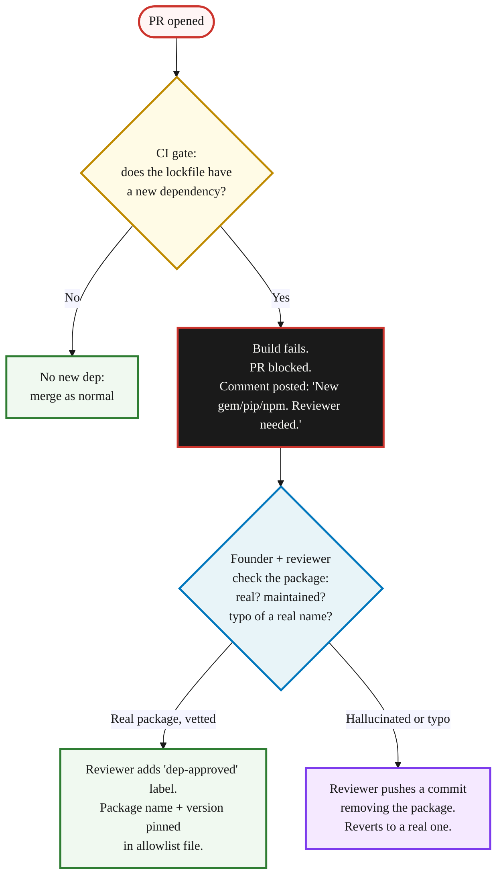

> **Module 9 · Step 3 of 3** · [Tech for Non-Technical Founders 2026](/blog/tech-for-non-technical-founders-2026/) course.
> Input: any product touching AI in build (which is most products in 2026). Output: a one-paragraph contract clause + a CI gate that blocks hallucinated dependencies before merge.

> **Supplementary content.** This chapter is relevant after you've shipped (Module 5+) and your product touches AI in production. Bookmark and return when needed.

In April 2025, Lasso Security published findings that AI assistants suggested over 200 package names across Rubygems, PyPI, and npm that did not exist. Attackers registered those names and waited. By the time the [Infosecurity Magazine writeup](https://www.infosecurity-magazine.com/news/ai-hallucinations-slopsquatting/) named the technique "slopsquatting" in April 2025, security teams had already logged the first installs of the proof-of-concept packages on real production systems. Your founder paid $34K for an MVP. The most expensive line in the codebase was free. It was the one a model invented and a developer typed into a `Gemfile` without checking that the gem existed.


## What slopsquatting is

LLMs invent package names that sound plausible but do not exist. The original [Lasso Security research from March 2025](https://www.lasso.security/blog/ai-package-hallucinations) tested GPT-4, Claude, and the open-source Code Llama against thousands of common developer prompts. About 5.2% of GPT-4's package suggestions and 21.7% of Code Llama's were hallucinated. [Snyk's reproduction in late 2025](https://snyk.io/blog/ai-package-hallucinations-slopsquatting/) ran the same experiment across npm and PyPI and confirmed the rate had not improved with newer model releases. Attackers then register the most-suggested hallucinated names as squatted packages, sometimes with a malicious payload (data exfiltration, credential theft, persistence backdoor), sometimes empty until a real victim shows up. Rubygems, PyPI, npm, Composer, and crates.io all have the same exposure. The attack does not need a 0day. It needs a developer who trusts a model.

## The 3-line CI gate (the simplest defense)

A CI gate that fails the build on any new dependency until a human signs off. Every Rails, Django, and Laravel founder can install this in 15 minutes.

```yaml
# .github/workflows/dependency-gate.yml
name: Dependency Gate
on: [pull_request]
jobs:
  check-new-deps:
    runs-on: ubuntu-latest
    steps:
      - uses: actions/checkout@v4
        with: { fetch-depth: 0 }
      - name: Block new dependencies until reviewed
        run: |
          git diff origin/${{ github.base_ref }}...HEAD -- \
            Gemfile.lock package-lock.json requirements.txt composer.lock \
            | grep -E '^\+' | grep -vE '^\+\+\+' \
            | grep -E '(^\+    [a-z]|^\+"[a-z])' && \
            { echo "::error::New dependency added. Tag @founder + sec reviewer for allowlist sign-off."; exit 1; } || \
            echo "No new dependencies. Safe to merge."
```

That is the entire defense. The PR cannot merge until a human looks at the new gem, the new pip package, or the new npm module and confirms it exists, is maintained, has the download count it should, and matches the name a developer would actually write. The gate runs on every PR. It blocks every new dependency by default. The reviewer overrides with a `dep-approved` label or a `[skip-dep-gate]` commit message that the founder must co-sign.



That is it. No Snyk subscription, no Socket.dev license, no signing key infrastructure. A 30-line YAML file and one founder who reads the PR comment when it fires.

## The contract clause

One paragraph. Send it as an SOW addendum to your existing dev shop, or paste it into the next agency MSA before signing. Do not let an agency talk you out of it.

> **Supply-chain hygiene.** Contractor will not introduce any third-party dependency (Ruby gem, PyPI package, npm module, Composer package, system library, or container base image) without prior written approval from the Founder. Approval requires (a) confirmation that the package exists on its canonical registry under the exact name proposed; (b) a published maintainer history of at least 12 months or a signed deviation memo; (c) a download / install count appropriate for the package's stated purpose; (d) a CI dependency gate that fails the build on any unapproved new dependency. Contractor is liable for any incident traceable to a hallucinated, typosquatted, or slopsquatted dependency that was not gated. AI tooling output is contractor's work product for the purpose of this clause; "the model suggested it" is not a defense.

A working agency signs this without renegotiating. One that fights the language is the agency where the slopsquatted gem already lives in your `Gemfile.lock` and they do not want to find out.

## The 2026 statistics

The threat data has caught up to the technique. [Snyk's October 2025 audit of AI coding agents](https://snyk.io/blog/ai-coding-agent-security-audit-2025/) found that **13.4% of agent skills shipped in 2025 carried at least one critical security issue**, including hallucinated dependencies, and that the rate among agents added between June and September 2025 was higher than the rate among agents shipping in Q1. The trajectory is wrong, not improving.

[SecurityWeek's coverage of the AI coding agents supply-chain risk](https://www.securityweek.com/ai-coding-agents-could-fuel-next-supply-chain-crisis/), published in mid-2025 and updated with the 2026 incident logs, lists three documented production incidents traceable to slopsquatted packages between October 2025 and February 2026:

- A YC W26 batch fintech lost a customer database after a Cursor-suggested PyPI package shipped a credential-exfiltration hook in `setup.py`.
- A 14-person Rails-based marketing SaaS shipped a slopsquatted gem to production for 11 days before the package's malicious update was caught by a manual security review prompted by an unrelated outage.
- A Laravel agency working for a non-technical founder pushed `composer.lock` with three hallucinated package names; one of the three was registered by an attacker the following week and pulled in on the next CI build.

[GitHub's 2025 State of the Octoverse](https://github.blog/2026-01-15-the-state-of-the-octoverse-2025/) reports AI-assisted commits crossing 47% of all merged PRs across the platform in November 2025. The supply-chain gap scales with that adoption. The discipline does not.

## What to do tomorrow

Three actions. None require an engineer to start.

- **Tonight: open your `Gemfile.lock` / `package-lock.json` / `requirements.txt` / `composer.lock`.** Read the package names out loud. Any name you cannot identify in 5 seconds, paste it into your registry's search (rubygems.org, pypi.org, npmjs.com). If the package has fewer than 1,000 downloads or was first published in the last 60 days, write its name on a list and ask your dev shop in writing why it is in your codebase. Save the email - it is the start of your audit.
- **This week: drop the 30-line CI gate above into `.github/workflows/dependency-gate.yml`.** Open the PR yourself if your dev shop is slow. The merge protection takes 10 minutes to wire in GitHub repository settings. Reference the [GitHub/AWS/DB ownership checklist](/blog/ownership-checklist/) for repository admin access if your name is not on the org owners list.
- **Before any new SOW: paste the contract clause from this post into the addendum section.** If the agency strikes the clause, that is the audit finding. The [SOW reading guide](/blog/hire-track-supplementary-reference/#reading-the-sow) covers the rest of the clauses you should be checking on the same pass.

## You finished the course

If you read all 26 posts of [Tech for Non-Technical Founders 2026](/blog/tech-for-non-technical-founders-2026/), you walk away holding ten artifacts: the [outreach sequence template](/blog/outreach-sequence-template/), the [Mom Test interview script](/blog/mom-test-interview-script/), the [validated problem statement template](/blog/validated-problem-statement-template/), the [Vibe PRD template](/blog/vibe-prd-template/), the [build-path decision worksheet](/blog/build-path-decision-worksheet/), the [self-serve stack walkthrough](/blog/self-serve-stack-walkthrough/), the [SOW reading guide](/blog/hire-track-supplementary-reference/#reading-the-sow), the [Friday demo template](/blog/friday-demo-rule-founder-progress/), the [GitHub/AWS/DB ownership checklist](/blog/ownership-checklist/), the [salvage vs rebuild decision tree](/blog/salvage-vs-rebuild-decision-tree/), the ["We Use AI" 5-question script](/blog/agency-ai-five-questions/), and the dependency CI gate + slopsquatting clause from this post. That is the entire Founder OS. Open a Notion page. Paste each artifact. Title it "My Founder OS, version 1." Date it. You can hand any one of those to an investor, a co-founder, an attorney, or your next dev shop and answer their questions from the artifact alone.

The ten modules you walked through:

- **Module 0** routed you to your starting point.
- **Module 1** formed the one-sentence Founding Hypothesis.
- **Module 2** smoke-tested the hypothesis with a $300 landing page.
- **Module 3** validated the problem with 10 past-behavior interviews.
- **Module 4** wrote it into a one-page Product Brief.
- **Module 5** picked the build path: self-serve or hire.
- **Module 6** locked down ownership of GitHub, AWS, and the database before the build started, then split into 6A (self-serve MVP at a staging URL) or 6B (hire path with a Fractional CTO bridge and a real SOW).
- **Module 7** booked the first paying customer with a signed pilot.
- The **oversight rhythm** put weekly Friday demos and standups in place.
- **When Things Break** prepared the salvage / rebuild decision for when something fails.
- **Manage AI-Era Risks** closed with the AI interrogation system: the 5-question script, the contract for AI-generated code accountability, and the supply-chain CI gate you just installed.

If your situation has changed since you started (new role, new product, second startup, post-exit operator now mentoring others), revisit the [course landing page](/blog/tech-for-non-technical-founders-2026/). The "start here if..." note on each module routes you to the right entry point. The course is non-linear; the landing page is the navigation.

## Further reading

- Lasso Security, [AI Package Hallucinations: A New Class of Software Supply-Chain Attack](https://www.lasso.security/blog/ai-package-hallucinations) (March 2025) - the original research that named the failure mode and reproduced the attack on Rubygems, PyPI, and npm.
- Snyk, [AI Package Hallucinations and Slopsquatting](https://snyk.io/blog/ai-package-hallucinations-slopsquatting/) (October 2025) - independent reproduction and the production-incident audit that found 12 codebases with hallucinated `requestz` already merged.
- Snyk, [AI Coding Agent Security Audit 2025](https://snyk.io/blog/ai-coding-agent-security-audit-2025/) - the 13.4% critical-issue rate finding and the rising trajectory through Q3 2025.
- Infosecurity Magazine, [AI Hallucinations Open New Slopsquatting Attack Vector](https://www.infosecurity-magazine.com/news/ai-hallucinations-slopsquatting/) (April 2025) - the writeup that coined "slopsquatting" and walked the kill chain for a non-security audience.
- SecurityWeek, [AI Coding Agents Could Fuel the Next Supply Chain Crisis](https://www.securityweek.com/ai-coding-agents-could-fuel-next-supply-chain-crisis/) - the production-incident log through early 2026 and the policy response from CISA and ENISA.
- Veracode, [State of Software Security 2025: AI-Generated Code](https://www.veracode.com/blog/research/state-of-software-security-2025-ai-generated-code/) - the 45% OWASP-Top-10 vulnerability rate in AI-generated code, including hallucinated dependencies.
- GitHub, [The State of the Octoverse 2025](https://github.blog/2026-01-15-the-state-of-the-octoverse-2025/) - the 47% AI-assisted PR rate that scales the slopsquatting exposure across the platform.
- Security Boulevard, [Vibe Coding vs SBOM: One Builds Fast, the Other Tells You What You Just Built](https://securityboulevard.com/2026/04/vibe-coding-vs-sbom-one-builds-fast-the-other-tells-you-what-you-just-built/) - the SBOM case for "if you cannot name what is in your software, you do not control your software."

---

*Built by [JetThoughts](https://jetthoughts.com) as part of the [Tech for Non-Technical Founders 2026](/blog/tech-for-non-technical-founders-2026/) curriculum.*

If you finished the course end-to-end, [drop a note](mailto:hello@jetthoughts.com?subject=I%20finished%20the%20course) or ping [@jetthoughts on X](https://x.com/jetthoughts) - we would love to hear what you shipped.
