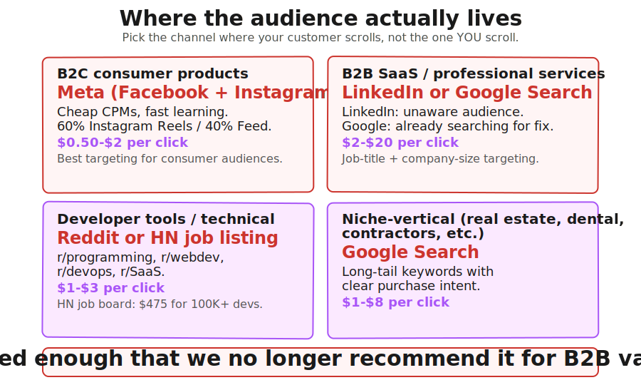
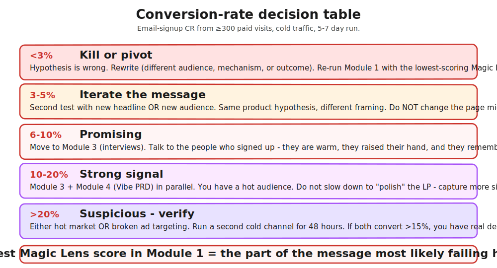

> **Module 2 · Step 1 of 1** · [Tech for Non-Technical Founders 2026](/blog/tech-for-non-technical-founders-2026/) course.
> Input: a one-sentence Founding Hypothesis (from Module 1). Output: a go / iterate / kill decision backed by ≥300 paid visits to a real landing page, plus the conversion rate.

## What a Smoke Test Actually Proves

Here is a number worth sitting with. A FinTech founder we joined on a rescue in March 2026 had run 14 customer interviews before she started build. Twelve of the 14 said "I would pay for that." She built the MVP over four months with a Lovable + Supabase stack and a developer her cousin had introduced her to. Total spend: $38,400 (developer + tooling + her own opportunity cost). When the MVP shipped in late February she ran a $420 Meta ad campaign against the same audience the 14 interviewees came from. Conversion rate on the landing page: 0.6%. Three signups, all of which churned before the second login.

The 14 interviews were not lying. They were doing what interviewees do: being agreeable on a 40-minute call with someone who sounded credible. The cost of being agreeable was zero. Asking a stranger on Meta to give up their email address - that cost is one click. The 12 yes votes vanished when the price of saying yes went from "smile and nod" to "type my email." She had skipped the demand filter and replaced it with social courtesy. Total wasted spend including the developer: $38,400 plus four months.

The smoke test is the demand filter. It runs between [Form Your Founding Hypothesis](/blog/form-your-founding-hypothesis-90-minute-sprint/) and [Find 10 People With the Problem](/blog/find-10-people-with-problem-outreach-2026/). It catches the founder who has a good idea on paper but no audience that will actually click to learn more. The signal is brutal in a useful way: nobody is being polite to a Meta ad. The conversion rate is the rawest version of "do strangers care."

What the smoke test does NOT prove is also worth naming. It does not prove the product works (you have not built it). It does not prove people will pay long-term (they are giving up an email, not a credit card unless you upgrade to the fake-Stripe variant in the sidebar). It does not prove retention. It does not prove price tolerance. It proves one thing: when a cold stranger sees your hypothesis sentence as a headline, do enough of them click the CTA to suggest a real audience exists.

That one thing saves founders the $38,400 our FinTech founder spent. The pattern is consistent across the dev-shop rescues we joined in 2026: founders who run the smoke test before building either ship the hypothesis with a baseline conversion rate to compare against in [Find 10 People With the Problem](/blog/find-10-people-with-problem-outreach-2026/) interviews, or they pivot in week two and re-test - long before a single line of production code gets written. None of them spent $38,400 to learn what $420 would have told them.

The five-step shape of the test, before we dig into each step:

```mermaid
%%{init: {'theme':'base', 'themeVariables': {'fontFamily':'Caveat, Patrick Hand, cursive', 'primaryColor':'#fff5f5', 'primaryBorderColor':'#cc342d', 'lineColor':'#333', 'primaryTextColor':'#1a1a1a'}}}%%
flowchart LR
    A["1. Define what you'll measure<br/>(email signup or $1 pre-sale)"] --> B["2. Build the page<br/>Carrd or Framer · 1 day"]
    B --> C["3. Set up tracking<br/>GA4 + Clarity + ad pixel"]
    C --> D["4. Buy cold traffic<br/>$300-$500 · 5-7 days"]
    D --> E["5. Read the numbers<br/>Go / iterate / kill"]
    classDef red fill:#fff5f5,stroke:#cc342d,stroke-width:2.5px,color:#1a1a1a
    classDef purple fill:#fbe9ff,stroke:#a855f7,stroke-width:2.5px,color:#1a1a1a
    class A,B,C,D red
    class E purple
```

## Build the Page in One Day

The temptation when you have a hypothesis is to design a beautiful page. The discipline is to ship an ugly one. The smoke test is a demand test, not a design test. Beautiful pages take three weeks and the founder has lost the thread of what they are testing by week two.

Two tools work for a non-technical founder in 2026.

**Carrd** (carrd.co, $9-49/yr for the Pro plan) is the cheapest path. One-page sites, drag-and-drop blocks, real responsive behavior on mobile. The Pro plan adds form integration with Mailchimp, ConvertKit, or whatever email tool you already use. Carrd does one thing well: it gets a working page live by lunch.

**Framer** (framer.com, free tier for the smoke test, $5-15/mo for custom domain) is the upgrade path for founders who care about typography or want a slightly more sophisticated look. Framer's templates feel like they were designed in 2025, not 2014. Free tier ships a `[yourpage].framer.website` URL that works fine for cold ad traffic; founders only need the paid tier if they want their own domain.

Pick one. Carrd if you want done by 11 AM. Framer if you have an afternoon. Do not pick Webflow, do not pick a Hugo theme, do not pick a Next.js boilerplate. You are not run a website; you are run a Tuesday-to-Saturday test.

**Required sections** of the page, in order top to bottom:

1. A headline that names the audience and the outcome in one sentence. Pull it directly from your [Founding Hypothesis](/blog/form-your-founding-hypothesis-90-minute-sprint/). Bad: "Smart financial tools for founders." Good: "Reconcile your Stripe and QuickBooks books in 90 seconds instead of 4 hours."
2. A sub-headline that names the mechanism in one sentence. "An AI agent that watches your Stripe webhooks and writes the journal entries to your QuickBooks daily."
3. A hero visual. Not a Figma mockup. A 15-second Loom screen recording of you walking through the imagined flow on a static slide deck, with your voice describing what the user sees. If you cannot record a Loom, use a single annotated screenshot. Hero visuals are the cheapest part of the page to overcomplicate; the founder who hires a designer for the hero is already lost.
4. Three or four value props. Each one is a sentence. Each one is a benefit, not a feature. "Daily reconciliation done by 6 AM" is a value prop. "Webhook integration" is not.
5. One CTA. One. Not three. The default CTA is "Get on the waitlist" with an email field. The upgraded CTA is "Reserve your spot ($1 today, refunded if we do not ship)" with a Stripe button (see the advanced sidebar).
6. A footer disclaimer in 11px gray text: "Coming Q3 2026. Email signup reserves your spot at launch." This protects you from FTC concerns about advertising a product that does not exist yet. It also gives interviewees a reason to expect a follow-up.

**Banned sections**, things the founder will be tempted to add and must not:

- Pricing pages. You do not know your price yet.
- FAQ sections. They water down the CTA conversion.
- Customer testimonials. You have no customers. Fake testimonials are fraud.
- A blog. The page goes live for 7 days. There is no blog.
- "About" pages. The visitor came from an ad. They do not care about your founder story yet.
- A "How it works" section longer than the value props. You do not know how it works yet; the test is whether people care.

The one-day rule has a reason. Founders who give themselves two weeks to build the page spend 90% of the time on visual polish and 10% on copy. Founders who give themselves eight hours spend 70% on copy. Copy is the variable that moves conversion; polish is not.

## Add a real price button

A waitlist signup tells you "this concept sounds interesting." A clicked Stripe payment link tells you "I would pay for this." Different signals. The smoke test gets sharper with the price-button version.

### Why a price button beats a waitlist

Waitlists overfit on novelty. Price buttons filter for intent. The same 100 visitors who'd cheerfully give an email might generate 0 payment clicks. That zero is the validated demand signal you actually need.

### How to set up a Stripe Payment Link in 5 minutes

No Stripe account integration. No code. Just a link.

1. Create a free Stripe account at stripe.com
2. Dashboard - Payments - Payment Links - New
3. Add a product (your hypothesis name) with a price (your hypothesis price)
4. Stripe generates a hosted checkout URL like `https://buy.stripe.com/test_xxx`
5. Paste the URL into your landing page button

The button label matters. "Reserve your spot for $99" outperforms "Buy now" for pre-product hypotheses (signals "early access" framing).

### What to measure

Three numbers from the same landing page:

| Signal | Measures | Threshold |
|---|---|---|
| Visit-to-form-fill rate | "Sounds interesting" | ≥10% = your headline works |
| Visit-to-payment-click rate | "I would actually pay" | ≥5% = price hypothesis validated |
| Form-fill-to-payment-click rate | Quality of intent | ≥30% = the people who care, really care |

The ≥5% click-to-payment-intent threshold is your go/iterate/kill signal. Below 3% means rethink price OR rethink hypothesis. Between 3-5% means iterate the headline + button copy. Above 5% means advance to Module 3 (interviews) with a price-validated hypothesis in hand.

### Cross-reference

For deep dive on the price hypothesis (when to revisit pricing post-launch, how to A/B test prices, what to do if traffic is low but click rate is high), see [Price Hypothesis on the Smoke-Test Page](/blog/price-hypothesis-on-smoke-test-page/) (Module 2.2 - dedicated chapter).

## Set Up Tracking Before You Spend a Dollar on Ads

This is the part founders skip and regret. Spending $300-$500 on cold traffic without tracking is buying lottery tickets and throwing them away unopened.

Three tools, all free or near-free, configured before the ads go live.

**Google Analytics 4** (free). Create a property, install the tracking code in Carrd or Framer's analytics section, verify in real-time view that page views are firing. GA4 is overkill for this test but it is the standard and you will use it later.

**Microsoft Clarity** (clarity.microsoft.com, free, no spending limit). Install one tracking snippet and get heatmaps plus session recordings of every visitor for free, forever. Clarity is the underrated half of the stack. The heatmap tells you where attention died on the page; the session recordings show whether visitors scrolled past your CTA or rage-clicked something you thought was a button. After 300 visits you will have 300 session replays. Watch ten random ones; the patterns are obvious within the first three.

**Ad platform pixel**. Meta Pixel, LinkedIn Insight Tag, or the equivalent for whichever channel you picked. The pixel is what lets the ad platform optimize for actual signups instead of pageviews. Without the pixel installed before launch, the platform is optimizing for clicks, which buys you the cheapest clickers and rarely the cheapest converters.

You are tracking three events. Not ten. Three.

1. **Page view** - fires automatically on landing.
2. **CTA click** - fires when the visitor clicks the button on the email form.
3. **Form submit** - fires when the email actually goes in. This is the conversion event.

Page view to CTA click is the headline-and-value-prop signal. CTA click to form submit is the friction signal (a real audience clicks and then bounces if the form is annoying). Form submit divided by page view is your conversion rate - the number your Founding Hypothesis is being judged against.

The founder who launches ads before the pixel fires has one number at the end of the week: how much they spent. Every other num is missing. That happened to a B2B SaaS founder we joined in early 2026 - she spent $480 on Meta and could only tell us "I think we got some signups." She had not installed Clarity. She had not installed the Meta Pixel. We rebuilt her tracking on a Tuesday, re-ran the same ad set for $260 on the Wednesday-to-Sunday window, and got real numbers back. Lesson cost: $480.

## Buy $300-$500 of Cold Traffic on the Right Channel

The right channel depends on your ICP. The wrong channel burns the budget with no signal. Founders who pick wrong here usually do it for the same reason: they pick the channel they personally use most, not the channel their customer uses.

**B2C consumer products → Meta** (Facebook + Instagram). Cheap CPMs, fast learning, the best targeting for consumer audiences. Budget split: 60% Instagram Reels, 40% Facebook feed. Run a single ad creative variant for the first 48 hours; let the algorithm pick the audience.

**B2B SaaS, professional services, or anything sold to a job title → LinkedIn or Google Search**. LinkedIn is expensive per click ($8-$20) but the targeting on job titles, company size, and industry is unmatched. Google Search is cheaper per click ($2-$8 on most B2B terms) but you only get the people who already know they have the problem - you miss the unaware audience. The right pick is LinkedIn if your hypothesis is about a problem people do not yet realize they have, Google if your hypothesis is about a problem people are already searching for.

**Developer tools or technical products → Reddit or Hacker News job listing**. Reddit Ads run cheap ($1-$3 per click) and the developer subreddits (r/programming, r/webdev, r/devops, r/SaaS) are where the audience actually lives. Hacker News job listings are technically not ads but cost $475 for a month and reach 100K+ developers - a fair shot when your hypothesis is technical enough that the audience overlaps. Twitter / X has decayed enough as a B2B targeting channel that we no longer recommend it for first-time validation in 2026.

**Niche-vertical products → Google Search**. Real estate agents, dentists, contractors, etc. Google Search captures intent better than any social channel when the audience does not hang out on platforms. Long-tail keywords are cheap; bid only on terms with clear purchase intent.

**The run-length rule: 5-7 days minimum.** Day-1 conversion lies. The first 24 hours of any ad campaign attract the platform's most reactive clickers, not the most representative ones. By day 3 the audience normalizes. By day 5 you have a stable conversion rate. Founders who read the day-1 number and kill the campaign miss every test that needed three days to find the right viewer.

**The volume rule: ≥300 paid visits before reading the numbers.** Below 300 the sample is too small to distinguish 2% from 5%. With 300 visits a 5% conversion is 15 signups, a 2% conversion is 6 signups, and the difference between 15 and 6 is meaningful. With 100 visits a 5% conversion is 5 signups, a 2% is 2, and you cannot tell whether you have a hot audience or a noisy one. Spend the $300-$500. Get to 300 visits. Do not pre-judge.

The Presta Startup Validation Framework 2026 frames the budget bluntly: *if you can't validate with $500 of traffic, you likely can't validate with $50K.* The corollary is that founders who refuse to spend $300 on this test because "I want to save the money for the build" are saving $300 to spend $30,000 instead. The smoke test budget is the cheapest budget in your founder career.

## Read the Numbers, Decide

You have your 300+ visits, your tracked CTA clicks, your form-submit count. Now you read the conversion rate against the table below. The Foundry CRO 2026 industry benchmark report (which cites Unbounce's Q4 2024 data) puts the median across all industries at 6.6%, the SaaS / technology median at 3.8%, B2B professional services at 1-3%, paid search traffic at 3.2%, paid social at 1.5%. Those are aggregate medians across mature products with optimized funnels. Your unoptimized smoke test against cold traffic at week one is comparing against a different baseline.

| Email signup CR from cold paid traffic | Decision | What to do |
|---|---|---|
| <3% | Kill or pivot | Hypothesis is wrong. Rewrite (different audience, mechanism, or outcome). Rewrite your [Founding Hypothesis](/blog/form-your-founding-hypothesis-90-minute-sprint/). |
| 3-5% | Iterate the message | Second test with new headline OR new audience. Same product hypothesis, different framing. |
| 6-10% | Promising | Move to [Find 10 People With the Problem](/blog/find-10-people-with-problem-outreach-2026/). Talk to the people who signed up. |
| 10-20% | Strong signal | Run [customer interviews](/blog/find-10-people-with-problem-outreach-2026/) + [The One-Page Product Brief](/blog/one-page-product-brief-vibe-prd/) in parallel. You have a hot audience. |
| >20% | Suspicious | Either hot market OR broken ad targeting. Verify with a second cold channel. |

Three rules for reading the table honestly.

First, the lens that scored lowest in [Form Your Founding Hypothesis](/blog/form-your-founding-hypothesis-90-minute-sprint/) is the part of the message most likely to fail in this test. If your Customer lens scored 2/5 in the Foundation Sprint, expect the conversion to come in below 5% - the audience question was the weak link. If your Money lens scored 1/5 (like our procurement-tool founder), expect the conversion to land respectable but the price-test in [The One-Page Product Brief](/blog/one-page-product-brief-vibe-prd/) to fail. The smoke-test number tells you which of the five Mad Libs blanks the audience is rejecting; it does not tell you the product idea is dead. The next move is to rewrite the blank that the lens flagged.

Second, do not optimize the page mid-test. Founders who see a 2% conversion on day 3 and rewrite the headline are not run a test anymore - they are run an A/B/C/D test with a sample size of 100 each, which is statistically useless. The signal you want is raw demand against the original hypothesis, not optimized funnel performance. If the original hypothesis flunks at 2%, that is the answer. Iterating gives you a 4% conversion against a hybrid sentence you did not write down, which proves nothing.

Third, the >20% band is the one founders most often misread. A 25% conversion rate on cold traffic feels like product-market fit. It usually means one of three things: (a) you have a hot audience (rare and great), (b) your ad targeting selected for an audience that already had the problem solved by a competitor and they are signing up to compare, or (c) your ad creative misled them about what the product does and they will all churn at signup confirmation. Verify by running a second cold channel for 48 hours. If LinkedIn shows 18% and Reddit shows 22%, you have a hot market. If LinkedIn shows 22% and Reddit shows 3%, your LinkedIn targeting is the variable, not the hypothesis.

A reasonable two-week schedule for the smoke test looks like this. Monday: write the page in one day using your [Founding Hypothesis](/blog/form-your-founding-hypothesis-90-minute-sprint/). Tuesday: install GA4, Clarity, and the ad platform pixel; verify all three fire. Wednesday morning: launch the ad campaign on your chosen channel. Wednesday afternoon through Sunday: do nothing. Do not rewrite the headline. Do not adjust the bid. Do not refresh the dashboard every hour. Monday morning of week two: read the numbers. Make the go / iterate / kill decision. If go, [customer interviews](/blog/find-10-people-with-problem-outreach-2026/) start Tuesday with your signup list as the warmest cold list you have ever had. If iterate, you have one more week and one new test ahead of you. If kill, you have a $300-$500 receipt and seven days saved versus building the product.

The trade-off worth naming: the smoke test misses founders whose product genuinely needs a longer education arc to make sense (a category-creation product, a complex B2B integration, a regulated-industry tool). Those founders will see 2-3% conversion on the smoke test and might pivot away from a product that would have worked given a sales motion. The rule of thumb: if your hypothesis sentence is hard to fit in a headline, the smoke test is not the right filter and you should run a paid-pilot conversation instead - see [Charge Before You Ship](/blog/paid-pilot-charge-before-ship/). For everything else, $300-$500 of cold traffic is the cheapest answer you will buy.

## Advanced (optional sidebar)

The default smoke test captures email addresses. The Pieter Levels upgrade captures dollars.

Replace the "Get on the waitlist" CTA with a "Reserve your spot ($1 today, refundable if we do not ship by [date])" CTA wired to a real Stripe checkout. After the $1 charge, the user lands on a confirmation page that says "you are reserved, we will email you when we ship in Q3 2026." The $1 charge proves the user was willing to type a credit card, not just an email. The conversion rate drops 3-5x compared to the email-only version - that is the point. The remaining converters are real demand, not curious clickers.

Pre-sale tiers from a $300-$500 traffic spend, based on Levels' own 70-product track record at [levels.io](https://levels.io/startups/):

- 0 sales: invalidate the hypothesis or the price.
- 1-10 sales: iterate the headline or the audience.
- 50+ sales from $500 of traffic: product-market-fit signal is in range; move to [customer interviews](/blog/find-10-people-with-problem-outreach-2026/) and [The One-Page Product Brief](/blog/one-page-product-brief-vibe-prd/) in parallel.

The Levels move is harder to set up (Stripe account, refund discipline, FTC compliance copy) and is the right move for founders on their second or third hypothesis who want stronger signal. First-time founders should run the email-only version above.
## Further reading

- Founder FAQs, [How to Run a Smoke Test Landing Page to Prove Demand](https://founderfaqs.com/blogs/how-to-run-a-smoke-test-landing-page-to-prove-demand) - 2026 step-by-step on the smoke-test workflow, including the email-CTA variant and the fake-Stripe variant.
- Presta, [Startup Validation Framework 2026](https://wearepresta.com/startup-validation-framework-2026-the-ultimate-guide-to-testing-ideas/) - the $500 budget rule and the validation-before-build doctrine.
- Foundry CRO, [Landing Page Conversion Rate Benchmarks 2026](https://foundrycro.com/blog/landing-page-conversion-rate-benchmarks-2026/) - the conversion-rate medians by industry and traffic source (citing Unbounce Q4 2024).
- Pieter Levels, [the 70-product startups portfolio](https://levels.io/startups/) - the fake-Stripe pre-sale playbook in operation across a decade of indie launches.
- Kromatic, [Real Startup Book - Landing Page Smoke Test](https://kromatic.com/real-startup-book/4-evaluative-market-experiment/landing-page-smoke-test) - the canonical Lean Startup version of the smoke-test experiment with the original Evaluative Market Experiment framing.
- [Carrd](https://carrd.co/) - the cheapest one-page builder for a smoke-test landing page.
- [Framer](https://framer.com/) - the upgrade for founders who want better typography and templates.
- [Microsoft Clarity](https://clarity.microsoft.com/) - free heatmaps and session recordings, no spending cap, the underrated half of the tracking stack.
- [PostHog](https://posthog.com/) - open-source product analytics alternative to GA4 + Clarity, useful once the smoke test passes and you start build.

---

*Built by [JetThoughts](https://jetthoughts.com) as part of the [Tech for Non-Technical Founders 2026](/blog/tech-for-non-technical-founders-2026/) curriculum.*
