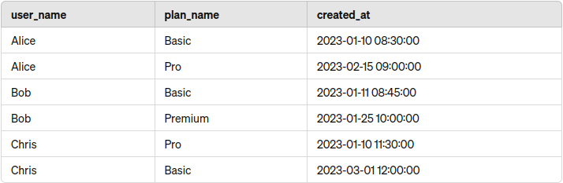

Here's one possible solution for a case when you need to fetch a set of records unique on one (or several) column with a min/max value in the other column (usually a timestamp). The solution doesn't require any changes to the DB scheme (denormalization or creation of views) and can be performed in the scope of a single SQL query.

## Scenario
Imagine you have a table named `customer_subscriptions` with the following fields:

- `user_name` (we'll use name instead of `user_id` for simplicity here consider `user_name` to be unique for this example)
- `plan_name` (we'll use name instead of `plan_id` here as well)
- `created_at` (the timestamp when the subscription was created)

For illustration, consider the following data in `customer_subscriptions`:



Let's say we want to show a table showing what was the first subscription plan for each user:


## Subquery JOIN solution

1. First, we must find the minimum `created_at` value for each user subscription entry separately in a subquery.
2. Then, we join the subquery on `user_name` and `created_at` to filter down to the first subscription record for each user.

```sql
SELECT cs.user_name, cs.plan_name, cs.created_at
FROM customer_subscriptions cs
JOIN (
    SELECT user_name, MIN(created_at) AS min_created_at
    FROM customer_subscriptions
    GROUP BY user_name
) AS sub
ON cs.user_name = sub.user_name AND cs.created_at = sub.min_created_at;
```

This solution would work perfectly for both MySQL and PostgreSQL.

## PostgreSQL-specific solution

In PostgreSQL, we can use `DISTINCT ON` to filter the resulting set to be unique on specific columns, such as `user_name`. We won't need to join an additional subquery.

1. `DISTINCT ON (user_name)`: Ensures that each `user_name` appears only once in the result set.
2. `ORDER BY user_name, created_at`: Orders the records by `user_name` and then by `created_at` within each user_name, so the first record (with the smallest `created_a`t value) is selected.

```sql
SELECT DISTINCT ON (user_name) user_name, plan_name, created_at
FROM customer_subscriptions
ORDER BY user_name, created_at;
```

## Conclusion

Fetching the first subscription record for each user based on the earliest `created_at` value can be efficiently achieved using different SQL constructs available in MySQL and PostgreSQL. While MySQL relies on subqueries and joins, PostgreSQL’s `DISTINCT ON` clause provides a straightforward and elegant solution.