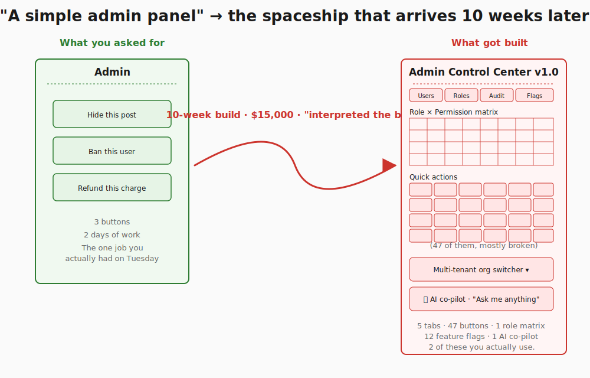
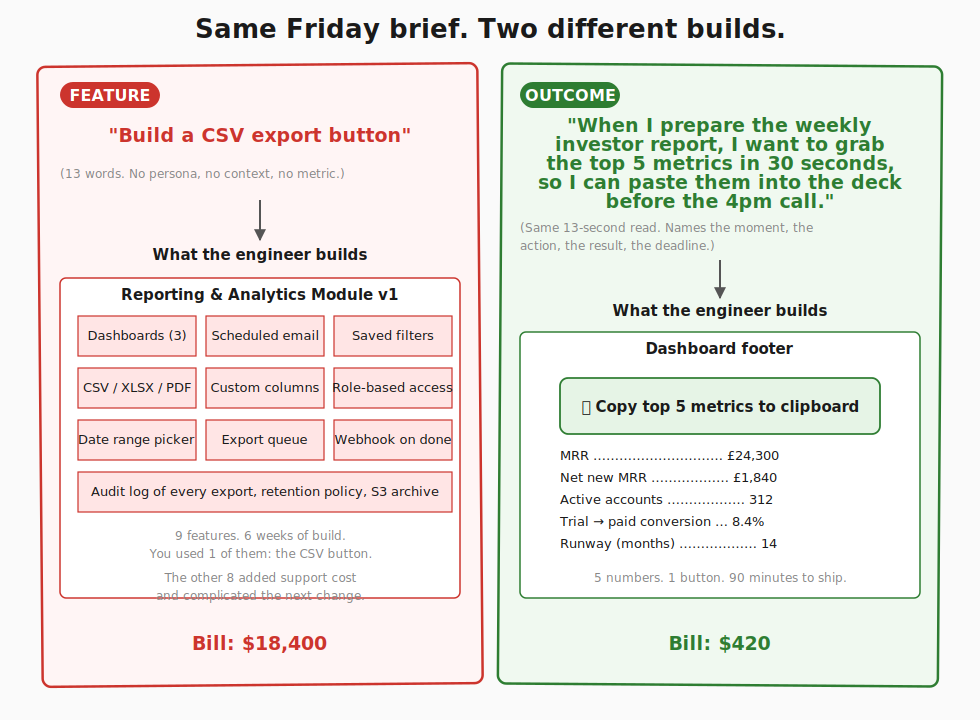
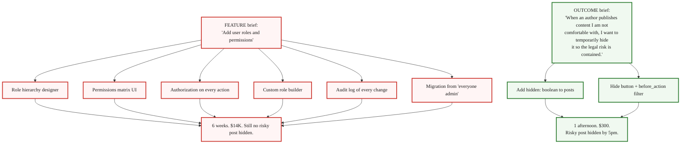

> **Module 4 · Step 2 of 2** · [Tech for Non-Technical Founders 2026](/blog/tech-for-non-technical-founders-2026/) course.
> Input: a one-page Product Brief (from [Module 4.1](/blog/one-page-product-brief-vibe-prd/)). Output: a one-page Product Brief rewritten so engineers and AI agents stop overengineering.

You asked for a simple admin panel. You got a spaceship. The reason is not that your engineers are show-offs. The reason is sitting on page one of the brief you sent them. You wrote *"a simple admin panel"* and moved on. They read those four words, filled in everything you did not say, and came back ten weeks later with 47 buttons, a role-permissions matrix, an audit log, and a co-pilot AI assistant nobody asked for.

## Why this matters in 2026

Engineers and AI agents have the same failure mode when the brief is vague. They fill in the missing scope from their training data. An engineer who just finished a stint at a big SaaS company will imagine the admin panel that company shipped. Cursor or Lovable will imagine the median admin panel scraped from a million GitHub repos, which is roughly the same shape. Feature-shaped requests like *"a CSV export button"* or *"add user roles"* invite the imagined system around them, because a feature word in isolation has no anchor to your actual job. An outcome-shaped request like *"when I prepare the weekly investor report, I want to grab the top 5 metrics in 30 seconds, so I can paste them into the deck before the 4pm call"* has nowhere to drift. The moment, the action, the result, and the deadline are all named. The build collapses to the smallest path that answers them. [Veracode's 2025 GenAI study](https://www.veracode.com/blog/genai-code-security-report/) found 45% of AI-generated code ships with at least one exploitable flaw, and the flaw rate climbs in direct proportion to how much the agent had to imagine. Tight outcome-shaped briefs are also the cheapest defense.

## Three briefs, two shapes each

Same job, two ways to write it. Read each pair out loud. Notice how much the engineer or the agent has to invent under the feature shape, and how little they have to invent under the outcome shape.

### Pair 1 - The CSV button

**Feature shape**: *"Build a CSV export button on the dashboard."*

**Outcome shape**: *"When I prepare the weekly investor report, I want to grab the top 5 metrics in 30 seconds, so I can paste them into the deck before the 4pm call."*

What the engineer builds from the feature shape: a reporting module with three dashboards, scheduled email exports, role-based access on who can export, a date-range picker, custom column selectors, and an audit log of every download. Six weeks of work. You used the CSV button once a week for the investor email and ignored the other eight features.

What the engineer builds from the outcome shape: one button at the bottom of the existing dashboard that says *"Copy top 5 metrics to clipboard,"* hard-coded to MRR, net new MRR, active accounts, trial-to-paid conversion, and runway. Ninety minutes of work in a Rails controller, one line per metric. The next investor email goes out before the deck even opens.

### Pair 2 - The user-roles request

**Feature shape**: *"Add user roles and permissions."*

**Outcome shape**: *"When an author publishes content I am not comfortable with, I want to temporarily hide it so the legal risk is contained until we decide what to do with the author."*

The feature shape opens a six-week tunnel. The engineer has to design a role hierarchy, build a permissions matrix UI, write authorization on every controller action, and figure out the migration path from "everyone is admin" to the new model. By week three the team is debating whether moderators should be able to ban or only hide, and the underlying problem - hiding one risky post in a hurry - is still unsolved.

The outcome shape gives the engineer one move: a *Hidden* boolean column on the `posts` table, a *Hide* button on the post page that flips it, a `before_action` filter on the public page that respects the flag. One afternoon of work. No roles, no matrix, no migration. When you actually need moderators-vs-admins six months later, that build sits cleanly on top of the boolean. The cheap thing first; the expensive thing only when the cheap thing stops working.

### Pair 3 - The CRM module

**Feature shape**: *"Build a CRM module."*

**Outcome shape**: *"When a new customer signs up, I want to see which 3 of our existing customers most resemble them, so I can pattern-match the onboarding playbook that worked for those three."*

What the engineer builds from the feature shape: companies, contacts, deals, pipelines, activities, tasks, notes, custom fields, email integration, calendar integration, and a Kanban board nobody opens. Three months. You used the contacts list and the notes field.

What the engineer builds from the outcome shape: a 30-line script that runs nightly, scores existing customers against the new signup on three attributes (industry, employee count, plan tier), and posts a Slack message every morning: *"New customer Acme Co looks most like Beta Inc, Gamma Ltd, and Delta GmbH - here are their onboarding notes."* Two days. The script is throwaway. When Salesforce is finally worth the bill, you import the script's three matches into the proper CRM record.

## The three-part shape that constrains every spec

Each outcome-shaped brief in the section above has the same three parts. The shape works because each part forecloses a category of overbuild.

**When [trigger context]** - the specific situation that activates the need. Names the moment, the day, the deadline, the surrounding tools. *"When I prepare the weekly investor report"* tells the engineer this happens once a week, that there is a deck involved, that there is a 4pm call. The engineer will not build a real-time streaming dashboard for something that happens on a Tuesday afternoon.

**I want [internal motivation]** - what you are trying to do, expressed as a verb on a concrete object. *"I want to grab the top 5 metrics in 30 seconds"* is a verb (grab) and an object (the 5 metrics) and a budget (30 seconds). The engineer will not build a 12-metric dashboard because you said 5, and will not build an asynchronous export queue because you said 30 seconds.

**So I can [outcome]** - the business or personal result that proves the build worked. *"So I can paste them into the deck before the 4pm call"* gives a finish line the engineer can hold up against any feature suggestion. The engineer can now say: *"Does the build let you paste into the deck before 4pm? Then we are done. Does the audit log help with that? No? Cut it."*

Put the three parts together and the engineer or the AI agent has nowhere left to fill in scope. Drop any one part and they will. Drop the *when* and the build is timeless and over-engineered. Drop the *I want* and the build is a feature list. Drop the *so I can* and the build hits the spec but misses the job. (The same shape has a name in product-management literature - see *Further reading* below if you want to chase the lineage. The shape works without the name. The name does not make the shape work.)

## What to do tomorrow

Three actions, in order.

- **Open your filled-in [Vibe PRD](/blog/vibe-prd-template/) from Module 4.1.** Find Section 3 ("What you're building"). Read the section out loud. If any line begins with a noun-shaped feature ("a CSV button," "a CRM," "user roles," "a settings page"), it is feature-shaped. Mark it.
- **Rewrite each marked line in the *When / I want / So I can* shape.** Force the *when* to name a specific moment with a deadline. Force the *I want* to name a verb and a budget. Force the *so I can* to name a result you can measure that week. Hard cap at 25 minutes for the whole section. If you spill, the section is too big - your one-page brief is trying to be three.
- **Share the rewritten section with your engineer or your AI agent and ask exactly one question**: *"What would you build differently from this brief than you would have built from the feature list?"* Their first answer is the scope you were about to lose. Their second answer is the scope you are about to keep.

> Feature-shaped briefs let engineers and AI agents fill in your scope from their training data. Outcome-shaped briefs name the moment, the action, the result - and leave nothing for them to invent.

The cheap fix for this whole pattern is the rewrite tomorrow morning. The expensive fix is the [salvage decision](/blog/salvage-vs-rebuild-decision-tree/) you are otherwise reading six months from now, after the spaceship lands and the next round of investors asks why the demo is so heavy. The brief is cheaper than the build it prevents. Module 4 closes here. Module 5 (Choose Your Build Path) is where you decide whether your rewritten brief goes to a self-serve stack or a hired team.

## Further reading

- Alan Klement, [*When Coffee and Kale Compete*](https://www.whencoffeeandkalecompete.com/) - the book that introduced the *When / I want / So I can* shape under the name "Job Stories" in 2013. The framework is worth chasing once your team is bigger than two; the shape is worth using tomorrow.
- Marty Cagan, [Product vs Feature Teams](https://www.svpg.com/product-vs-feature-teams/) - the canonical essay on why product teams (chartered with outcomes) ship better than feature teams (chartered with feature lists).
- Veracode, [GenAI Code Security Report 2025](https://www.veracode.com/blog/genai-code-security-report/) - 45% of LLM-generated code shipped at least one exploitable security flaw. Vague briefs amplify the rate.
- DHH, [The One Person Framework](https://world.hey.com/dhh/the-one-person-framework-711e6318) - the Rails case for keeping the architecture small enough that one developer can ship outcomes end-to-end.
- Basecamp / Ryan Singer, [Shape Up - Appetite vs Estimate](https://basecamp.com/shapeup/1.2-chapter-03) - the chapter on writing pitches that fix the appetite first, so the build collapses to fit.
- Tom Kerwin, [JTBD Job Stories vs User Stories](https://jtbd.info/replacing-the-user-story-with-the-job-story-af7cdee10c27) - the 2013 Klement piece on Medium that popularised the shape, for readers who want the original 1,500 words.
- Y Combinator, [Startup School: How to Write a Product Spec](https://www.ycombinator.com/library/) - YC's distilled take on specs that ship versus specs that sit.

---

*Built by [JetThoughts](https://jetthoughts.com) as part of the [Tech for Non-Technical Founders 2026](/blog/tech-for-non-technical-founders-2026/) curriculum.*
