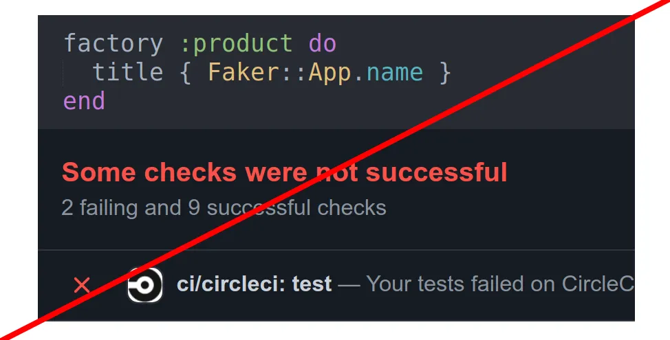

**Faker/FFaker** can seem like the perfect solution to generate data for testing.

In theory, Faker increases development speed while allowing you to have real-looking test data and having your database populated with more records while you’re doing development.

But in reality, Faker comes with hidden costs. That said, we don’t think you can truly appreciate their complexity without building them firsthand.

Here is what we learned using Faker in our projects.

## Raised risk for randomly failing tests (aka flakiness)

One of the biggest challenges in tests is preventing flakiness (not determined tests) which is hard to debug. Your randomized data might at some stage trigger unexpected results in your tests, making your data frustrating to work with.

This is a frustrating process since tests might fail only once every ten or hundred runs — depending on how many attributes and possible values there are and which combination triggers the bug.

**What exactly is difficult to determine?**

Faker produces tones of tests that are hard to debug. It isn’t easy to understand why the test failed and harder to reproduce the same test scenario.


Code will produce problems in which someone **spends more than 10 hours finding that problem** or triangulating the issue.

Primely tests must describe one specific case to be **explicit and deterministic***.* Repeatability of results requires repeatability of test fixture setup and repeatability of the interactions with the software under test.

### Ther is a simple example where the test produces an error:
```
    test 'with faker' do
      *product *= Product.new(title: **Faker::App.name**)
    
      assert_equal 'Entered title', *product*.title
    end

    => test::Assertion: Expected: "Rails App"
    =>  Actual: "**Daltfresh**"
```
That will be the trouble to debug by title to find out where the title Daltfresh was used because it is generated randomly, and, e.g., on the next run, we will see another title.

## Reduced performance

Random is a very relative value. Comparatively to constant data, the function that generates **a random variable is quite resource-intensive**.

Looking at how generates a pseudo-unique number, a massive amount of resources can be spent on a regular generation of random ID.

It turns out that random operation is quite tricky in tests, especially Faker because Faker is not just random, it works with bigger volumes of data like strings, texts, and thus Faker sags performance where it is not needed.

For one of our projects, we **reduced it by** **20% (more than 20 min)** by replacing Faker with alternatives.

## Faker breaks the common principles of testing

The problem is that random data breaks [F.I.R.S.T principles of testing](https://medium.com/@tasdikrahman/f-i-r-s-t-principles-of-testing-1a497acda8d6).


Performance issues may violate the fast testing principle.


## Effect on development
>  *As a result above together gives a meaningful impact on the project, and in fact, the sum will be a critical slowdown in development. This is incredibly frustrating.*


Persistent troubleshooting instead of productive development not only frustrates customers who encounter them but frustrates team members who constantly address them.

## **What do we use instead of Faker?**

It depends on the case of data — unique or scalar.

Here we use a **Sequence** to get the unique title:
```
    factory :product do
      sequence(:title) { |*n*| "Title #{*n*}"}
    end

    ...

    test 'with sequence' do
      *product *= build(:product)
    
      assert_equal 'Entered title', *product*.title
    end
```
Using a **Constant **to get the pre-defined title:
```
    test 'with constant' do
      *product *= Product.new(title: 'Book')
    
      assert_equal 'Entered title', *product*.title
    end
```
Using Sequences and Constants it is easier for us to determine and repeat the failing test.

**Oleh** is a Software Engineer at [JetThoughts](https://www.jetthoughts.com/). Follow him on [LinkedIn](https://www.linkedin.com/in/oleh-barchuk-0b9813192/) or [GitHub](https://github.com/phoenixixixix).
>  If you enjoyed this story, we recommend reading our [latest tech stories](https://jtway.co/latest) and [trending tech stories](https://jtway.co/trending).

**References:**

* [F.I.R.S.T principles of testing](https://medium.com/@tasdikrahman/f-i-r-s-t-principles-of-testing-1a497acda8d6)

* [xUnit Patterns **Test Smells** Erratic Tests](http://xunitpatterns.com/Erratic%20Test.html)
