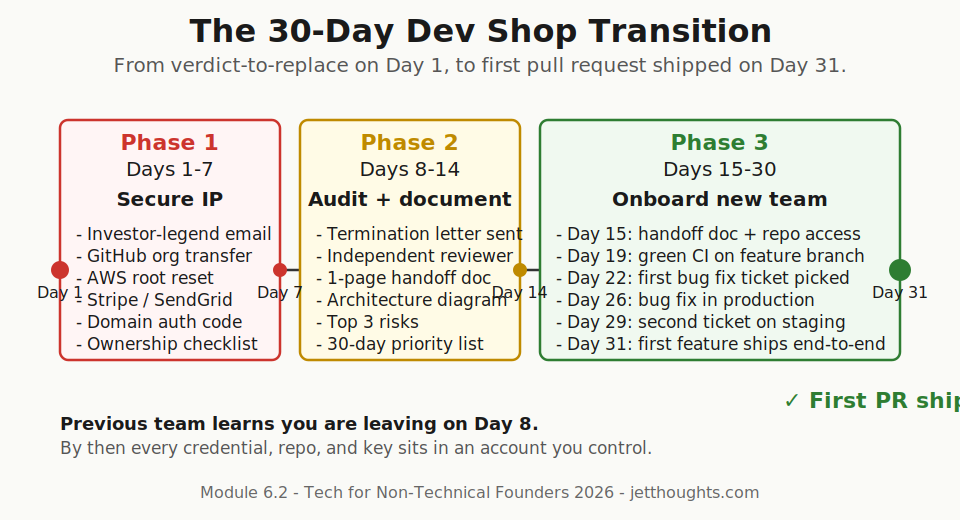
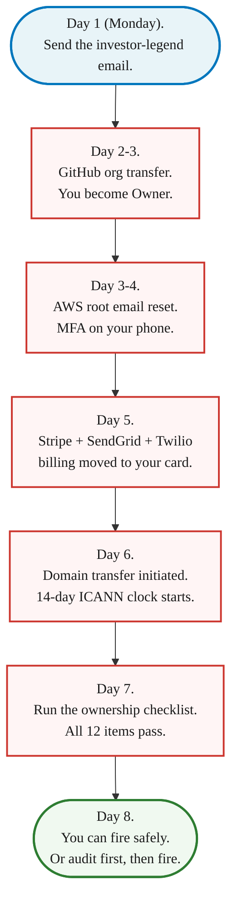

> **Module 6 · Step 2 of 2** · [Tech for Non-Technical Founders 2026](/blog/tech-for-non-technical-founders-2026/) free course.
> Input: a Module 6.1 verdict that says replace the team. Output: a 30-day transition that ends with the new team shipping by Day 31.

What is the cheapest way to lose your codebase forever? Tell the agency you are firing them on Day 1, before you have moved a single GitHub org, AWS root, or Stripe key. The next morning, the lead engineer pushes a force commit to `main`, the AWS root password gets rotated, and a domain transfer that takes 14 days under ICANN rules turns into 14 days of downtime you did not budget for.

The verdict from [Module 6.1's salvage-vs-rebuild decision tree](/blog/salvage-vs-rebuild-decision-tree/) said REPLACE the team. This post is the 30-day playbook for actually doing it without losing the artifact you are paying to keep. The next team ships their first pull request to staging by Day 31. The previous team finds out you are leaving on Day 8, after every credential, repo, and key sits in an account you control.

## Why most transitions burn 60-90 days

Founders who switch dev shops without a plan lose a quarter of runway to the gap. The previous team gets the termination email Monday, the new team starts intro calls Wednesday, and nobody has a working local environment until week six. In between: an unmaintained production app, no one to fix the 11pm Stripe webhook bug, and an investor update that has to explain why velocity went to zero.

The shape of a working transition is the inverse. The previous team does not know you are leaving until Day 8 - by then every credential is yours. The new team is interviewed in parallel with the audit (Days 8-14) and starts on Day 15 with a one-page handoff doc and write access to a repo you own. Day 31 ships a real pull request, not a Slack message about why ramp-up takes another sprint.

## Phase 1 (Days 1-7): Secure IP without triggering conflict

The single failure that turns a 30-day transition into a 90-day legal mess is announcing the firing before the assets move. Once the previous team knows they are losing the contract, who holds the cards flips. They control the GitHub org. They control the AWS root. They control the domain. They have no incentive to release any of it on your timeline.

So the first week is not about the new team. It is about quietly moving every credential into accounts you own, while the previous team thinks the relationship is unchanged.

This is where the **investor legend** comes in. You need a diplomatic cover story for asking the agency to transfer the GitHub org, reset the AWS root email, and add you as the billing owner on every third-party service - all in the same week, all with no friction. The cover story most founders use successfully:

> "Our investor diligence requires us to consolidate all production infrastructure under the corp account before next quarter's board meeting. Can you transfer the GitHub org to `founder@mycompany.com` this week? The AWS root email and Stripe billing too. Our lawyer is asking."

It works because every agency has heard it before. Investor diligence is a non-negotiable external deadline that does not threaten the agency's contract. Asking for the same five access transfers as a "we are firing you" is a confrontation. Asking for them as "our investor needs this by Friday" is a chore the agency processes in 20 minutes between sprints.

The script does not need to be true. It needs to be plausible. If you do have an investor and a board, even better - the legend is just the actual reason. If you do not, the legend still works because the agency is not going to call your investor.

The five moves in order. Each one is a 20-minute task for the agency, a 5-minute confirmation for you.

- **GitHub org transfer.** Settings - Transfer ownership. They type your email, GitHub sends you a confirmation, you accept. The agency's developers stay on as Outside Collaborators with the same write access they had Friday. Nothing changes in their workflow. Everything changes in yours.
- **AWS root email + MFA.** They go to Account Settings, change the root user email to `aws@yourcompany.com`, you confirm via the email link, you set MFA on your phone, you set a new root password and store it in your password manager. The IAM users the agency uses keep working. The console looks identical to them.
- **Third-party billing on your card.** Stripe, SendGrid, Twilio, Plaid, OpenAI - whoever charges you monthly. Each takes 2 minutes in the settings UI. The API keys keep working; only the billing email + card change.
- **Domain transfer.** This one cannot be hidden because the auth code has to come from the losing registrar. Frame it as "moving the domain to our company registrar account so renewal billing is on the corp card." Initiate the transfer to a registrar account in your name. The 14-day ICANN clock starts ticking; nothing breaks during the window.
- **Run the [ownership checklist](/blog/ownership-checklist/) on Friday afternoon.** The 12-item audit. By the end of Friday, every item is PASS. If anything is still FAIL on Day 7, fix it before Monday. Do not start Phase 2 on a foundation you do not own.

By the end of Day 7, the agency thinks you ran a routine consolidation pass. The new team's job is now possible because every account they will inherit on Day 15 is already in your name.

## Phase 2 (Days 8-14): Audit and document

The audit is what tells the new team what they are walking into - and tells you whether the cost of onboarding is two weeks or two months.

Hire one independent senior engineer for a 3-day paid audit, not the new agency you are about to sign with. The new agency has a structural incentive to find more work. An independent reviewer (a fractional CTO from [Module 3.2](/blog/fractional-cto-bridge-5-hours-week/), or a Toptal Senior, or one of the AI-Augmented Developers from [Module 4B.1](/blog/who-where-hire-developer-2026-ai-augmented-offshore/)) gets paid the same whether the verdict is "salvage" or "rebuild," so the verdict is closer to honest.

The reviewer's job is **not** to read every line of code. The job is to fill in a one-page handoff doc the new team will use on Day 15. Six sections, half a day per section:

- **The architecture diagram on one page.** Boxes for the web app, the database, the worker queue, every external API. Lines for who calls whom. If the previous team cannot draw this from memory, the reviewer draws it by reading the routes file and the deploy config.
- **The top three risks.** "0% test coverage on the checkout flow." "Auth implemented three times, two paths still wired." "Stripe webhook handler swallows exceptions silently." Specific. Reproducible. Not "the code is messy."
- **The deploy story.** How does code get from a developer's laptop to production? If the answer is "Marcus pushes to main and SSHes into the box," that is the first thing the new team rebuilds.
- **The credentials inventory.** What secrets exist, where they are stored, who has access. Cross-reference against the Phase 1 ownership checklist - anything that did not pass on Day 7 lives here as a known gap.
- **The on-call situation.** Who gets paged at 3am if the database melts? In most failed engagements, the answer is "nobody." The new team needs to know this before Week 1, not during the first outage.
- **The 30-day priority list for the new team.** Not "rewrite everything." Three concrete tickets the new team ships in their first sprint to prove they can read this codebase. A small bug fix, a small feature, a deploy pipeline improvement.

A reviewer earning $400-$800 a day, three days, costs $1,200 to $2,400. The handoff doc compresses what would otherwise be six weeks of new-team archaeology into a 90-minute read on Day 15.

## Phase 3 (Days 15-30): Onboard the new team

By Day 15 the previous team knows you are leaving (the termination letter went out around Day 8 once Phase 1 was complete) and the new team has a contract, a [signed SOW with the clauses Module 4B.4 walks through clause by clause](/blog/reading-sow-clause-by-clause/), and write access to a GitHub org you own. Now they have 16 days to ship one pull request to staging. The first-week checklist:

- **Day 15 (Monday).** New team gets the handoff doc, the GitHub org invite, and the AWS IAM credentials. Goal for Friday Day 19: a running local environment for every engineer on the team, plus a green CI build on a throwaway feature branch.
- **Day 19 (Friday).** First [Friday demo](/blog/three-questions-turn-standup-into-proof/) with the new team. Three questions: what shipped this week, what is blocked, what is the plan for next week. Even if "what shipped" is "we got the local environment running," the rhythm starts here.
- **Day 22 (Monday Week 2).** New team picks up the first ticket from the reviewer's 30-day priority list. A small bug fix. Not a feature. The fix is the diagnostic - if the team cannot ship a one-line bug fix in three days on this codebase, the audit underestimated the cost.
- **Day 26 (Friday Week 2).** The bug fix is in production. Second Friday demo. The conversation is about the second ticket on the priority list.
- **Day 29 (Wednesday Week 3).** Second ticket merged to staging.
- **Day 31.** Third ticket - the small feature - ships as the first new feature the new team owns end to end. The transition is over. Module 6 closes here.

The new team's geography decision was already made in [Module 4B.1's hiring map](/blog/who-where-hire-developer-2026-ai-augmented-offshore/). Their interview screen happened in [Module 4B.2's AI-theater interview](/blog/hiring-interview-catches-ai-theater/). The contract clauses they signed came from [Module 4B.4](/blog/reading-sow-clause-by-clause/). Phase 3 is just the execution.

## Common mistakes

**Firing the previous team before extracting the assets.** The single most expensive mistake. A founder who sends the termination email on Day 1 and starts asset transfers on Day 2 is negotiating with someone who has lost their incentive to cooperate. Run Phase 1 silently for 7 days. Send the termination letter on Day 8.

**Over-paying severance to "keep them friendly."** You do not need them friendly. You need them to release the auth code for the domain transfer and answer three questions for the new team in week 3. A clean 30-day notice per the contract, paid on time, gets you both. A 60-day "thank you" pad gets you the same three answers and burns $30K-$80K of runway.

**Skipping the audit because "the new team will figure it out."** The new team will spend their first six weeks billing you to figure out what an independent reviewer documented in three days for $2,000. The audit is the cheapest line item in the transition.

## The Rails / Django / Laravel angle

Production rebuilds in 2026 usually pick the boring framework on purpose. A new team can read an existing Rails app, a Django app, or a Laravel app on Day 15 because the conventions are the framework, not a tribal-knowledge document the previous team kept in their heads. The new engineer who joins on Day 15 has shipped Rails apps before. They open `config/routes.rb`, they know what they are looking at. They open `app/models/user.rb`, they know where validations live. The handoff is a couple of orientation hours, not a couple of weeks.

The previous team that built the production app on a Next.js frontend talking to a Node API talking to a Python ML service talking to a Go billing worker is the team whose codebase the new team cannot read in two weeks. Each service is its own onboarding. Each service has its own deploy story. Each service has its own bug surface. We covered the same shape in [Five Tech Words to Stop Nodding At](/blog/five-tech-words-stop-nodding-at/): the bigger the architecture word the previous team chose, the longer the next team takes to inherit it.

If the verdict from [Module 6.1's decision tree](/blog/salvage-vs-rebuild-decision-tree/) was REBUILD core paths and the existing codebase is already a microservices spread, the rebuild plan should consolidate to a single Rails or Django or Laravel app, not preserve the architecture. The framework choice is a transition asset. Pick the boring one and the next team can read it.

## What to do tomorrow

Three actions, in this order. Do not skip Phase 1 to get to Phase 3 faster.

- **Run the [ownership checklist](/blog/ownership-checklist/) tonight.** 45 minutes, alone, no team conversation. You need to know which of the 12 items are already PASS before you write the investor-legend email. If 10 of 12 are PASS, Phase 1 is a 2-day exercise. If 2 of 12 are PASS, it is the full 7 days.
- **Draft the investor-legend email.** Two paragraphs. "Our investor diligence requires consolidation of production infrastructure under the corp account before [date]. Can you transfer the GitHub org to [your email], move the AWS root to [your email], and shift Stripe + SendGrid + Twilio billing to the company card by Friday?" Send Monday morning. Do not send the termination notice in the same week.
- **Book the 3-day audit for Days 8-10.** Reach out to one independent reviewer (a fractional CTO from [Module 3.2](/blog/fractional-cto-bridge-5-hours-week/), or a Senior from one of the platforms in [Module 4B.1](/blog/who-where-hire-developer-2026-ai-augmented-offshore/)). $1,200-$2,400 budget. Send them the agency contract, the architecture summary as you understand it, and access to the GitHub org once Phase 1 completes Day 7.

> The cheapest 30-day transition starts with 7 days of silence. Move every credential before the agency knows you are leaving. The investor-legend email is the cover story that makes it possible.

## Continue the course

This is **Module 6 · Step 2 of 2** in the free [Tech for Non-Technical Founders 2026](/blog/tech-for-non-technical-founders-2026/) course - 8 modules from idea to first paying users. Module 6 (When Things Break) closes here.

| # | Module | Output you walk away with |
|---|---|---|
| 0 | Where Are You? | Self-assessment + your starting module |
| 1 | Validate the Problem | One-page validated problem statement |
| 2 | Design the Solution | One-page Product Brief (Vibe PRD) |
| 3 | Choose Your Build Path | Build decision: self-serve or hire |
| 4A | Ship Self-Serve (branch) | Live MVP at a staging URL |
| 4B | Hire & Ship (branch) | Signed SOW, kickoff scheduled, code in YOUR GitHub org |
| 5 | Manage Your Build | Weekly oversight rhythm |
| **6** | **When Things Break** ← you are here | **Salvage / rebuild verdict + 30-day transition** |
| 7 | Manage AI-Era Risks | AI interrogation system |

**In Module 6 · When Things Break**: 6.1 [Salvage vs Rebuild: 6-Question Decision Tree](/blog/salvage-vs-rebuild-decision-tree/) · 6.2 **Switch Dev Shops Without Losing the Code** ← you are here.

The full course landing page (with all 11 artifacts) publishes after Module 5 ships. Until then, bookmark this post.

## Further reading

- ICANN, [Inter-Registrar Transfer Policy](https://www.icann.org/resources/pages/transfer-policy-2016-06-01-en) - the official 14-day clock and the auth-code rules every domain transfer runs on. Read before you initiate the transfer in Phase 1.
- GitHub Docs, [Transferring an organization](https://docs.github.com/en/organizations/managing-organization-settings/transferring-organization-ownership) - the 5-step transfer flow. Required reading for the agency engineer who will execute it.
- AWS Documentation, [Change the email address for the AWS account root user](https://docs.aws.amazon.com/IAM/latest/UserGuide/email-update.html) - the self-service path when you have the current root password.
- Deloitte, [Global Outsourcing Survey 2024](https://www.deloitte.com/ca/en/services/consulting/perspectives/global-outsourcing-survey-2024.html) - 70% of executives have insourced previously outsourced work over the last five years. The structural backdrop for why dev shop switches are now routine.
- Joel Spolsky, [Things You Should Never Do, Part I](https://www.joelonsoftware.com/2000/04/06/things-you-should-never-do-part-i/) - why "rebuild from scratch" is the single worst strategic mistake. Read before deciding the new team starts greenfield.
- Appstronauts, [Project Transition Plan Checklist](https://appstronauts.co/blog/a-successful-software-development-project-transition-plan-checklist/) - the practitioner-level checklist for vendor handoff, useful as a cross-reference.

---

Built by JetThoughts as part of the free Tech for Non-Technical Founders 2026 curriculum. See the full curriculum at [/blog/tech-for-non-technical-founders-2026/](/blog/tech-for-non-technical-founders-2026/).
