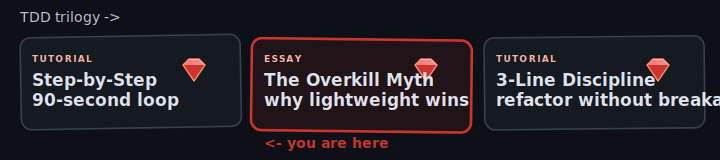
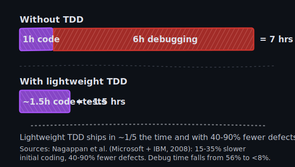

The senior dev who told you TDD was overkill learned it on a project where the test suite took twenty minutes to run and every PR took two rounds of mock refactoring. So did we. What Kent Beck described in 2003 and what most TDD-skeptical engineers we meet call "TDD" in 2026 are not the same practice. The loudest "TDD is too slow" complaints we hear in rescue kickoffs describe a workflow that has nothing to do with the cycle Beck laid out.

If you want the rhythm worked out on real Ruby code, we walk through four cycles on a small `Order` class in [TDD in Ruby: A Step-by-Step Guide](/blog/test-driven-development-tdd-in-ruby-step-by-guide-tutorial-bestpractices/).

## The "TDD is overkill" myth comes from heavyweight habits

The Agile Institute frames the [time ledger of TDD](https://agileinstitute.com/articles/dispelling-myths-about-tdd) plainly. One hour of writing code without tests usually buys you six hours of debugging the following week. The lightweight TDD version of that same feature costs roughly fifteen to thirty-five percent more upfront ([Nagappan et al., Microsoft + IBM, 2008](https://www.microsoft.com/en-us/research/wp-content/uploads/2009/10/Realizing-Quality-Improvement-Through-Test-Driven-Development-Results-and-Experiences-of-Four-Industrial-Teams-nagappan_tdd.pdf)) and reduces defect density by forty to ninety percent. The same feature ships in roughly one-and-a-half hours total instead of seven, with a design you can change.



Thirty-minute red-green cycles are the first culprit. Beck's original cycle measures in seconds and minutes. A team that writes one giant test, builds an entire feature, then fights ten unrelated mock failures has done integration testing after the fact, not TDD. On a billing-platform rescue last quarter the average cycle ran thirty-eight minutes because each spec booted Rails before asserting anything. The team kept TDD and learned to write unit tests that ran in 8ms instead.

Premature mocking compounds the problem. A new developer reads "test in isolation," wraps each collaborator in a stub, and ends up with a test suite that asserts the structure of the code instead of its behavior. Change a method name, twenty tests fail. None of them caught a real bug. We covered the specific shape of this failure mode in [Mock Everything: A Good Way to Sink TDD Testing](/blog/mock-everything-good-way-sink-tdd-testing/).

Scenario sprawl makes it worse. ATDD, BDD, and Cucumber all promised non-technical stakeholders could write executable specs. In practice, your PM never wrote a single Gherkin scenario, and your engineers maintained a 4,000-line `features/` directory nobody trusted while the unit tests did the actual work.

## What lightweight TDD actually feels like

The cycle is short. Write one assertion that fails for the right reason. Type the smallest method body that makes it green - a hardcoded return value is fine, that is what Sandi Metz means by [Shameless Green](https://sandimetz.com/99bottles): code cheap enough to throw away when the next test forces a better shape. Commit. Refactor only if there is a real duplication to remove, then commit again, separately.

The first cycle on a fresh `Order` class is six lines of code:

```ruby
# test
assert_equal 0, Order.new.total

# implementation
class Order
  def total = 0
end
```

That's not a typo. The simplest method body that turns the test green is a hardcoded zero. Two more cycles - adding an item, summing two items - replace the hardcode with the actual logic. The full progression lives in the step-by-step guide.

Ninety seconds per cycle, not thirty minutes. Each cycle ends with a green test and a commit, so reverting to the last green state costs ninety seconds of work, not an afternoon. Heavyweight TDD lost this on purpose. Once cycles drift past 30 minutes, the safety net stops paying for itself.

## The actual prize is design, not coverage

The biggest mistake new TDD readers make is treating coverage as the goal. It is not. When a test is hard to write, the design is what's wrong. Setup that runs ten lines means your object has too many dependencies, and behaviour changes that cascade into eight test rewrites mean the seams are in the wrong place. J.B. Rainsberger calls this [listening to the cries of the test](https://blog.thecodewhisperer.com/permalink/the-myth-of-advanced-tdd). Lightweight TDD turns that pain into a refactoring trigger instead of a reason to abandon the discipline.

The payoff is refactor courage. With a green suite under you, renaming a class is a thirty-second move. Without it, the rename becomes a four-hour archaeology project where you read each caller and pray. The last three Rails rescues we picked up all had tests in the 2-5% range, and refactor proposals turned into "let's not touch it" at every standup.

Design exploration follows. The test forces you to write the call site before the implementation, so if the call site reads badly, you learn that in 90 seconds, before any production code commits to the bad shape.

Then there's fearless deletion. Code with tests around it can be removed with confidence. That 600-line service object nobody calls anymore? Run the suite, delete it, run the suite again. Without tests, dead code rots in the repo for years because the cost of being wrong about whether anything still uses it is too high.

Teams that chase coverage as the goal end up with suites full of `assert_not_nil(@order)` assertions that don't test the actual behaviour.

## When TDD really is overkill

A 40-line Rake task that backfills one column on one production table - the one you will run twice and delete next week - does not need a test. Run it on staging, eyeball the output, run it on production, delete the file. The same logic covers most one-off data migrations: the script is a transaction that runs once, and writing a test against a populated dev database often costs more than running the migration twice.

Prototype spikes and hackathon demos earn the same exemption. The point of the spike is to learn whether an idea is worth building - write the messy code, get the answer, throw it away. With eighteen hours on the clock and judges who will not open the repo, optimise for the demo running. If the spike survives, you will rewrite it with tests on the way to production, and that rewrite is when the discipline starts paying.

The rule of thumb that catches each: will this code be touched again? If the answer is no, skip TDD and feel no guilt. If the answer is yes, even "yes, in three months," the ledger flips and you should write the test. The Rails app you are still maintaining six months later is the one where the missing tests cost you four hours per change.

## What changes when your team adopts the rhythm

Code review gets shorter. Separate structural commits (rename, extract) from behavioural ones (new branch, new result), and reviewers scan the structural moves in seconds while focusing on actual behaviour changes. Beck made this separation the spine of [Tidy First?](https://tidyfirst.substack.com/) (2023). Look at the difference in commit shape.

```ruby
# bundled commit (3 files changed, 47 lines)
# - extracted PriceCalculator
# - added bulk discount branch
# - renamed total -> total_with_tax

# separated commits
# (1) Tidy: extract PriceCalculator   (refactor, no behaviour change)
# (2) Tidy: rename total              (refactor, no behaviour change)
# (3) Feat: bulk discount branch      (behaviour change, with new test)
```

The bundled commit needs a careful reviewer for an hour. The three separated commits review in twelve minutes total because (1) and (2) only need to confirm the suite stayed green. Tidy First commits are cheap to review precisely because TDD made them safe to make. We work through the 3-line micro-refactor mechanics that keep Tidy First sustainable in [Refactor Without Breaking Tests](/blog/refactor-step-tdd-three-line-discipline-ruby/).

Regressions surface during the cycle that introduces them. The red bar interrupts you while the change is still in your head; production logs interrupt you three weeks later, mid-context-switch on something else. Debugging cost drops as a side effect, because each micro-commit is a known-good state. A CI failure two commits later costs you a two-minute `git bisect` and a ninety-second revert, instead of an hours-long unwind.

A 200-line setup block is your object asking to be split. When a test needs eight mocks to run, the collaborator graph wants flattening. The Ruby and Rails patterns we see most often when this happens are catalogued in [Test-Driven Thinking for Solving Common Ruby Pitfalls](/blog/test-driven-thinking-for-solving-common-ruby-pitfalls-rails-tdd/).

## What a TDD rescue actually starts with

Last quarter we picked up a HealthTech rescue. The MVP had been live for nine days when the first 217 paying users hit the auth flow. The founder had spent $140K. The codebase had 2% line coverage and no CI worth running. We've seen forty-plus Rails rescues over seventeen years; that one was the most recent in a pattern we recognize on first read.

The fix never starts with adding test coverage to the existing code. That is the trap. We start by writing a single failing test that captures the bug the founder is currently bleeding from, fixing it inside the 90-second loop, and shipping the patch the same day. Then we write the next failing test for the next bleeding bug. We covered the rationale on this approach in [Why and How to Use TDD: Tips for Testing](/blog/why-how-use-tdd-main-tips-testing/).

If you wrote the MVP yourself and the bugs are showing up faster than you can ship features - or you are the senior dev being asked to rescue someone else's vibe-coded build - that is the situation we audit for free. One senior developer reads your codebase and writes a one-page assessment naming the three changes that pay back fastest. No contract, no follow-up sales call. Send the repo URL and a paragraph on what's breaking to [/contact-us/](/contact-us/) and we respond inside 48 hours.

Writing the test is the cheapest moment in a piece of code's life. The rename three weeks from now and the refactor you keep putting off both cost more, because the suite is too thin to catch what breaks.
