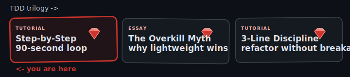

You opened this post because you want to try TDD on real Ruby code, and the tutorials you've seen so far either skipped the rhythm entirely or buried it under three pages of theory. This one shows the loop on a small `Order` class you can paste into a Minitest file and follow along with.

We'll work four rounds in under eight minutes. Each one ends with a green test and a commit, so at any point you can `git reset --hard` and you've lost at most 90 seconds of work. That bounded cost is what makes the whole discipline tractable - and it's the part most TDD intros leave out.

## Why TDD looks slow but isn't

The Agile Institute frames the time ledger plainly: a typical hour of code without tests usually buys you six hours of debugging the following week, while an hour with TDD usually buys close to zero. The clock time washes out. What changes is what sits in your repo at week's end - one version still has the bugs in it, and you'll find them in production.

A separate complaint - "TDD is overkill for what I'm doing" - is a different argument we cover in [TDD Without the Overkill](/blog/tdd-overkill-myth-lightweight-ruby/). For now, assume you're willing to give the discipline a fair try; this post focuses on the rhythm itself.

## The 90-second loop on a small Order class

The loop is RED, then SHAMELESS GREEN, then COMMIT, then REFACTOR if anything's worth tidying, then COMMIT again. We'll work four iterations, with timestamps so you can feel the pace.

Start with one test file. Minitest because it's what ships in stdlib and because the project this post lives in uses it.

```ruby
# 00:00 RED - cycle 1
require "minitest/autorun"

class OrderTest < Minitest::Test
  def test_empty_order_total_is_zero
    assert_equal 0, Order.new.total
  end
end
```

Run it. `NameError: uninitialized constant Order`. That counts as red - the test fails for the right reason.

```ruby
# 00:30 SHAMELESS GREEN - cycle 1
class Order
  def total
    0
  end
end
```

Tests pass. `git commit -m "Order responds to #total"`. 90 seconds in, one green test, one commit, and an `Order` that returns zero. We'll fix the lie shortly.

```ruby
# 02:00 RED - cycle 2
def test_total_sums_a_single_item
  order = Order.new
  order.add(price: 1000)
  assert_equal 1000, order.total
end
```

Red - `NoMethodError: undefined method 'add'`.

```ruby
# 02:45 SHAMELESS GREEN - cycle 2
class Order
  def initialize
    @items = []
  end

  def add(price:)
    @items << price
  end

  def total
    @items.sum
  end
end
```

Green. Both tests pass - `[].sum` is zero, so the empty-order test still works. Commit.

```ruby
# 04:30 RED - cycle 3
def test_total_sums_multiple_items
  order = Order.new
  order.add(price: 1000)
  order.add(price: 2500)
  assert_equal 3500, order.total
end
```

Run it. It passes on first try. The cycle 2 code already covered the multi-item case - we didn't need new production code, only a test that pinned the behavior down. Commit anyway: the test is part of the safety net now, and the commit log shows what we believed was true at this point.

```ruby
# 06:00 RED - cycle 4
def test_supports_quantity
  order = Order.new
  order.add(price: 1000, quantity: 3)
  assert_equal 3000, order.total
end
```

Red - the existing `add` ignores the new keyword.

```ruby
# 07:00 SHAMELESS GREEN - cycle 4
def add(price:, quantity: 1)
  @items << price * quantity
end
```

Green. Commit. Seven minutes in, four green tests, four commits, an `Order` that handles items, totals, and quantities. The whole class fits on one screen.

The pace is the point. Each round ends with green tests and a commit, so the worst possible state of your working tree is 90 seconds away from a known-good one. Compared to the alternative - 200 lines deep, stack trace in your face, half an hour of `binding.pry` to find which change broke what - the bounded-loss trade is obvious.

## Shameless Green - write the dumbest code that works

Cycle 1's `def total; 0; end` looks embarrassing, and that's exactly the point. Sandi Metz, in [99 Bottles of OOP](https://sandimetz.com/99bottles), calls this Shameless Green: code that's "cheap to write, cheap to understand, cheap to change." It isn't trying to be clever. It's optimizing for the things you can actually verify in the moment (did this take me five minutes and does the next person who reads it understand it), and trading away the things you can't, like whether your abstraction will still feel right six months from now.

The temptation, especially for senior Ruby developers, is to design the right shape now. You can already see the `LineItem` value object, the `OrderCalculator` service, the `PricingPolicy` strategy. Resist. After the first round you have one example. After the second you have two. The [rule of three for abstraction](https://wiki.c2.com/?ThreeStrikesAndYouRefactor) exists because two examples lie about what they have in common - they always look more similar than they really are.

KISS and YAGNI fold in here. KISS picks the simplest path that makes the test pass. YAGNI tells you not to add the configurable `currency:` parameter until a test demands it. The hardcoded `0` in cycle 1 satisfies both. Four iterations later we have four concrete examples and the right shape - a sum over priced items with optional quantity - emerged on its own. We didn't design it; the tests did.

JT's internal flocking-rules standard formalizes the move once you do have enough examples: select the things most alike, find the smallest difference between them, make the simplest change that removes the difference. You wait until you've got three concrete shapes side-by-side and let the differences point at the abstraction. The most common way Ruby developers wreck a TDD suite is by [reaching for mocks the moment a test gets uncomfortable](/blog/mock-everything-good-way-sink-tdd-testing/) - same root cause: trying to design ahead of the evidence the tests are giving you.

## Tidy First - never bundle structure with behavior

Look at cycle 4 again. Suppose along with adding quantity support you also rename `@items` to `@line_items` because it reads better. Now the commit contains two unrelated things: a behavior change (quantity arithmetic) and a structural change (rename). The reviewer can't tell which line caused the test to flip green. Six months from now, when someone runs `git blame` on the bug your quantity logic introduced, they land on a commit that did two things and the message only explained one.

Kent Beck's 2023 book [Tidy First?](https://tidyfirst.substack.com/) makes the rule blunt: structural changes and behavioral changes go in separate commits. Beck calls structural changes "tidyings" - rename, extract, inline, reformat. They never change what the program does. Behavior changes do. Mixing them costs you twice: once during review, once during `git bisect`.

Bad commit:

```text
feat: add quantity support and rename @items to @line_items
```

Good commits, in order:

```text
refactor: rename @items to @line_items
feat: add quantity support to Order#add
```

The cost of splitting is one extra commit. The benefits compound: `git revert` on the feature commit doesn't undo the rename, [code review reads top to bottom without context-switching](/blog/effortless-code-conventions-review-for-pull-request-changes-ruby-ci/), and the next developer can bisect a regression to the actual cause. On the last Rails rescue we picked up, structure-and-behavior commits were the default - the team had been mixing them for years. Untangling that habit was the first win; the bug fixes came easier afterward. We covered the 3-line micro-refactor mechanics that make Tidy First easy to sustain in [Refactor Without Breaking Tests](/blog/refactor-step-tdd-three-line-discipline-ruby/).

## Auto-revert when red - `git reset --hard` is your friend

Tests went red and you're not sure why? `git reset --hard HEAD`. You've lost at most 90 seconds of work, because that's how long it's been since the last green commit. Try again, smaller step.

Shameless Green works because revert is cheap. We commit each time the suite goes green - cycle 1's `def total; 0; end` was committable code - so revert costs nothing. The pairs we onboard usually flinch at the reset for a sprint or two. Then somebody runs `git reset --hard` mid-pairing because they're tired and don't want to think, and after that nobody's precious about it again. The 90-second loop puts a hard ceiling on lost work, and that ceiling is what makes experimenting cheap enough to do twenty times in an afternoon.

The 5-to-20-commits-per-hour rhythm Beck describes in *Tidy First?* isn't aspirational. It's how you actually work once you trust the safety net. On the last fintech rescue we ran (a Q1 2026 engagement, Rails 7.1, ~11k tests), the previous team committed once a day in 600-line bombs. Their `git bisect` on a regression was useless because each commit straddled the line between behavior change and refactor. We rebuilt the commit cadence first and debugged second.

## Common newbie mistakes

Three failure modes show up over and over when developers first try TDD on Ruby. Each one passes for the practice at a glance, and each one quietly removes the thing that makes TDD pay off.

The first is testing implementation instead of behavior. A junior developer writing the cycle 2 example reaches for the internal `@items` array because it feels concrete:

```ruby
# Mistake: tests internals
def test_add_pushes_to_items_array
  order = Order.new
  order.add(price: 1000)
  assert_equal [1000], order.instance_variable_get(:@items)
end
```

The test passes, but it locks you into the array representation. The day you decide `@items` should be a hash keyed by SKU, the test breaks even though the behavior is identical. The corrected version asserts on the public surface:

```ruby
# Fix: tests behavior
def test_add_increases_total_by_item_price
  order = Order.new
  order.add(price: 1000)
  assert_equal 1000, order.total
end
```

The behavior - "adding an item with price 1000 makes the total 1000" - is what the rest of your code actually depends on. That's the contract. The internal storage is implementation detail and should be free to change.

The second mistake is skipping the refactor step entirely. Shameless Green is supposed to be the cheap, embarrassing first version - not the final form. If cycle 4's `@items << price * quantity` is still your storage strategy eight rounds later, when you're adding discounts and tax codes and currency, you'll have crammed seven concerns into one integer. The refactor step is where you take the four examples you now have and let a `LineItem` value object emerge, because four examples earn the right to that abstraction. [Refactoring with the existing tests as a safety net](/blog/test-driven-thinking-for-solving-common-ruby-pitfalls-rails-tdd/) is a separate skill from adding behavior, and it's the half of TDD that pays the long-term dividend.

The third mistake is bundling tidy and behavior commits. We covered the mechanics in the previous section, and it's worth naming as a TDD failure mode in its own right: a developer who skips Tidy First loses the ability to revert just the behavior change. Once `git log` reads like a memoir instead of a ledger, the loop's safety net is theoretical. Most teams we've seen at that point just stop committing every 90 seconds because what's the point.

## How JetThoughts uses TDD on rescues

When we inherit a codebase, the three failure modes above are usually all present at once - tests coupled to internals, refactor steps skipped for months, commits that mix tidy with behavior. We rescue Ruby on Rails projects from devshops that shipped this exact configuration with a CI suite that takes 22 minutes to run. The 90-second loop is the rhythm we put back first.

The pattern's consistent across the rescues we've taken: either no tests at all (the last three we picked up), or a brittle test suite written months after the code, mocked-to-the-teeth and useless under change pressure. We rebuild the rhythm first. Then we fix the bugs. [Refactoring callbacks back into services](/blog/how-avoid-callbacks-using-services-rails-refactoring/) and tightening the test suite go hand in hand once the rhythm is in place.

If you're holding a Rails codebase you can't change without breaking, we run a free 45-minute audit: one senior developer reads your suite and your most recent five PRs, and you get a one-page written assessment naming the three fixes that would help most. We don't follow up to sell you something - that isn't the offer.

[Talk to us about your codebase](/contact-us/).

## Further reading

- [Sandi Metz, *99 Bottles of OOP*](https://sandimetz.com/99bottles) - Shameless Green and the Flocking Rules
- [Kent Beck, *Tidy First?* (2023)](https://tidyfirst.substack.com/) - structural vs behavioral changes
- [J.B. Rainsberger, "The Myth of Advanced TDD"](https://blog.thecodewhisperer.com/permalink/the-myth-of-advanced-tdd-is-a-symptom) - the sit-up analogy and "tests are the cries"
- [The Agile Institute, "Dispelling Myths About TDD"](https://agileinstitute.com/articles/dispelling-myths-about-tdd) - the time-ledger framing

Related: [why and how to use TDD](/blog/why-how-use-tdd-main-tips-testing/), [test-driven thinking for Ruby pitfalls](/blog/test-driven-thinking-for-solving-common-ruby-pitfalls-rails-tdd/), [how mocks sink TDD](/blog/mock-everything-good-way-sink-tdd-testing/), [refactoring callbacks into services](/blog/how-avoid-callbacks-using-services-rails-refactoring/).
