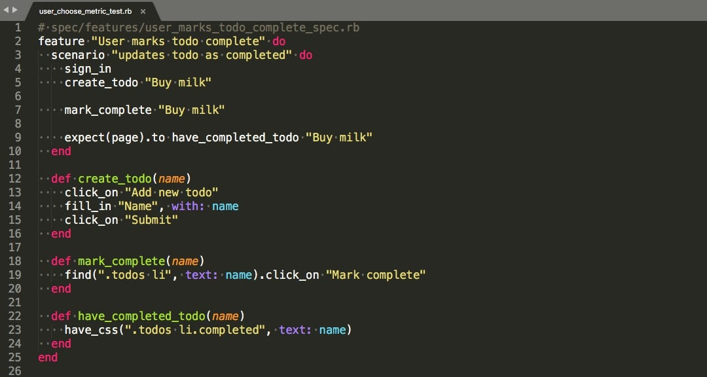

> # Want to make system tests easy to main tain? We have selected some best practice tips to help achieve this.



## Organize tests in four phases

The [Four-Phase Test](http://xunitpatterns.com/Four%20Phase%20Test.html) is a testing pattern, applicable to all programming languages and unit tests (not so much integration tests).

There are four distinct phases of the test. They are executed sequentially.
```
    test do
      setup
      exercise
      verify
      teardown
    end
```
### setup

During setup, setup initial state.
```ruby
    user = User.new(password: 'password')
```
### exercise

At this stage, run/execute a tested scenario.
```ruby
    user.save
```
### verify

Here, the result of the exercise is verified against the developer’s expectations.
```ruby
    user.encrypted_password.should_not be_nil
```
### teardown

During the teardown, the system under test is reset to its pre-setup state.

## Maintain a single level of abstraction

Each acceptance test tells a story: a logical progression through a task within an application. As developers, it’s our responsibility to tell each story in a concise manner and to keep the reader (either other developers or our future selves) engaged, aware of what is happening, and understanding the purpose of the story.

At the heart of understanding the story being told is a consistent, single level of abstraction; that is, each piece of behavior is roughly similar in terms of functionality extracted and its overall purpose.

Let’s first focus on an example of how *not* to write an acceptance test by writing a test at multiple levels of abstraction:

```ruby
# test/system/user_chooses_metric_test.rb
feature 'user chooses metric' do
  scenario 'user adds metric' do
    sign_in
    find('[test-id=metrics-menu]').click

    find("[test-id=metric-Margin]").click

    assert_match 'margin', current_url
  end
end
```

Let’s now look at a scenario written at a single level of abstraction:

```ruby
# test/system/user_chooses_metric_test.rb
feature 'user chooses metric' do
  scenario 'user adds metric' do
    sign_in
    click_on_metrics_menu

    click_on_metric 'Margin'

    have_saved_metric_in_url 'margin'
  end

  def click_on_metrics_menu
    find('[test-id=metrics-menu]').click
  end

  def click_on_metric(metric)
    find("[test-id=metric-#{metric}]").click
  end

  def have_saved_metric_in_url(metric)
    assert_match metric, current_url
  end
end
```

This spec follows the [Composed Method pattern](http://c2.com/ppr/wiki/WikiPagesAboutRefactoring/ComposedMethod.html), discussed in [Smalltalk Best Practice Patterns](http://www.amazon.com/Smalltalk-Best-Practice-Patterns-Kent/dp/013476904X), wherein each piece of functionality is extracted to well-named methods. Each method should be written at a single level of abstraction.

Maintaining a single level of abstraction is a tool in every developer’s arsenal to help achieve clear, understandable tests. By extracting behavior to well-named methods, the developer can better tell the story of each scenario by describing behaviors consistently and at a high enough level that others will understand the goal and outcomes of the test.

## Be explicit about naming

Some main rules related to naming:

* Use regular text, when describing features and everything else, i.e. user change to predefined date range

* Use actual class names, when describing classes or test name, i.e. UserSelectDimensionMetricTest

* Use unique data-attribute for testing, i.e. test-id="dimension-list"

## Guidelines about organization

There are three major blocks dedicated to documenting our tests:

 1. describe helps us to define our subject — usually top-level describe is either a feature name or a class name, while lower-level describe defining methods, constants, etc.

 2. context should clearly describe… context (or environment) in which our assertions will be verified. Each context should describe only one aspect of the environment and we should refrain from including contexts in expectations.

 3. And it.The good practice is to use present simple tense to describe expectations and keep those expectations concise, precise and unambiguous.

## Set up only relevant information

To facilitate the process between the test setup and the assertions easier, it may be useful to be as clear as possible about data.

* Use more or less real values in the context, i.e. assigning a user name of user_1 isn’t a good idea.

* Irrelevant information is another cause of obscure tests. expect(page.title).to eq(dimensions[:title] will be clearer expect(page.title).to eq('Date').

* Limit the use of local variables, and just use explicit (yes, duplicated) values directly.

* Don’t use fixtures. Fixtures, usually stored in separate files, hide important context of spec, necessary to understand it to the fullest extent.

## Follow the tips or not?

Writing readability system tests does some cost, such as code duplication and more restrictions on compiling tests.
However, you are increasing the enjoyment of system tests because your tests become readable and easy to maintain.
Follow the tips or not? It is up to you to decide!

**Andriy Parashchuk** is a Software Engineer at [JetThoughts](https://www.jetthoughts.com/). Follow him on [LinkedIn](https://www.linkedin.com/in/andriy-parashchuk-3aa56468/) or [GitHub](https://github.com/andriyParashchuk).
>  *If you enjoyed this story, we recommend reading our [latest tech stories](https://jtway.co/latest) and [trending tech stories](https://jtway.co/trending).*
