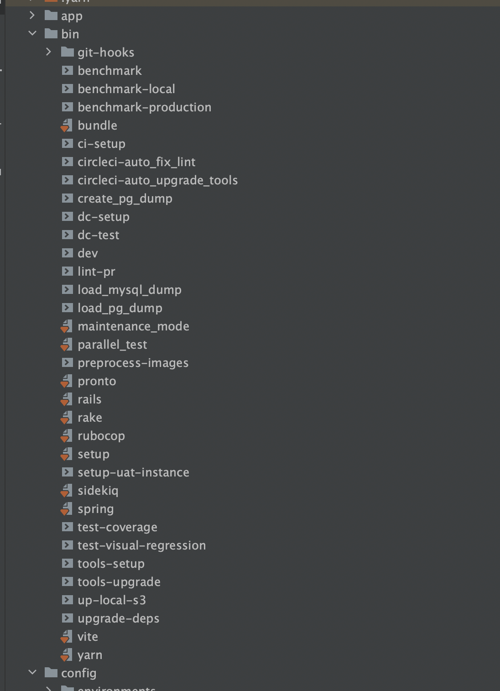

Today our `/bin` folder has become overwhelmed with different development tools and scripts.

We put everything there: local automations, _CI/CD_ helpers, _PAAS_ release scripts, `Dockerfile` helpers, etc.

It becomes too hard to find appropriate tools for your problem in that mess. 

I had several revisions on decomposing the `/bin` scripts and the whole directory, but I still have not found one solution.

I have played with subfolders `/bin/heorku/release` and prefixes `/bin/ci-setup`. Each strategy has pros & cons. 

## CI/CD is on the way out

But I have found that developers do not use _CI/CD_ scripts locally, which means we could move them out from the `/bin`.

Exploring some _GitHub Actions_ documentation, I found this neat folder: `/.automation`. And I got that this what I have looked.

`/.automation` is an excellent place to hide some ninja scripts which developers would not like to read or maintain.

So, all my last `bin/ci-setup` will become: `.automation/tests/setup`. Or if I need to put composed steps for _GitHub Actions_, I'll have `.automation/actions/prepare.yml`

### References:

Here is a good example: https://github.com/github/super-linter/tree/main/.automation

---

**Paul Keen** is an Open Source Contributor and a Chief Technology Officer at [JetThoughts](https://www.jetthoughts.com). Follow him on [LinkedIn](https://www.linkedin.com/in/paul-keen/) or [GitHub](https://github.com/pftg).
> If you enjoyed this story, we recommend reading our latest tech stories and trending [tech stories](https://jtway.co/trending).
