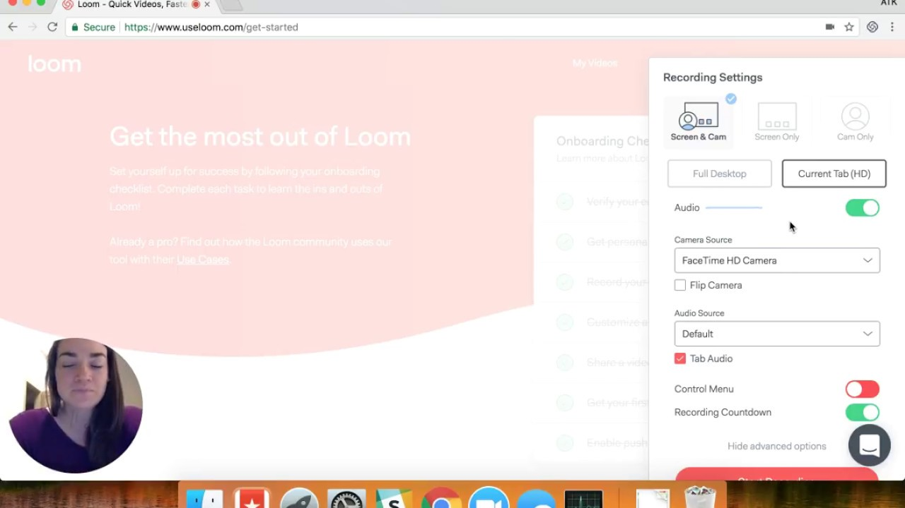

 on [Unsplash](https://unsplash.com/s/photos/video?utm_source=unsplash&utm_medium=referral&utm_content=creditCopyText)](file_0.jpeg)

How to share info in a remote async environment? What is the best way to keep everyone in the loop?

When people work in the office, their processes are synchronized, and a lot of routines, delivery flows are dependent, which results in bureaucracy and unnecessary tasks ping pong over and over again.

It may not only result in a toxic culture, stressful environment, and overall decrease not just in quality, but also in communication and the way people used to do their job.

Our team at [JetThoughts](https://medium.com/u/c55e7783810f?source=post_page-----7bfcbbffe051----------------------) spent tons of time to get the async processes entirely seamless and useful at the same time. One of the tools that entirely changed the way we work was [Loom](https://www.loom.com/).

## What is Loom?

It’s a screen recording app that also catches the sound that goes out of your mike and might also capture you talking on smth on a screen using the webcam.

It could be installed from [Chrome Web Store](https://chrome.google.com/webstore/detail/loom-video-recorder-scree/liecbddmkiiihnedobmlmillhodjkdmb?hl=en-US). It’s also available for iOS btw. Just add the extension to your browser and register using your Slack or Google account. Here is how the interface looks like:

## How to use it?

 1. Download the plugin [here](https://chrome.google.com/webstore/detail/loom-video-recorder-scree/liecbddmkiiihnedobmlmillhodjkdmb?hl=en-US)

 2. Click on the icon in the Chrome plugins panel (top right corner)

 3. Register using Google Account or Slack

 4. Once registered, you’ll see the menu to record your screen or current tab

 5. Finish the screencast by clicking the “Stop Sharing” button and get your screencast link to share with everyone.

 6. Optional: play with the options and try also using your webcam in screencast to make it more personal, if you want.

## Why?

We often use it to not only record a screencast instead of calling and distracting people but also to document anything worth noticing for future references.

Once the screencast is recorded, it will give you a link to share with your team or clients.

The best thing about the screencast is that it could be reused as many times as needed, and you can speed up the recording to watch it faster and concentrate on those parts you need.

I hope this tool helps you share your thoughts and ideas and improve the workflow of your team.

**Paul Keen** is an Open Source Contributor and a Chief Technology Officer at [JetThoughts](https://www.jetthoughts.com). Follow him on [LinkedIn](https://www.linkedin.com/in/paul-keen/) or [GitHub](https://github.com/pftg).
>  *If you enjoyed this story, we recommend reading our[ latest tech stories](https://jtway.co/latest) and trending [tech stories](https://jtway.co/trending).*
