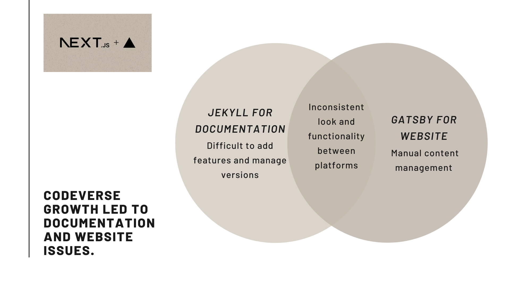
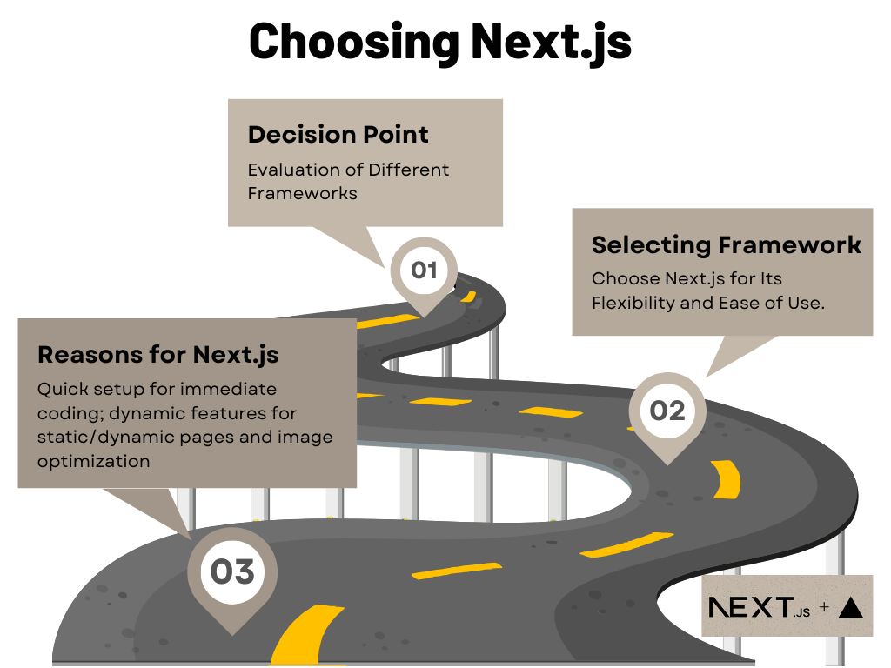
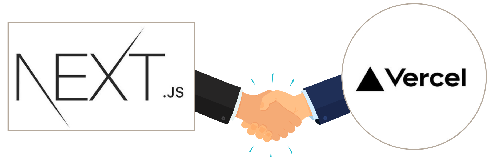
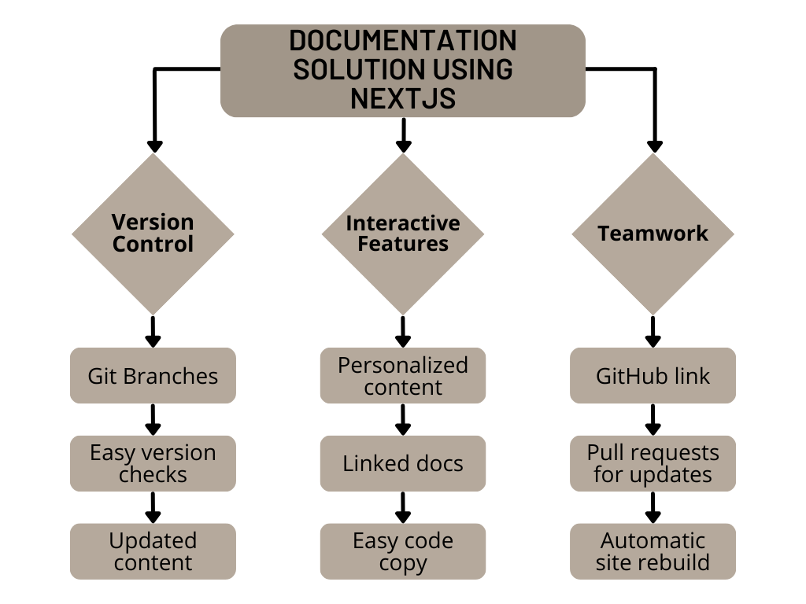

Well-structured documentation is crucial for all open-source projects, but it becomes even more vital for Open Core solutions like CodeVerse, especially when large businesses rely on them. Our project with CodeVerse, where we completely reimagined their documentation platform, is a perfect case study for tech founders and developers aiming for superior documentation.

## The Challenge

CodeVerse helps teams better manage their code and collaborate. As they grew, they faced significant issues with their documentation and website. They used separate tools: Jekyll for documentation and Gatsby for their website. Here’s where they ran into problems:

- **Stiff and Inflexible**: Jekyll made it difficult to add cool features and manage different versions of the documentation easily.
- **Hard to Keep Updated**: Gatsby didn’t make it easy to manage content, which meant a lot of manual work for updates.
- **Separate Experiences**: Having the website and docs on different platforms made it challenging to keep everything looking and functioning the same way.

To fix these problems, CodeVerse needed an easy-to-use solution that would allow it to grow.

## Choosing Next.js and Vercel

After looking at different frameworks, the CodeVerse team decided on Next.js, a React-based framework. Why did they choose Next.js?

- **Quick Setup**: Next.js has a simple setup, allowing developers to start coding immediately without wasting time on configurations.
- **Dynamic Features**: It supports static and dynamic pages, has built-in optimization for images, and can quickly create pages for better performance.

### Why Vercel Was the Right Hosting Choice

To host their platform, CodeVerse chose Vercel’s Enterprise plan. Here’s why this was a smart move:

- **Scalable**: The Enterprise version can grow with their team and needs.
- **Security First**: It meets strict security standards, ensuring user data is safe and compliant with regulations.
- **Easy Access Management**: Features like Single Sign-On (SSO) via Okta made controlling who could access what easy.

Before this switch, builds could take forever—over 20 minutes! But with Vercel, they could deploy changes faster and with more flexibility.

## Custom Solutions for CodeVerse

With Next.js, we created the perfect documentation experience tailored to CodeVerse’s needs:

- **Managing Versions**: Using branches in their main repository, CodeVerse can easily handle different versions of documents without extra hassle. They can quickly see changes across versions, keeping everything current.
- **Dynamic Features**: Next.js allowed them to add interactive elements, like user-specific content and linked documentation pages. It also made copying code snippets much easier for developers.
- **Team Collaboration**: Integrating with GitHub means the team can manage documentation updates through pull requests. If a branch approves a change, the documentation site automatically rebuilds, making teamwork smooth and efficient.

## Document Deployment Made Easy

Before this project, getting documentation online was slow and manual. With Vercel’s Preview Deployments, the CodeVerse team can review changes before they go live. They can run checks, make edits, and collaborate effortlessly.

Next.js also enabled exciting new features, such as smart search functions and customizable components, leading to hundreds of thousands of monthly visits.

## Final Thoughts

This transformation marks a significant step for CodeVerse. By partnering with JetThoughts and leveraging Next.js and Vercel, CodeVerse has a robust documentation platform that meets their current needs and can scale with them for the future.

Are you facing similar challenges with your documentation or software solutions? Let JetThoughts help transform your project into something remarkable! [Contact us](https://jetthoughts.com/contact-us/) today to discuss how we can create innovative solutions tailored to your needs. Together, we can drive your success in the tech landscape!