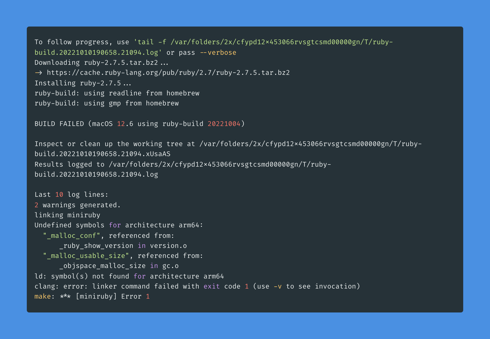

Have you found problems building ruby on a local machine? How to configure your local environment once and for all?



Building ruby is dependent on several key elements: build tools, compilers, linkers, also shared libraries like openssl, libyaml, readline and etc. And we need to help ruby-build to find all those tools and libraries.

The shared solution is designed for _macOS_ with [Homebrew](https://brew.sh/).

#### Install system packages

```bash
brew install gmp libyaml rbenv readline zlib
```

As a bonus, it will also install [Xcode Command Line Tools](https://www.freecodecamp.org/news/install-xcode-command-line-tools/).

#### Preconfigure ruby-build

```bash
export RUBY_CONFIGURE_OPTS="\
  --with-libyaml-dir=$(brew --prefix libyaml) \
  --with-zlib-dir=$(brew --prefix zlib) \
"
```

#### Install Ruby 3.1+

```bash
brew install openssl@3 rust 
export RUBY_CONFIGURE_OPTS="$RUBY_CONFIGURE_OPTS --with-openssl-dir=$(brew --prefix openssl@3)"
rbenv install 3.2.0-preview2
```

> Note: We need `rust` for the new _YJIT_.

#### Install Ruby 2.x-3.x

```bash
brew install openssl@1.1
export RUBY_CONFIGURE_OPTS="$RUBY_CONFIGURE_OPTS --with-openssl-dir=$(brew --prefix openssl@1.1)"
rbenv install 2.7.5
```

#### (Optional) Let's add Jemalloc

To enable [Jemalloc](http://jemalloc.net/) we need to do next before ruby installation:

```bash
brew install jemalloc

export LDFLAGS="$LDFLAGS -L$(brew --prefix jemalloc)/lib"
export CPPFLAGS="$CPPFLAGS -I$(brew --prefix jemalloc)/include"
export PKG_CONFIG_PATH="$(brew --prefix jemalloc)/lib/pkgconfig:$PKG_CONFIG_PATH"

export MALLOC_ARENA_MAX=2

export RUBY_CONFIGURE_OPTS="$RUBY_CONFIGURE_OPTS --with-jemalloc"
```

#### Best place to have ENV configuration


All those settings are better placed in `.profile`, `.bashenv` or `.zshenv`, then you do not need to recall them each time you install or reinstall ruby.

My `.zshenv` looks like:

```bash
## Make: tune conf

export MAKEOPTS="-j 10" # increases the number of parallel build processes

## Build Ruby configuration

export RUBY_CONFIGURE_OPTS="\
  --disable-install-doc \
  --with-jemalloc \
  --with-libyaml-dir=/opt/homebrew/opt/libyaml \
  --with-openssl-dir=/opt/homebrew/opt/openssl@3 \
  --with-zlib-dir=/opt/homebrew/opt/zlib \
  --without-tcl \
  --without-tk \
"

## Jemalloc

export LDFLAGS="-L/opt/homebrew/opt/jemalloc/lib $LDFLAGS"
export CPPFLAGS="-I/opt/homebrew/opt/jemalloc/include $CPPFLAGS"
export PKG_CONFIG_PATH="/opt/homebrew/opt/jemalloc/lib/pkgconfig:$PKG_CONFIG_PATH"

export MALLOC_ARENA_MAX=2

## Openssl

export PATH="/opt/homebrew/opt/openssl@3/bin:$PATH"
export LIBRARY_PATH="/opt/homebrew/opt/openssl@3/lib:$LIBRARY_PATH"

export LDFLAGS="-L/opt/homebrew/opt/openssl@3/lib $LDFLAGS"
export CPPFLAGS="-I/opt/homebrew/opt/openssl@3/include $CPPFLAGS"
export PKG_CONFIG_PATH="/opt/homebrew/opt/openssl@3/lib/pkgconfig:$PKG_CONFIG_PATH"

## Readline

export LDFLAGS="-L/opt/homebrew/opt/readline/lib $LDFLAGS"
export CPPFLAGS="-I/opt/homebrew/opt/readline/include $CPPFLAGS"
export PKG_CONFIG_PATH="/opt/homebrew/opt/readline/lib/pkgconfig:$PKG_CONFIG_PATH"
```

## Next

[ruby-build Wiki](https://github.com/rbenv/ruby-build/wiki) is good to learn.

---

**Paul Keen** is an Open Source Contributor and a Chief Technology Officer at [JetThoughts](https://www.jetthoughts.com). Follow him on [LinkedIn](https://www.linkedin.com/in/paul-keen/) or [GitHub](https://github.com/pftg).
> If you enjoyed this story, we recommend reading our latest tech stories and trending [tech stories](https://jtway.co/trending).
