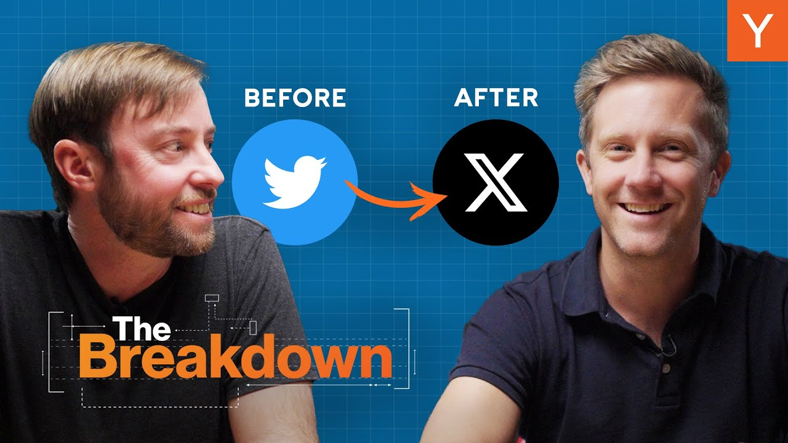

Since Elon Musk took over Twitter and rebranded it as X, the platform has undergone significant changes. New features, major UX modifications, and controversial algorithm updates have sparked discussions about what founders can learn from this transformation. In this article, we explore the lessons for startup founders interested in product design.

### Key Takeaways

*   **User Engagement vs. User Value**: Focusing solely on engagement metrics can lead to poor user experiences.
*   **Algorithmic Feeds**: The shift to algorithm-driven content can dilute user satisfaction.
*   **Branding Matters**: A name change can confuse users and dilute brand identity.
*   **Clear Purpose**: Founders should articulate the purpose of their product clearly.

### The Shift From Twitter to X

When Elon Musk took over Twitter, he made sweeping changes. The most notable was the shift from a chronological feed to an algorithmic one. This change aimed to increase user engagement but has led to mixed feelings among users. Many have noticed a shift in content, with more sensational posts appearing in their feeds.

### Understanding User Value

One of the biggest questions is: **How do you know if your users are getting value from your product?** It’s easy to assume that more time spent on the platform equals success. However, watching endless videos of fistfights isn’t what most users want. This highlights a critical point: optimizing for a single metric can lead to a poor user experience.

### The Dangers of Engagement Metrics

When product teams focus solely on engagement metrics, they risk losing sight of what users truly value. For example, if users are spending more time on X but feeling worse afterward, that’s a problem. **Long-term retention** is crucial. If users feel unsatisfied, they will eventually leave.

### The Algorithmic Dilemma

The move to an algorithmic feed has its pros and cons. On one hand, it can surface content that users might enjoy. On the other, it can lead to a flood of unwanted content. Users often find themselves sifting through irrelevant posts, which can be frustrating.

*   **User Feedback**: Users should have clear ways to provide feedback on what they want to see. If they have to search for how to adjust their feed, that’s a design flaw.
*   **Curated Lists**: Using curated lists can help users find high-quality content without the noise. However, these lists should be easier to access.

### The Importance of Branding

The rebranding from Twitter to X has raised eyebrows. Twitter had become a verb in our language. Changing the name to X seems unnecessary and confusing. A strong brand name is crucial for user recognition and loyalty. Founders should think carefully before making such changes.

### Lessons for Founders

So, what can startup founders learn from X’s journey?

1.  **Define Your Purpose**: Clearly articulate what your product is for and who it serves.
2.  **Avoid Single-Metric Optimization**: Don’t chase one metric at the expense of user satisfaction.
3.  **Engagement Isn’t Everything**: Focus on creating real value for users, not just engagement.
4.  **Be Cautious with Branding**: A name change can confuse users and dilute your brand.

### Conclusion

The changes at X provide valuable lessons for startup founders. It’s essential to balance user engagement with genuine value. As you build your product, keep your users’ needs at the forefront. Remember, a clear purpose and thoughtful design can lead to a more satisfying user experience. Let’s hope the lessons learned from X can guide future product development in a positive direction.