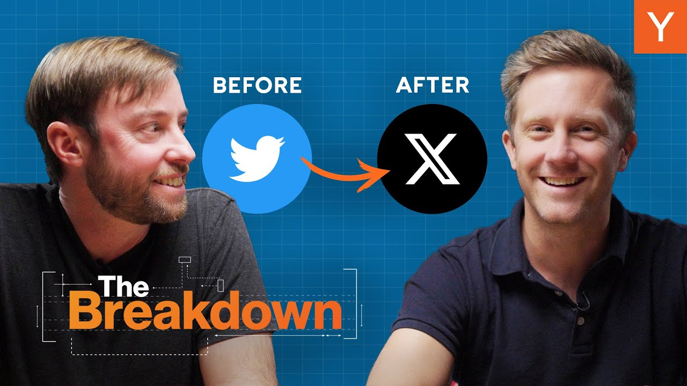

Since Elon Musk took over Twitter and rebranded it as X, the platform has undergone significant changes. New features, major UX modifications, and controversial algorithm updates have sparked discussions about what founders can learn from this transformation. In this article, we explore the lessons for startup founders interested in product design.

### Key Takeaways

*   **User Engagement vs. User Value**: Focusing solely on engagement metrics can lead to poor user experiences.
*   **Algorithmic Feeds**: The shift to algorithm-driven content can dilute user satisfaction.
*   **Branding Matters**: A name change can confuse users and dilute brand identity.
*   **Clear Purpose**: Founders should articulate the purpose of their product clearly.

### The Shift From Twitter to X

When Elon Musk took over Twitter, he made sweeping changes. The platform shifted from a chronological feed to an algorithmic one, similar to TikTok. This change aimed to increase user engagement but raised questions about the quality of content users were seeing.

Users noticed a shift in the type of content appearing in their feeds. Many reported seeing more extreme political content and less of what they originally followed. This change highlights a critical point: **just because users are engaging more doesn't mean they are getting value**. Watching endless fistfight videos might keep users on the platform, but it doesn't fulfill their needs.

### The Dangers of Single-Metric Optimization

One of the biggest pitfalls for product managers is optimizing for a single metric, like engagement time. While it might seem beneficial to have users spend more time on the platform, it can lead to a poor experience. Users may feel overwhelmed by irrelevant content, leading to dissatisfaction and eventual churn.

*   **Engagement Metrics**: Likes, shares, and time spent can be misleading. Users might engage with content they dislike, which can harm long-term retention.
*   **Quality vs. Quantity**: Focusing on how long users stay on the platform can overshadow the importance of the quality of their experience.

### The Role of Product Design

As the conversation shifted to product design, it became clear that user feedback mechanisms need improvement. Users often struggle to navigate the options available to customize their feeds. For instance, many users were unaware of how to filter out unwanted content effectively. This indicates a design flaw: **if users need to watch long videos to understand how to use your product, something is wrong**.

### Learning From Other Platforms

To understand the implications of these changes, it’s helpful to look at the history of social networks. Facebook, for example, initially had no news feed. When it introduced one, it faced backlash but ultimately saw increased engagement. However, as the platform grew, users began to feel overwhelmed by content from people they didn’t want to follow.

Instagram followed a similar path. Initially, it was a space for sharing photos with friends. Over time, it became cluttered with ads and irrelevant content, leading to user dissatisfaction. TikTok, on the other hand, jumped straight to an algorithmic feed, which some users find unsatisfying, as it often serves up low-quality content.

### What Founders Can Learn

So, what can startup founders take away from the evolution of Twitter to X? Here are some key points:

1.  **Define Your Purpose**: Clearly articulate what problem your product solves. If it’s about connecting people, don’t sacrifice that for engagement.
2.  **Be Cautious with Algorithms**: While algorithmic feeds can drive engagement, they can also lead to user dissatisfaction if not managed carefully.
3.  **Branding is Key**: Changing your product’s name can confuse users. Ensure that any rebranding aligns with the product’s purpose and user expectations.
4.  **User Feedback Matters**: Make it easy for users to provide feedback and customize their experience. If they struggle to navigate your product, they may leave.

### Conclusion

In the end, the changes at Twitter, now X, serve as a cautionary tale for founders. It’s easy to get caught up in metrics and engagement, but the ultimate goal should be to provide real value to users. As you build your product, keep the focus on what truly matters: the user experience. Remember, a happy user is a loyal user.

Thanks for reading! If you have thoughts on product design or want to share your experiences, drop a comment below!