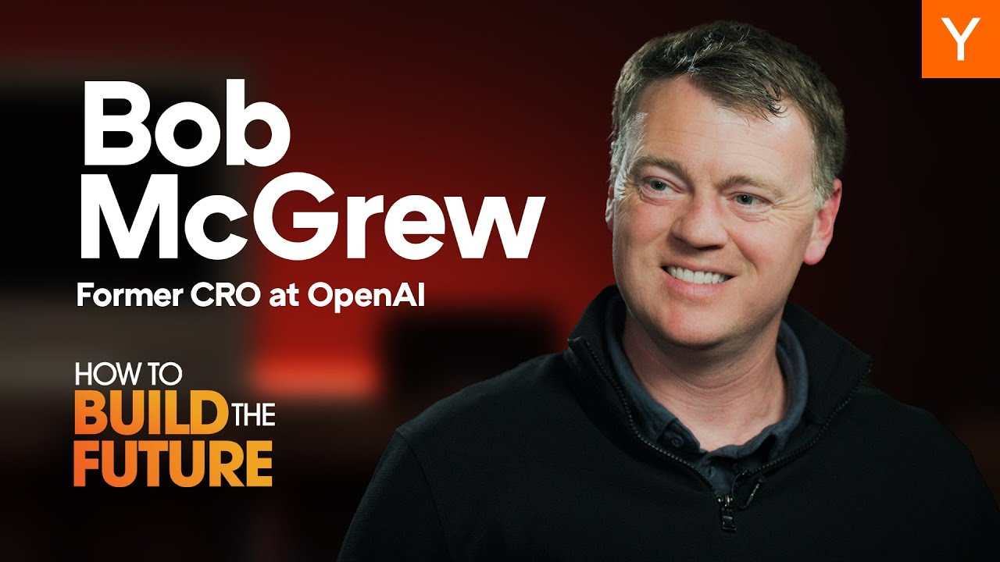

In a recent episode of "How To Build The Future," Garry Tan interviews Bob McGrew, former Chief Research Officer at OpenAI. They discuss the evolution of AI, the journey towards Artificial General Intelligence (AGI), and the future of jobs in an AI-driven world. McGrew shares his experiences at OpenAI, the importance of scaling laws, and what startups need to know to thrive in this rapidly changing landscape.

### Key Takeaways

*   Reasoning and test-time compute are key to developing reliable AI agents.
*   Scaling laws have been crucial in improving AI capabilities.
*   Startups should focus on using the **best AI models** available to succeed.
*   The future of jobs will involve **collaboration with AI**, not just replacement.

## The Early Days of OpenAI

Bob McGrew's journey into AI began unexpectedly. He initially aimed to start a robotics company but found himself at OpenAI, a place filled with brilliant minds and ambitious goals. Early projects included teaching a robot to solve a Rubik's Cube and developing AI to play Dota 2. These projects were not just for fun; they were foundational in proving that **scale** is essential for AI improvement.

## The Role of Scaling Laws

Scaling laws have been a game-changer in AI development. McGrew explains that the more data and experience fed into a neural network, the better it learns. This principle was evident in projects like Dota 2, where massive amounts of gameplay data helped the AI improve significantly. The same concept applied to language models, leading to the development of GPT-1, GPT-2, and beyond.

## The Shift Towards Reasoning

As AI technology advanced, McGrew noted a shift from merely scaling models to incorporating **reasoning**. This new approach allows AI to think longer and more deeply about problems, leading to better outcomes. The introduction of reasoning in models like GPT-3 has opened doors for AI to perform tasks more reliably, which is crucial for real-world applications.

## The Future of AI Agents

McGrew believes that the future of AI lies in creating agents that can perform actions on our behalf. These agents will need to be reliable enough for users to trust them with important tasks. The challenge is ensuring that these agents can consistently make the right decisions. McGrew suggests that improving reasoning capabilities will be key to achieving this reliability.

## Startups and AI

For entrepreneurs looking to build AI startups, McGrew offers valuable advice. He emphasizes the importance of starting with the best AI models available. This approach allows startups to leverage cutting-edge technology and iterate quickly based on user feedback. The goal is to create products that genuinely solve problems rather than just automating existing workflows.

## The Future of Work

As AI continues to evolve, the nature of work will change. McGrew envisions a future where humans collaborate with AI rather than being replaced by it. He likens this to the introduction of cameras in art; while some jobs may disappear, new ones will emerge. The key will be adapting to these changes and finding ways to integrate AI into our daily lives.

## Robotics and AGI

Looking ahead, McGrew sees potential breakthroughs in robotics that could parallel the advancements in AI. Companies focused on building foundational models for robots are making significant progress. He believes that we are on the brink of a moment similar to the rise of large language models, where robotics will become more capable and integrated into various industries.

## Conclusion

Bob McGrew's insights provide a glimpse into the future of AI and its impact on society. As we move closer to AGI, the focus will be on developing reliable AI agents and understanding how they can enhance our lives. For startups, the message is clear: leverage the best technology available and be prepared to adapt to the evolving landscape of work. The future is bright, and with the right approach, we can harness AI's potential for the greater good.
