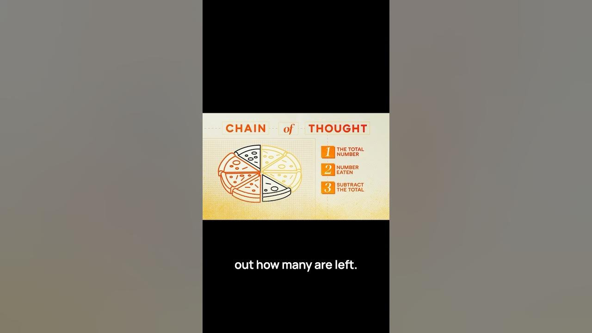

In the world of AI, OpenAI’s O1 and O3 models are making waves with their ability to tackle complex reasoning tasks. These models mimic human-like thought processes, breaking down problems into manageable steps. This approach not only enhances their accuracy but also makes them more relatable to how we think. Let’s dive into how these models operate and what makes them stand out.

### Key Takeaways

*   O1 and O3 models use a chain of thought process.
*   They break down complex problems into smaller steps.
*   This method mirrors human reasoning.
*   The models learn from their mistakes and adjust their strategies.

## Understanding The Chain Of Thought Process

The chain of thought process is a game changer in AI reasoning. It allows models to approach problems like humans do. Instead of just spitting out answers, they work through the problem step by step. This method was popularized by Google Brain researchers in 2022, and it’s been a hit ever since.

Here’s how it works:

1.  **Identify the Problem**: The model first understands what the question is asking.
2.  **Break It Down**: It divides the problem into smaller, manageable parts.
3.  **Calculate Step By Step**: The model processes each part one at a time.
4.  **Adjust If Needed**: If it makes a mistake, it learns and tries a different approach.

### Example of Chain Of Thought

Let’s look at a simple example to see this in action. Imagine this scenario:

*   John has one pizza cut into eight equal slices.
*   John eats three slices, and his friend eats two slices.
*   The question is: How many slices are left?

Using the chain of thought process, the model would:

1.  **Identify Total Slices**: Recognize that there are 8 slices in total.
2.  **Calculate Eaten Slices**: Add up the slices eaten by John (3) and his friend (2), which equals 5.
3.  **Subtract**: Finally, subtract the eaten slices from the total: 8 - 5 = 3.

So, there are 3 slices left. Simple, right? But without this structured approach, the model might just guess based on patterns, leading to errors.

## Why This Matters

The ability to reason like this is a big deal for AI. It means that models can handle more complex tasks and provide better answers. Here are a few reasons why this is important:

*   **Improved Accuracy**: By breaking down problems, the models can avoid common mistakes.
*   **Better User Interaction**: Users can ask more complex questions and get reliable answers.
*   **Learning From Mistakes**: The models adapt and improve over time, making them smarter.

## Conclusion

OpenAI’s O1 and O3 models are paving the way for a new era of AI reasoning. By using a chain of thought process, they mimic human problem-solving skills. This not only makes them more effective but also more relatable. As these models continue to evolve, we can expect even more impressive capabilities in the future. Who knows? Maybe one day, they’ll be solving problems we haven’t even thought of yet!
