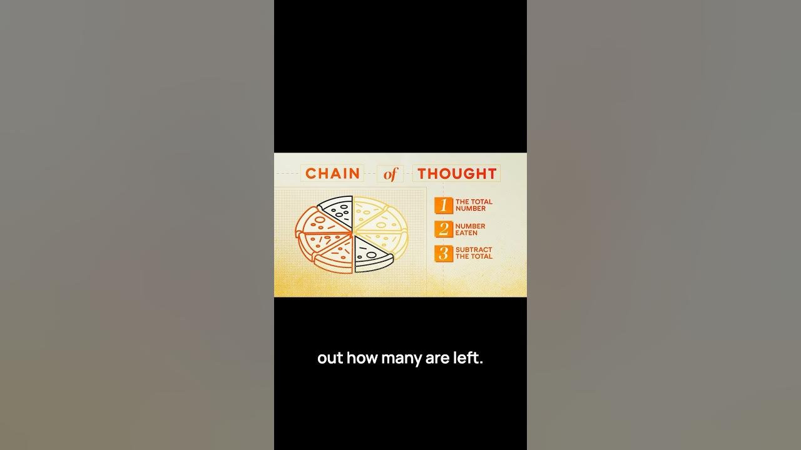

In the world of AI, OpenAI’s O1 and O3 models are making waves. These models tackle complex reasoning tasks in a way that mimics human thought processes. They break down problems into smaller, manageable steps, making them more effective at finding solutions. Let’s explore how they do this.

### Key Takeaways

*   O1 and O3 models use a chain of thought process.
*   They break down complex problems into smaller steps.
*   This method mirrors how humans solve problems.
*   The approach helps in recognizing and correcting mistakes.

## Understanding The Chain Of Thought Process

The chain of thought process is a game changer. It’s not just about spitting out answers. Instead, these models work through problems step by step. This method is similar to how we humans tackle complex issues. We often break them down into smaller parts to make sense of them.

For example, let’s say you have a pizza cut into eight slices. If John eats three slices and his friend eats two, how many slices are left? Here’s how the chain of thought process would handle it:

1.  **Identify the Total Slices**: The pizza has eight slices.
2.  **Calculate Eaten Slices**: John eats three, and his friend eats two. That’s a total of five slices eaten.
3.  **Subtract to Find Remaining Slices**: Eight slices minus five eaten slices equals three slices left.

Without this structured approach, the model might just guess the answer without understanding the problem. This is where the magic happens.

## Why This Matters

The ability to break down problems is crucial. It allows the models to:

*   **Recognize Mistakes**: If they make an error, they can backtrack and correct it.
*   **Try Different Strategies**: They can adjust their approach based on what they learn.
*   **Fine-Tune Their Responses**: This leads to more accurate answers over time.

This method is not new. The term "chain of thought" was introduced by Google Brain researchers in 2022. But OpenAI has taken it further, making it a core part of their O1 and O3 models.

## Real-World Applications

So, where can we see these models in action? Here are a few areas:

*   **Education**: Helping students solve math problems step by step.
*   **Customer Support**: Assisting users by breaking down troubleshooting steps.
*   **Content Creation**: Aiding writers in organizing their thoughts and ideas.

These applications show how powerful the chain of thought process can be. It’s not just about answering questions; it’s about understanding and reasoning.

## Conclusion

OpenAI’s O1 and O3 models are changing the game in AI reasoning. By using a chain of thought process, they mirror human problem-solving skills. This makes them more effective and reliable. As we continue to explore AI, understanding these models will be key to unlocking their full potential.

In a world where complex problems are the norm, having tools that can think like us is a big win. Let’s see where this technology takes us next!