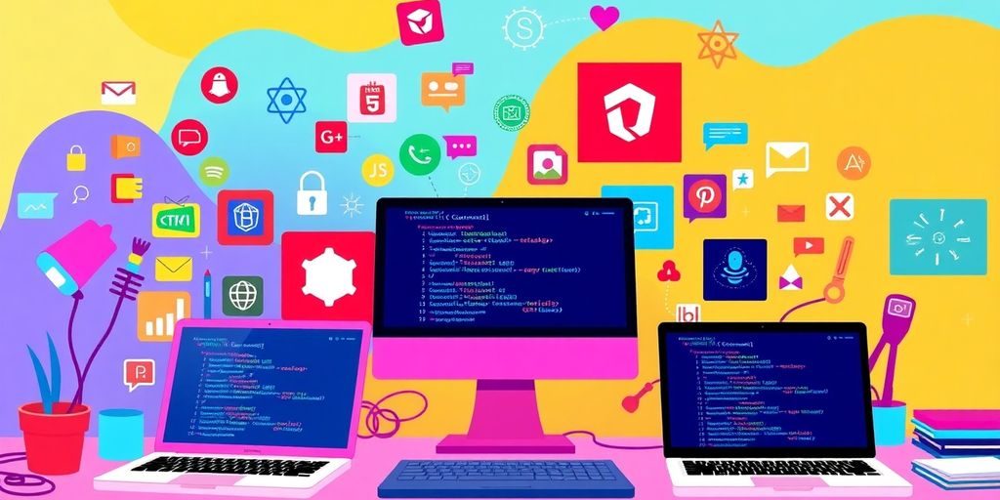
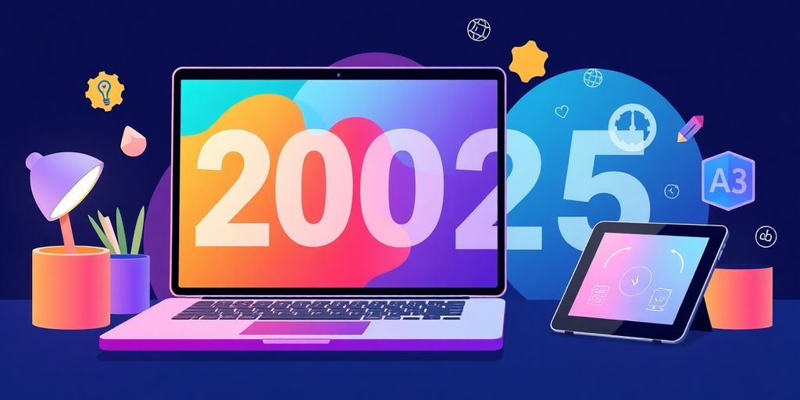

As we step into 2025, the landscape of web development is more vibrant than ever. Open source website development tools are leading the charge, making it easier for everyone—from seasoned developers to newcomers—to create stunning websites. This article will explore the best open source tools available, the rise of no-code platforms, the influence of AI, and much more. Whether you're looking to enhance your skills or find tools that fit your needs, there's something here for you.

### Key Takeaways

*   Check out the top open source website development tools that can streamline your projects in 2025.
*   Consider no-code and low-code platforms for quick and easy website creation without needing extensive coding skills.
*   AI tools are changing the game, making development tasks faster and more efficient.
*   Effective collaboration tools are vital for remote teams, enhancing communication and project management.
*   Open source tools can save you money while providing robust features and strong community support.

## Exploring The Best Open Source Web Development Tools

So, you want to build something cool online? Awesome! Let's check out some great open source tools. These are free, community-driven, and can seriously boost your web dev game. Think of them as your secret weapons for creating amazing websites and apps without spending a fortune. Let's [explore open source](https://jetthoughts.com/blog/enhancing-productivity-ultimate-developer-experience-tool-for-2024/) options.

### Top Picks for 2025

Okay, here's the deal. The web dev world changes fast. But some tools consistently rock.

*   For code editors, VS Code is still a top choice. It's free, customizable, and has tons of extensions.
*   For front-end frameworks, React, Angular, and Vue.js are all super popular. They help you build user interfaces.
*   Don't forget about Git for version control. It's a lifesaver when you mess something up (and trust me, you will!).

### Must-Have Features

When you're picking open source tools, think about what you _really_ need. Here's a quick checklist:

1.  Easy to use: If it's too complicated, you won't use it.
2.  Good documentation: You need to be able to figure out how it works.
3.  Active community: A helpful community can save you hours of frustration.

> Open source web development software provides increased flexibility when it comes to creating the website or application that they want. It eliminates any need for third-party proprietary solutions. Developers also have full control over the design and structure of their projects and do not depend on third parties or vendors to make changes.

### Community Support and Resources

One of the best things about open source is the community. Seriously, these folks are amazing. You can find help on forums, Stack Overflow, and even on GitHub. Don't be afraid to ask questions. Everyone starts somewhere. Plus, contributing back to the community is a great way to learn and [improve developer experience](https://jetthoughts.com/blog/enhancing-productivity-ultimate-developer-experience-tool-for-2024/).

## Daily Tools That Make Life Easier

### Top Picks for 2025

Okay, let's talk about the tools you'll use _every single day_. These are the things that make you go, "Ah, I can actually get stuff done today." Think of them as your digital coffee—essential for survival. These tools will [boost productivity](https://jetthoughts.com/blog/how-start-dev-tools-company-insights-8569/) and streamline your workflow.

### Must-Have Features

So, what makes a tool a "must-have"? It's not just about being shiny and new. It needs to:

*   Actually save you time. No one wants a tool that creates more work.
*   Integrate well with your other tools. Compatibility is key.
*   Be easy to learn. Ain't nobody got time for a steep learning curve.

> A good tool should feel like an extension of your brain, not a roadblock.

### Community Support and Resources

Let's be real, you're gonna get stuck. That's where a strong community comes in. Good community support means:

*   Lots of forums and Q&A sites.
*   Active maintainers who respond to issues.
*   Plenty of tutorials and documentation. **Don't underestimate the power of good documentation.**

With these tools and a solid community, you'll be unstoppable. Now, go forth and code!

## The Rise of No-Code and Low-Code Platforms

These platforms are changing the game. You don't need to be a coding expert to build something cool anymore. It's all about making development accessible. Think of it as LEGOs for software. Let's check it out!

### What Are No-Code Platforms?

No-code platforms let you build apps with minimal code. You use visual interfaces, drag-and-drop, and pre-built templates. **This means faster development.** They matter because they let businesses adapt quickly. It's like having a superpower. You can build things faster than ever before. You can find many [online resources](https://jetthoughts.com/blog/exploring-innovative-open-source-front-end/) to learn web development.

### Benefits for Non-Developers

If you're not a developer, these platforms are a game-changer. You can bring your ideas to life without complex coding.

*   Create simple apps for internal use.
*   Automate tasks.
*   Build websites without writing code.

> These platforms democratize app creation. More people can participate in the digital world. Accessibility and speed are key. As tech evolves, the gap between technical and non-technical users shrinks.

It's all about _empowering_ you to create, regardless of your tech skills.

### Popular Low-Code Tools to Try

2025 is the year of low-code platforms. They're everywhere for a reason. Here are some you might want to check out:

1.  Bubble: Great for building web apps with customization.
2.  Webflow: Perfect for designers who want to create responsive websites without coding.
3.  Airtable: A tool for creating databases and managing projects.

These platforms make it easy to turn your ideas into reality. They offer templates, drag-and-drop features, and support.

## AI-Powered Tools Transforming Development

### Automating Tedious Tasks

AI is changing the game. _AI-driven platforms_ [software development is evolving](https://jetthoughts.com/blog/exploring-best-platforms-for-software-development/) can automate tasks. This lets you focus on design and user experience. It is like having a super-smart assistant. It can help you with the boring parts of web development, so you can focus on being creative.

### Smart Code Suggestions

AI can help you write code faster and with fewer errors. **It can also give you insights for decision-making.** It is like having a superpower for web development. GitHub Copilot gives you real-time code suggestions. It is like having a coding buddy that knows everything.

### AI in Project Management

AI is stepping up, not just for coding but also for managing projects. Imagine having a robot assistant that does your job better than you do. Scary, but cool! AI can map out what users might do next on your site. It’s like having a GPS for user behavior. AI helps in creating content that feels personalized and fresh every time.

## Collaboration Tools for Remote Teams

Remote work is here to stay. You need the right tools to keep your team connected and productive. Let's look at some top options.

### Best Tools for Team Communication

Communication is key for remote teams. Without it, projects can fall apart fast. Here are some tools to keep everyone on the same page.

*   Slack: A popular choice for instant messaging. Create channels for different projects or topics. Share files and integrate with other tools. It helps teams stay connected.
*   Microsoft Teams: An all-inclusive platform that helps teams stay connected and productive. It features instant messaging, video conferencing, and file sharing tools. Plus, it has project management functionality like task tracking. [Microsoft Teams](https://thedigitalprojectmanager.com/tools/best-collaboration-tools/) makes it easy for groups to work together.
*   Discord: Not just for gamers! Discord is great for community building and quick communication. It offers voice and text channels, plus screen sharing. It's easy to set up and use.

### Project Management Solutions

Staying organized is key. These tools help you track progress and manage tasks.

*   Trello: A visual way to manage projects. Move cards between lists to show progress. It is a simple way to represent tasks.
*   Jira: Designed for software development teams. It offers advanced features for bug tracking and issue resolution. If you are in software, [Jira is a powerful tool](https://thedigitalprojectmanager.com/tools/best-collaboration-tools/).
*   Asana: A project management tool that helps teams organize, track, and manage their work. It offers features like task assignments, deadlines, and progress tracking.

### Integrating Workflows Seamlessly

Make sure your tools work well together. Integration saves time and reduces errors.

*   Zapier: Connects different apps and automates workflows. It can trigger actions in one app based on events in another.
*   IFTTT (If This Then That): Similar to Zapier, but simpler. It connects apps and devices to automate tasks. It is great for basic integrations.
*   GitHub Actions: Automate your software development workflows. Build, test, and deploy your code right from GitHub. It is perfect for continuous integration and continuous deployment (CI/CD).

> Remote work can be tough, but the right tools make it easier. Choose tools that fit your team's needs and workflow. Don't be afraid to try new things and see what works best. Experiment and have fun!

## Innovative Projects to Explore in 2025

### Open Source Contributions

Want to make a real impact? Open source is where it's at. Find a project that excites you. Maybe it's fixing bugs in a popular library or adding features to a framework. Contributing to open source is a great way to learn, build your resume, and connect with other developers. Plus, you get the satisfaction of knowing you're helping to build something cool. You can find a project that fits your skills and interests. Start small, and don't be afraid to ask questions. The open source community is usually very welcoming. Check out some [Rails open source projects](https://jetthoughts.com/blog/exploring-best-rails-open-source-projects-for-developers-in-2025/) to get started.

### Hands-On Projects for All Levels

No matter your skill level, there's a project out there for you. Here are a few ideas:

*   **Beginner:** Build a simple to-do list app using HTML, CSS, and JavaScript.
*   **Intermediate:** Create a blog using a framework like React or Vue.
*   **Advanced:** Contribute to an existing open source project or build your own library.

Don't be afraid to experiment and try new things. The best way to learn is by doing. If you are stuck, there are tons of resources online to help you out. Remember, even experienced developers started somewhere. So, dive in and start building!

### Emerging Technologies to Watch

Keep an eye on these _emerging technologies_:

*   **WebAssembly:** This tech allows you to run code written in other languages in the browser. It opens up new possibilities for web development.
*   **Serverless Computing:** Build and run applications without managing servers. It's a great way to save time and money.
*   **AI-Powered Tools:** AI is changing the way we develop software. Expect to see more tools that automate tasks and help you write better code.

> Staying updated on these technologies will give you a competitive edge. The web development landscape is constantly evolving, so it's important to keep learning. Don't get left behind!

## Staying Updated on Tech Innovations

### Following Industry Trends

Staying current in web development feels like trying to drink from a firehose. New tools and frameworks pop up all the time. How do you keep up? Start by identifying key sources. Follow tech blogs, newsletters, and _influencers_ who focus on web development. Set aside time each week to read up on the latest news. Don't try to learn everything at once. Focus on areas that interest you or that are relevant to your work. It's a marathon, not a sprint.

### Joining Developer Communities

Online communities are a goldmine of information. Sites like Stack Overflow, Reddit's r/webdev, and GitHub discussions are great places to ask questions and share knowledge. Find a community that fits your skill level and interests. Don't be afraid to ask "dumb" questions. Everyone starts somewhere. **Participate in discussions, offer help to others, and share your own experiences.** You'll learn a lot, and you might even make some new friends. Plus, you can find some great [best practices](https://jetthoughts.com/blog/10-essential-developer-best-practices-for/) from experienced developers.

### Participating in Hackathons

Want to level up your skills and have some fun? Join a hackathon! These events are a great way to learn new technologies, work on interesting projects, and meet other developers. Most hackathons have themes, so you can choose one that aligns with your interests. Don't worry if you're not an expert. Hackathons are about learning and experimenting. You might even win a prize! And even if you don't, you'll walk away with new skills and a cool project to add to your portfolio.

> Staying updated is a continuous process. The tech world never sleeps, so neither should your curiosity. Embrace the challenge, and enjoy the ride!

To keep up with the latest in technology, it's important to [stay informed about new tools and trends.](https://jetthoughts.com) Regularly checking reliable sources can help you understand how these innovations can impact your life and work. Don't miss out on the latest updates! Visit our website to learn more about how we can help you navigate the tech world and stay ahead of the curve.

## Wrapping It Up

So, there you have it! Open source web development tools are really making waves in 2025. Whether you’re a newbie or a seasoned coder, there’s something here for everyone. These tools not only help you tackle everyday challenges but also spark creativity and collaboration. Plus, they’re often free or low-cost, which is a huge win for anyone on a budget. As you explore these resources, keep experimenting and learning. The tech world is always changing, and staying curious is key. Happy coding!

## Frequently Asked Questions

### What are some top open source web development tools for 2025?

In 2025, some of the best open source tools include Visual Studio Code, Git, and React. These tools help make web development easier and more efficient.

### How do I pick the right web development tool for my project?

To choose the right tool, think about what you need for your project, such as how easy it is to use, the support from the community, and the features it offers. Reading reviews and trying a few tools can help too.

### What are no-code and low-code platforms?

No-code and low-code platforms allow people to create websites without needing to write a lot of code. They use simple drag-and-drop features to help anyone build web applications.

### What benefits does AI bring to web development?

AI helps speed up development by automating tasks like suggesting code and running tests. This allows developers to focus on more complex issues and can save them time.

### How do collaboration tools help teams working remotely?

Collaboration tools improve communication and project management for remote teams. They allow team members to share ideas and updates easily, making it easier to work together.

### What are some innovative projects to check out in 2025?

In 2025, you can explore open source contributions, hands-on projects suitable for all skill levels, and new technologies that are emerging in the web development space.
