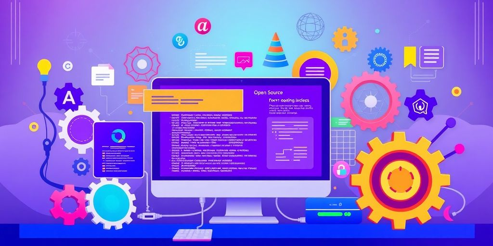
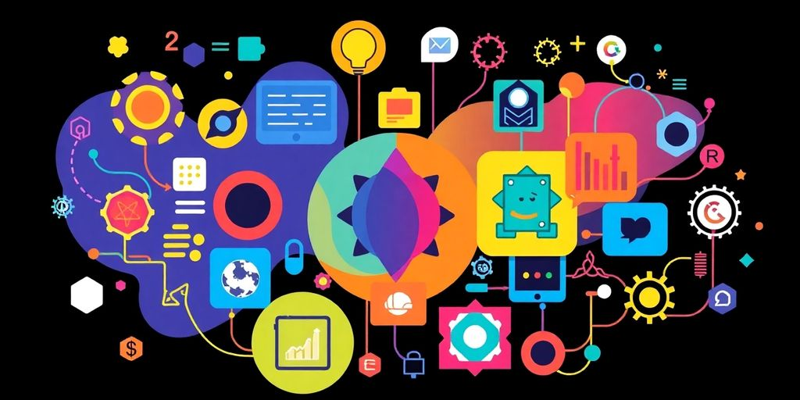

In 2025, the world of web development is buzzing with innovation and exciting new tools. Open source web development tools are at the forefront of this change, making it easier for developers and non-developers alike to create stunning websites. Whether you're a seasoned coder or just starting out, understanding these tools can help you streamline your workflow and enhance your creative process. This guide will walk you through the best open source options available, the rise of no-code platforms, the impact of AI, and much more.

### Key Takeaways

*   Explore the top open source web development tools that can simplify your projects in 2025.
*   Consider no-code and low-code platforms for quick website creation without extensive coding knowledge.
*   AI-powered tools are revolutionizing development, making tasks faster and more efficient.
*   Collaboration tools are essential for remote teams, improving communication and project management.
*   Open source solutions can save you money while providing robust features and strong community support.

## Exploring The Best Open Source Web Development Tools

So, you want to build something cool online? Great! Let's check out some awesome open source tools. These are free, community-driven, and can seriously boost your web dev game. Think of them as your secret weapons for creating amazing websites and apps without spending a fortune.

### Top Picks for 2025

Okay, here's the deal. The web dev world changes fast. But some tools consistently rock. For code editors, [VS Code](https://dev.to/arindam_1729/7-developer-tools-that-will-boost-your-workflow-in-2025-564e) is still a top choice. It's free, customizable, and has tons of extensions. For front-end frameworks, React, Angular, and Vue.js are all super popular. They help you build interactive user interfaces. On the back end, Node.js and Python with Django or Flask are solid options. They handle server-side logic and databases. Don't forget about Git for version control. It's a lifesaver when you mess things up (and trust me, you will!).

*   **VS Code**: A free, powerful, and customizable code editor.
*   **React**: A JavaScript library for building user interfaces.
*   **Node.js**: A JavaScript runtime for server-side development.

### How to Choose the Right Tool

Choosing the right tool can feel like picking a pizza topping. So many options! First, think about your project. Is it a simple website or a complex web app? A simple site might only need basic HTML, CSS, and JavaScript. A complex app will need a framework. Consider your skill level. Are you a beginner or a seasoned pro? Some tools have a steeper learning curve than others. Also, think about community support. A large community means more tutorials, forums, and help when you get stuck. Finally, don't be afraid to try different tools. Experiment and see what clicks for you.

> Picking the right tool is like choosing the right instrument for a band. Each one has its strengths, and the best choice depends on the kind of music you want to make. Don't be afraid to experiment and find what works best for your style.

### Community Support and Resources

One of the best things about open source is the community. You are never alone! Most open source projects have active forums, mailing lists, and chat channels. These are great places to ask questions, get help, and connect with other developers. Also, check out websites like Stack Overflow and GitHub. They have tons of answers and code examples. Don't be afraid to contribute back to the community. Report bugs, submit code changes, or write documentation. It's a great way to learn and help others. _Community_ is key in open source.

Here's a quick rundown of where to find help:

*   **Project Forums**: Most projects have their own forums.
*   **Stack Overflow**: A Q&A site for developers.
*   **GitHub**: A platform for code sharing and collaboration.

## The Rise of No-Code and Low-Code Platforms

These platforms are changing how we build stuff. You don't need to be a coding wizard to create something cool anymore. It's all about making development accessible to everyone. Think of it as LEGOs for software.

### What They Are and Why They Matter

No-code and low-code platforms let you build applications with minimal or no actual code. Instead, you use visual interfaces, drag-and-drop components, and pre-built templates. **This means faster development times and lower costs.** They matter because they [suit your team's needs](https://thectoclub.com/tools/best-low-code-platform/), letting businesses adapt quickly and innovate without being held back by a shortage of developers. It's like having a superpower that lets you build things faster than ever before.

### Benefits for Non-Developers

If you're not a developer, these platforms are a game-changer. You can bring your ideas to life without needing to learn complex coding languages.

*   Create simple apps for internal use.
*   Automate tasks.
*   Build websites without writing a single line of code.

> These platforms democratize application creation, allowing more people to participate in the digital world. Accessibility and speed are key. As tech evolves, the gap between technical and non-technical users shrinks.

It's all about _empowering_ you to create, regardless of your technical skills.

### Limitations to Consider

While no-code and low-code platforms are awesome, they aren't perfect. They might not be suitable for complex applications that require a lot of customization. You might hit a wall when you need to do something that the platform doesn't support. Also, you're relying on the platform vendor, so you're locked into their ecosystem. It's like renting a house versus owning one. You have less control, but it's often easier and cheaper. Just something to keep in mind!

## AI-Powered Development Tools

### How AI is Changing the Game

AI is not just a buzzword; it's changing how we build websites. _AI-driven platforms_ can now automate tasks, like writing code or testing layouts. This lets you focus on the fun stuff, like design and user experience. **These platforms are becoming easier to use, even if you are not a coding expert.**

### Popular AI Tools to Check Out

There are many AI tools available. Here are a few to get you started:

*   **GitHub Copilot:** This tool gives you real-time code suggestions. It is like having a coding buddy that knows everything.
*   **AI Code Analyzers:** These tools find bugs and security issues in your code. They help you write better code.
*   **UI Design Tools:** Some AI tools can help you design user interfaces. They can suggest layouts and color schemes.

> AI is like having a super-smart assistant. It can help you with the boring parts of web development, so you can focus on being creative.

### Integrating AI into Your Workflow

Adding AI to your workflow does not have to be hard. Here are some tips:

1.  Start small. Try using AI for one task, like code completion.
2.  Learn as you go. Experiment with different AI tools and see what works best for you.
3.  Do not be afraid to ask for help. There are many online communities where you can get support.

AI can help you write code faster and with fewer errors. It can also give you [insights for decision-making](https://jetthoughts.com/blog/enhancing-productivity-ultimate-developer-experience-tool-for-2024/). It is like having a superpower for web development.

## Collaborative Tools for Remote Teams

Working remotely is now common. You need the right tools to keep your team connected and productive. Let's look at some top options.

### Best Tools for Team Communication

Communication is key for remote teams. Without it, projects can fall apart fast. Here are some tools to keep everyone on the same page.

*   **Slack**: This is a popular choice for instant messaging. Create channels for different projects or topics. Share files and integrate with other tools. It helps to keep communication organized.
*   **Microsoft Teams**: Teams offers chat, video conferencing, and file sharing. It integrates well with other Microsoft products. If your company uses Microsoft, this is a solid option.
*   **Discord**: While popular with gamers, Discord works well for teams. It offers voice and text channels. Discord is free and easy to use. It is a good option if you need voice communication.

### Project Management Solutions

Good project management keeps things on track. These tools help you organize tasks, set deadlines, and monitor progress. No more guessing where things stand!

*   **Asana**: Asana is great for managing projects and workflows. You can assign tasks, set deadlines, and track progress. It is easy to use and helps teams stay organized. [manage your projects](https://www.mentimeter.com/blog/business/collaboration-tools) with ease.
*   **Trello**: Trello uses a Kanban board system. You create lists and cards to represent tasks. Move cards between lists to show progress. It is a visual way to manage projects.
*   **Jira**: Jira is designed for software development teams. It offers advanced features for bug tracking and issue resolution. If you are in software, Jira is a powerful tool.

### Real-Time Coding Collaboration

Coding together in real time can boost productivity. These tools let multiple developers work on the same code at the same time. It is like pair programming, but online.

*   **Visual Studio Code Live Share**: This extension lets you share your code in VS Code. Others can edit, debug, and run the code with you. It is a great way to collaborate on code.
*   **CodeSandbox**: CodeSandbox is an online editor for web development. You can create and share projects easily. It supports many frameworks and libraries. It is perfect for quick prototyping and collaboration.
*   **Replit**: Replit is another online IDE that supports many languages. It offers real-time collaboration features. Replit is easy to use and great for learning and teaching code.

> Remote work can be tough, but the right tools make it easier. Choose tools that fit your team's needs and workflow. Don't be afraid to try different options until you find what works best. Remember, happy teams make great products!

## Trends in Open Source Technologies

### Emerging Frameworks to Watch

Keep your eye on these! The world of open source moves fast. New frameworks pop up all the time, each promising to be the next big thing. Some actually deliver. Right now, there's a lot of buzz around serverless architectures and edge computing frameworks. These let you build apps that scale automatically and run closer to your users. _Exciting stuff_, right? Also, keep an eye on frameworks that make it easier to build cross-platform apps. Nobody wants to write the same app three times for iOS, Android, and the web. Frameworks like React Native and Flutter are still super relevant, but new contenders are always emerging. Don't be afraid to try them out. You might find your new favorite tool. Remember [low-code solutions](https://jetthoughts.com/blog/exploring-best-platforms-for-software-development/) are also gaining traction.

### The Impact of Community Contributions

Open source lives and dies by its community. A strong community means more eyes on the code, faster bug fixes, and a constant stream of new features. **It's like having a huge team of volunteer developers working for you.** But it's not just about the code. Communities also provide support, documentation, and a place to learn. If you're thinking about using an open-source tool, check out its community first. Is it active? Are people helpful? A thriving community can make all the difference. Here's a quick look at what a good community offers:

*   Active forums and chat channels
*   Regular contributions and updates
*   Clear and helpful documentation
*   A welcoming environment for new users

> Open source is more than just free code. It's a collaborative effort that benefits everyone involved. By contributing back to the community, you're not only helping others but also improving your own skills and knowledge.

### Future Predictions for Open Source

What does the future hold for open source? I think we'll see even more AI-powered tools and frameworks. Imagine tools that can automatically generate code, find bugs, or even design user interfaces. Sounds like science fiction, but it's closer than you think. Also, I expect to see more companies embracing open source, not just as a way to save money, but as a way to innovate faster and attract top talent. Open source is no longer a niche thing. It's the future of software development. The shift in [developer preferences](https://jetthoughts.com/blog/exploring-best-platforms-for-software-development/) is clear. Get on board, or get left behind!

## Maximizing Your Budget with Open Source

### Cost-Effective Solutions

Let's face it, money matters. Open source tools can seriously cut costs. How? Most are free. _No licensing fees_ means more cash for pizza (or, you know, servers). Plus, a huge community often supports these tools. This means help is easy to find. It is a smart way to save money and still build something great.

### Comparing Open Source vs. Paid Tools

Okay, so you are thinking about open source. But what about paid tools? Here's the deal. Paid tools often have slick interfaces and support. But they cost money. Open source? It might take some setup. But it is free. **Think about what you need.** Do you need hand-holding, or are you okay with a little DIY? It is your call.

### Tips for Budget-Friendly Development

Want to save even more? Here are some tips:

*   Use free hosting. Many options exist for small projects.
*   Learn to troubleshoot. Knowing how to fix things yourself saves money on support.
*   Contribute to open source projects. It builds skills and helps the community. Check out [Rails open source projects](https://jetthoughts.com/blog/exploring-best-rails-open-source-projects-for-developers-in-2025/) to get started.

> Open source is great, but make sure you have the skills to use it. Otherwise, you might spend more time and money fixing things. It is a balancing act.

## Building a Creative Workflow

### Integrating Tools for Efficiency

Okay, so you've got all these shiny new open-source tools. Cool. But how do you actually _use_ them together without losing your mind? The key is integration. Think of it like building with Lego bricks. Each tool is a brick, and your workflow is the awesome castle you're building.

*   **Plan your workflow:** Before you even start, map out what you want to achieve. What are the steps? Which tools fit where?
*   **Automate repetitive tasks:** Use scripts or task runners to handle the boring stuff. Nobody likes doing the same thing over and over.
*   **Use _integrated development environments_ (IDEs):** IDEs can bring many tools together in one place. It's like having a Swiss Army knife for coding.

> Don't try to force tools to work together if they don't play nice. Sometimes, the best solution is to find a different tool that fits better. It's like trying to fit a square peg in a round hole – frustrating for everyone involved.

### Balancing Creativity and Structure

Creativity needs freedom, but projects need structure. It's a delicate balance, like trying to herd cats. Too much structure, and you stifle innovation. Too little, and you end up with a chaotic mess.

*   **Set clear goals:** Know what you're trying to achieve. This gives you a direction without being too restrictive.
*   **Experiment, but document:** Try new things, but keep track of what works and what doesn't. Future you will thank you.
*   **Embrace _agile methodologies_:** Agile lets you adapt as you go. It's perfect for projects where you don't know exactly what you'll need from the start.

### Personalizing Your Development Environment

Your development environment is your happy place. Make it your own! Customize everything to fit your style. A personalized environment boosts productivity and makes coding more enjoyable. Think of it as your digital Batcave.

*   **Choose your favorite editor:** VS Code, Sublime Text, Atom – the choice is yours. Find one that feels right.
*   **Customize your theme:** Dark mode? Light mode? Rainbow mode? Go wild. Make it visually appealing.
*   **Use extensions and plugins:** Add features that make your life easier. There are extensions for everything, from code completion to Git integration. Check out some [developer tools](https://jetthoughts.com/blog/how-start-dev-tools-company-insights-8569/) to get started.

Creating a good workflow for your creative projects is super important. It helps you stay organized and get things done faster. Start by planning your tasks and setting clear goals. Don’t forget to take breaks to keep your mind fresh! If you want to learn more about [improving your workflow](https://jetthoughts.com), check out our website for tips and resources.

Ready to boost your creativity? Visit us now!

## Wrapping It Up

So there you have it! Open source web development tools are really shaking things up in 2025. Whether you're a seasoned pro or just starting out, there's something in this world for everyone. These tools not only help you tackle everyday challenges but also spark creativity and collaboration. Plus, they’re often free or low-cost, which is a huge win for anyone on a budget. As you dive into these resources, remember to keep experimenting and learning. The tech world is always changing, and staying curious is key. Happy coding!

## Frequently Asked Questions

### What are the best open-source web development tools for 2025?

Some of the top open-source tools for 2025 include Visual Studio Code, Git, and React. These tools help developers create websites more easily and efficiently.

### How can I choose the right web development tool for my project?

When picking a tool, consider what you need for your project, like ease of use, community support, and features. It's also helpful to read reviews and try out a few options.

### What are no-code and low-code platforms?

No-code and low-code platforms let people build websites without needing to write a lot of code. They use simple drag-and-drop features to make it easier for anyone to create web applications.

### What are the advantages of using AI in web development?

AI can speed up development by automating tasks like code suggestions and testing. This helps developers focus on more complex problems and can save time.

### How do collaborative tools help remote teams?

Collaborative tools help remote teams communicate better and work together on projects in real-time. Tools like Slack and GitHub make it easier to share ideas and track progress.

### Why should I consider open-source tools over paid options?

Open-source tools are often free and have strong community support. They can save you money on licensing fees while still providing powerful features for web development.
