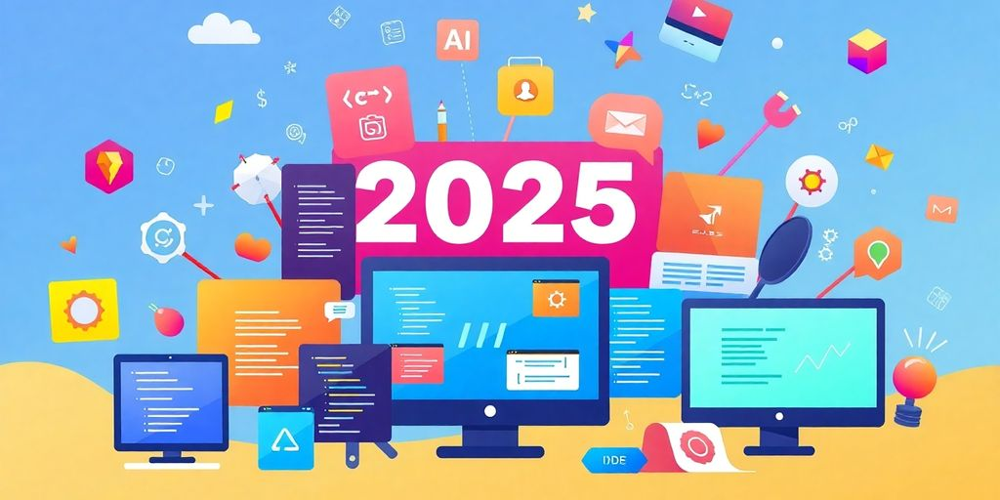
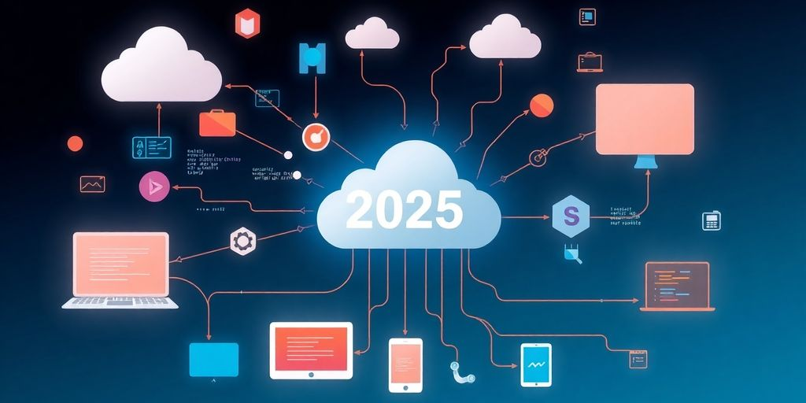

As we step into 2025, developers are on the lookout for tools that not only streamline their workflow but also make collaboration and coding easier. The right tools can truly change the game, allowing teams to work more efficiently and effectively. In this article, we'll explore some of the best developer tools that can help you tackle common challenges and enhance your productivity.

### Key Takeaways

*   Collaboration tools are essential for smooth teamwork and effective communication.
*   Modern IDEs should be user-friendly and adaptable to individual developer needs.
*   Automation tools can significantly reduce repetitive tasks and save time.
*   AI coding assistants are becoming vital for error detection and smart suggestions.
*   Project management tools should focus on clarity and ease of use for better tracking and reporting.

## Essential Tools For Seamless Collaboration

When you're coding with others, things should roll without extra fuss. You deserve a toolkit that helps you share your code, chat with your team, and quickly polish up your work.

### Real-Time Code Sharing

Picture working on a block of code while your teammate sees every keystroke _live_. Tools for code sharing let you both edit at the same time, which makes teamwork feel less like a slow email chain and more like a real conversation.

*   Instant code updates
*   Side-by-side editing
*   Quick live demos

**Real-time sharing makes team work feel like a jam session.**

### Integrated Communication Platforms

Talking about your code has never been simpler. Communication platforms bring chats, calls, and even code snippet sharing right into one place. This means you aren’t juggling multiple apps when you just need to sort a bug out. You can also find help faster with [clear documentation](https://jetthoughts.com/blog/10-innovative-strategies-improve-developer-experience-in-2024/) in view.

*   Dedicated chat channels
*   Built-in video calls
*   Easy file and snippet sharing

### Feedback and Review Systems

You don’t want to get stuck waiting on feedback. These systems help you see comments fast, so you can fix mistakes before they grow into bigger issues. A good feedback loop lets you aim for better code without the usual back-and-forth.

*   Automated review alerts
*   Inline commenting options
*   Integration with issue tracking

> Keep your team in sync and your code tidy. Rely on these tools to catch mistakes early and keep conversations clear.

| Tool Area | Function |
| --- | --- |
| Real-Time Code Sharing | Immediate code updates |
| Integrated Communication Platforms | Chat and call features |
| Feedback and Review Systems | Rapid and clear comments |

## Game-Changing IDEs For Every Developer

### User-Friendly Interfaces

When you start coding, you need an IDE that is clear and clean. You don't want a messy screen full of options. The best tools keep things simple. They show just what you need so you can work without extra clutter. Check out [modern IDE features](https://jetthoughts.com/blog/innovative-software-development-tools-techniques-for-2025/) for a look at a clean design. **Simple is smart.**

### Customization Options

You have your own style. A great IDE lets you shape the workspace to fit your taste. You can change themes, adjust shortcuts, and organize panels. The IDE is _customizable_ for you to build a setup that feels familiar. Here are some ways to tailor your tool:

*   Change your color theme
*   Set up your own shortcut keys
*   Rearrange panels to suit your flow

### Built-In Debugging Tools

You know the frustration when a bug slows you down. Good debugging tools can make that process less painful. They help you spot errors quickly and let you check code with just a few clicks. The tools show you what's wrong and offer quick fixes. Look for these features in your IDE:

| IDE Name | Speed | Debugging Ease |
| --- | --- | --- |
| LightIDE | Fast | Excellent |
| CodeFlow | Medium | Good |

> Find an IDE that fits your style, and coding will feel more like a friendly chat than a tedious chore.

## Automation Tools That Save Time

### Task Automation Solutions

When you have repetitive tasks, this tool cuts your work. You can set up scripts to handle daily chores. This makes coding a bit more fun. **It keeps your workflow unbelievably smooth.**

Here are three ways task automation helps you:

*   It handles routine builds and tests.
*   It sends alerts and reminders about your tasks.
*   It manages file transfers and cleanups.

Try checking out [automation frameworks](https://saucelabs.com/resources/blog/top-test-automation-frameworks-in-2023) to see how they work in real projects.

### CI/CD Pipelines

CI/CD pipelines help you merge code fast. They check your code for bugs and then roll out changes automatically. You spend less time waiting for builds and more time coding.

A small table shows how CI/CD can boost your projects:

| Step | What It Does |
| --- | --- |
| Code | You write your code |
| Test | Automatic tests run |
| Deploy | Code goes live fast |

This setup helps you catch errors early and makes deploying clear and quick.

### Code Quality Checkers

These tools look at your code to find mistakes. They point out short cuts that might slow you down. This process helps you stay sharp.

Here are three benefits of using quality checkers:

1.  They catch bugs in real time.
2.  They give quick feedback on style and structure.
3.  They help keep your code clean and neat.

Using _automation frameworks_ can save your time further by pairing with quality checkers. Just think: less fuss, more progress.

## AI-Powered Coding Assistants

When you code, sometimes you hit a wall with routine tasks or get stuck on small errors. AI-powered coding assistants step in like a friendly helper. They make suggestions on what to type next and check your code for mistakes. Check out [AI code tools](https://www.zdnet.com/article/the-best-ai-for-coding-in-2025-and-what-not-to-use-including-deepseek-r1/) for a closer look at this trend.

### Smart Code Suggestions

Imagine your editor suddenly hints at the next few lines of code. It studies how you work and gives clues that feel almost like a nudge from a buddy. These suggestions can help you:

*   Follow patterns in your code
*   Reduce time spent on repetitive typing
*   Experiment with new methods while you work

This feature is _smart_ enough to catch the little things you may miss.

### Error Detection and Fixing

You might see errors that throw off your workflow. AI tools spot mistakes as you code. They mark the issues and sometimes even offer fixes. **This feature saves your day when errors pop up unexpectedly.** It lets you get back to building without the long hunt for bugs.

### Learning and Adapting

These tools keep track of how you code. They adjust their tips based on your style. As you code more, they pick up on your habits. Here’s a quick breakdown of how it works:

| Step | What It Does | How It Helps |
| --- | --- | --- |
| Analyze Code | Checks your coding style | Makes suggestions fit |
| Update Model | Learns from your changes | Stays up-to-date |
| Review Fixes | Notes accepted fixes | Improves its tips |

They sharpen over time, matching your pace and style. It almost feels like the tool grows with you.

## Project Management Tools That Actually Work

Managing a project does not have to be a headache. You need tools that help you see what’s happening at a glance and keep your team on the same page. Over time, a few smart features stand out.

### Visual Task Boards

Visual Task Boards let you check tasks at a glance. They place your work in columns and show you what waits, what’s in progress, and what’s done. Tools like [clear view](https://jetthoughts.com/blog/enhancing-productivity-ultimate-developer-experience-tool-for-2024/) do the trick. Set them up with a few basic lanes and get a _simple_ overview of your daily flow.

### Time Tracking Features

Time tracking features help you know how long tasks stick around on your list. You record and review the time spent on tasks, which is helpful when plans shift. Tools that let you [track hours](#ec8c) keep things straightforward. Consider these points:

*   See time spent at a glance
*   Spot when tasks overrun
*   Adjust plans as needed

### Collaboration and Reporting

Keeping the team updated is key. Good reporting gives you snapshots of progress and issues. Collaboration tools let every team member share updates clearly. For instance, a [team update](#ec8c) function might handle this well.

| Report Type | Info Shown |
| --- | --- |
| Daily Summary | Task status and hours |
| Weekly Overview | Progress and issues |
| Monthly Report | Trends and fixes |

> A clear report saves you confusion and shows where the work stands.

**This approach keeps your project running without fuss.**

## Security Tools For Peace Of Mind

### Vulnerability Scanners

When you check your code for weak spots, vulnerability scanners are your first line of defense. These tools spot errors before they become problems. They run quick tests that point out flaws.

*   They look for common issues
*   They check for misconfigurations
*   They flag outdated code segments

Run a scan now using [offensive security tools](https://scytale.ai/resources/top-offensive-security-tools/). **Your security wins if you check early and often.**

### Code Analysis Tools

You use these tools to get a closer look at your code. They hunt down bugs and keep your code neat. They work by highlighting error lines and suggesting fixes.

*   They catch small mistakes
*   They show risky code patterns
*   They help you clean up fast

A few lines of code fixed can save you hours.

### Compliance Checkers

These checkers make sure you stick to the rules. They compare your work against industry standards. You use them to be sure you’re legally compliant.

*   They verify standard practices
*   They help reduce manual reviews
*   They keep your workflow smooth

> Security is about building safe code every step of the way. Following checks keeps you on track.

| Tool Type | Main Advantage |
| --- | --- |
| Vulnerability Scanners | Quick flaw detection |
| Code Analysis Tools | Automated bug spotting |
| Compliance Checkers | Rule adherence checking |

Keep an eye on _risk_ and rest easy knowing you have these tools at hand.

## Cloud Services That Enhance Development

### Scalable Infrastructure

You need a system that grows as you do. Imagine adding servers without breaking a sweat. A good cloud service gives you that. It handles heavy data and traffic like a champ. Try balancing loads with [cloud insights](https://jetthoughts.com/blog/enhancing-dev-experience-strategies-for-better-developer-journey-in-2025/).

**You have the power to scale effortlessly.**

Take a look at this quick view:

| Metric | Low Traffic | High Traffic |
| --- | --- | --- |
| Server Load | Low | Manageable |
| Response | Fast | Consistent |
| Capacity | Fixed | Dynamically increased |

### Easy Deployment Options

When you deploy your code, you shouldn’t get tangled in red tape. A strong cloud service makes updates simple and clear. It lets you focus on your work and not on the tech. You can update in steps without the fear of complex setups. Here are some tips to keep in mind:

*   Backup before updating
*   Test small changes first
*   Roll out updates gradually

> Cloud tools help you keep a cool head even when things get hectic. They let you test, fix, and go live with just a few clicks.

### Collaboration in the Cloud

Working with peers is a breeze when your code lives in the cloud. It’s easy for you to share work and get quick feedback. Your team can join from anywhere at any time. This setup includes built-in chat and shared editing features, which cut down on tech hassles. Remember: _flexibility_ is just one benefit among many.

Cloud services can really help make software development easier and faster. They provide tools that let teams work together better, share resources, and speed up the whole process. If you're looking to [boost your development efforts](https://jetthoughts.com), check out our website for more information on how we can assist you!

## Wrapping It Up

So, there you have it! As we roll into 2025, the right tools can really change the game for developers. It’s all about finding what works for you and your team. Whether it’s speeding up your workflow, making collaboration easier, or just helping you write better code, these tools are here to help. Don’t forget, a happy developer is a productive developer. So, if you’ve got a favorite tool that makes your life easier, share it! Let’s keep the conversation going and help each other out in this ever-evolving tech world.

## Frequently Asked Questions

### What are the best tools for developers in 2025?

In 2025, the best developer tools include collaboration platforms, user-friendly IDEs, automation tools, AI coding assistants, project management tools, security tools, and cloud services.

### How do developer tools improve teamwork?

Developer tools help teams work better together by making communication easier, sharing code in real-time, and providing quick feedback.

### What features should I look for in an IDE?

When choosing an IDE, look for an easy-to-use interface, options to customize it, and built-in tools for debugging your code.

### How can automation tools help save time?

Automation tools save time by handling repetitive tasks, setting up continuous integration and delivery pipelines, and checking code quality automatically.

### What are AI-powered coding assistants?

AI-powered coding assistants are tools that suggest code, help find and fix errors, and learn from your coding habits to improve over time.

### Why is project management important for developers?

Project management tools help developers keep track of tasks, manage time, and collaborate effectively, leading to better project outcomes.
