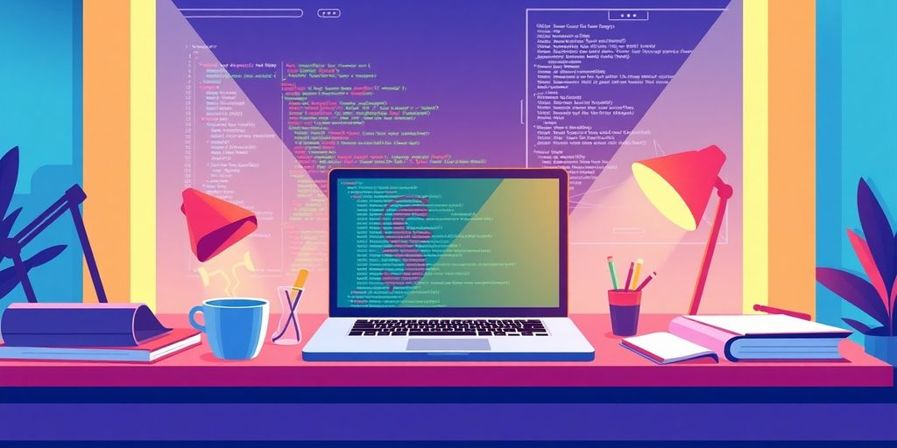

In today's tech landscape, becoming a successful Ruby on Rails (RoR) developer is a promising career path. As the demand for web applications continues to grow, RoR developers are at the forefront of creating dynamic and efficient web solutions. This article will guide you through the essential steps to thrive in this field by exploring the unique aspects of RoR development, the skills you need to acquire, and how to navigate the job market effectively. Whether you're just starting out or looking to enhance your skills, there's something here for everyone.

### Key Takeaways

*   Understand what sets RoR developers apart and their key roles in web development.
*   Learn the essential skills, including Ruby basics, front-end technologies, and database management.
*   Explore various learning pathways, such as online courses, books, and community involvement.
*   Get tips on how to stand out in the job market, including crafting a strong resume and networking effectively.
*   Stay updated on emerging trends and the future of RoR development, including the impact of AI.

## Understanding The Role Of A ROR Developer

So, you want to be a Ruby on Rails (ROR) developer? Awesome! It's a solid career choice. Let's break down what that actually _means_.

### What Makes ROR Developers Unique?

ROR developers are special because they use a framework that values simplicity and efficiency. Think of it like this: other frameworks make you build a car from scratch, but Rails gives you a pre-built chassis. You still customize it, but you start way ahead. **This "convention over configuration" approach speeds things up.** Plus, the Ruby language itself is pretty readable, which helps a lot. ROR developers can quickly [develop new programs](https://www.simplilearn.com/tutorials/java-tutorial/what-is-ruby-on-rails) and applications.

### Key Responsibilities of ROR Developers

What do ROR developers _do_ all day? It's more than just coding. Here's a taste:

*   Building server-side logic. This is the _backend_ stuff that makes websites work.
*   Working with databases. Storing and retrieving data is a big part of the job.
*   Connecting apps to other web services. Think APIs and integrations.
*   Troubleshooting and debugging. Because things _always_ break.
*   Collaborating with front-end developers. Making sure everything looks and works great.

> ROR developers are like the unsung heroes of the web. They build the engines that power the sites and apps we use every day. They ensure the website is easy to maintain and update.

### The Importance of Back-End Development

Okay, so why is back-end development so important? Imagine a fancy restaurant. The front-end is the dining room: beautiful decor, friendly staff. But the back-end? That's the kitchen. If the kitchen is a mess, the food is bad, and the restaurant fails. Back-end development is the same. It's the foundation that everything else is built on. Without a solid back-end, your website is just a pretty face with no substance. A good back-end ensures [web development service](https://www.simplilearn.com/tutorials/java-tutorial/what-is-ruby-on-rails) is seamless.

## Essential Skills For Aspiring ROR Developers

So, you want to be a Ruby on Rails developer? Awesome! It's a great career choice. But what skills do you _really_ need? Let's break it down.

### Mastering Ruby Basics

First things first: Ruby. You can't build on Rails without a solid grasp of Ruby. Think of it as the foundation of your house. **You need to know the basics like syntax, data structures, and object-oriented programming.** If you skip this, you'll be lost when things get complex. Seriously, spend time here. It will pay off. There are tons of free resources online, so no excuses!

### Front-End Technologies You Should Know

Okay, so you're a back-end developer, right? Yes, but you can't ignore the front end. You don't need to be a _master_ of JavaScript, HTML, and CSS, but you should know enough to work with front-end developers and understand how your code impacts the user interface. Plus, knowing a bit of front end can help you debug issues faster. Think of it as speaking the same language as your front-end colleagues. It makes [tech hiring strategies](https://jetthoughts.com/blog/tags/hiring/) way easier.

Here's a quick list:

*   HTML: Structure of web pages.
*   CSS: Styling and appearance.
*   JavaScript: Interactivity and dynamic content.

### Database Management Skills

Rails is all about data, so you need to know databases. You should understand how to design schemas, write queries, and optimize performance. SQL is your friend. Learn it, love it, live it. Seriously, knowing your way around a database is a game-changer. You'll be working with databases constantly, so make sure you're comfortable with the basics. A good understanding of database management is key to unlocking [Ruby on Rails training](https://jetthoughts.com/blog/tags/hiring/) opportunities.

> Understanding database relationships and how to efficiently query data is super important. Knowing how to use migrations to manage your database schema is also a must. Don't skip this step!

## Learning Pathways To Become A ROR Developer

So, you want to be a Ruby on Rails developer? Awesome! Let's talk about how to get there. There are a few paths you can take, and honestly, it's all about finding what clicks with you. No one-size-fits-all here. Let's explore some options.

### Online Courses and Certifications

Online courses are a great way to learn at your own pace. You can find courses for every level, from total beginner to advanced wizard. Plus, a [RoR certification course](https://jetthoughts.com/blog/exploring-innovative-ruby-on-rails-open/) can really boost your resume. Look for courses that offer hands-on projects. Watching videos is cool, but _doing_ is better. Make sure the course is up-to-date. Tech changes fast, and you don't want to learn outdated stuff.

### Books That Every ROR Developer Should Read

Don't underestimate the power of a good book. Sure, they don't update as fast as online resources, but they give you a solid foundation. Some books are classics for a reason. They cover the core concepts in a way that sticks with you. Plus, no distractions from social media! Here are a few must-reads:

*   "The Well-Grounded Rubyist" by David A. Black
*   "Programming Ruby" by Dave Thomas
*   "Agile Web Development with Rails" by Sam Ruby (yes, really)

> Books give you a deep understanding of the fundamentals. They're like the bedrock of your knowledge. Online resources are great for specific problems, but books give you the big picture.

### Joining Developer Communities

**Developer communities are where the magic happens.** Seriously, these groups are gold. You can ask questions, get feedback, and learn from others' experiences. Plus, it's a great way to network. Find a community that fits your style. Some are super formal, others are more laid-back. Check out these options:

*   Online forums like Stack Overflow. It's a lifesaver when you're stuck.
*   Local meetups. Face-to-face interaction is still valuable.
*   [Ruby on Rails open source projects](https://jetthoughts.com/blog/exploring-innovative-ruby-on-rails-open/). Contribute and learn at the same time.

## Navigating The Job Market As A ROR Developer

So, you've got the skills. Now, how do you actually land that sweet Ruby on Rails (RoR) job? It's not just about knowing the code; it's about playing the game. Let's break down how to get yourself noticed and hired.

### Crafting An Impressive Resume

Your resume is your first impression. Make it count. Don't just list your skills; show them off.

*   Highlight your projects: Include links to your GitHub or personal website. Let them see what you can do.
*   Use action verbs: Instead of "Worked on," try "Developed," "Implemented," or "Optimized."
*   Tailor it: Adjust your resume for each job application. Focus on the skills and experience that match the job description.

> A strong resume is more than just a list of jobs. It's a story of your skills and accomplishments. Make sure it tells the right story.

### Networking Tips For Developers

Networking can feel like a chore, but it's super important. It's not just about collecting contacts; it's about building relationships.

*   Attend meetups: Local tech meetups are great for meeting other developers. Plus, free pizza!
*   Contribute to open source: Working on open-source projects gets your name out there and shows off your skills.
*   Use LinkedIn: Connect with recruiters and other developers in your field. Engage in conversations and share your knowledge.

_Remember, networking is a two-way street. Offer help and advice to others, and they'll be more likely to help you._

### Preparing For Technical Interviews

Technical interviews can be nerve-wracking, but preparation is key. You need to show that you know your stuff.

*   Practice coding challenges: Sites like LeetCode and HackerRank are your friends. Practice makes perfect.
*   Review data structures and algorithms: Brush up on the basics. You might be asked to implement a linked list or sort an array.
*   Be ready to explain your projects: Walk through your projects and explain your design decisions. Show that you understand the _why_, not just the _how_.

Don't be afraid to ask questions during the interview. It shows that you're engaged and curious. And hey, if you bomb an interview, don't sweat it. Learn from it and move on. There are plenty of [RoR job opportunities](https://jetthoughts.com/blog/discover-exciting-ruby-on-rails-jobs/) out there.

## The Future Of ROR Development

### Emerging Trends In ROR

What's next for Ruby on Rails? Good question! A few things are bubbling up. First, expect to see more focus on _API-first_ development. This means Rails apps will be built to serve data to other applications and devices. Think mobile apps, single-page applications, and even IoT devices.

Also, keep an eye on serverless deployments. Rails is adapting to run on platforms like AWS Lambda and Google Cloud Functions. This can save you money and make your apps more scalable. Finally, look for continued improvements in performance and security. The Rails team is always working to make the framework faster and more secure. It is important to stay updated on [Ruby trends](https://jetthoughts.com/blog/exploring-ruby-frontend-development-best-practices/) to improve application performance.

### The Impact Of AI On ROR Development

AI is changing everything, including how we build Rails apps. One big area is code generation. Tools are emerging that can write Rails code for you, based on your specifications. This can speed up development and reduce errors. AI can also help with testing. Automated testing tools can find bugs and vulnerabilities that humans might miss.

AI-powered tools can also help you optimize your Rails applications for performance. They can analyze your code and suggest ways to make it faster and more efficient. **AI is not going to replace Rails developers**, but it will change the way we work.

### Why ROR Will Remain Relevant

Is Rails dying? Nope! Despite what some people say, Rails is still a great choice for web development. It's mature, stable, and has a huge community. Plus, it's still one of the fastest ways to build a web application. Rails is also very flexible. You can use it for everything from simple websites to complex web applications.

Here are a few reasons why Rails will stick around:

*   It's easy to learn. Rails has a clear structure and a lot of documentation.
*   It's productive. Rails lets you build applications quickly and efficiently.
*   It's fun! Rails is a joy to work with.

> Rails has a proven track record. Many successful companies use Rails, including Shopify, GitHub, and Airbnb. Rails is not going anywhere anytime soon. It is a cost effective solution.

So, if you're thinking about learning Rails, go for it! You won't regret it. Rails is a valuable skill that will serve you well for years to come. It is important to choose the [best website development company](https://jetthoughts.com/blog/exploring-ruby-frontend-development-best-practices/) for your project.

## Building A Portfolio That Stands Out

Your portfolio is your digital handshake. It shows what you can do. It is more than just a list of skills. It shows employers what you are about. Let's make yours shine.

### Showcasing Your Projects

Think of your portfolio as a highlight reel. It is not every project you have ever touched. It is the best ones. Pick projects that show off your skills. Explain what you did. What problems did you solve? What did you learn? Use images and demos. Make it easy for people to see your work. **Focus on quality over quantity.**

*   Include a variety of projects.
*   Describe your role in detail.
*   Showcase the technologies you used.

### Contributing To Open Source

[Rails open source projects](https://jetthoughts.com/blog/exploring-best-rails-open-source-projects-for-developers-in-2025/) are a great way to show you can work with others. It shows you can learn new things. Find a project that interests you. Contribute code, documentation, or bug fixes. Open source shows you are a team player. It shows you care about the community. Plus, you get to learn from experienced developers. It's a win-win!

> Contributing to open source is not just about writing code. It is about being part of a community. It is about learning from others. It is about giving back.

### Creating A Personal Website

Your website is your online home. It is where people can learn about you. It is where you show off your work. Keep it simple. Make it easy to navigate. Include a blog. Write about what you are learning. Share your thoughts on ROR. A personal website shows you are serious about your career. It shows you are willing to invest in yourself. _Make sure it looks good on mobile devices._

*   Choose a clean design.
*   Include a contact form.
*   Update it regularly.

## Tips For Continuous Improvement As A ROR Developer

### Staying Updated With New Technologies

Tech moves fast, especially in web development. To stay sharp, you need to keep learning. Set aside time each week to read blogs, check out new _gems_, and experiment with new features in Ruby and Rails. Don't just read about it; actually try it. Build a small app using a new technique. This hands-on approach will help you understand the concepts better and remember them longer. It's like learning a new language; you have to practice to become fluent. Also, consider following key influencers and thought leaders in the Ruby on Rails community on platforms like Twitter or LinkedIn. This way, you'll get real-time updates and insights into what's happening in the ROR world. You can also subscribe to newsletters or join online forums to stay informed about the latest trends and best practices. Remember, **continuous learning is not a chore, it's an investment in your future as a developer**.

### Practicing Coding Regularly

Coding is like a muscle; you have to use it or lose it. Make time to code every day, even if it's just for an hour. Work on personal projects, contribute to open source, or solve coding challenges on sites like HackerRank or LeetCode. The more you code, the better you become at problem-solving, debugging, and writing clean, efficient code. Plus, it's fun! Think of it as a daily workout for your brain. Don't be afraid to experiment and try new things. The more you push yourself, the more you'll grow as a developer. Regular practice also helps you internalize the syntax and best practices of Ruby on Rails, making you a more efficient and confident coder. Consider setting up a [minimalistic process](https://jetthoughts.com/blog/develop-minimalistic-process-for-development-teams-innovate-startup-productivity/) to keep your skills sharp.

### Seeking Feedback From Peers

Getting feedback from other developers is super important. It's easy to get stuck in your own way of thinking, and fresh eyes can spot problems or suggest better solutions that you might miss. Share your code on platforms like GitHub and ask for code reviews. Join a local Ruby on Rails meetup and present your work. Don't be afraid of criticism; it's an opportunity to learn and improve. Remember, even the best developers get feedback. It's part of the process. Plus, giving feedback to others can also help you improve your own skills. It forces you to think critically about code and explain your reasoning, which can solidify your understanding of the concepts. Here are some ways to get feedback:

*   Ask for code reviews on GitHub.
*   Present your work at meetups.
*   Join online forums and discussions.
*   Pair program with other developers.

> Feedback is a gift. It helps you see yourself and your code from a different perspective, leading to growth and improvement.

Also, remember that _collaboration_ is key in software development. Working with others not only provides opportunities for feedback but also exposes you to different coding styles and approaches. This can broaden your skillset and make you a more well-rounded developer.

As a Ruby on Rails developer, always look for ways to get better at your craft. Keep learning new skills, ask for feedback, and try to solve problems in different ways. Remember, the tech world is always changing, so staying updated is key. For more tips and resources to help you grow, visit our website today!

## Wrapping It Up

So, there you have it! Becoming a Ruby on Rails developer in 2025 is totally doable if you put in the effort. With the tech world booming, there’s no better time to jump in. Just remember to keep learning, practice your skills, and connect with others in the community. Whether you’re diving into online courses or just tinkering on your own, every bit of experience counts. Don’t stress too much about getting everything perfect right away. Just take it one step at a time, and soon enough, you’ll find yourself building awesome web applications. Now go out there and start coding!

## Frequently Asked Questions

### What does a Ruby on Rails Developer do?

A Ruby on Rails Developer builds web applications using the Ruby on Rails framework. They work on the back-end, creating the logic that makes websites work and connecting them to databases.

### How can I start learning Ruby on Rails?

You can start by taking online courses, reading books about Ruby and Rails, and joining coding communities to get support and guidance.

### Is it hard to learn Ruby on Rails?

No, it's not very hard! Ruby on Rails has a simple structure and a lot of resources available, which makes it easier for beginners to learn.

### What skills do I need to become a Ruby on Rails Developer?

You should learn Ruby programming, understand front-end technologies like HTML and CSS, and know how to manage databases.

### What is the job outlook for Ruby on Rails Developers?

The demand for Ruby on Rails Developers is strong, with many job openings expected in the coming years as more companies look to build web applications.

### How can I make my portfolio stand out as a developer?

You can showcase your projects, contribute to open-source projects, and create a personal website to display your work and skills.