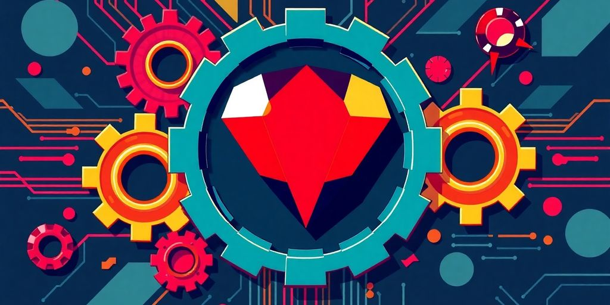

In the ever-evolving tech world, being a Ruby engineer can lead to exciting opportunities. With the demand for web applications on the rise, mastering Ruby and its frameworks is essential. This article will break down the key skills, networking strategies, and job market tips you need to thrive in this field. Whether you're just starting or looking to level up your career, there’s something here for everyone.

### Key Takeaways

*   Master the basics of Ruby syntax and Rails framework to build strong applications.
*   Create a standout portfolio by showcasing projects and contributing to open source.
*   Networking is crucial; join communities and attend meetups to connect with other developers.
*   Tailor your resume to highlight relevant skills and experiences for each job application.
*   Stay updated with industry trends through online courses and tech blogs.
*   Collaboration is key; engage in code reviews and pair programming to improve your skills.
*   Be prepared for technical interviews by practicing coding challenges and understanding system design.
*   Soft skills matter; communication and teamwork are essential in tech roles.

## Essential Skills Every Ruby Engineer Should Master

### Understanding Ruby Syntax

Alright, first things first: Ruby itself. You can't even think about Rails if your Ruby skills aren't up to par. It's like trying to build a house without a solid foundation. **You need to know the basics: syntax, data structures, and object-oriented programming.** If you skip this, you'll be lost when things get complex. Seriously, spend time here. It will pay off. There are tons of free resources online, so no excuses! You can even [build a web server](https://github.com/fpsvogel/learn-ruby) from scratch to test your knowledge.

### Mastering Rails Framework

Rails is where the magic happens. It's a full-stack framework, meaning it handles both the front and back end of web development. Get comfortable with its conventions. Learn about models, views, and controllers (MVC). Understand how routing works. Rails is opinionated, but that's a good thing. It helps you write code faster and more consistently.

### Database Management Basics

Rails is all about data, so you need to know databases. You should understand how to design schemas, write queries, and optimize performance. SQL is your friend. Learn it, love it, live it. Seriously, knowing your way around a database is a game-changer. You'll be working with databases constantly, so make sure you're comfortable with the basics. A good understanding of database management is key to unlocking _Ruby on Rails training_ opportunities.

> Understanding database relationships and how to efficiently query data is super important. Knowing how to use migrations to manage your database schema is also a must. Don't skip this step!

### Version Control with Git

Git is non-negotiable. It's how you track changes to your code, collaborate with others, and revert to previous versions if something goes wrong. Learn the basic commands: `add`, `commit`, `push`, `pull`, `branch`, `merge`. Use GitHub, GitLab, or Bitbucket to host your repositories. Version control is like having a time machine for your code. Don't leave home without it.

### Testing and Debugging Techniques

Writing code is only half the battle. You also need to test it to make sure it works correctly. Learn how to write unit tests, integration tests, and end-to-end tests. Use testing frameworks like RSpec or Minitest. Debugging is also a crucial skill. Learn how to use debugging tools to find and fix errors in your code. Testing and debugging are like quality control for your software.

### API Development Skills

In today's world, everything is connected. You need to know how to build APIs (Application Programming Interfaces) that allow your application to communicate with other applications. Learn about RESTful APIs, JSON, and HTTP methods. Use tools like Postman or Insomnia to test your APIs. API development is like building bridges between different software systems.

## Building A Strong Portfolio As A Ruby Engineer

Your portfolio? It's your chance to shine. It shows potential employers what you can _actually_ do. Let's make it awesome.

### Showcasing Your Projects

Got cool projects? Show them off! Don't just list them. Make them pop. Include descriptions of what you did, what you learned, and why it matters. **A live demo is worth a thousand words.**

### Contributing to Open Source

Open source contributions? Gold. It shows you can work with others, understand existing code, and give back to the community. Plus, it's a great way to learn. Find a [project to contribute to](https://www.codecademy.com/resources/blog/software-developer-portfolio-tips/) that interests you.

### Creating a Personal Website

A personal website is your digital home. It's where you control the narrative. List your skills, projects, and experience. Make it easy to navigate and visually appealing. Think of it as your online resume, but way cooler. It's a great way to show off your [software developer portfolio](https://www.codecademy.com/resources/blog/software-developer-portfolio-tips/).

### Highlighting Your Best Work

Don't just throw everything in there. Curate your best work. Focus on quality over quantity. Choose projects that show off your skills and passion. Make sure they are polished and well-documented.

### Including Relevant Certifications

Certifications can add weight to your portfolio. They show you've put in the work to learn specific skills. List any relevant certifications you have. But remember, experience trumps certifications. A [RoR certification course](https://www.codecademy.com/resources/blog/software-developer-portfolio-tips/) can really boost your resume.

### Using GitHub Effectively

GitHub is your friend. Use it to host your code, track your progress, and collaborate with others. Make sure your repositories are well-organized and easy to understand. A clean GitHub profile shows you're serious about coding.

> A strong portfolio is more than just a list of projects. It's a story about your journey as a developer. It shows your skills, your passion, and your potential. Make it count.

## Networking Tips For Ruby Engineers

Networking is super important. It's not just about finding a job. It's about learning, growing, and making friends. Here's how to do it right.

### Joining Online Communities

Online communities are gold. Seriously. You can ask questions, get feedback, and learn from others. Plus, it’s a great way to network. Find a community that fits your style. Some are super formal, others are more laid-back. Check out these options:

*   Stack Overflow: A lifesaver when you’re stuck.
*   Reddit (r/ruby, r/rails): Great for discussions and news.
*   [Slack channels](https://jetthoughts.com/blog/discover-exciting-ruby-on-rails-jobs/): Real-time chat and collaboration.

### Attending Local Meetups

Face-to-face interaction is still valuable. Local meetups are awesome for this. You can meet other Ruby engineers in your area, share ideas, and maybe even find a mentor. Plus, free pizza is often involved. Check out Meetup.com for local groups.

### Participating in Hackathons

Hackathons are intense, but they're also a ton of fun. You get to work on a project with other developers, learn new skills, and maybe even win a prize. It's a great way to network and show off your skills. Plus, you get to code like crazy for a weekend. What's not to love?

### Engaging on Social Media

Social media isn't just for cat videos. It's also a great way to connect with other Ruby engineers. Follow industry leaders, share your work, and participate in discussions. Twitter and LinkedIn are good places to start. Just don't spend all day scrolling.

### Finding a Mentor

A mentor can be a game-changer. They can offer advice, share their experiences, and help you grow as a developer. Look for someone who's been in the industry for a while and is willing to share their knowledge. Don't be afraid to reach out and ask for help.

### Collaborating on Projects

Working on projects with other developers is a great way to learn and network. You can contribute to open source projects, work on side projects with friends, or even start your own project. It's a great way to build your skills and meet new people. Plus, you'll have something to show off in your portfolio. Contributing to [Ruby on Rails open source projects](https://jetthoughts.com/blog/discover-exciting-ruby-on-rails-jobs/) is a great way to network.

## Navigating The Job Market As A Ruby Engineer

So, you've got the Ruby skills. Awesome! Now, how do you actually get a job? It's more than just knowing the code; it's about playing the game. Let's break down how to get noticed and hired.

### Crafting An Impressive Resume

Your resume is your first impression. Make it count. Don't just list skills; show them off. **Make sure your resume highlights your best work.**

*   Highlight your projects: Include links to your GitHub or personal website. Let them see what you can do.
*   Use action verbs: Instead of "Worked on," try "Developed," "Implemented," or "Optimized."
*   Tailor it: Adjust your resume for each job application. Focus on the skills and experience that match the job description.

### Preparing For Technical Interviews

Technical interviews can be scary, but preparation is key. Practice makes perfect, so get ready to code! You can find [interview tips](https://www.igmguru.com/blog/unleashing-the-full-potential-of-ruby-on-rails-ror-benefits-career-prospects-and-salaries) online.

*   Practice coding challenges on platforms like HackerRank or LeetCode.
*   Review data structures and algorithms.
*   Be ready to explain your thought process.

### Understanding Job Descriptions

Job descriptions can seem like a foreign language. Learn to decode them. _Pay attention to the required skills and experience._

> Read the job description carefully. Identify the key skills and experience they are looking for. Tailor your resume and cover letter to match these requirements.

### Leveraging Job Boards

Job boards are your friend. Use them wisely. Don't just apply to everything; be strategic. Here are some popular job boards:

*   Indeed
*   LinkedIn
*   Glassdoor

### Networking for Job Opportunities

Networking is super important. It's not just about who you know, but who knows you. Attend meetups, join online communities, and connect with other Ruby engineers. It’s a great way to network. Find a community that fits your style. Some are super formal, others are more laid-back. Check out these options:

*   Online forums like Stack Overflow. It’s a lifesaver when you’re stuck.
*   Local meetups. Face-to-face interaction is still valuable.
*   [Ruby on Rails open source projects](https://rubyonrails.org/). Contribute and learn at the same time.

### Following Up After Interviews

Don't forget to follow up after interviews. A simple thank-you note can go a long way. It shows you're interested and professional. Send a thank-you email within 24 hours of the interview. Reiterate your interest in the position. Briefly mention something specific you discussed during the interview.

## Continuous Learning As A Ruby Engineer

So, you're a Ruby engineer? Awesome! But tech never sleeps, and neither should your learning. Let's talk about how to stay sharp and keep those skills fresh. It's not just about knowing the code today, but being ready for tomorrow's challenges. Think of it as leveling up your character in a game—except this game is your career!

### Staying Updated with Trends

Tech changes fast. Like, _really_ fast. What's hot today might be old news tomorrow. Set aside some time each week to read blogs, check out new gems, and play with new features in Ruby and Rails. Don't just read about it; actually try it. Build a small app [using a new technique](https://dev.to/wraith/beyond-the-bare-minimum-how-software-engineers-can-truly-stand-out-4a2b). This hands-on approach helps you understand and remember things better. It's like learning a new language; you have to practice to become fluent.

### Taking Online Courses

Online courses are great. You can learn at your own pace. Find courses for every level, from total beginner to advanced wizard. A RoR certification can boost your resume. Look for courses with hands-on projects. Watching videos is cool, but _doing_ is better. Make sure the course is up-to-date. Tech changes fast, and you don’t want to learn outdated stuff.

### Reading Relevant Books

Books are still a thing! Find some good books on Ruby and Rails. Read them. Highlight them. Dog-ear the pages. Books give you a solid foundation. They go deep into the concepts. Plus, they don't crash like your internet browser.

### Following Influencers in Tech

Find some smart people in the Ruby world. Follow them on Twitter, LinkedIn, or whatever platform they use. See what they're talking about. What problems are they solving? What new tools are they using? It's like having a bunch of mentors in your pocket.

### Practicing Coding Regularly

Coding is like a muscle; you have to use it or lose it. **Make time to code every day, even if it’s just for an hour.** Work on personal projects, contribute to open source, or solve coding challenges. The more you code, the better you become at problem-solving, debugging, and writing clean code. Plus, it’s fun! Think of it as a daily workout for your brain. Don’t be afraid to experiment and try new things. The more you push yourself, the more you’ll grow as a developer.

### Joining Study Groups

Learning with others is awesome. Find a study group. Or start one! Talk about code. Help each other out. Explain things. Teaching someone else is a great way to learn. Plus, it's more fun than staring at a screen alone.

## The Importance Of Collaboration In Development

Collaboration? It's not just a buzzword. It's how real magic happens in development. Think of it as the secret sauce that turns a good project into a great one. You're not an island, and your code shouldn't be either. Let's explore why working together is so important.

### Working With Other Developers

Ever stared at a screen for hours, totally stuck? A fresh pair of eyes can spot the problem in minutes. Working with other developers means sharing knowledge, getting different perspectives, and learning new tricks. Plus, it's way more fun than coding alone in your basement. Think of it as a coding party, but with less pizza and more problem-solving. [developer-centric culture](https://jetthoughts.com/blog/enhancing-dev-experience-strategies-for-better-developer-journey-in-2025/) is key.

### Participating in Code Reviews

Code reviews are like having a second brain check your work. It's not about finding fault; it's about improving quality. You catch bugs, learn new techniques, and ensure your code is readable. It's a win-win. Plus, giving code reviews helps you understand different coding styles. It's like learning a new language, but for code.

### Pair Programming Benefits

Pair programming is where two developers work on the same code, at the same time, on the same computer. One codes, the other reviews. Switch roles often. It sounds intense, but it's super effective. You get real-time feedback, share ideas, and catch errors instantly. **It's like having a coding buddy who's always got your back.**

### Learning From Feedback

Feedback can sting, but it's a gift. Don't take it personally. Use it to grow. Ask questions, understand the reasoning, and apply it to your next project. _Embrace feedback_, and you'll become a better developer.

### Building Team Projects

Team projects are where you put all these collaboration skills to the test. You learn to coordinate, communicate, and compromise. It's not always easy, but it's incredibly rewarding. Plus, you get to build something bigger and better than you could alone.

### Sharing Knowledge

Don't hoard your knowledge. Share it. Write blog posts, give talks, answer questions on forums. The more you share, the more you learn. Plus, it makes you feel good. It's like being a coding superhero, but without the tights.

> Collaboration isn't just about writing code together; it's about building a community of learning and growth. It's about helping each other become better developers and creating amazing things together.

## Emerging Technologies In Ruby Development

### API-First Development

API-first development means you design your API before anything else. Think of it as building the blueprint before the house. This approach makes your apps more flexible. They can talk to different devices and services easily. Expect to see more [focus on API](https://rubyroidlabs.com/blog/2025/03/ror-trends/) in Rails. It is a good way to build apps that last.

### Serverless Architecture

Serverless doesn't mean no servers. It means you don't manage them. Platforms like AWS Lambda handle the server stuff. This can save you money. It also makes your apps scale better. Rails is getting better at serverless. It is worth a look.

### Integration with AI Tools

AI is changing how we code. Tools can now write Rails code for you. This speeds up development. AI can also help find bugs. It can even optimize your code. **AI won't replace you, but it will change your job.**

### Microservices Architecture

Microservices break down big apps into smaller parts. Each part does one thing well. This makes apps easier to update. It also makes them more reliable. Rails can work well with microservices. It is a good choice for complex projects.

### Containerization with Docker

Docker puts your app and everything it needs into a container. This makes it easy to move your app around. It works the same everywhere. Docker is super popular. It is a must-know for modern Rails devs.

### Cloud Deployment Strategies

Cloud deployment means putting your app on servers in the cloud. This makes it easy to scale. It also makes it more reliable. There are many ways to deploy Rails to the cloud. Find the one that works for you. Here are some options:

*   AWS
*   Google Cloud
*   Azure

## Best Practices For Ruby Engineers

### Writing Clean Code

You know what's not fun? Dealing with code that looks like a toddler finger-painted it. _Clean code_ is readable, maintainable, and testable. Think of it as writing a book that other developers (including future you) will actually enjoy reading. Use meaningful names, keep functions short, and avoid unnecessary complexity. Trust me, your teammates will thank you.

### Implementing Design Patterns

Design patterns are like blueprints for solving common problems. Instead of reinventing the wheel every time, you can use a proven solution. Some popular patterns include:

*   Singleton: Ensures only one instance of a class exists.
*   Factory: Creates objects without specifying the exact class to create.
*   Observer: Defines a one-to-many dependency between objects.

Using design patterns makes your code more organized and easier to understand. Plus, it shows you know your stuff. It's like using [Ruby for web development](https://jetthoughts.com/blog/exploring-ruby-frontend-development-best-practices/) to build robust web applications.

### Optimizing Performance

Nobody likes a slow website. Optimizing performance means making your code run faster and more efficiently. Here are a few tips:

*   Use efficient algorithms.
*   Minimize database queries.
*   Cache frequently accessed data.

> Performance optimization is an ongoing process. Regularly profile your code to identify bottlenecks and make improvements. It's like tuning a race car to get every last bit of speed.

### Effective Error Handling

Errors happen. It's how you deal with them that matters. Effective error handling means anticipating potential problems and writing code that gracefully recovers. Use `begin...rescue` blocks to catch exceptions and provide informative error messages. Don't just swallow errors; log them and take appropriate action. It's like having a plan for when things go wrong, because they will.

### Using Gems and Libraries

Ruby has a huge ecosystem of gems and libraries that can save you time and effort. Need to parse JSON? There's a gem for that. Need to generate PDFs? There's a gem for that too. But be careful not to go overboard. Too many dependencies can make your project bloated and hard to maintain. Choose your gems wisely.

### Maintaining Documentation

Documentation is like a map for your code. It tells other developers (and future you) what your code does and how to use it. Write clear, concise comments and use tools like RDoc to generate API documentation. Good documentation makes your code more accessible and easier to maintain. It's like leaving breadcrumbs so others can follow your path.

## Understanding The Ruby Community

The Ruby community is awesome. It's one of the biggest reasons Ruby is still kicking butt today. Seriously, the people involved make all the difference. Let's look at how to get involved.

### Joining Online Communities

Online communities are gold. You can ask questions, get feedback, and learn from others. It's also a great way to network. Find a community that fits your style. Some are formal, others are laid-back. Check out options like Stack Overflow. It’s a lifesaver when you’re stuck. The African Ruby Community [offers a supportive network](https://medium.com/@yashbatra11111/rubys-secret-weapon-how-its-community-keeps-it-alive-and-thriving-0100069bac3c) of developers.

### Attending Local Meetups

Face-to-face interaction is still valuable. Local meetups are a great way to connect with other Rubyists in your area. You can learn about new technologies, share your experiences, and maybe even find a job. Plus, free pizza is often involved. What's not to love?

### Participating in Hackathons

Hackathons are intense coding events where you build something cool in a short amount of time. They're a great way to learn new skills, meet other developers, and maybe even win a prize. Plus, they look great on your resume. Just remember to sleep sometime.

### Engaging on Social Media

Social media is a powerful tool for connecting with the Ruby community. Follow Ruby developers on Twitter, join Ruby groups on Facebook, and participate in discussions on LinkedIn. Share your work, ask questions, and offer help to others. Just don't spend all day scrolling.

### Finding a Mentor

A mentor can provide guidance, support, and advice as you navigate your Ruby career. Look for someone with experience and expertise who is willing to share their knowledge. Don't be afraid to reach out and ask for help. Most Rubyists are happy to help out a fellow coder.

### Collaborating on Projects

Working on projects with other developers is a great way to learn and grow. You can learn from their experience, improve your coding skills, and build something cool together. Plus, it's more fun than coding alone. Consider contributing to [Ruby on Rails open source projects](https://medium.com/@yashbatra11111/rubys-secret-weapon-how-its-community-keeps-it-alive-and-thriving-0100069bac3c). **It's a win-win.**

> The Ruby community is one of the keys to success with Rails. It provides events for all flavors, from small to big, from local to global. I highly recommend getting involved and attending events to meet developers in person.

## The Future Of Ruby Engineering

### Trends Shaping Ruby Development

So, what's next for Ruby? Expect to see more _API-first_ development. Rails apps will serve data to other apps and devices. Think mobile apps, single-page apps, and even IoT devices. Serverless deployments are also on the rise. Rails adapts to run on platforms like AWS Lambda and Google Cloud Functions. This saves money and makes apps more scalable. Keep an eye on performance and security improvements. The Rails team constantly works to make the framework faster and more secure. Stay updated on [Ruby trends](https://versatile.club/offshore-ruby-on-rails-development/) to improve application performance.

### The Role of AI in Ruby

AI changes everything, including how we build Ruby apps. One big area is code generation. Tools emerge that write Ruby code for you, based on your specs. This speeds up development and reduces errors. AI also helps with testing. Automated testing tools find bugs and vulnerabilities that humans might miss. AI-powered tools optimize your Ruby applications for performance. They analyze your code and suggest ways to make it faster and more efficient. **AI won't replace Ruby developers**, but it will change how we work.

### Sustainability in Software Development

Sustainability in software development means writing code and building systems that minimize environmental impact. This includes reducing energy consumption, optimizing resource use, and designing for longevity. Consider the environmental cost of your code. Use efficient algorithms and data structures. Choose cloud providers with renewable energy sources. Dispose of old hardware responsibly. Small changes can make a big difference.

### The Growth of Remote Work

Remote work is here to stay. More companies embrace distributed teams. This means more opportunities for Ruby engineers to work from anywhere. To thrive in a remote environment, you need good communication skills, self-discipline, and the ability to work independently. Set up a dedicated workspace, establish clear boundaries between work and personal life, and stay connected with your team through regular video calls and messaging. Embrace the flexibility and freedom that remote work offers.

### Evolving Job Roles in Tech

Job roles in tech are always changing. As a Ruby engineer, you might find yourself taking on new responsibilities. You might need to learn new skills, such as DevOps, cloud computing, or data science. Be open to change and willing to learn. The more skills you have, the more valuable you will be. Don't be afraid to step outside your comfort zone and try new things. The tech industry rewards those who are adaptable and curious.

### The Impact of New Frameworks

New frameworks and libraries constantly emerge in the Ruby ecosystem. Some gain traction, while others fade away. It's important to stay informed about these developments, but don't feel like you need to learn every new tool that comes along. Focus on mastering the fundamentals of Ruby and Rails. Then, selectively learn new frameworks and libraries that address specific needs or solve particular problems. Remember, the best tool is the one that gets the job done efficiently and effectively.

## Common Challenges Faced By Ruby Engineers

Being a Ruby engineer is cool, but it's not always sunshine and rainbows. You'll hit some snags along the way. Let's talk about some common issues and how to deal with them.

### Debugging Complex Applications

Debugging can be a real headache, especially when you're dealing with a huge, complicated application. It's like trying to find a needle in a haystack, but the needle is also invisible. **Start with the basics: read the error messages carefully.** Use debugging tools like `byebug` to step through your code and see what's happening. Don't be afraid to add `puts` statements to print out variable values and track the flow of execution. And remember, rubber duck debugging is a real thing. Explain the problem to a rubber duck (or a coworker), and you might just figure it out.

### Managing Dependencies

Gems are great, but they can also be a pain. _Dependency conflicts_ are a common problem in Ruby projects. One gem might require a specific version of another gem, which conflicts with what another gem needs. Bundler is your friend here. Use a `Gemfile` to specify the exact versions of your gems, and run `bundle install` to install them. This will help you avoid conflicts and ensure that your application works as expected. Also, keep your gems updated, but test thoroughly after updating to catch any regressions.

### Handling Legacy Code

Ah, legacy code. We've all been there. You inherit a project that's been around for years, and it's full of weird hacks and outdated practices. It can be tempting to rewrite everything from scratch, but that's usually not the best approach. Instead, try to understand the existing code first. Add tests to cover the existing functionality, and then refactor it gradually. Don't be afraid to ask questions and seek help from other developers who are familiar with the codebase. Remember, Rome wasn't built in a day, and neither was that legacy application.

### Scaling Applications

So, your app is getting popular? Awesome! But now you need to make sure it can handle the increased traffic. Scaling a Ruby application can be tricky. You might need to optimize your database queries, use caching, or distribute your application across multiple servers. Consider using tools like Puma or Unicorn to handle concurrent requests. And don't forget to monitor your application's performance to identify bottlenecks and areas for improvement. Scaling is an ongoing process, so be prepared to iterate and adapt as your application grows. You might need to consider [cloud deployment strategies](https://medium.com/@yashbatra11111/is-ruby-dead-in-2025-why-developers-are-abandoning-it-for-good-94f82d80e20c) to handle the load.

### Balancing Work and Learning

Tech moves fast. Really fast. It can be tough to keep up with the latest trends and technologies while also doing your day job. Make time for learning, even if it's just a few hours a week. Read blog posts, take online courses, or attend conferences. Find a learning method that works for you, and stick with it. And don't be afraid to ask for help from your coworkers or mentors. Remember, learning is a lifelong journey, so embrace it and enjoy the ride.

### Staying Motivated

Coding can be tough. You'll encounter bugs, setbacks, and frustrating problems. It's easy to get discouraged and lose motivation. Find ways to stay inspired. Work on personal projects, contribute to open source, or join a coding community. Celebrate your successes, no matter how small. And remember why you started coding in the first place. If you're passionate about what you do, you'll be able to overcome any challenge. Plus, a little [networking for job opportunities](https://medium.com/@yashbatra11111/is-ruby-dead-in-2025-why-developers-are-abandoning-it-for-good-94f82d80e20c) can remind you why you're honing your skills.

## Effective Tools For Ruby Engineers

So, you're a Ruby engineer, huh? Cool. Let's talk about the toys you get to play with. Having the right tools can seriously boost your productivity and make your life way easier. Forget banging rocks together; let's get you set up with some modern marvels.

### IDE and Text Editor Recommendations

Okay, first things first: your editor. This is where you'll spend most of your time, so pick something you actually like.

*   RubyMine is a popular choice. It's got all the bells and whistles: code completion, debugging, refactoring... the works. It's like driving a luxury car.
*   Visual Studio Code (VS Code) is another solid option. It's free, customizable, and has a ton of extensions. Think of it as a reliable pickup truck. You can find [popular Ruby IDEs](https://www.netguru.com/blog/ruby-ides-and-text-editors) to suit your needs.
*   Sublime Text is lightweight and fast. It's like a sports car: sleek and quick, but maybe not as feature-packed as the others.
*   Atom is also a good choice. It's open-source and customizable, so you can tweak it to your heart's content.

### Version Control Systems

If you're not using version control, you're living in the Stone Age. Git is the standard, and GitHub, GitLab, and Bitbucket are your playgrounds. Learn Git. Love Git. Live Git. Seriously, it'll save your bacon more times than you can count. Branching, merging, pull requests... get familiar with it all. It's not just about backing up your code; it's about collaborating effectively with other developers.

### Testing Frameworks

Testing? Yeah, yeah, I know. It's boring. But trust me, writing tests will save you from pulling your hair out later. RSpec and Minitest are the big players in the Ruby world. Learn how to write unit tests, integration tests, and maybe even some end-to-end tests. Your future self will thank you. Plus, it makes debugging way easier. Think of tests as a safety net.

### Deployment Tools

So, you've written some awesome code. Now what? You need to get it out into the world! Capistrano is a classic deployment tool for Ruby on Rails applications. It automates the process of deploying your code to a server. Docker is also becoming increasingly popular. It lets you package your application and its dependencies into a container, making it easy to deploy anywhere. Heroku is a platform-as-a-service (PaaS) that makes deployment super simple. Just push your code, and Heroku takes care of the rest.

### Monitoring and Analytics Tools

Once your application is live, you need to keep an eye on it. New Relic and Datadog are great for monitoring performance and identifying bottlenecks. They give you insights into how your application is behaving in the real world. Google Analytics is essential for tracking user behavior and understanding how people are using your application. Think of these tools as your application's vital signs monitor.

### Collaboration Platforms

Unless you're a lone wolf, you'll be working with other developers. Slack is the go-to communication tool for most teams. It's great for quick questions, sharing code snippets, and coordinating tasks. Trello and Jira are popular project management tools. They help you organize your work, track progress, and stay on schedule. Zoom or Google Meet are essential for video conferencing and remote collaboration.

> Using the right tools can make a huge difference in your productivity and job satisfaction. Don't be afraid to experiment and find what works best for you. And remember, the best tool is the one you actually use.

## Creating A Productive Work Environment

Let's face it, a junky workspace equals junky code. You can't expect to write elegant Ruby if you're surrounded by chaos. So, how do you make your work area a haven of productivity? Let's get into it.

### Setting Up Your Workspace

First, think about ergonomics. Is your chair comfy? Is your monitor at eye level? These things matter. A bad setup leads to aches and pains, which leads to distractions. Also, keep it clean. A tidy desk equals a tidy mind. Or so they say. I find it helps.

### Time Management Techniques

Time is money, friend. Learn to manage it well. Try the Pomodoro Technique. Work in focused bursts with short breaks. It sounds simple, but it can do wonders for your concentration. Also, plan your day. Know what you need to accomplish. Prioritize tasks. Don't just drift around aimlessly. Use a [calendar for scheduling](https://dev.to/ruppysuppy/7-tools-that-make-me-productive-as-a-software-engineer-4p3l) to keep track of your tasks.

### Using Productivity Tools

There are tons of apps and tools out there to help you stay on track. Find what works for you. Maybe it's a task manager, a note-taking app, or a fancy code editor. Experiment and see what boosts your output. Don't be afraid to try new things. Just don't get lost in the endless search for the _perfect_ tool. At some point, you need to actually work.

### Minimizing Distractions

Ah, distractions. The bane of every coder's existence. Turn off notifications. Close unnecessary tabs. Put your phone on silent. Tell your coworkers to leave you alone (nicely, of course). If all else fails, noise-canceling headphones can be a lifesaver.

### Establishing a Routine

Humans are creatures of habit. Create a routine and stick to it. Wake up at the same time. Start work at the same time. Take breaks at the same time. A routine helps your brain get into the zone. It's like telling your mind, "Okay, it's time to code now." **Consistency is key.**

### Balancing Work and Life

Don't burn out. It's not worth it. Make time for things you enjoy. Spend time with friends and family. Exercise. Read a book. Do something that isn't coding. A well-rounded life makes you a better coder. Trust me on this one. It's easy to get lost in the code, but remember there's a world outside your screen.

> Remember, a productive work environment isn't just about the physical space. It's about your mindset, your habits, and your overall well-being. Take care of yourself, and the code will follow.

## Understanding Ruby On Rails Framework

So, you want to get into Rails? Awesome! It's a powerful framework, but don't sweat it. We'll break it down.

### Core Concepts of Rails

Rails is built on the idea of "convention over configuration." This means Rails makes assumptions about how you want to do things, reducing the amount of code you need to write. Think of it as Rails saying, "I got you, fam." **It handles a lot of the setup for you.**

### MVC Architecture Explained

MVC stands for Model-View-Controller. It's how Rails organizes your code. The _Model_ handles data, the View displays data, and the Controller manages the flow between them. It's like a well-organized kitchen: ingredients (Model), presentation (View), and the chef (Controller).

### Routing and Controllers

Routing determines how your app responds to different URLs. Controllers handle user requests and interact with the Model. Imagine a traffic cop (Routing) directing cars (requests) to the right destinations (Controllers).

### Views and Templates

Views are what the user sees. They're built using templates, which are HTML files with embedded Ruby code. Think of it as the stage where your app puts on a show. You can use [REST Web services](https://jetthoughts.com/blog/exploring-innovative-ruby-on-rails-open/) with Rails.

### Active Record Basics

Active Record is Rails' ORM (Object-Relational Mapping) system. It lets you interact with your database using Ruby code instead of SQL. It's like having a translator that speaks both Ruby and SQL.

### Building RESTful APIs

RESTful APIs are a way for different applications to communicate with each other. Rails makes it easy to build these APIs. It's like setting up a universal language for your app to talk to other apps.

> Rails is an open-source web framework optimized for programmer happiness and sustainable productivity. It favors convention over configuration, letting you write beautiful code with less effort.

## The Role Of Databases In Ruby Development

Databases are _essential_ for most Ruby applications. They store and organize the data that your app uses. Without a database, your app would have no memory. Let's explore how databases fit into the Ruby world.

### Choosing the Right Database

Picking the right database is a big deal. You have options like PostgreSQL, MySQL, and SQLite. Each has its strengths. PostgreSQL is robust and feature-rich. MySQL is popular and widely supported. SQLite is lightweight and great for small projects. Consider your app's needs before you decide. Think about scalability, data types, and how much traffic you expect. Don't just pick the one you know best without considering the project.

### Understanding SQL vs NoSQL

SQL and NoSQL databases are different. SQL databases use structured data with schemas. NoSQL databases are more flexible. They can handle unstructured data. SQL databases are good for complex relationships. NoSQL databases are good for speed and scalability. It's like choosing between a well-organized filing cabinet and a big, flexible storage bin. Both have their place. Understanding the difference is key to [backend development](https://dev.to/jetthoughts/unlocking-the-power-of-ruby-backend-development-a-comprehensive-guide-for-modern-applications-49bc).

### Database Design Principles

Good database design is _important_. It affects performance and scalability. Think about your data. How will it be used? Design your tables and relationships carefully. Use indexes to speed up queries. Avoid redundancy. A well-designed database is easier to maintain and scale. It's like building a house with a solid foundation.

### Using Active Record Effectively

Active Record is Ruby on Rails' ORM (Object-Relational Mapper). It lets you interact with databases using Ruby code. Instead of writing SQL, you use Ruby objects. Active Record handles the translation. It makes database interactions easier and more Ruby-like. Learn how to use Active Record's features. It will save you time and effort.

### Managing Migrations

Migrations are how you change your database schema. They let you add tables, columns, and indexes. Migrations keep your database in sync with your code. Rails provides a migration system. Use it to manage your database changes. It's like having a version control system for your database. This is a must for [Ruby on Rails training](https://dev.to/jetthoughts/unlocking-the-power-of-ruby-backend-development-a-comprehensive-guide-for-modern-applications-49bc).

### Optimizing Queries

Slow queries can kill your app's performance. Learn how to optimize them. Use indexes. Avoid `SELECT *`. Write efficient SQL. Use tools like `EXPLAIN` to analyze queries. Caching can also help. A fast database is a happy database. It's like tuning up your car for better performance.

> Databases are the backbone of many applications. Understanding how to design, manage, and optimize them is crucial for any Ruby engineer. Take the time to learn these skills. It will pay off in the long run.

## The Impact Of Open Source On Ruby Engineering

Open source is a big deal in the Ruby world. It's more than just free code; it's a way of life. You'll see how it shapes careers and the tech itself.

### Benefits of Open Source Contributions

Contributing to open source is like leveling up your Ruby skills. You get to work on real projects, solve real problems, and learn from experienced developers. Plus, it looks great on your resume. It shows you can play well with others and write code that stands up to scrutiny. Think of it as a free, hands-on education. You can learn about [Rails open source projects](https://jetthoughts.com/blog/exploring-best-rails-open-source-projects-for-developers-in-2025/) and contribute to them.

### Finding Projects to Contribute To

Finding a project is easier than you think. GitHub is your friend. Look for projects that interest you and have a "good first issue" tag. These are usually beginner-friendly tasks that help you get your feet wet. Don't be afraid to start small. Every contribution counts, even if it's just fixing a typo. You can also check out the Ruby Toolbox for _popular_ gems and libraries that need help.

### Licensing and Legal Considerations

Before you start contributing, understand the project's license. It tells you what you can and can't do with the code. Most Ruby projects use permissive licenses like MIT or Apache 2.0, which give you a lot of freedom. But it's always good to double-check. Make sure your contributions don't violate any _copyrights_ or patents. When in doubt, ask the project maintainers.

### Building Your Reputation

Open source is a meritocracy. The more you contribute, the more people will notice. A strong GitHub profile is like a digital resume. It showcases your skills and experience. Participate in discussions, submit pull requests, and help other developers. Over time, you'll build a reputation as a reliable and knowledgeable contributor. This can lead to job offers, speaking opportunities, and other cool perks.

### Networking Through Open Source

Open source is a social activity. You'll interact with developers from all over the world. This is a great way to build your network. Attend online meetups, join mailing lists, and participate in forums. Get to know the people behind the projects you use. You never know where these connections might lead. Maybe you'll find a mentor, a collaborator, or even your next employer.

### Learning from Community Feedback

Your code will be reviewed by other developers. This can be intimidating, but it's also a great learning opportunity. Be open to feedback and willing to revise your code. Don't take criticism personally. Instead, see it as a chance to improve your skills. The community is there to help you grow. Embrace it. **Feedback is a gift.**

> Contributing to open source is not just about writing code. It's about being part of a community, learning from others, and giving back to the world. It's a win-win for everyone involved.

## Preparing For Technical Interviews

So, you're ready to tackle those tech interviews? Awesome! It can feel like facing a dragon, but with the right prep, you'll be breathing fire yourself. Let's break down how to get ready.

### Common Interview Questions

First, know your enemy. Expect questions about data structures, algorithms, and your favorite language, Ruby. Be ready to explain the difference between a hash and an array, or how you'd implement a simple sorting algorithm. Don't just memorize answers; _understand_ the concepts. You might get asked about [Ruby Developer questions](https://www.finalroundai.com/blog/ruby-developer-interview-questions), so be prepared.

### Coding Challenge Platforms

Think of sites like LeetCode and HackerRank as your training grounds. They offer a ton of coding challenges that mimic what you'll face in an interview. **Practice regularly to sharpen your skills.** Treat it like a game; the more you play, the better you get. Plus, it's kinda fun... sometimes.

### Mock Interviews

Okay, this might sound scary, but trust me, it helps. Find a friend, mentor, or even a willing stranger to conduct a mock interview. This lets you practice explaining your thought process out loud and helps you get comfortable with the interview format. It's like a dress rehearsal before the big show.

### Understanding System Design

For more senior roles, expect questions about system design. How would you design a scalable web application? What are the trade-offs between different architectural choices? Brush up on concepts like caching, load balancing, and database sharding. It's about showing you can think big.

### Behavioral Interview Tips

Technical skills are important, but so are your soft skills. Be ready to answer questions about teamwork, problem-solving, and how you handle conflict. Use the STAR method (Situation, Task, Action, Result) to structure your answers. Show them you're not just a coder, but a valuable team member.

> Remember, interviews are a two-way street. It's your chance to see if the company is a good fit for you, too. Ask questions, be yourself, and show your passion for Ruby.

### Following Up After Interviews

Don't forget to send a thank-you note after the interview. It shows you're polite and interested. Reiterate your enthusiasm for the role and highlight something specific you discussed during the interview. It's a small gesture that can make a big difference. Good luck!

## The Importance Of Soft Skills For Ruby Engineers

Hey, you! Yeah, you, future rockstar Ruby engineer. You might think coding chops are all you need. But guess what? Soft skills are your secret weapon. Let's talk about why they matter.

### Communication Skills

Ever tried explaining code to someone who isn't tech-savvy? It's an art. **Good communication bridges the gap between you and your team, clients, or even your grandma.** Clear emails, concise explanations, and active listening are all part of the package. It's not just about talking; it's about being understood. This is especially important when you [hire Ruby developers](https://jetthoughts.com/blog/how-effectively-hire-ruby-developers-for-your-next-project/).

### Teamwork and Collaboration

Coding isn't a solo act. You're part of a team. That means sharing ideas, helping others, and accepting help. _Collaboration_ is key to building great software. Learn to play nice, share the sandbox, and celebrate team wins. No one likes a lone wolf who can't work with others.

### Problem-Solving Mindset

Bugs happen. It's a fact of life. But how do you react? Do you panic, or do you put on your detective hat? A problem-solving mindset means approaching challenges with curiosity and persistence. Break down problems, try different solutions, and don't be afraid to ask for help. It's all about turning roadblocks into learning opportunities.

### Adaptability in Tech

Tech changes fast. Like, _really_ fast. What's hot today might be old news tomorrow. Adaptability means being open to new technologies, frameworks, and ways of doing things. Be a sponge, keep learning, and don't get stuck in your ways. The ability to learn new [Ruby on Rails training](https://jetthoughts.com/blog/how-effectively-hire-ruby-developers-for-your-next-project/) is key.

### Time Management

Deadlines loom. Tasks pile up. How do you stay sane? Time management. Prioritize tasks, set realistic goals, and avoid procrastination. Use tools, techniques, or whatever works for you. Just don't let time manage you.

### Emotional Intelligence

This is the big one. Emotional intelligence is about understanding your own emotions and the emotions of others. It's about empathy, self-awareness, and building strong relationships. It helps you navigate conflicts, give and receive feedback, and create a positive work environment. **It's the glue that holds teams together.**

> Soft skills aren't just nice-to-haves; they're essential for success. They help you communicate, collaborate, solve problems, adapt to change, manage your time, and build strong relationships. So, don't neglect them. Invest in your soft skills, and watch your career soar.

## Leveraging Social Media As A Ruby Engineer

Social media? It's not just for cat videos and arguing about politics. For Ruby engineers, it's a surprisingly useful tool. Think of it as your digital water cooler, resume booster, and learning hub all rolled into one. Let's see how you can make social media work for you.

### Building Your Professional Brand

First things first: clean up your profiles! Make sure your online presence reflects the professional you. Use a decent headshot, write a concise bio highlighting your skills, and ditch anything that might make a potential employer raise an eyebrow. **Your social media is your digital handshake.**

### Engaging with the Community

Find your tribe! Join relevant groups on LinkedIn, follow hashtags on Twitter, and participate in discussions. Share your insights, ask questions, and offer help to others. The Ruby community is pretty awesome, and getting involved can open doors you never knew existed. Check out some [online forums](https://dev.to/jetthoughts/how-to-hire-a-ruby-on-rails-developer-tips-for-finding-the-perfect-fit-51o6) to get started.

### Sharing Your Work and Insights

Don't be shy! Share your projects, blog posts, and anything else you're working on. This shows you're active, engaged, and passionate about Ruby. Plus, it's a great way to get feedback and connect with other developers. Think of it as showing off, but in a good way.

### Following Industry Leaders

Stay in the loop by following key influencers in the Ruby world. Learn from their insights, keep up with the latest trends, and get inspired by their work. It's like having a virtual mentor, without the awkward small talk.

### Participating in Discussions

Jump into conversations! Share your opinions, ask questions, and offer solutions. This shows you're not just a passive observer, but an active participant in the community. Just remember to be respectful and constructive. Nobody likes a troll.

### Using LinkedIn Effectively

LinkedIn is your professional playground. Update your profile regularly, connect with other Ruby engineers, and join relevant groups. Use it to [hire Ruby on Rails developers](https://dev.to/jetthoughts/how-to-hire-a-ruby-on-rails-developer-tips-for-finding-the-perfect-fit-51o6), find job opportunities, and showcase your skills. It's basically the grown-up version of Facebook, but with more job offers and fewer baby pictures.

> Social media can be a powerful tool for Ruby engineers, but it's important to use it wisely. Be authentic, be professional, and be respectful. And for goodness' sake, avoid posting anything you wouldn't want your boss to see.

As a Ruby engineer, [using social media can really help you grow your career.](https://jetthoughts.com) You can share your projects, connect with other developers, and even find job opportunities. Don't miss out on the chance to showcase your skills and learn from others in the field. For more tips on how to make the most of social media as a Ruby engineer, visit our website today!

## Wrapping It Up

So, that’s a wrap! If you want to be a Ruby on Rails developer, now’s the time to jump in. The tech scene is buzzing, and there are tons of chances out there. Just keep learning, practice your coding, and connect with folks in the community. Whether you’re taking online classes or just messing around with your own projects, every little bit helps. Don’t stress about being perfect right away—just take it step by step. Before you know it, you’ll be creating some pretty cool web apps. So, get out there and start coding!

## Frequently Asked Questions

### What is a Ruby on Rails Developer?

A Ruby on Rails Developer builds web applications using the Ruby programming language and the Rails framework.

### What skills do I need to become a Ruby Engineer?

You should learn Ruby syntax, how to use Rails, database basics, Git for version control, and testing techniques.

### How can I build a strong portfolio as a Ruby Developer?

Show your projects, contribute to open-source, create a personal website, and highlight your best work.

### What are some networking tips for Ruby Engineers?

Join online communities, attend local meetups, participate in hackathons, and find a mentor.

### How do I navigate the job market as a Ruby Engineer?

Craft a good resume, prepare for technical interviews, understand job descriptions, and use job boards.

### What are the best practices for Ruby Engineers?

Write clean code, use design patterns, optimize performance, and maintain good documentation.

### How can I keep learning as a Ruby Engineer?

Stay updated with trends, take online courses, read books, and practice coding regularly.

### What are the common challenges Ruby Engineers face?

Debugging complex applications, managing dependencies, and handling legacy code are common challenges.

### What tools should I use as a Ruby Engineer?

Use IDEs, version control systems like Git, testing frameworks, and deployment tools.

### How important are soft skills for Ruby Engineers?

Soft skills like communication, teamwork, and problem-solving are very important in tech jobs.

### How can I leverage social media as a Ruby Engineer?

Build your professional brand, engage with the community, and share your insights on platforms like LinkedIn.

### What is the future of Ruby Engineering?

Ruby will continue to evolve with trends like AI integration and serverless architecture shaping its development.
