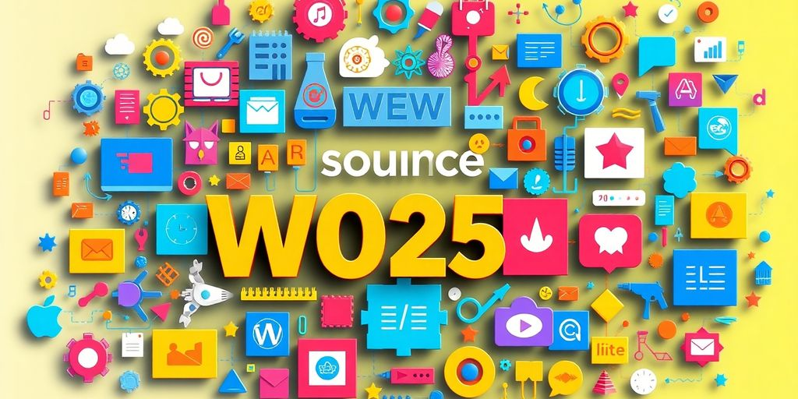
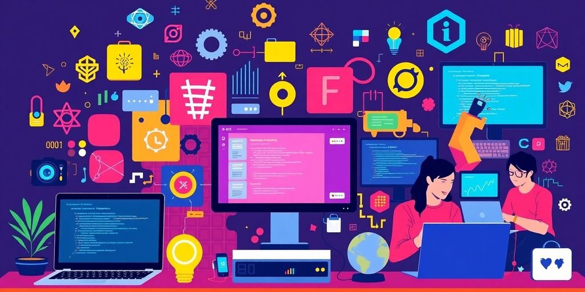
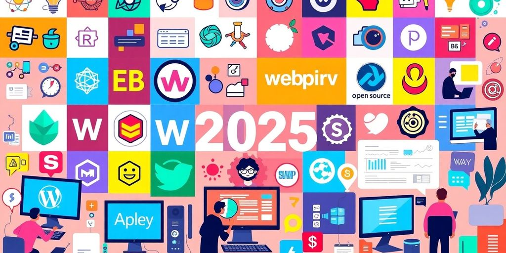

As we step into 2025, the world of open source web development is buzzing with new ideas and tools. This article highlights innovative projects that can help developers of all skill levels enhance their abilities while contributing to the open source community. Whether you're just starting out or looking to take on more challenging tasks, there's something here for everyone. Let's explore the exciting landscape of open source web development and see what awaits us this year!

### Key Takeaways

*   Explore daily tools that simplify open source web development tasks.
*   Stay updated on tech innovations that could change the game in 2025.
*   Learn about common problems developers face and how to solve them.
*   Join hands-on projects tailored for beginners to advanced developers.
*   Discover the rise of no-code solutions and how they can benefit web developers.

## Exploring New Tools For Open Source Web Development

### Daily Tools That Make Life Easier

Every day, developers juggle a bunch of tools that make coding less of a headache. **Git** is like your trusty sidekick for version control. If you're not using it yet, you probably should. Then there's _Visual Studio Code_, the Swiss Army knife of code editors. It's got plugins for everything, including your favorite coffee recipe. And don't forget about Docker. It's your go-to for containerizing apps, making sure they run smoothly on any machine.

### Tech Innovations to Watch

As we approach 2025, [software development is evolving](https://jetthoughts.com/blog/innovative-software-development-tools-techniques-for-2025/) with innovative tools and techniques. AI is stepping up, not just for coding but also for managing projects. Imagine having a robot assistant that does your job better than you do. Scary, but cool! Low-code platforms are also on the rise, letting even non-techies build apps. And let's not forget about blockchain, which is moving beyond crypto to secure all sorts of digital transactions.

### Common Problems and Their Solutions

Web development isn't all fun and games. Bugs, compatibility issues, and deployment headaches can make you want to pull your hair out. But fear not! Debugging tools like Chrome DevTools can sniff out those pesky bugs. For compatibility, polyfills and transpilers like Babel are your best friends. And when it comes to deployment, CI/CD pipelines can save the day, automating the whole process so you can kick back and relax.

> "In the ever-changing world of web development, staying updated with the latest tools is not just beneficial—it's a must. Embrace the chaos and let technology do the heavy lifting."

## Hands-On Projects To Boost Your Skills

### Beginner-Friendly Ideas

Starting out in web development? Dive into projects that help build your foundation. **HTML and CSS** are your best friends here. Crafting a simple [event webpage](https://dev.to/arindam_1729/top-5-open-source-projects-you-must-explore-before-2025-3l6l) or a parallax scrolling site can be both fun and educational. These projects teach you to structure content and add styles, like a pro chef learning basic knife skills before tackling a soufflé.

*   Create a basic portfolio website
*   Develop a simple blog using HTML and CSS
*   Build a static landing page for a fictional product

### Intermediate Challenges

Ready to step up your game? Try integrating JavaScript into your projects. You could build an interactive to-do list or a weather app using APIs. These projects challenge you to think about user interaction and data handling.

*   Develop a to-do list with CRUD operations
*   Create a weather app using open weather APIs
*   Build a small e-commerce site with a cart feature

### Advanced Projects for Pros

For the seasoned developer, it's time to flex those coding muscles. Consider projects that require backend integration and complex data management. Think about creating a full-stack application or a real-time chat app. These projects are like the Ironman triathlon of web development.

*   Develop a full-stack application using Node.js and React
*   Create a real-time chat application with WebSocket
*   Build a content management system from scratch

> When you work on these projects, remember: Practice makes perfect. Every line of code you write brings you one step closer to mastering web development. Keep pushing your limits and exploring new tools and technologies.

## The Rise of No-Code Solutions

### What Is No-Code Development?

No-code development is like magic for those who dread coding. Imagine building an app without typing a single line of code. That's what no-code offers. It's a way to create software using visual tools and pre-built modules. You drag, drop, and watch your idea come to life. It's perfect for people who want to focus on creativity rather than technical details.

> No-code platforms are changing the game. They let anyone with a bright idea create something amazing without needing to learn complex programming languages.

### Popular No-Code Platforms

2025 is the year of no-code platforms. They're everywhere and for good reason. Here are some you might want to check out:

1.  **Bubble**: Great for building web apps with a lot of customization.
2.  **Webflow**: Perfect for designers who want to create responsive websites without coding.
3.  **Airtable**: A powerful tool for creating databases and managing projects.

These platforms make it easy to turn your ideas into reality. They offer templates, drag-and-drop features, and lots of support.

### Benefits of Going No-Code

Why should you care about no-code? Well, it can save you time and money. You don't need to hire a developer or spend months learning to code. Plus, you can update your projects anytime you want. Here are some perks:

*   **Speed**: Launch your project faster.
*   **Cost-Effective**: No need to pay for expensive development.
*   **Flexibility**: Make changes on the fly.

In a world where technology is always changing, no-code platforms are a breath of fresh air. They let you focus on what matters: your ideas. By [2025](https://blog.lewagon.com/skills/rise-of-no-code-low-code-platforms-how-developers-can-adapt-in-2025/), no-code and low-code platforms will make technology more accessible than ever. So, if you're ready to build something new, no-code might be your best friend.

## AI's Impact on Web Development

### How AI Is Changing the Game

So, AI in web development? Yeah, it's a big deal. It's not just about automating tasks anymore. AI is now the creative sidekick every developer dreams of. Imagine having a tool that predicts what users want before they even know it themselves. That's AI for you. It's like having a crystal ball, but way cooler.

*   Predictive User Journeys: AI can map out what users might do next on your site. It's like having a GPS for user behavior.
*   Generative Content: AI helps in creating content that feels personalized and fresh every time.
*   Adaptive Chatbots: These aren't your regular chatbots. They're like having a conversation with someone who knows you really well.

### Tools That Leverage AI

AI tools are everywhere, and they're making life a lot easier. From coding to personalization, AI's got you covered.

*   _GitHub Copilot_: Automates those mundane coding tasks, so you can focus on the fun stuff.
*   WordLift: Analyzes user behavior to serve up content that's just right for them.
*   Smart Search AI: Uses natural language processing to make searches feel like a conversation.

### Future Predictions for AI in Development

The future's looking bright with AI. By 2025, expect even more mind-blowing stuff.

*   AI will become the norm in web development. It's not just an add-on; it's the main event.
*   Expect more integration with edge computing to make websites faster and more responsive.
*   [The future of AI in web development](https://www.designrush.com/agency/web-development-companies/trends/ai-and-web-development) is set to transform websites and enhance user experiences by 2025.

> AI is not just changing the game; it's rewriting the rules. Get ready for a web that's smarter, faster, and more intuitive than ever.

## Trends Shaping the Future of Web Development

### Emerging Technologies to Watch

Alright, let's talk tech. By 2025, web development is going to look a lot different. **Frontend technology is evolving rapidly**, with micro frontends leading the charge for scalable architectures. You might want to keep an eye on AI's role in development, which is only getting bigger. Plus, frameworks like Svelte 5.0 and Next.js are becoming the cool kids on the block. And don't sleep on Tailwind CSS and CSS Modules—they're making styling a breeze. With serverless technologies, deployment is less of a headache, too. These innovations aim to make web experiences faster and more interactive.

### User Experience Innovations

User experience is all about making things smooth and intuitive. In the next few years, expect big shifts. Think personalized web experiences powered by AI, making sites feel like they know you. Voice search and navigation will become standard, so get ready to talk to your devices more. And let's not forget about augmented reality—it's not just for games anymore. Imagine trying on clothes virtually before buying them online. It's all about making the web feel more like the real world.

### Security Trends to Consider

Security is always a big deal, and it's only getting more important. As more data gets online, keeping it safe is crucial. Expect to see more AI-driven security measures that can predict and prevent threats before they happen. Encryption will get stronger, making it harder for the bad guys to get in. And with the rise of blockchain, decentralized security models will become more common. It's like having a digital lockbox for your data. Stay ahead of the game by keeping up with these trends.

## Community-Driven Projects to Join

### Finding the Right Project

So, you're itching to jump into open source, but where to start? **Finding the right project can be a game-changer.** It's like picking the right movie for movie night—get it wrong, and it's a snooze fest. Look for projects that align with your interests and skills. Consider your level of expertise. Are you a newbie or a seasoned coder? There's something for everyone.

*   **Beginner Projects**: These are great if you're just starting out. They usually have good documentation and a friendly community.
*   **Intermediate Projects**: Perfect for those who know their way around code but want to learn more.
*   **Advanced Projects**: Dive into these if you're looking to challenge yourself. They often involve complex architectures and cutting-edge tech.

### How to Contribute Effectively

Contributing to open source is not just about writing code. It's about being part of a community. Start by reading the project's contributing guidelines. They’re like the rules of a board game—ignore them, and you’ll be lost. Check out the issue tracker, and see where you can help. It’s like a to-do list for the project.

*   **Communication**: Always communicate with the project maintainers. They'll appreciate it.
*   **Documentation**: Don't underestimate the power of good documentation. It's as important as the code.
*   **Feedback**: Be open to feedback. It's how you grow, after all.

### Benefits of Open Source Collaboration

Why bother with open source? Well, it's a bit like joining a band. You get to jam with others, learn new things, and maybe even become a rock star. Open source lets you work on real projects that people use. Plus, you can [enhance your web development skills](https://www.geeksforgeeks.org/web-development-projects/) through hands-on experience.

> "In open source, we feel like we're part of something bigger. It's not just about the code; it's about the community."

*   **Networking**: Meet like-minded folks who are as passionate about tech as you are.
*   **Learning**: Gain new skills and improve existing ones.
*   **Recognition**: Your contributions can lead to job offers or collaborations. Who knows, you might even get famous!

Jumping into open source is like diving into a pool of knowledge and camaraderie. So, grab your laptop, find a project, and start contributing. You'll be glad you did.

## Learning Resources for Aspiring Developers

### Top Online Courses

So, you're diving into web development, huh? Great choice! **Online courses** are a fantastic way to get started. They're flexible and you can learn at your own pace. Here are some you might want to check out:

*   Codecademy: Offers interactive courses in HTML, CSS, and JavaScript. Perfect for hands-on learners.
*   Coursera: Features courses by top universities. You can even earn certificates.
*   Udemy: A treasure trove of courses on everything from front-end basics to advanced backend stuff.

### Books and Tutorials

If you're more of a bookworm or love a good tutorial, there's plenty out there. Books can give you a deep understanding, while tutorials are great for quick learning. Here are some picks:

*   _Eloquent JavaScript_: A must-read for anyone serious about JavaScript.
*   "HTML & CSS: Design and Build Websites" by Jon Duckett: It's like a comic book for web design!
*   FreeCodeCamp: Tons of tutorials and a supportive community.

### Communities to Join

Feeling a bit lonely on your coding journey? Join a community! They're great for support, feedback, and just having a chat with folks who "get it."

*   [Rails open source projects](https://jetthoughts.com/blog/exploring-best-rails-open-source-projects-for-developers-in-2025/): Dive into projects like GitLab and Discourse. Great for learning and networking.
*   Stack Overflow: The go-to place for getting your questions answered.
*   GitHub: Not just for code. Follow projects, contribute, and learn from others.

> Web development isn't just about code; it's a journey of creativity and problem-solving. Every bug you fix is a step forward. Keep pushing, and you'll get there!

If you're looking to become a great developer, there are many resources available to help you learn. From online courses to coding bootcamps, you can find tools that fit your style. Don't forget to [check out our website for more tips and resources](https://jetthoughts.com) that can guide you on your journey to becoming a skilled developer!

## Wrapping It Up

So there you have it! As we look ahead to 2025, the world of open source web development is buzzing with exciting projects just waiting for you to jump in. Whether you're just starting out or you're a seasoned pro, there's something here for everyone. These projects not only help you sharpen your skills but also connect you with a community of like-minded developers. So, grab your laptop, pick a project that sparks your interest, and get coding! Who knows? You might just create something amazing that others will use and love.

## Frequently Asked Questions

### What are some new tools for web development in 2025?

In 2025, developers can use various new tools that make their work easier. These tools help solve common problems and improve daily tasks.

### How can I improve my web development skills?

You can boost your web development skills by working on hands-on projects. Try beginner, intermediate, or advanced projects to practice what you learn.

### What is no-code development?

No-code development means creating websites or apps without writing code. It allows people who are not programmers to build software easily.

### What are the benefits of using no-code platforms?

No-code platforms save time and make it easier for anyone to create applications. They are great for quick projects and allow more people to participate in development.

### How is AI changing web development?

AI is changing web development by helping automate tasks and improve user experiences. It can analyze data and suggest improvements for websites.

### Where can I find resources to learn web development?

You can find many resources online, like courses, tutorials, and communities. Websites like Codecademy, FreeCodeCamp, and various forums are great places to start.