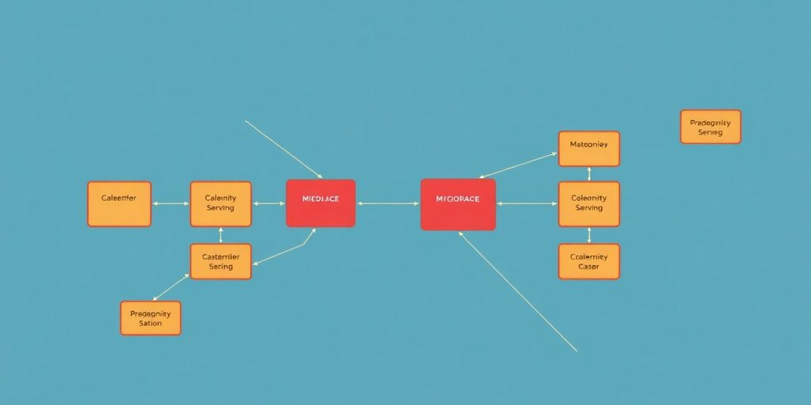

In today's fast-paced tech world, developers are always on the lookout for ways to improve their applications. Ruby on Rails microservices have become a popular choice for building scalable and flexible systems. This approach allows developers to break down their applications into smaller, manageable pieces, making it easier to develop, deploy, and maintain. Let's explore how you can harness the power of Ruby on Rails microservices for your projects.

### Key Takeaways

*   Ruby on Rails microservices simplify code management by breaking applications into smaller, independent services.
*   They enhance scalability, allowing specific parts of an application to grow without impacting the whole system.
*   Flexibility in technology choices lets teams pick the best tools for each service, optimizing performance.
*   Microservices improve fault tolerance, isolating issues to single services and preventing widespread failures.
*   Adopting an API-first approach is crucial for smooth communication between services in a Ruby on Rails microservices setup.

## Simplifying Codebase With Ruby On Rails Microservices

Microservices can really clean up your Rails codebase. Instead of one giant app, you get a bunch of smaller, focused services. It's like organizing your messy room into neat little boxes. Let's see how this works.

### Understanding Microservices Architecture

Think of microservices as a collection of small apps that work together. Each one does a specific job, like handling user accounts or processing payments. They talk to each other using APIs. This is different from a _monolithic_ app, where everything is crammed into one big codebase. **Microservices make things easier to manage and scale.**

### Benefits of Microservices in Rails

Why bother with microservices in Rails? Well, a few reasons:

*   Smaller codebases are easier to understand. No more spaghetti code!
*   Independent deployment means you can update one service without taking down the whole app.
*   Teams can work on different services at the same time, speeding up development.

> Microservices let you break down complex problems into smaller, manageable pieces. This makes development faster and less stressful.

### Common Challenges and Solutions

It's not all sunshine and roses. Microservices come with their own set of problems. One big one is communication. How do these services talk to each other? You'll need to figure out [service communication strategies](https://jetthoughts.com/blog/how-avoid-callbacks-using-services-rails-refactoring/). Another challenge is data management. Do you use a shared database, or does each service have its own? These are questions you'll need to answer. But don't worry, there are solutions for all of these problems. For example, you can use REST APIs or message queues for communication. And you can use distributed databases or event sourcing for data management.

## Scalability and Flexibility in Ruby On Rails Microservices

Microservices can really change how you build and run your Rails apps. Instead of one big app, you get a bunch of smaller ones that work together. This setup brings some serious advantages, especially when it comes to scaling and being flexible. Let's get into it.

### How Microservices Enhance Scalability

Think of your app as a team. If one person is doing all the work, things slow down. Microservices let you spread the load. **You can scale specific parts of your application independently.** If your user authentication service is getting hammered, you scale that without touching the rest of the app. It's like giving the busy team member some extra hands, without bothering the others.

*   Scale only what you need.
*   Avoid bottlenecks.
*   Improve resource use.

### Flexibility in Technology Choices

One of the coolest things about microservices is that you're not stuck with one tech stack. Need a super-fast database for one service? Go for it. Want to try a new language for another? No problem. _Each service can use the best tool for the job._ It's like having a toolbox full of specialized gadgets instead of just a hammer.

> Microservices let you pick the right tool for each job. This means you can use different languages, frameworks, and databases for different services. It's all about choosing what works best for each part of your application.

### Managing Resource Utilization

With a monolithic app, you often end up wasting resources. Some parts of the app might be idle while others are overloaded. Microservices let you allocate resources more efficiently. You can give more power to the services that need it and scale down the ones that don't. It's like only watering the plants that are thirsty, instead of flooding the whole garden. This efficient [resource allocation](https://jetthoughts.com/blog/best-practices-for-optimizing-ruby-on-rails-performance/) saves money and improves performance.

Here's a simple example of how resource allocation might look:

| Service | CPU Usage | Memory Usage |
| --- | --- | --- |
| User Authentication | 80% | 70% |
| Product Catalog | 30% | 40% |
| Order Processing | 60% | 50% |

## Optimizing Performance Through Microservices

Microservices can seriously boost your app's performance. It's like giving your app a turbocharger. Let's see how.

### The Power of Independent Services

Microservices let you focus on specific parts of your application. Instead of one big, clunky app, you have smaller, manageable services. **Each service handles a specific job**, making it easier to optimize. Think of it as a pit crew fine-tuning each part of a race car.

### Load Balancing Techniques

_Load balancing_ is key to handling traffic. It spreads requests across multiple instances of a service. This prevents any single service from getting overloaded. Some common techniques include:

*   Round Robin: Distributes requests evenly.
*   Weighted Round Robin: Gives more weight to servers with more capacity.
*   Least Connections: Sends requests to the server with the fewest active connections.

These techniques ensure optimal performance, even during peak times. [Rails API](https://jetthoughts.com/blog/maximizing-efficiency-proven-strategies-for-ruby-on-rails-performance/) can help with this.

### Improving Response Times

Microservices can cut down response times. Since each service is smaller, it starts faster. Plus, you can optimize each service independently. This means faster load times and a better user experience. It's like having a team of sprinters instead of one marathon runner.

> By breaking down your application into smaller services, you can identify and fix bottlenecks more easily. This leads to faster response times and a smoother user experience.

## Integrating Microservices Into Your Rails Workflow

So, you're thinking about bringing microservices into your Rails world? Awesome! It might seem like a big leap from a monolithic app, but trust me, it's manageable. Let's break down how to make this transition smooth.

### API-First Development

Think of APIs as the language your microservices use to talk to each other. Adopting an _API-first_ approach means you design your APIs before you even start coding the services themselves. This helps ensure that your services can communicate effectively from the get-go. Rails makes this pretty straightforward with tools like Rails API. It's like planning a road trip before hitting the road—you know where you're going and how to get there.

### Service Communication Strategies

How do your services chat? There are a few options:

*   **RESTful APIs:** Simple and widely used. Services make HTTP requests to each other.
*   **Message Queues:** Services send messages to a queue, and other services pick them up. Think of it like sending letters—the sender doesn't need to know who will read it.
*   **gRPC:** A high-performance option using protocol buffers. It's like having a super-fast, efficient translator for your services.

Choosing the right strategy depends on your needs. REST is easy to start with, but message queues can be better for asynchronous tasks. gRPC is great for speed, but it adds complexity. It's like choosing between a bike, a car, or a rocket ship—depends on where you're going!

### Data Management Approaches

This is where things can get tricky. Each microservice should ideally have its own database. This keeps them independent, but it also means you need to think about how to handle data consistency across services.

Here are some common approaches:

*   **Database per Service:** Each service owns its data.
*   **Shared Database (with caution):** Multiple services use the same database, but this can create dependencies.
*   **Eventual Consistency:** Services update their data independently, and data eventually becomes consistent across all services. This is common with message queues.

> Data management in a microservices architecture requires careful planning. You need to balance independence with the need for data consistency. Think about how your services will handle transactions and data updates to avoid conflicts and ensure data integrity.

Remember, the goal is to keep your services independent and scalable. Choose the approach that best fits your application's needs. For example, companies like [Airbnb use Rails](https://jetthoughts.com/blog/innovative-companies-using-rails-how-they-leverage-ruby-on-for-success-in-2024/) for API integration, so you can too!

## Building Resilient Systems With Ruby On Rails Microservices

Microservices can really change how you build apps. Instead of one big app, you get lots of smaller ones. This makes things more stable. Let's see how.

### Fault Isolation Benefits

Imagine one part of your app crashes. With a single app, the whole thing might go down. But with microservices, only that one part fails. The rest keep running. This is _fault isolation_ at its finest. It's like having separate circuits in your house. If one blows, the whole house doesn't lose power.

### Independent Deployment Advantages

Updating a big app can be a pain. You have to take the whole thing offline. With microservices, you can update each service separately. **This means less downtime and faster releases.** It's like upgrading one room in your house without shutting off the water to the whole place. Plus, if an update goes wrong, it only affects that one service. You can roll it back without messing up everything else. Think of the [benefits of microservices](https://jetthoughts.com/blog/innovative-companies-using-ruby-how-they/) as a safety net for your application.

### Enhancing Team Productivity

Small teams can own individual microservices. This makes development faster. Each team can choose its own tools and work independently. No more waiting for other teams to finish their part. It's like having multiple small businesses instead of one giant corporation. Everyone knows their role and can move quickly. This setup also makes it easier to find and fix problems. Each team is responsible for its own service, so they know it inside and out.

> Microservices let teams focus on specific parts of the app. This speeds up development and makes it easier to manage. It also lets teams use the best tools for each job.

## Real-World Applications of Ruby On Rails Microservices

### Case Studies of Successful Implementations

Ever wonder if all this microservices talk is just hype? Nah. Plenty of companies use Ruby on Rails microservices in the real world. Think about it: any app that needs to handle tons of traffic or scale quickly is a good candidate. One example is a popular e-commerce platform that broke down its monolithic Rails app into smaller, manageable services. This let them scale their product catalog service independently during peak shopping seasons. Another company uses microservices for its payment processing, making transactions faster and more secure. It's not just theory; it's happening now. You can use [Rails API](https://outropy.ai/blog/2025-01-24-building_apps_with_ruby_on_rails/) to build lightweight APIs.

### Lessons Learned from Industry Leaders

So, what have the folks who've already walked this path learned? A big one is: start small. Don't try to rewrite your entire app overnight. Pick one area that's causing pain and break it out into a microservice. Another lesson? Monitoring is _key_. When you have lots of services, you need to know what's going on. Use tools to track performance and catch errors early. Also, communication is super important. Teams need to talk to each other to make sure services work well together. Here are some key takeaways:

*   Start with a clear understanding of your domain.
*   Automate everything you can, especially deployments.
*   Invest in good monitoring and logging tools.

> Microservices are not a silver bullet. They add complexity. Make sure you really need them before you jump in. Otherwise, you might end up with more problems than you started with.

### Future Trends in Microservices Architecture

What's next for microservices? One trend is serverless computing. Instead of managing servers, you deploy your services to a platform that handles all the infrastructure. This can make things simpler and more cost-effective. Another trend is the rise of service meshes. These tools help you manage communication between services, providing features like traffic management and security. Also, expect to see more focus on _observability_. It's not enough to just monitor your services; you need to understand how they're behaving and why. The future looks bright, but it's also complex. You can achieve [independent deployment](https://outropy.ai/blog/2025-01-24-building_apps_with_ruby_on_rails/) with microservices.

## Getting Started With Ruby On Rails Microservices

So, you're thinking about diving into the world of Ruby on Rails microservices? Awesome! It might seem daunting at first, but trust me, it's manageable. Let's break down how to get started.

### Identifying Your Services

First things first: figure out what your services _actually_ are. Don't just guess! Think about the different parts of your application. What are the key functions? User accounts? Payments? Product catalogs? Each of these could be a separate service. The goal is to break down your big app into smaller, more manageable [modular components](https://jetthoughts.com/blog/how-setup-project-that-can-host-up-1000-users-for-free-heroku-startup/).

### Defining Service Boundaries

Okay, you've identified your services. Now, draw some lines! Define clear boundaries between them. What does each service _do_, and what does it _not_ do? This is super important. You want each service to be independent. This means they can be updated and deployed without messing with other services. Think of it like setting up fences in your backyard—you want to know where your property ends and your neighbor's begins.

### Implementing Communication Mechanisms

So, your services are all nicely separated. Great! But they still need to talk to each other. How do they do that? Well, you have a few options:

*   **RESTful APIs:** A classic choice. Simple and easy to understand.
*   **Message Queues:** Good for asynchronous communication. One service sends a message, and another service picks it up later.
*   **gRPC:** A high-performance option. Uses protocol buffers for efficient communication.

Choose the method that best fits your needs. Consider factors like speed, reliability, and complexity. Remember, good communication is key to a happy microservices ecosystem. Think of it as setting up a [project using Ruby on Rails](https://jetthoughts.com/blog/how-setup-project-that-can-host-up-1000-users-for-free-heroku-startup/) where each service is a team member, and they need to communicate effectively to get the job done.

> Starting with microservices can feel like assembling a puzzle, but with each piece you place, the bigger picture becomes clearer. Don't be afraid to experiment and learn as you go. The journey is just as important as the destination.

If you're ready to dive into the world of Ruby on Rails microservices, you're in the right place! This guide will help you understand the basics and get started on your journey. Don't miss out on the chance to enhance your skills and build amazing applications. Visit our website today to learn more and take your first step!

## Wrapping It Up

Alright, so there you have it! Microservices with Ruby on Rails can really change the game for your apps. They let you break things down into smaller, manageable pieces, making it easier to scale and update without the usual headaches. Sure, it takes some planning and thought to get everything set up right, but once you do, the benefits are huge. You’ll get better performance, more flexibility, and a smoother development process. So, if you’re ready to take your Rails projects to the next level, give microservices a shot! And hey, let us know how it goes in the comments!

## Frequently Asked Questions

### What are Ruby on Rails microservices?

Ruby on Rails microservices are small, independent services built using the Ruby on Rails framework. They work together to create a larger application, allowing each service to focus on a specific task.

### How do microservices improve scalability?

Microservices help you scale specific parts of your application separately. This means if one service gets a lot of traffic, you can make more copies of just that service without having to scale the whole application.

### What are the main benefits of using microservices in Rails?

Using microservices in Rails can make your code easier to manage, improve performance, and allow different teams to work on different services at the same time.

### What challenges might I face when using microservices?

Some challenges include managing communication between services, ensuring data consistency, and monitoring multiple services. However, there are strategies to help solve these issues.

### How can I get started with Ruby on Rails microservices?

Start by identifying the different services you need for your application. Define clear boundaries for each service and choose how they will communicate with each other.

### Are there any real-world examples of Ruby on Rails microservices?

Yes, many companies use Ruby on Rails microservices. For example, some popular apps have moved to microservices to improve performance and make it easier to add new features.