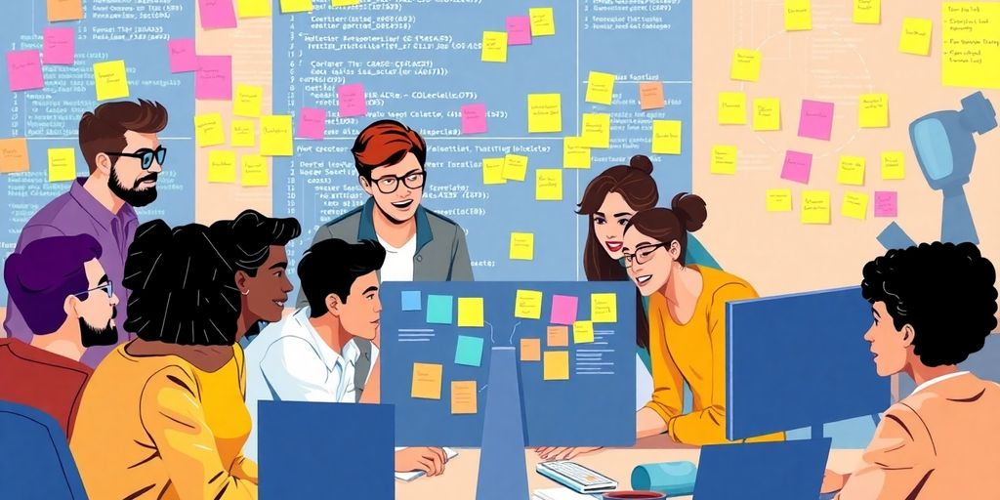
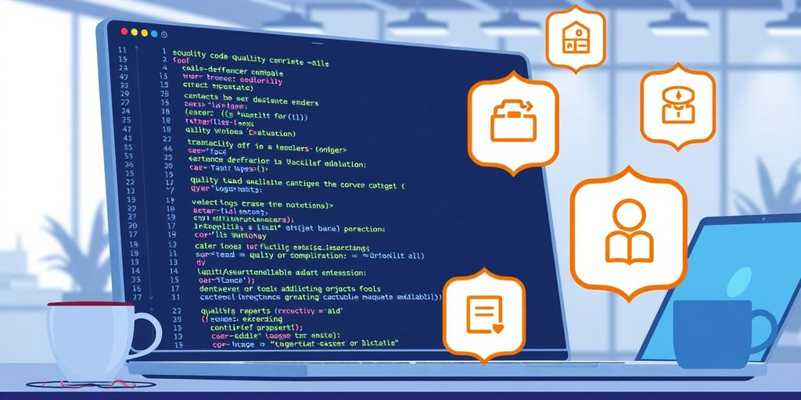

As we move into 2025, the landscape of software engineering continues to evolve at a rapid pace. With new technologies emerging and collaboration becoming more remote, it’s essential for software engineers to adapt and implement effective practices. This article will explore key software engineering best practices that can help you stay relevant and successful in the coming years. From embracing continuous integration to mastering remote teamwork, these strategies will set you on the path to success.

### Key Takeaways

*   Continuous integration and automated testing are vital for quick, reliable software releases.
*   Strong communication tools and practices are essential for effective remote collaboration.
*   Balancing technical skills with soft skills is crucial for team success and personal growth.
*   Staying updated with new technologies and trends helps prevent obsolescence in your career.
*   Focusing on problem-solving and user needs leads to better software outcomes.

## Embracing Continuous Everything

Okay, so 2025 is here, and if you're not doing _continuous everything_, you're late to the party. Seriously. It's all about speed, automation, and getting stuff out there without breaking everything. Think of it as the software world's version of a well-oiled machine. Let's break it down.

### Why Continuous Integration Matters

CI is the backbone. It's where you merge all those code changes into a central repo, like, a bunch of times a day. The goal? Catch problems early. No one wants to spend weeks debugging a massive merge. **It's about making sure everyone's code plays nice together.** If you're not doing CI, you're basically asking for trouble. Think merge conflicts, broken builds, and a whole lot of frustration.

### Streamlining Your Deployment Pipeline

Your deployment pipeline is how your code goes from your computer to the users. Automate it. Seriously, automate all of it. Manual deployments are slow, error-prone, and a waste of time. Use tools to build, test, and deploy your code automatically. This way, you can release more often, with less risk. It's like having a [CD process](https://medium.com/@aditya-sunjava/mastering-ci-cd-with-aws-devops-a-complete-2025-guide-0eda68ab4aad) that runs itself.

### Automating Testing for Faster Releases

Testing is not optional. It's a must. And in 2025, it needs to be automated. Write unit tests, integration tests, and end-to-end tests. Run them automatically as part of your CI/CD pipeline. This catches bugs early, before they make it to production. Nobody wants to be woken up at 3 AM because of a bug that could have been caught with a simple test. Plus, automated testing gives you the confidence to release more often.

> Continuous everything isn't just a buzzword. It's a way of life. It's about building quality software, faster, with less risk. If you're not embracing it, you're going to get left behind. So, get on board. Your future self will thank you.

## Mastering Remote Collaboration

Remote work is here to stay, right? So, let's get good at it. It's not just about having a laptop and Wi-Fi. It's about making sure you and your team can work together, even when you're miles apart. Think of it as leveling up your teamwork skills for the digital age. Let's dive in.

### Tools That Make Communication Easy

Okay, so you need to talk to your team. Shocker! But email chains are _ancient_. There are way better ways to stay connected. Think about it: you need to chat, share files, and maybe even see each other's faces.

Here are some tools to consider:

*   Slack: It's like a virtual office water cooler. Quick chats, channels for different projects, and easy file sharing. What's not to love?
*   Microsoft Teams: It's an all-in-one deal. Chat, video calls, document sharing. If your company is already in the Microsoft ecosystem, this is a no-brainer. Check out [project management software](https://dev.to/jetthoughts/essential-development-best-practices-for-modern-software-projects-in-2025-f2f) for more options.
*   Zoom: Video calls are a must. Seeing your teammates' faces (even if they're in their pajamas) makes a huge difference.

> Pick the tools that work for your team and stick with them. Don't jump from one platform to another every week. Consistency is key.

### Building Trust Across Time Zones

This is a big one. When you're not in the same room, it's easy for misunderstandings to happen. You need to build trust, even from afar. How do you do that? Be reliable. Do what you say you're going to do. Communicate clearly. And be understanding when someone in another time zone doesn't reply instantly.

Here are some ideas:

*   Set clear expectations. What are the deadlines? Who is responsible for what? No surprises.
*   Over-communicate. It's better to share too much information than not enough.
*   Be responsive. Even if you don't have an answer right away, let people know you're working on it.

### Tips for Effective Virtual Meetings

Virtual meetings can be a drag. But they don't have to be! With a few simple tweaks, you can make them way more productive. First, have an agenda. No one wants to sit through a meeting that has no point. Second, keep it short. Attention spans are shorter online. Third, make sure everyone gets a chance to speak. Don't let one person dominate the conversation.

Here's a quick checklist:

1.  Send out an agenda beforehand. Let people know what to expect.
2.  Start and end on time. Respect people's schedules.
3.  Encourage participation. Ask questions, use polls, and make it interactive.

Remote collaboration can be awesome. It just takes a little effort and the right tools. Now go forth and conquer the digital workplace!

## Balancing Soft Skills and Technical Skills

Okay, so you can code. Big deal. Everyone and their grandma seems to be learning Python these days. But can you _actually_ work with other humans without wanting to throw your laptop out the window? That's the real question. In 2025, it's not enough to be a coding wizard. You also need to play nice in the sandbox.

### Why Communication is Key

Ever been stuck in a meeting where no one understands each other? It's painful. Good communication skills are like the oil that keeps the software engineering machine running smoothly. **If you can't explain your ideas clearly, or understand what others are saying, projects will grind to a halt.** Think about it: how can you build something amazing if you can't even agree on what "amazing" means? Effective communication also means active listening. Hear what your teammates are saying. Ask questions. Make sure you're all on the same page.

### The Art of Team Collaboration

Software development is rarely a solo act. It's a team sport. And like any team, you need to know how to work together. That means sharing knowledge, helping each other out, and not being a jerk. Seriously, no one likes a know-it-all who refuses to share their wisdom. Learn to give and receive feedback gracefully. Understand that everyone has different strengths and weaknesses. Embrace the diversity of thought. And for the love of all that is holy, learn to use Git properly. Speaking of teams, [developer experience](https://jetthoughts.com/blog/enhancing-dev-experience-strategies-for-better-developer-journey-in-2025/) is key to a happy and productive team.

### Navigating Conflicts with Grace

Disagreements happen. It's inevitable. But how you handle those disagreements is what matters. Don't let conflicts fester. Address them head-on, but do it respectfully. Listen to the other person's point of view. Try to find common ground. And remember, it's not about winning or losing. It's about finding the best solution for the project. Sometimes, that means swallowing your pride and admitting you were wrong. It's not easy, but it's a sign of maturity. And who knows, you might even learn something new. Plus, you'll avoid those awkward silences in the office kitchen.

> Soft skills aren't just "nice to haves" anymore. They're essential. They're what separate the good software engineers from the great ones. So, brush up on your communication, collaboration, and conflict-resolution skills. Your career will thank you for it.

## Staying Ahead with Emerging Technologies

Tech moves fast. You need to keep up. Let's look at how to stay ahead.

### The Rise of AI in Development

AI is changing everything. It helps with code, tests, and more. **Learn how to use AI tools.** _AI_ can automate tasks. This frees you to focus on bigger problems. Check out leading [software business ideas](https://blog.lewagon.com/skills/emerging-software-engineering-trends-for-2025/) for 2025 to see where AI fits.

### Keeping Up with New Frameworks

New frameworks pop up all the time. It's hard to keep up. But you should try. Pick one or two new frameworks each year. Learn the basics. See how they can help you. Staying current with [software engineering trends](https://blog.lewagon.com/skills/emerging-software-engineering-trends-for-2025/) is necessary.

Here are some ways to keep up:

*   Read blogs.
*   Watch tutorials.
*   Attend conferences.

### Adapting to Changing Trends

Trends change. What's hot today might be old news tomorrow. Be ready to adapt. Learn new skills. Try new things. Don't get stuck in your ways. Remember, the right mix of _software to develop_ today will set the stage for success tomorrow.

> Staying ahead means thinking about tomorrow’s problems today. It’s not just about reacting but preparing for what’s next.

## Focusing on Problem-Solving

Software engineering? It's all about fixing problems. Seriously, that's the gig. Companies don't hire you to write code; they hire you to make their lives easier. So, how do you get good at this whole problem-solving thing? Let's break it down.

### Understanding User Needs

First, you need to know what people actually _want_. Not what they say they want, but what they _really_ need. This means talking to users, watching them work, and figuring out their pain points. It's like being a detective, but instead of solving crimes, you're solving usability issues. You need to understand the [context of your software](https://dev.to/hadil/15-skills-every-software-engineer-should-have-in-2025-47ph) to provide meaningful _solutions_.

### Design Thinking in Software Engineering

Design thinking? It's not just for designers. It's a way of approaching problems that puts the user at the center. It involves:

*   Empathizing with users.
*   Defining the problem.
*   Ideating possible solutions.
*   Prototyping those solutions.
*   Testing them out.

It's a cycle, not a straight line. You keep iterating until you find something that works. **This process helps you avoid building something nobody wants.**

### Iterating Based on Feedback

Feedback is your friend. Seriously. It might sting a little at first, but it's the only way to improve. Get feedback early and often. Show your work to users, stakeholders, and even your grandma. The more eyes on it, the better.

> Don't be afraid to throw things away. If something isn't working, scrap it and start over. It's better to fail fast than to waste time on a dead end. Plus, you learn something every time you try, even if it doesn't work out.

## Prioritizing Code Quality

Let's be real, nobody _loves_ dealing with messy code. It's like trying to untangle a Christmas tree light situation. But, if you want to build software that lasts, you need to make code quality a priority. It's not just about making things work; it's about making them work _well_ and stay that way.

### The Importance of Clean Code

Clean code is readable, understandable, and easy to change. Think of it as writing a book that other developers (including future you) can actually enjoy reading. **It reduces bugs, speeds up development, and makes collaboration way less painful.**

*   Use meaningful names for variables and functions.
*   Keep functions short and focused.
*   Write comments that explain _why_, not _what_.

### Refactoring for Maintainability

Refactoring is like giving your code a makeover. It's about improving the structure and design without changing the functionality. It's an ongoing process, not a one-time event. Make sure you [embrace good software engineering practices](https://jetthoughts.com/blog/elevating-your-code-embracing-good-software-engineering-practices-for-success/) to keep your code in tip-top shape.

> Refactoring is not just about making code look pretty. It's about making it easier to understand, modify, and extend. It's an investment in the future of your project.

### Testing Strategies That Work

Testing is your safety net. It helps you catch bugs early and often. There are different types of tests, and you should use a mix of them to cover all your bases. Think of it as a [practical testing methods](https://jetthoughts.com/blog/elevating-your-code-embracing-good-software-engineering-practices-for-success/) for your code.

*   Unit tests: Test individual components in isolation.
*   Integration tests: Test how different components work together.
*   End-to-end tests: Test the entire application from the user's perspective.

## Setting Achievable Goals for Growth

Okay, so you want to level up. Cool. But where do you even start? It's easy to get lost in the noise. Let's break down how to actually make progress without burning out.

### Defining Your Career Path

First, figure out what you _actually_ want. Don't just chase the latest trend. What excites you? What problems do you want to solve? Do you want to be a team lead, an architect, or a _coding_ ninja? Knowing your direction makes everything else easier. Think about what skills you want to develop. Maybe it's mastering a new language, getting better at system design, or finally understanding [essential goals](https://www.designgurus.io/blog/software-engineering-goals). Your path is yours alone.

### Measuring Success in Software Engineering

How do you know if you're winning? It's not always about promotions. Maybe it's about shipping features faster, writing cleaner code, or mentoring junior devs. Set some metrics. Track your progress. Celebrate small wins. For example:

*   Lines of code refactored per week.
*   Number of bugs fixed.
*   Positive feedback from code reviews.

> Remember, progress is progress, no matter how small. Don't compare yourself to others. Compare yourself to who you were yesterday.

### Staying Motivated Through Challenges

Let's be real: software engineering can be tough. You'll hit walls. You'll get frustrated. **The key is to keep going.** Find your support system. Join a community. Take breaks. Learn from your mistakes. And remember why you started in the first place. If you are facing a challenge, try to:

*   Break the problem into smaller parts.
*   Ask for help.
*   Take a walk.

It's a marathon, not a sprint. You got this!

When you set goals that are realistic, you can see real progress in your growth. Start by breaking down your big dreams into smaller, manageable steps. This way, you can celebrate each little win along the way. If you want to learn more about how to set these kinds of goals and grow effectively, visit our website for helpful tips and resources!

## Wrapping It Up

So, there you have it! As we gear up for 2025, it’s clear that the software engineering scene is changing fast. Staying on top of new tools and practices is key, and let’s be real, it’s not just about writing code anymore. You’ve got to be a team player, communicate well, and adapt to whatever comes your way. Embrace the chaos, keep learning, and don’t forget to automate those boring tasks. If you can balance all this, you’ll not only survive but thrive in this wild tech world. Here’s to your success in the coming year!

## Frequently Asked Questions

### What does continuous integration mean?

Continuous integration is a way to make sure that all the code changes are automatically tested and combined into the main code base. This helps find problems early.

### How can I improve communication with my remote team?

Using tools like video calls, chat apps, and project management software can help you stay connected and share ideas easily.

### Why are soft skills important for software engineers?

Soft skills like communication and teamwork help you work better with others and solve problems more effectively.

### What new technologies should I learn about for 2025?

You should pay attention to artificial intelligence, new programming frameworks, and other tech trends that are becoming popular.

### How can I ensure my code is of high quality?

Writing clean code, regularly refactoring it, and using good testing strategies can help maintain high code quality.

### What are some good ways to set career goals?

Think about where you want to be in the future, break down your goals into smaller steps, and keep track of your progress.
