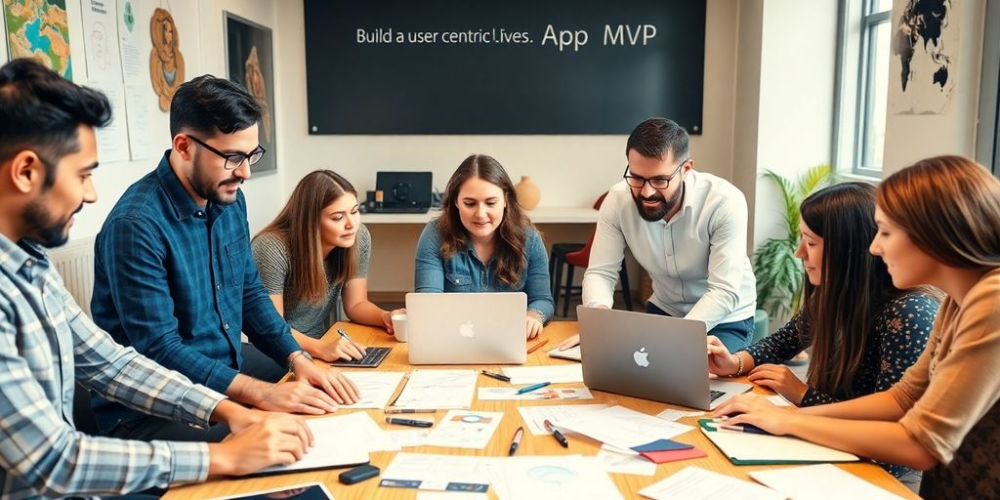

So you're thinking about building an app, huh? It's a big journey, but there's a way to make it smoother and smarter. Enter MVP dev. It's all about starting small and learning fast. You don't need all the bells and whistles right away. Instead, focus on what really matters to your users and get feedback. This approach can save you time, money, and a lot of headaches down the road. Let's dive into how MVP dev can change your app development game.

### Key Takeaways

*   MVP dev helps you focus on essential features first, saving time and resources.
*   Gathering user feedback early can guide your app's development effectively.
*   Rapid prototyping allows you to test ideas without a huge investment.
*   Collaborating with experienced MVP developers can enhance your app's success.
*   Launching an MVP can create early buzz and attract users before full development.

## Embracing The MVP Mindset

### Why MVP Matters

The MVP, or Minimum Viable Product, is your first step in app development. It's all about launching with the basics and getting feedback fast. By focusing on core features, you test your idea without spending a fortune. **This approach saves time and money**, letting you refine your product based on actual user input.

### Shifting Your Perspective

Adopting an MVP mindset means thinking differently about development. Instead of perfecting every detail, you prioritize what's essential. This shift helps you adapt quickly to user needs and market changes. Think of it as building a sturdy foundation before adding the fancy stuff.

### Learning From Feedback

Feedback is your best friend in the MVP process. It guides you on what works and what doesn't. Set up systems to collect user opinions, like surveys or analytics tools. Use this data to make informed decisions and improve your app. _Iterate_ based on real-world use, not just assumptions.

> Embracing the MVP mindset transforms your development journey. It teaches you to value user insights and adapt swiftly, ensuring your app meets real needs and stands out in the market.

Incorporating the MVP approach into your strategy can significantly enhance your app's success. For more insights on developing a Minimum Viable Product for mobile applications, emphasizing simplicity, feedback, and scalability, check out [this article](https://www.netguru.com/blog/mobile-app-development-mvp).

## Navigating The MVP Development Process

### Steps To Get Started

Starting an MVP isn't about jumping in headfirst. It's about setting clear goals and knowing your audience. Here's a quick guide to get you rolling:

1.  Define the problem - Identify the issue your product will solve. Be specific.
2.  Research the market - Look into competitors and see what's already out there.
3.  Prototype your ideas - Create a basic version to test your concept.

These [seven essential steps](https://www.uptech.team/blog/build-an-mvp) can transform your MVP from a mere idea into a lean, mean, market-conquering machine.

### Common Pitfalls To Avoid

Even the best plans can hit snags. Here are some common pitfalls when working with MVPs:

*   Overloading features: Keep it simple. Too many features can confuse users.
*   Ignoring user feedback: Listen to what your users say. Their input is gold.
*   Skipping testing: Always test before you launch.

### Iterating For Success

Iteration is key in MVP development. **Embrace change** and refine your product based on user feedback. This process helps in delivering a product that truly meets market needs.

*   Focus on core functionalities
*   Adjust based on user insights
*   Keep improving till you hit the mark

> Iteration isn't just a step; it's a mindset. Keep tweaking and refining your MVP until it aligns perfectly with what users want. This approach not only enhances the developer experience but also leads to a more successful product launch.

## Building A User-Centric MVP

### Understanding User Needs

To create a user-centric MVP, you gotta start with understanding what users really want. Dive into their world. What problems do they face? What solutions do they crave? Use surveys, interviews, or even casual chats to gather insights. **Knowing your users' needs is like having a map for your app journey.**

### Designing For Engagement

Once you know what users need, it's time to design with them in mind. Focus on simplicity and ease of use. Don't overcomplicate things. Users should feel at home when they use your app. Think about the design elements that keep them engaged. A clean interface, intuitive navigation, and responsive design are key. Remember, in the world of [front end development services](https://jetthoughts.com/blog/creating-minimum-lovable-product-balancing-functionality-user-delight/), user engagement is everything.

### Gathering Valuable Insights

Feedback is your best friend here. After launching your MVP, gather as much feedback as possible. Use in-app surveys or feedback forms. Talk to users through social media or forums. This feedback isn't just data; it's a treasure trove of insights. It helps you refine and improve your MVP. And don't just listen to what users say—observe how they interact with your app. This is where [ruby on rails services](#7a61) can help, by providing robust analytics tools to track user behavior.

> Building a user-centric MVP is all about putting the user first. Understand their needs, design for their engagement, and use their feedback to make your app better. This approach not only helps in creating a product that users love but also paves the way for a successful app journey.

## The Power Of Rapid Prototyping

### Testing Ideas Quickly

Picture this: you have a groundbreaking idea for an app. But before pouring resources into full development, you need to know if it will fly. That's where rapid prototyping comes in. It lets you test your ideas fast with minimal fuss. **Software co** can whip up a basic version using tools like _React and Rails_. This way, you see how your concept works in the real world without breaking the bank.

### Validating Concepts Early

Early validation is a game-changer. With rapid prototyping, you can put your idea in front of real users. They interact with your prototype, and you gather insights. This feedback is gold. It tells you what's working, what’s not, and what needs tweaking. It's like having a sneak peek into the future of your app. Plus, it helps in making sure you're on the right track before going all in.

### Reducing Development Costs

Developing an app can be pricey. But with a prototype, you save money. How? By identifying issues early and avoiding costly mistakes later. Think of it as a trial run. You spot potential problems and fix them before they become expensive headaches. This approach is a smart move, especially for startups or any [software company NYC](https://jetthoughts.com/blog/how-we-configure-simplecov-for-our-ruby-on-rails-projects/) looking to make the most of their budget.

> Rapid prototyping isn't just about speed. It's about smart, efficient development that saves time and money. It's about making sure your app is ready for the big leagues without unnecessary risks.

In essence, rapid prototyping is your secret weapon in app development. It empowers you to test, validate, and refine your ideas swiftly. And with the right [tooling software](#67a4), you can transform your vision into a reality with confidence.

## Collaborating With MVP Experts

### Finding The Right Team

Getting the right _dev team_ on board is key. Look for [top MVP development companies](https://www.spaceotechnologies.com/blog/mvp-development-companies/) known for their reviews and ratings. Check out their past projects. A solid team will have experience in different areas like react development companies or even software development company New York. This mix of skills helps you cover all bases.

### Leveraging External Resources

Sometimes, you need extra hands. The best software development companies offer a range of services. They bring fresh ideas and new perspectives. This can be a game-changer, especially if your in-house team lacks certain skills. Collaborating with these experts can fill those gaps and improve the overall dev experience.

### Building Strong Partnerships

Partnerships are not just about contracts. It's about building trust and understanding. A good partnership with a software company can lead to long-term success. Keep communication open and honest. This helps in aligning your goals with theirs and ensures everyone is on the same page.

> Working with experts can transform your MVP journey. They bring in expertise, resources, and a fresh outlook to your project. This collaboration can turn a simple idea into a successful product.

## Maximizing Your MVP Launch

### Creating Buzz Before Launch

Creating a buzz before your MVP launch is like setting the stage for a grand performance. You want people talking, sharing, and getting excited. Start by tapping into social media. Create engaging posts that highlight the unique aspects of your MVP. This is your chance to show how your product solves real problems. Consider hosting webinars or live Q&A sessions to engage with your audience directly. These interactions can build anticipation and trust. Collaborate with influencers or industry experts to amplify your message. Remember, the goal is to create a community that is eager to try your product.

### Strategies For User Acquisition

User acquisition doesn't have to be daunting. Begin with a clear understanding of your target audience. Who are they, and what do they need? Use this insight to tailor your marketing efforts. Offer exclusive access or special deals to early adopters. This can create a sense of urgency and exclusivity. Leverage _software development services for startups_ to ensure your MVP is top-notch. You want users to have a seamless experience right from the start. Consider using referral programs to encourage users to bring in their friends. A happy user is your best advocate.

### Measuring Success Post-Launch

After the launch, it's time to measure success. But how do you know if your MVP is hitting the mark? Start by setting clear metrics. Look at user engagement, retention rates, and feedback. These will give you a snapshot of how your MVP is performing. Use analytics tools to dive deeper into user behavior. Are users sticking around, or are they dropping off? This data is gold. It tells you where to focus your efforts next. Don't forget to incorporate feedback from your users. Their insights can guide your next steps and help you refine your product.

> Launching an MVP is just the beginning. It's about learning, adapting, and growing. Listen to your users, watch the data, and keep improving. With the right strategies, your MVP can be the first step to something big.

## Iterating Beyond The MVP

### Scaling Your Product

Once your MVP is out there, it's time to think about scaling. **Focus on what users love** and double down on those features. Look at your data to see which features are getting the most attention. Then, invest in those areas to make them even better. Don't forget to optimize your resources. Consider using _rails services_ to streamline your backend as you grow.

### Incorporating User Feedback

User feedback is your best friend. Regularly check in with your users to see what they think. Use surveys, social media, and forums to gather their thoughts. This feedback helps you shape the next version of your product. Be open to making changes based on what you hear. Remember, your users know what they need.

### Planning For Future Features

Think ahead about where you want your product to go. Make a list of potential features and prioritize them. Consider what will bring the most value to your users. Collaborate with your team to brainstorm and refine these ideas. If you're working with a [developer ruby](https://jetthoughts.com/blog/tags/agile/) team, their insights can be invaluable. They can help you decide which features are feasible and which might need more time.

> The MVP is just the beginning. It's a stepping stone to something greater. Keep iterating, keep improving, and keep listening to your users. That's how you'll turn a simple idea into a successful product.

## Wrapping It Up

So, there you have it. MVP development is like your trusty sidekick in the wild world of app creation. It's not just about getting a product out the door; it's about making sure what you're building actually clicks with people. By focusing on the basics first, you can save time, money, and a whole lot of headaches. Plus, you get to learn from real users and tweak things as you go. It's a win-win. Whether you're a startup trying to make a splash or a seasoned pro looking to streamline your process, MVP is the way to go. So, roll up your sleeves, get your team together, and start turning those ideas into reality. Who knows? Your app might just be the next big thing.

## Frequently Asked Questions

### What is an MVP in app development?

An MVP, or Minimum Viable Product, is the simplest version of your app that still solves your users' main problem. It has just enough features to be usable and helps you learn what users like or dislike.

### Why should I start with an MVP?

Starting with an MVP helps you test your idea without spending too much time or money. It lets you gather feedback from real users, so you know what to improve or change.

### How do I gather feedback for my MVP?

You can gather feedback through surveys, user interviews, or by observing how users interact with your app. This feedback will guide your next steps in development.

### What are common mistakes when building an MVP?

Common mistakes include adding too many features, not focusing on the core problem, and ignoring user feedback. It's important to keep it simple and listen to what users say.

### How can I make my MVP user-friendly?

To make your MVP user-friendly, focus on simple design, easy navigation, and clear instructions. Testing with real users can help you find any confusing parts to fix.

### What happens after launching an MVP?

After launching, gather user feedback to see what works and what doesn't. Use this information to improve your app, add new features, and plan for future updates.
