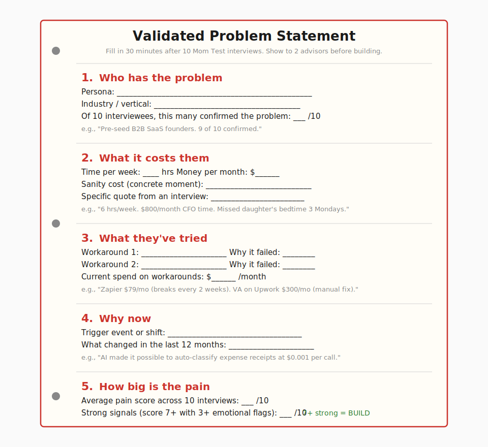
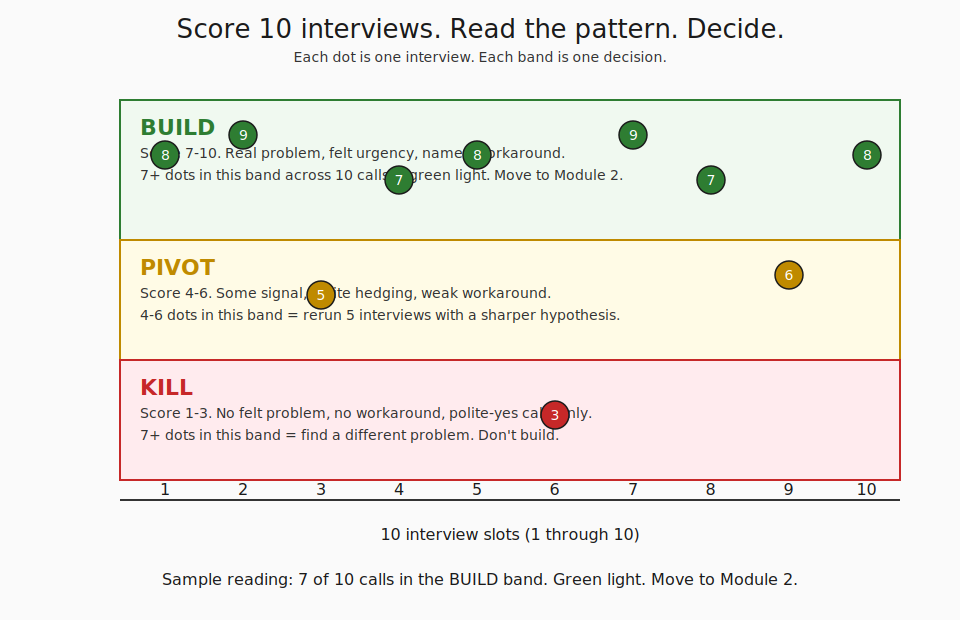
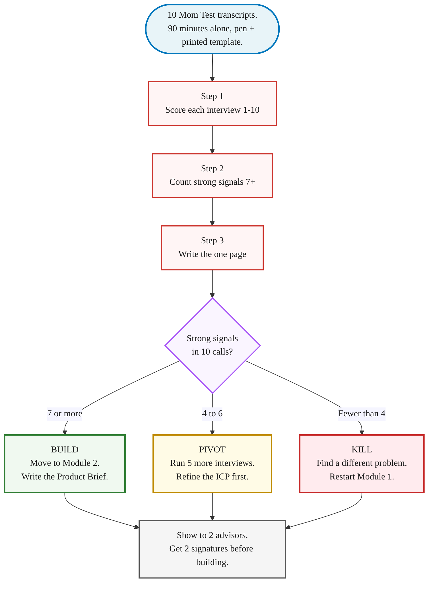

> **Module 1 · Step 3 of 3** · [Tech for Non-Technical Founders 2026](/blog/tech-for-non-technical-founders-2026/) free course.
> Input: 10 Mom Test interview transcripts (from Module 1.2). Output: a one-page validated problem statement signed by 2 advisors/peers + a build/pivot/kill decision.

A founder posted in r/startups last month: *"I did all 10 interviews. Now what?"* Forty-seven commenters told her to start building. Two said hire an engineer. None asked her to write the problem down first. She replied two days later that she'd already opened a Lovable project and was prompting her way to a prototype. The 10 transcripts stayed in a Notion doc she never reread. That moment - 10 interviews in a folder, an open prompt window, no written synthesis - is where most validation rounds die quietly.

## Why this matters in 2026

Interview-to-product is where pre-seed founders get cheaper to kill than to save. You ran 10 honest conversations. The transcripts are sitting in a Notion doc. In 2026 the trap is the same as in 2016 with a faster build tool attached: you open Lovable or Bolt or Cursor on Monday, you're prompting a prototype by Tuesday afternoon, and the synthesis step - the actual validation - never happens. Six weeks later you have a working MVP nobody asked for and a [quality tax for AI MVPs](/blog/quality-tax-ai-mvp-cost/) you didn't budget for. Synthesis isn't a nice-to-have. It's the part of validation that turns 10 transcripts into a decision a peer can argue with.

## The 3-step synthesis

Synthesis runs on three moves. You don't need a framework. You need 90 minutes alone with the 10 transcripts, a printed template, and the willingness to write down a number that might be a 3.

### Step 1 - Score each interview 1-10

Open the transcripts in order. For each call, read your handwritten Q4 score and your emotional-flag count from [the Mom Test interview script](/blog/mom-test-interview-script/). Combine the two into one number from 1 to 10.

A score of 7+ means the interviewee gave you a 7 or higher on Q4 *with a comparison* (the polite-default 7 with no comparison rounds to 5) and at least 3 emotional-language flags across the five answers. A 4 to 6 means partial signal - a real story but a weak workaround, or a high Q4 score with zero frustration language. Below 4 means polite-yes mode: vague Q1 answers, "nothing yet" on Q3, a hedged Q4 number under 7.

Write the number on the first page of each transcript. Don't average yet. Don't reread the answers to argue yourself up. The score you wrote within 5 minutes of hanging up is more honest than the one you'd write today after a week of wanting the number to be higher.

### Step 2 - Count the strong signals

On a single sheet of paper, list the 10 scores in a column. Circle every score that is 7 or higher. That circled count is your strong-signal number.

The pattern matters more than the average. Eight 7+ scores and two 3s is a strong signal - you found a problem two ICPs share. Five 7+ scores and five 5s is muddled - the ICP definition is too broad and the calls split into two groups. Three 9s and seven 4s is the dangerous one: you talked to your three best friends in the industry and they validated the idea while seven strangers told you the truth. Read the pattern before you read the average.

Skip ahead to the [interview score-to-decision matrix](#the-decision-build-pivot-kill) below, which maps the count to the next action. The math is deliberately blunt because synthesis is the part where founders rationalize their way back to building.

### Step 3 - Write the one page

Open the [Validated Problem Statement Template](/blog/validated-problem-statement-template/) on a second screen. Fill it in within 30 minutes. Five sections, no exceptions:

- **Who has the problem.** A named persona, named industry, and the count of interviewees who confirmed it (the strong-signal number from Step 2). "Pre-seed B2B SaaS founders running their own bookkeeping. 8 of 10 confirmed."
- **What it costs them.** Time per week, money per month, and one specific moment-of-pain quote from a real transcript. Avoid "frustrating" and "time-consuming." Use the quote that has a date and a person.
- **What they've tried.** Named workarounds (tools, hired people, manual scripts) and why each failed. The workarounds are your real competitors and your pricing anchor.
- **Why now.** The trigger event or market shift that makes this problem solvable in 2026 when it wasn't in 2023. AI-cost collapse, a regulatory change, a platform shift. If the answer is "no real change, just my idea," the why-now is missing and the post-launch story will start the same way.
- **How big is the pain.** The average score across 10 calls plus the strong-signal count. Print both, not just the average.

A single side of paper. If you spill onto a second page, the persona is too broad or the pain is too vague. Cut until it fits.

## The decision: build / pivot / kill

Your strong-signal count from Step 2 routes you to one of three outcomes. Each outcome has a next action you can name today.

**7+ strong signals: build.** You have a problem that 70%+ of a stranger sample confirmed with felt urgency. The validated problem statement is your input to Module 2. Move on. Write the one-page Product Brief next.

There is one upgrade most founders skip here: the *3 pre-orders = green light* rule. Before you start writing code or hire an engineer, ask 3 of the strongest-signal interviewees for a pre-order, a paid letter of intent, or a deposit toward the prototype. £500 each, $500 each, whatever's appropriate for the price point. Strangers who told you their problem score is a 9 should be willing to put a small commitment behind it. If 3 of your top 5 say yes, you have validation with money attached - the strongest signal there is. If 0 of 5 say yes, the 7+ scores were politer than you thought, and you slide back into the pivot lane.

**4-6 strong signals: pivot.** The signal is partial. Most often this is an ICP problem, not a problem problem. You ran 10 calls across two-and-a-half segments and got two clean signals from one segment plus noise from the others. Pick the cleanest segment, sharpen the ICP definition, run 5 more interviews against that narrower group. Don't build yet. The 5 sharper interviews cost you a week. A built MVP against a fuzzy ICP costs you a quarter.

If the second round of 5 lands the strong-signal count above 7, you're in the build lane with a sharper definition. If it stays in the 4-6 range, the problem is real but the urgency isn't - park the idea, run a smoke-test landing page from [Module 1.1](/blog/find-10-people-with-problem-outreach-2026/) while you go talk to a different ICP.

**Below 4 strong signals: kill.** The problem doesn't have a real problem behind it. Strangers were polite. Your three friends were enthusiastic. The market said no in the only way the market knows how to say no before a launch: by not feeling the pain enough to put a number on it.

This is the hard one to honor. The instinct is to argue the scores up, find the one 9 and build for that one person, or rerun the same 10 calls with a different framing. The kill outcome saves you the [refactoring tax cost](/blog/quality-tax-ai-mvp-cost/) of building for an unfelt problem. Write down what you learned about the wrong ICP, the wrong framing, or the wrong trigger event. Start Module 1 again with a different hypothesis. The five days you spent on the failed validation cost you a five-digit dollar amount less than the alternative.

## What good looks like vs what bad looks like

Your same 10 transcripts can produce a bad problem statement or a good one. The wording does the work.

**Bad problem statement (vague, polite, unfilled):**
> Founders need a better way to validate their startup ideas. Many of them waste time and money. Our solution will help them be more efficient.

**Good problem statement (specific, named, signed):**
> Pre-seed B2B SaaS founders running their own discovery do customer interviews, but 9 of 10 (per our 10-call sample, Apr-May 2026) use hypothetical-future questions and get polite-yes answers. The average interviewee currently spends 6-12 hours running interviews and learns the problem wasn't real only after their first launch flops - typical sunk cost is 6 weeks of build time plus £15-30K of contractor spend. Workarounds tried: YC Library essays (too high-level), $1,500 SurveyMonkey panel (taught one founder I spoke with nothing in the survey style), free templates downloaded but not used. Why now: AI-built MVPs accelerated this failure mode - the prototype lands in 4 days instead of 12 weeks, so the validation gap surfaces faster. Pain average 7.6/10 across 10 calls, 8 strong signals.

The good answer has named industry, dated sample, named workarounds with named failure modes, a quantified cost, a why-now, and a strong-signal count. A peer can argue with it. The bad answer has nothing to argue with - which is why advisors nod politely when they read it and never get to "I disagree with the pricing because of how you described their workaround."

**Bad cost statement:**
> The problem costs founders a lot of time and money.

**Good cost statement:**
> Six weeks of full-time founder work plus £15K to £30K of contractor spend per failed validation round. One founder I spoke with paid $1,500 for a SurveyMonkey panel that returned 47 responses, none of which mentioned the problem her product was solving. Another spent six weeks reading r/SaaS for free and learned more in the first three threads.

A good cost statement is pulled from a real transcript. The bad one is a placeholder you should have deleted. If your statement has the word "many" or "a lot," cross it out.

**Bad why-now:**
> The market is changing fast.

**Good why-now:**
> AI inference costs dropped 70% from 2024 to 2026, which makes per-document AI processing economical at a $9/month price point for the first time. Stripe's automated tax product launching in Q1 2026 shows the SMB-finance segment is being deconstructed feature by feature, but bookkeeping reconciliation is still manual at pre-seed founder budgets.

The good why-now names the specific shift, the specific price point, and the specific market signal. The bad why-now is filler.

## What to do tomorrow

Three actions, in order.

- **Block 90 minutes on your calendar tomorrow morning. Print [the Validated Problem Statement Template](/blog/validated-problem-statement-template/). Bring the 10 transcripts and a pen.** Don't do this on a screen. The friction of handwriting is what stops you from typing the bad version straight out of an LLM. Score, count, write the page. Do not open Lovable or Cursor before the page is signed.
- **Send the filled page to 2 people for signature.** One advisor (a founder one step ahead, a fractional CTO, a board member). One peer (another founder still pre-launch). Ask each: "Would you argue with this problem statement?" If both nod, you're done with Module 1. If either picks a fight, you have your next 5 interviews to run.
- **If you scored in the BUILD band, run the 3 pre-orders test before you build.** Email your top 5 strongest-signal interviewees. Ask each for a £500 deposit, a signed letter of intent, or a paid waitlist slot. Three yeses out of five = build. Zero yeses = the 7+ scores were politer than you thought. The check between the validated problem statement and the first line of code costs you four days and saves you a quarter.

> The synthesis is the validation. The 10 interviews are the raw material. A founder with 10 unwritten transcripts and an open Lovable prompt has not validated anything yet - she has a folder and a hypothesis.

The [Validated Problem Statement Template](/blog/validated-problem-statement-template/) is the artifact for this post. Print it, fill it in 30 minutes, get 2 signatures, and the Module 1 checkpoint is closed.

Founders who skip this step are not the founders who fail at the build. They're the founders who succeed at the build and find no buyers. The [pre-PMF founder sales rule](/blog/sales-pre-pmf-should-be-done-by-founders/) - validation is founder work - applies to synthesis too. You don't outsource this to a contractor, an advisor, or an LLM. You write the page yourself because the act of writing is what tells you whether the 10 transcripts actually pointed somewhere.

## Continue the course

This is **Module 1 · Step 3 of 3** in the free [Tech for Non-Technical Founders 2026](/blog/tech-for-non-technical-founders-2026/) course - 8 modules from idea to first paying users. Module 1 closes here. Next stop: Module 2 (Design the Solution).

| # | Module | Output you walk away with |
|---|---|---|
| 0 | Where Are You? | Self-assessment + your starting module |
| **1** | **Validate the Problem** ← you are here | **One-page validated problem statement** |
| 2 | Design the Solution | One-page Product Brief (Vibe PRD) |
| 3 | Choose Your Build Path | Build decision: self-serve or hire |
| 4A | Ship Self-Serve (branch) | Live MVP at a staging URL |
| 4B | Hire & Ship (branch) | Signed SOW, kickoff scheduled |
| 5 | Manage Your Build | Weekly oversight rhythm |
| 6 | When Things Break | Salvage / rebuild decision |
| 7 | Manage AI-Era Risks | AI interrogation system |

**In Module 1 · Validate the Problem**: 1.1 [Find 10 People With the Problem in 2026](/blog/find-10-people-with-problem-outreach-2026/) · 1.2 [The Mom Test: Ask About the Past, Not the Future](/blog/mom-test-ask-about-past-not-future/) · 1.3 **Validate Your Problem: Write the One Page** ← you are here.

## Further reading

- Rob Fitzpatrick, [The Mom Test (book site)](https://www.momtestbook.com/) - the book that named the technique your 10 transcripts were built on. Pages 88 to 102 cover the synthesis pattern.
- Y Combinator, [How to Talk to Users (Startup Library)](https://www.ycombinator.com/library/6g-how-to-talk-to-users) - YC's distilled discipline for the same conversation, free, 20 minutes.
- Teresa Torres, [Continuous Discovery Habits](https://www.producttalk.org/continuous-discovery-habits/) - what these interviews become after the validation phase, when you run them weekly forever as a built habit.
- Steve Blank, [The Four Steps to the Epiphany - Customer Discovery](https://steveblank.com/category/customer-development/) - the original customer-development methodology and the synthesis-to-pivot rule that predates the lean canvas era.
- Lenny Rachitsky, [Customer interviewing 101](https://www.lennysnewsletter.com/p/the-ultimate-guide-to-conducting) - operational walkthrough including how to write findings up after the calls.
- Ash Maurya, [Running Lean - Problem-Solution Fit](https://blog.leanstack.com/the-problem-solution-fit-canvas/) - one alternative canvas if you prefer a guided template over a freeform one-pager.

---

Built by JetThoughts as part of the free Tech for Non-Technical Founders 2026 curriculum. See the full curriculum at [/blog/tech-for-non-technical-founders-2026/](/blog/tech-for-non-technical-founders-2026/).
