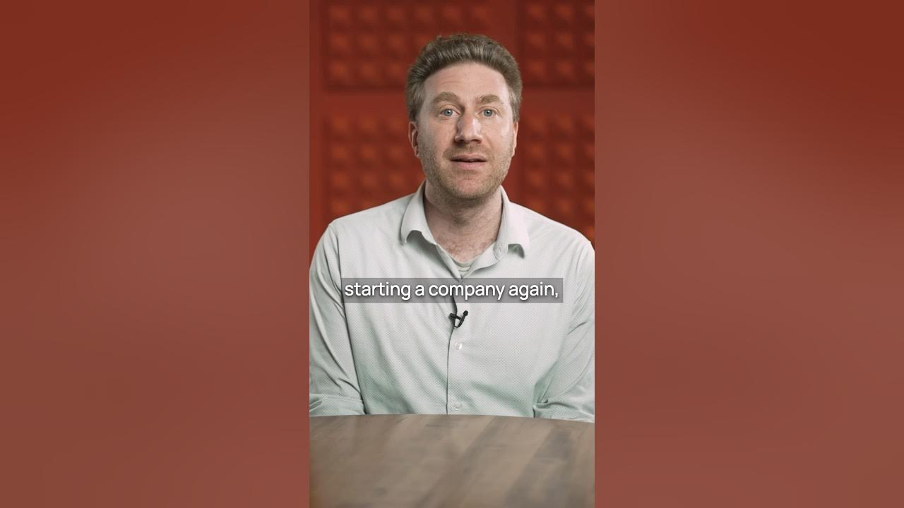

Imagine finding a startup idea that could really take off, one that not many people are talking about yet. It sounds like a dream, right? Well, there's a concept gaining traction: **vertical AI agents**. These are specialized software tools built using large language models (LLMs) that can automate specific tasks. Even Sam Altman, a big name in tech, thinks these are the next big thing.

## What Are Vertical AI Agents?

Vertical AI agents are basically smart software programs. They use powerful AI, like the kind that understands and generates human language, to do very specific jobs. Think of them as highly trained digital assistants for one particular area. Instead of being a general-purpose AI, they focus on one "vertical" or industry.

For example, you wouldn't ask a vertical AI agent for medical advice if it's designed for accounting. Its whole purpose is to be really good at that one thing. This focus makes them super efficient and effective in their chosen field.

## Why Are They a Big Deal?

Sam Altman, who knows a thing or two about successful startups, recently shared his thoughts. He said if he were 24 and starting a company today, he'd build a vertical AI agent. That's a pretty strong endorsement!

The reason these agents are so promising is simple: they can automate a lot of work. Every industry has tasks that are repetitive or require specialized knowledge. An AI agent can step in and handle these, freeing up people to do more complex or creative work. This automation can lead to huge savings and better efficiency for businesses.

## Examples of Vertical AI Agents

It's easy to see how these agents could fit into many different areas. Here are a few ideas:

*   **AI Tax Accountant**: Imagine an AI that handles all your tax filings, finds deductions, and keeps track of your finances.
*   **AI Medical Biller**: This agent could manage all the complex billing for hospitals and clinics, making sure everything is coded correctly.
*   **AI Phone Support Agent**: Not just a chatbot, but an AI that can actually resolve customer issues over the phone, understanding context and providing real solutions.
*   **AI Quality Assurance Tester**: An AI that automatically tests software or products for bugs and issues, much faster than a human could.

There are tons of categories like these. It's not hard to picture a billion-dollar company emerging from each one. The market for specialized automation is huge.

### Key Takeaways

*   **Focus is Power**: Vertical AI agents succeed by specializing in one area.
*   **Automation Potential**: They can automate specific, often complex, tasks within an industry.
*   **Big Opportunity**: Experts like Sam Altman see them as a major area for new businesses.
*   **Diverse Applications**: Almost any industry could benefit from a specialized AI agent.