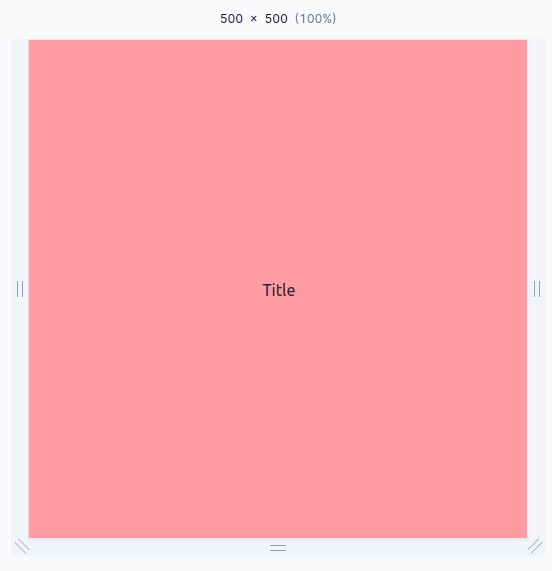

How can vertically align an element with Tailwind CSS by Flex?

## Justify-Center and Items-Center

- `flex` : To use a flex-div as a container.
- `h-screen` : To size the container height to the viewport height.
- `justify-center` : To justify center (horizontal center).
- `items-center` : To align the items to the center (vertical center).

```html
<div class="flex h-screen items-center justify-center">
  <h1>Title</h1>
</div>
```



This is already pretty well documented in the [Tailwind CSS](https://tailwindcss.com/docs/align-items#center) docs.

## Another way to use Flex for to align items

In this case need to set `margin: auto` to wrapper of children element.

```html
<div class="flex h-screen">
  <div class="m-auto">
    <h1>Title</h1>
  </div>
</div>
```
