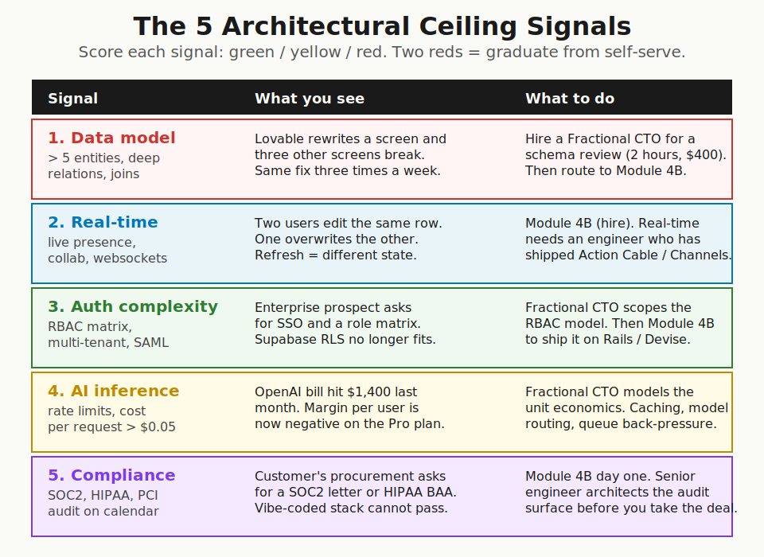
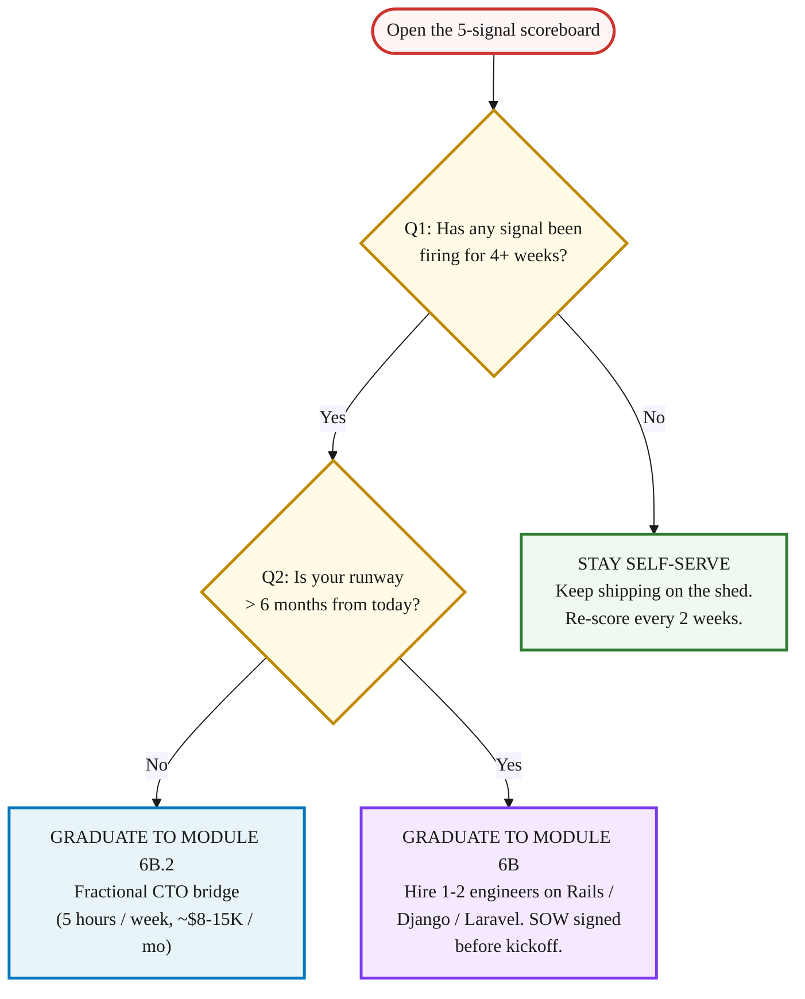

> **Module 6A · Step 2 of 2** · [Tech for Non-Technical Founders 2026](/blog/tech-for-non-technical-founders-2026/) course.
> Input: a live MVP on the self-serve stack (from Module 6A.1). Output: a yes/no decision on whether to graduate to Module 6B (hire) or stay self-serve.

Starting at Week 2 of your build, run this 5-signal check monthly. Each signal that fires earlier saves weeks later. This is a proactive monitoring habit, not a post-mortem - the goal is to catch the ceiling before you slam into it.

Tuesday morning. Your Lovable app is live. 47 paying users. The dashboard takes 11 seconds to load on a coach with 80 clients. The Stripe webhook fired twice on three of yesterday's payments and you spent the morning refunding duplicates. Two of your users keep landing on each other's data because the Supabase row-level security drifted last week when a contractor patched the check-in form. The ceiling is visible - but it was visible two months earlier too, which is when this check should have caught it.

## Why this matters in 2026

The Lovable + Supabase + Stripe shed from [The Self-Serve MVP Stack](/blog/self-serve-mvp-stack-lovable-supabase-stripe-2026/) holds 80% of pre-seed B2B SaaS workloads. The other 20% is what this post is about. Founders who run this check monthly from Week 2 catch the ceiling before it becomes an emergency. Founders who skip it until something breaks - slow dashboard, duplicate webhooks, support tickets climbing - find it costs more to fix late than it would have to address early. The 5 signals below are the early-warning system. Run them before you need them.

## The 5 architectural ceiling signals

Each signal has the same shape: a visible symptom you can see in your dashboard tonight, the thing that is actually happening underneath, the cost of leaving it alone for another month, the cost of addressing it now. Score each one green / yellow / red. Two reds means you graduate. Signals are ordered by when they typically become detectable - run Signal 1 from Week 2, Signal 5 at Week 8+.

### Signal 1: AI inference cost or rate limits eating your margin (detectable: Week 2-4)

**What you see**: your OpenAI bill for last month was $1,400. You have 200 paying users at $29/month. Your gross margin per user just went negative on the Pro plan. Or: the OpenAI rate limit on your tier hits at 11am on weekdays and your "AI summary" feature returns errors for 90 minutes until usage drops.

**What is happening underneath**: a Lovable app that calls an LLM on every screen load (or every form submit) racks up per-request cost no founder modeled. The naive integration sends the full context every call, no caching, no model routing, no queue back-pressure when rate limits hit. Anthropic and OpenAI both publish per-token pricing; founders rarely run the per-user math until the credit-card statement arrives.

**Cost of leaving it alone**: a coach-facing AI features startup we spoke with in Q4 2025 was burning $2,200/month on OpenAI for 180 paying users at $19/month. They were $2,000 underwater before they paid for hosting, before the founder paid herself. Eight months of runway went to AI cost they never modeled early enough to change course.

**Cost of addressing now**: a Fractional CTO models the unit economics in a spreadsheet (~$800 of work). The conversation that follows is about caching, model routing (cheap-model for the first pass, expensive-model only when needed), token budgets per plan tier, and queue back-pressure that fails gracefully when the rate limit hits. If the math says the unit economics are unfixable at the current price, the conversation is about pricing, not engineering. Better to have it at week four of noticing the problem than at month six.

### Signal 2: Data model complexity passing 5 entities with deep relations (detectable: Week 4-6)

**What you see**: you ask Lovable to add a "tags" feature to your client list. Lovable rewrites the client detail screen and now the check-in form, the export-to-CSV, and the weekly email digest are all subtly off. You fix the same join error three times in one week. New features take twice as long as they did in month two.

**What is happening underneath**: Lovable's generated schema treats every prompt as a fresh design. When your data model crosses roughly 5 core entities (`coaches`, `clients`, `check_ins`, `programs`, `tags`, plus their joins), the implicit foreign-key reasoning the LLM holds in its head per-prompt no longer covers the full graph. It writes a query that ignores a join, or it adds a column to one screen but not the migration. The schema decays from edits.

**Cost of leaving it alone**: a fitness-coaching SaaS we picked up in Q1 2026 had 11,000 lines of Lovable-generated code, no foreign keys, every model named in the singular, and three customer accounts with corrupted data because a webhook had retried a Stripe charge update four times. The founder shipped six features in month four and zero in months five and six because every change surfaced something else.

**Cost of addressing now**: a 2-hour [Fractional CTO](/blog/hire-track-supplementary-reference/#the-fractional-cto-bridge) schema review (~$400 at $200/hour). They sketch the proper entity-relationship diagram, identify the joins your current schema is missing, and tell you whether the next 10 features fit on the current schema or need a redesign. If the verdict is "rebuild on a real ORM," route to [Reading the SOW](/blog/hire-track-supplementary-reference/#reading-the-sow).

### Signal 3: Real-time features becoming non-negotiable (detectable: Week 4-8)

**What you see**: two team members open the same client record on the dashboard. One adds a note. The other adds a different note. Whoever clicks save second wins. The first note is gone. Or: a coach's client list shows 8 active clients, the coach refreshes, now it shows 6 because two trainers were viewing in parallel and the cache went stale. Your Slack fills with "the app is acting weird again."

**What is happening underneath**: the Lovable + Supabase REST loop is request-response. Every screen reads on load and writes on submit. Real-time presence (live cursors, typing indicators), collaborative editing, websockets-driven dashboards, and live-updating client feeds are not what auto-generated REST endpoints serve well. Supabase has a Realtime product, but wiring it into a Lovable-generated frontend that was never designed around subscriptions is a rebuild of every screen the feature touches.

**Cost of leaving it alone**: the support ticket volume becomes the product. Customers churn because the app feels unreliable even when no individual bug is consistently reproducible.

**Cost of addressing now**: this is a hire-a-team graduation, not a Fractional CTO bridge. Real-time done right needs an engineer who has shipped Action Cable on Rails or Channels on Django and knows the queue, broadcast, and reconnection edge cases. The [SOW reading guide](/blog/hire-track-supplementary-reference/#reading-the-sow) walks the contract. Estimated rebuild on Rails: 6 to 10 weeks for one senior + one mid engineer.

### Signal 4: Auth complexity passing the email + OAuth ceiling (detectable: Week 6-10)

**What you see**: an enterprise prospect asks: "do you support SAML SSO with our Okta tenant, with role-based access where managers see their direct reports' data but not the whole organization, and an audit log of every read?" You answer yes because the deal is $50K ARR. You then realize Supabase RLS does not model that role hierarchy without writing your own policy DSL on top.

**What is happening underneath**: Supabase's row-level security is excellent for "user X can only read rows where user_id = X." It strains under role matrices (manager-reads-team, admin-reads-org, super-admin-reads-everything), multi-tenant isolation across an organization, SAML federation, and audit trails. Each of those needs first-class engineering, not a configurable policy.

**Cost of leaving it alone**: you write the SOC2 letter and the SAML promise into the contract and ship a workaround. Six months later, the workaround becomes the breach incident. The [vibe-coded auth shape](/blog/vibe-coding-disposable-by-design/) - 47 startups with public URL-based access controls, BOLA-class vulnerabilities, no audit log to diagnose what got read - is what deferred auth complexity produces.

**Cost of addressing now**: a Fractional CTO scopes the role matrix on paper (1-2 weeks of part-time work, ~$8-15K), then hands the spec to a hired engineering team for the production build on Devise + Pundit (Rails) or django-allauth + django-guardian. Total auth-shaped rebuild: 4 to 8 weeks.

### Signal 5: Compliance or security audit landing on the calendar (detectable: Week 8-12+)

**What you see**: a customer's procurement team emails you the SOC2 questionnaire. Or HIPAA: they need a Business Associate Agreement before they can send a single PHI record. Or PCI: you wanted to handle card data directly instead of using Stripe Checkout and now you need to pass a quarterly scan. The self-serve stack cannot pass any of these, not because it is insecure in every way, but because it has no audit log, no documented data handling, no formally reviewed access control.

**What is happening underneath**: compliance is mostly process plus a small amount of code. The process is documented data flow, access logs, encryption at rest and in transit, vulnerability disclosure, vendor reviews. The code is the implementation underneath. A Lovable + Supabase stack passes some checks (Supabase encrypts at rest, Stripe handles PCI-sensitive paths) and misses others (no audit log, no documented data lifecycle, no senior engineer to sign the security policy). The auditor needs a person to ask "show me how you decommission a leaver's access" and a non-technical founder cannot answer that question alone.

**Cost of leaving it alone**: you pass on the deal. Or worse, you sign the deal and ship a workaround, which becomes the breach narrative when the customer's auditor finds it 11 months later.

**Cost of addressing now**: this is a hire-a-team decision from day one, not a bridge. A senior engineer architects the audit surface (audit logs, access controls, vendor inventory, data flow diagrams) before you take the deal. Vanta, Drata, and Secureframe automate the SOC2 paperwork; the engineering work underneath them is real and needs an architect from day one. Budget: 8 to 16 weeks to first-time SOC2 readiness, plus ongoing process work.

## Shed → House → Skyscraper

[Rob Walling's shed analogy](https://podcast.creatorscience.com/rob-walling/) from [Should You Hire?](/blog/should-you-hire-2026-decision-tree/) is the right map. The shed holds one workflow, one persona, one happy path. The house adds a second story (a second workflow, a second persona, a real data model) and needs a structural engineer to plan the load. The skyscraper (compliance-bound, multi-tenant, real-time, AI-heavy) needs a hired engineering team and an architect from day one. The shed never converts to a skyscraper. The skyscraper is a different building.

## The decision: stay self-serve or graduate

The 2-question test runs in 90 seconds. Print it. Tape it inside the laptop case.

Q1 No: stay self-serve. The shed is holding. Re-score every two weeks. The cost of being wrong is two weeks of lost lead time, which is recoverable.

Q1 Yes + Q2 Yes: graduate to the hire-a-team path. You have the runway to scope, hire, and onboard a 1-2 engineer team on Rails, Django, or Laravel. The [SOW reading guide](/blog/hire-track-supplementary-reference/#reading-the-sow) is your starting page.

Q1 Yes + Q2 No: graduate to the [Fractional CTO bridge](/blog/hire-track-supplementary-reference/#the-fractional-cto-bridge). Five hours a week of senior eyes for the next two to three months while you raise or grow into the runway needed for a hire. The [Salvage vs Rebuild decision tree](/blog/salvage-vs-rebuild-decision-tree/) tells you which signal-firing pieces salvage and which the Fractional CTO triages first.

> Two ceiling signals firing for 4+ weeks means the shed is no longer holding. Either hire (6B) if you have runway, or bridge with a Fractional CTO (6B.2) until you do. Both beat watching the codebase get worse.

## What to do tomorrow

Three actions. The first is tonight.

- **Open your Lovable + Supabase admin dashboard tonight.** Pull up: the 30-day request error rate, the 30-day Stripe webhook retry log, the active user count, and last month's OpenAI / Anthropic invoice if you use one. Five minutes of dashboard time is the input to the scoreboard.
- **Score each of the 5 signals: green / yellow / red.** Use the scoreboard above. Green = no symptom yet. Yellow = symptom showing in the last 30 days but recoverable. Red = symptom firing 4+ weeks AND you've patched it more than once. Be honest. Founders who score themselves green when the symptoms are firing are the founders who post in the [salvage-or-rebuild thread](/blog/salvage-vs-rebuild-decision-tree/) at month nine.
- **If 2 or more signals are red, start the [Fractional CTO bridge](/blog/hire-track-supplementary-reference/#the-fractional-cto-bridge) THIS WEEK.** Not next month, not after the next sprint. The Fractional CTO conversation is one Calendly invite away and the first call is usually free. The bridge holds until you have the runway clarity for a full hire.

## When 2+ signals fire

If 2+ signals fire in one monthly check, the self-serve path is ending. Switch to the [hire-track supplementary reference](/blog/hire-track-supplementary-reference/) for where to find developers, the Fractional CTO bridge, and SOW reading. The default ends here; the hired team takes over.

## Further reading

- Rob Walling, [Vibe Coding interview on Creator Science](https://podcast.creatorscience.com/rob-walling/) - the shed-vs-skyscraper analogy that frames every architectural ceiling decision. 35-minute listen.
- DHH, [The One-Person Framework](https://world.hey.com/dhh/the-one-person-framework-711e6318) - the Rails case for keeping the production rebuild small enough that one engineer can operate end-to-end.
- Veracode, [GenAI Code Security Report 2025](https://www.veracode.com/blog/genai-code-security-report/) - 45% of LLM-generated code shipped at least one exploitable security flaw. The data behind why ceiling signal 5 fires.
- Supabase, [Realtime documentation](https://supabase.com/docs/guides/realtime) and [Row-Level Security guide](https://supabase.com/docs/guides/database/postgres/row-level-security) - the official boundary between what Supabase serves well and where ceiling signals 2 and 3 begin.
- OpenAI, [Rate limits documentation](https://platform.openai.com/docs/guides/rate-limits) - the per-tier request and token caps that drive ceiling signal 4 once your traffic crosses a threshold.
- Vanta, [SOC2 readiness for early-stage SaaS](https://www.vanta.com/resources/soc-2-compliance-checklist) - the audit-surface checklist most founders see for the first time when their first enterprise customer asks for a SOC2 letter.
- Y Combinator, [Startup School Library + 2026 Founder Resources](https://www.ycombinator.com/library/) - the YC stance on validating without code and the changing role of the technical co-founder. Read before any framework decision.

---

*Built by [JetThoughts](https://jetthoughts.com) as part of the [Tech for Non-Technical Founders 2026](/blog/tech-for-non-technical-founders-2026/) curriculum.*
