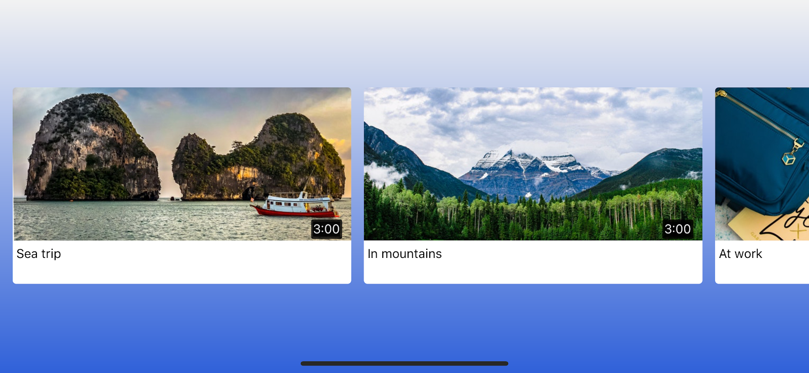

Nowadays there are [plenty of solutions](https://medium.freecodecamp.org/a-deeply-detailed-but-never-definitive-guide-to-mobile-development-architecture-6b01ce3b1528) to build an application for a mobile platform. If we are talking about the technology that feels native (uses native UI components), our company has successful experience in [building React Native applications](https://jtway.co/the-simplest-way-to-automate-delivery-of-your-react-native-application-f37f2c71eb1d). And now we decided to check other similar solutions that are built on top of React Native.

We are going to review it in a series of two articles. This is the first one, where we will touch on [Expo](https://expo.io/). Expo is quite popular and is even recommended in [Getting Started guide for React Native](https://facebook.github.io/react-native/docs/getting-started.html). But it differs a lot. Here we will go through the process of building an app with Expo and then make technology comparison based on the results.

## Formulate the problem

We want to build a video catalog app where a user can go through the list of videos, choose and watch a video. We are covering only a client part of the application here. Our big technology targets of exploration are Expo and TypeScript.

You can try out final product [here](https://expo.io/@jetthoughts/expo-video-catalogue-demo).

## Develop

Here we are going to go through the process of building an app from scratch. The process is divided into steps. Each step results in a fully functional app that you can run. The code is available [here](https://github.com/jetthoughts/expo-video-catalogue-demo). Also, the first commits in the repository are corresponding to the steps in this article.

By the way, I will use iPhone simulator for development. But it’s almost the same instruction for Android emulator or physical mobile device.

### Setup

First, we need to initialize the project.

 1. [Install Expo](https://docs.expo.io/versions/latest/guides/up-and-running.html)

 2. Create the project: expo init expo-video-catalogue-demo

 3. Start it: yarn ios

Now we have an empty Expo app that runs on a simulator and shows text: *Open up App.js to start working on your app!*

### Add TypeScript

Then we need to add TypeScript support. There is a good [instruction](https://github.com/janaagaard75/expo-and-typescript#setting-up-expo-and-react-native-with-typescript) on how to do this. So we will just follow it. You can check the resulting code [here](https://github.com/jetthoughts/expo-video-catalogue-demo/tree/61659189f3950b950343003ee90c5cf3fc25575f). Don’t forget to restart the app.

Now app works as before but we have support for TypeScript in src folder.

### Build a home screen

Let’s start to add real features. First thing is the home screen with a list of videos.

 1. Add landscape orientation. Change in app.json:

    "orientation": "landscape"

2. Use fixtures to fake API call for now.

Add fixture file for the list of videos:

```
[
  {
    "name": "Sea trip",
    "previewImage": "https://res.cloudinary.com/davhyl8f2/image/upload/v1539689606/pexels-photo-1481096_bknyjx.jpg",
    "id": "c1r342c2",
    "duration": "0:55"
  },
  {
    "name": "In mountains",
    "previewImage": "https://res.cloudinary.com/davhyl8f2/image/upload/v1539689606/pexels-photo-1480799_xe2h5h.jpg",
    "id": "432cr34r",
    "duration": "3:00"
  },
  {
    "name": "At work",
    "previewImage": "https://res.cloudinary.com/davhyl8f2/image/upload/v1539689606/pexels-photo-1478477_bddfuv.jpg",
    "id": "43rcc3rd",
    "duration": "4:12"
  }
]
```

Add fixture API that gets this list of videos:

```
export default {
  getVideos: () => {
    return {
      ok: true,
      data: require('../fixtures/Videos.json'),
    }
  },
}
```

3. Add carousel package:
```
    yarn add react-native-snap-carousel
```
4. Add screen itself. Add the main component, then its parts [VideoCarousel](https://gist.github.com/obliviusm/62f1bbfb51f428a0f6212787709e0236) and [PreviewSlide](https://gist.github.com/obliviusm/db1ad9f96cac6befed036b8d1c662e0e).

5. Add Spinner. It is used during API calls when there is no content yet.

```
import React from 'react'
import { View, ActivityIndicator } from 'react-native'
import styles from './Home/styles'
import { LinearGradient } from 'expo'

const Spinner = () => {
  return (
    <LinearGradient colors={['#F2F2F2', '#3061D9']} style={styles.loader}>
      <ActivityIndicator size="large" color="#fff" />
    </LinearGradient>
  )
}

export default Spinner
```

6. To connect Home screen with app change code in App.tsx:

```
import Home from './views/Home'
export default Home
```

Check the full code for this step [here](https://github.com/jetthoughts/expo-video-catalogue-demo/tree/9f4569e87bdcd4702141cb0d0c7f6506e2a99c8c). Now our app should look similar to the image. It shows some information on video previews and allows to scroll through the list.



### Build a video screen

The next step is to play a video.

 1. Use fixtures for video.

Add fixture to show video:

```

{
  "id": "c1r342c2",
  "name": "Sea trip",
  "uri": "https://www.videvo.net/videvo_files/converted/2016_11/videos/GOPR6239_1.mov34724.mp4",
  "nextVideoId": "c1r342c2"
}
```
Add one more method to fixture API to get a video:

```
getVideo: videoId => {
  return {
    ok: true,
    data: require('../fixtures/Video.json')
  }
}
```

2. Add dependencies.

Add a custom video player package. We forked @expo/videoplayer package to add a top bar with the back button and title. And also to update dependencies as it had a quite old Expo version.

    yarn add [https://github.com/jetthoughts/videoplayer/archive/v0.4.2.tar.gz](https://github.com/jetthoughts/videoplayer/archive/v0.4.2.tar.gz)

Add a router to switch between home screen and video player smoothly.

    yarn add react-native-router-flux

3. Replace App component with AppRouter

```
import React from 'react'
import { Scene, Router } from 'react-native-router-flux'
import Home from './views/Home'
import VideoPlayer from './views/VideoPlayer'

const AppRouter = () => (
  <Router>
    <Scene key="root" hideNavBar>
      <Scene key="Home" component={Home} initial />
      <Scene key="VideoPlayer" component={VideoPlayer} hideNavBar={true} />
    </Scene>
  </Router>
)

export default AppRouter
```

4. Add video screen [Playback](https://gist.github.com/obliviusm/4042d895185e7b466bb9263e9cb5cafc) .

This version of the app allows to choose a video, watch and use typical controls for the player. When a video is over it should switch to the next one.


### Add real API

The last thing is to use real API.

 1. Add library to make requests

    yarn add apisause

2. Add our API service [api.ts](https://gist.github.com/obliviusm/33181f6a9db1cb0801db87f8a04fa04a)

3. To use this service we need to replace FixtureApi in Playback and Home components:

    import api from '../../services/api'

That’s all — the app is done!

## Publish

To publish an app we need to create an account on *expo.io*. Then run command expo publish. Once it’s published, we can open it on our iOS or Android device. Also, any Android user can open our app inside Expo Client immediately. Our app is [here](https://expo.io/@jetthoughts/expo-video-catalogue-demo).

## Compare Expo vs React Native

Based on our experience with developing this app we can now make a comparison with React Native.

### Pros

 1. **Easy to get started and set up a project.** You don’t need to do much initial configuration, install studio/IDE or even simulator.

 2. **Rich Expo SDK.** The standard library has all kinds of things like using the camera, accelerometer, maps, location tracking, analytics, etc. You don’t need to install external packages, link native modules for Android and iOS.

 3. **Works both on iOS and Android.** You don’t need Mac to develop for iOS. If it works on one platform then it works on the other one too.

 4. **Simplified configure.** Configurations that you would typically prepare inside of your Xcode / plist files or Android studio / xml files are handled through app.json

 5. **A convenient way to develop on the device.** You can run your local app on any of your devices or in a simulator. No need for wires. It’s all done through Expo app.

 6. **The built-in way to share with testers.** Instead of having to sign up several external testers through iTunes connect, you can easily have them to download the Expo client app and immediately have a working version on their phone. Now it’s true for Android only though.

### Cons

 1. **You can’t use native modules with Expo.** Must stick to supported SDK’s.

 2. **The standard library is limited.** It is big but still doesn’t have all APIs like Bluetooth, WebRTC, FaceDetector, ARKit or Payments. Also, it has much fewer implementations. I.e. we needed a video player but there is only one player implementation in Expo and it’s quite old. On the contrary, you can find 5 different in React Native for sure.

 3. **Less flexibility compared to React Native Core.** Expo hides a lot of complexity behind and this results in fewer options for configuration.

 4. **No matter how fast the development team is, they will always be a bit behind React Native Core.** Because Expo is built on top of React Native.

 5. **Bigger app size.** The size for an Expo app on iOS is approximately 33mb (download), and Android is about 20mb. This is because Expo includes a bunch of APIs regardless of whether or not you are using them.

### Additional features

Furthermore, there are other features of Expo that were not explored in this article, like:

* **Deliver to the App Store or Google Play.** Expo has a set of features that should greatly simplify the process of delivering an app to the store and sending updates. It’s especially useful for App Store as it has a quite complicated process of accepting your app.

* **Eject to ExpoKit.** If Expo doesn’t provide access to a native module or API then you can eject and use ExpoKit instead. It has fewer features than Expo and it’s still not pure React Native.

## Conclusion

To summarize, in our opinion, Expo is a good choice for you in the next cases:

* **It’s your first React Native app.** You won’t have information overload and plenty of errors to fix. Also, you will see the only JavaScript code and no iOS/Android internals.

* **You need to prototype/deliver quickly.** I think all process from setup to the store should be fast and much simpler than with React Native.

* **You don’t need native modules or Expo has good support/recent updates for features you need.** I recommend to check it beforehand very carefully. In the case of our test app, it was not exactly the case: we had to fork the video player library to satisfy our needs.

But if you’re planning on long-term development, the feature list is obscure and you need the ability to make serious customizations then React Native looks much better.

Our company has got React Native experience and set up good process/pipelines for development, found and resolved some bugs/complications along the way. And in our case Expo doesn’t give that many conveniences to switch but introduces too many constraints.

In the next article, we will explore another cross-platform technology — [*ReactXP](https://microsoft.github.io/reactxp/)*. Stay tuned!

**Paul Keen** is an Open Source Contributor and a Chief Technology Officer at [JetThoughts](https://www.jetthoughts.com). Follow him on [LinkedIn](https://www.linkedin.com/in/paul-keen/) or [GitHub](https://github.com/pftg).
>  If you enjoyed this story, we recommend reading our [latest tech stories](https://jtway.co/latest) and [trending tech stories](https://jtway.co/trending).
