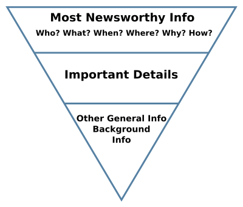
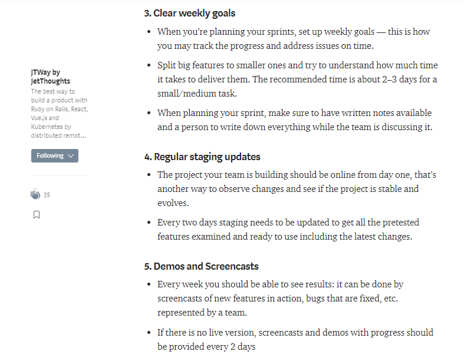

After 100 articles of the research on how to write Technical Blog post simple and quickly, without any stress, we can distinguish 3 main principles which helped us overcome this barrier and can definitely help you with writing. Learn with us how to improve your post’s readability!

 on [Unsplash](https://unsplash.com/s/photos/typing?utm_source=unsplash&utm_medium=referral&utm_content=creditCopyText)](file_0.jpeg)

## Start from Angle

What is Angle? It’s the laser-focused main point of your content. Everything you write starts with your angle. An easy way to visualize it to write a one or two-paragraph summary of what your content will be about.

There are a few components to formulating a strong angle, including:

* A unique perspective. What can you show your audience about a topic that no one else has covered yet?

* A laser focus. Which specific details will your content cover?

* Relevancy to a target audience. What would make someone want to read or watch your content?

## Frontloading

The approach of offering the most important information before filling in on the secondary details is called frontloading.

An effective frontloading distills the most important information for the reader. It helps readers quickly digest the announcement, decision, and when the new procedures go into effect. The reader doesn’t necessarily want to know all the background information that led to the decision. He or she likely wants to know “how does this information affect me?” and this principle should answer this question every time.

Why? Because it’s easier for users to scan a webpage to see if it is relevant for their needs. Nobody likes to spend their time, so if you make it clear in the first line or paragraph exactly what the page is about, users can quickly decide whether they want to read on or whether they’re on the wrong page and need to leave.

Here’s how you can apply the principles of frontloading:

* At the post level: Work on your post title and introduction.

* At the Sub-topics level: Sections are organized and ordered so that ideas flow intuitively from one point to the next.

* At the paragraph level: Your paragraph’s opening or leading sentence should summarize what that paragraph is about. Basically, you need to make your point right at the opening of each paragraph.

## Shortness is the key: by small steps

Just use short sentences, short paragraphs, and short posts. Never write more than two pages on any subject. Over time, try to write less, not more. In general, shorten everything.

*Note:* short does not mean that your writing can’t be stylistic and intelligent. Short means simple and understandable.

One more sub-header of this principle is the rule of 3 items. What is this?

## Rule of 3 items (sub-case)

While we reviewed all posts, we try to generalize one principle and called it “Rule of 3 items”. Where we limit items per each level to 3 items.

The main principles of this rule:

* Amount of sentences in a paragraph till 3

* Amount of paragraphs in a topic till 3

* Amount of topics till 3

* Amount of images till 3

* Amount of used lists and number of points in the list 3

Here is an example from our previous article [https://jtway.co/checklist-for-the-non-tech-founder-5c638133f899](https://jtway.co/checklist-for-the-non-tech-founder-5c638133f899)

**Ruslana** is a Lead Generation Manager at [JetThoughts](https://www.jetthoughts.com/). Follow her on [LinkedIn](https://www.linkedin.com/in/ruslana-brykaliuk-970016135/).
>  *If you enjoyed this story, we recommend reading our [latest tech stories](https://jtway.co/latest) and [trending tech stories](https://jtway.co/trending).*
