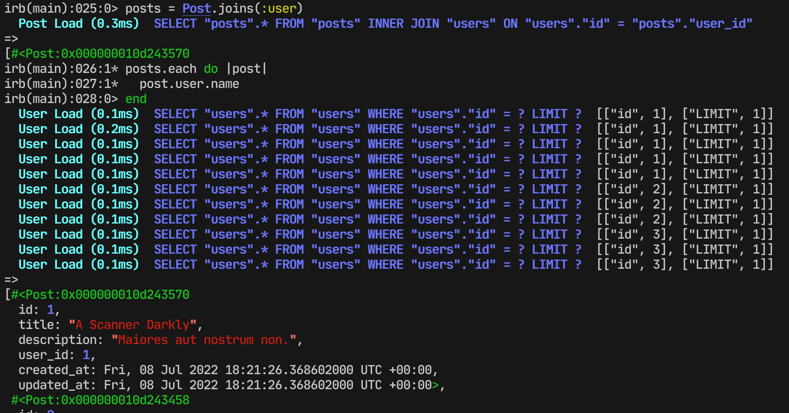

The main difference is that when using includes the eager loading is used. Eager loading allows you to optimize data retrieval by avoiding additional queries to the database.

Let’s see how it works with an example:

**Joins:**

We have joined tables, but we don’t get any data from the users table. Therefore, each time the user record is accessed, and there is an additional query to the database.

**Includes:**

As you can see, we don’t have any additional queries because we use eager loading and we get the data about the user from memory instead of querying the database.

