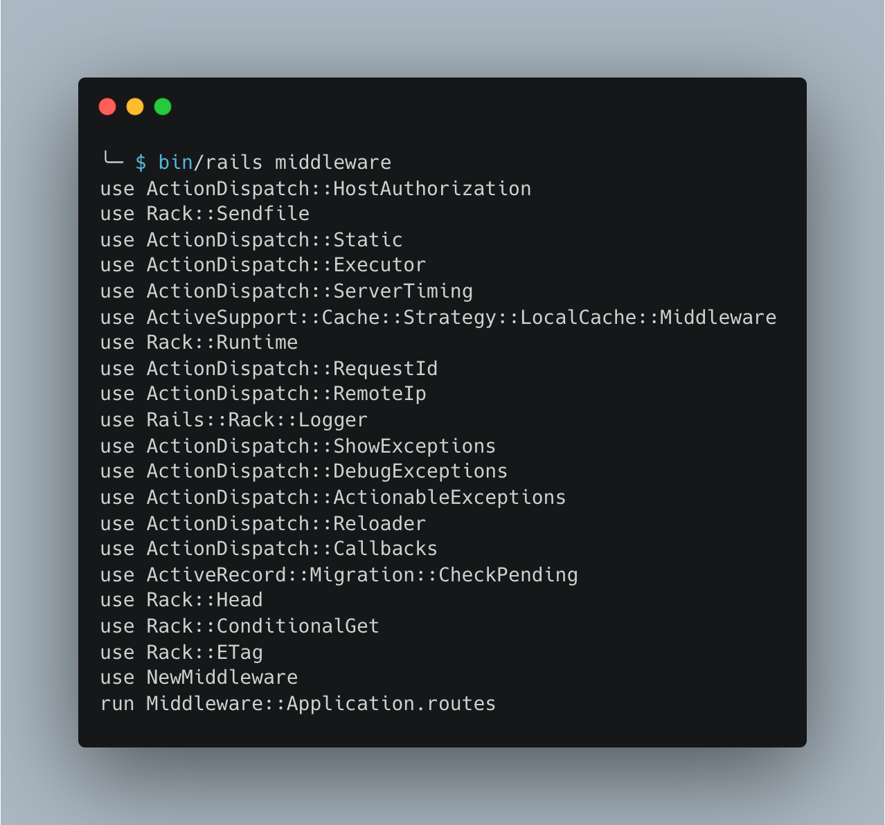

The middleware component sits between the client and the server, processing inbound requests and outbound responses. The middleware is used for tasks that are not related to business logic of your application.

A list of tasks that are commonly solved with the help of middleware:

- Caching
- Logging
- Sessions
- Performance & Usage Monitoring
- Security
- Serving static files (css, js, images, etc)

## How to make your own middleware.

Every Rails application is based on Rack server. Rack allow us to create middleware layers. Middleware must have call method, this is the interface that requires the Rake app.

To view a list of current middlewares, use the command: `bin/rails middleware.`

Then you should define your middleware in environment config:
`config/environment/<development/staging/etc.>.rb`

**You can add a new middleware to the middleware stack using any of the following methods:**

`config.middleware.use(new_middleware, args)` - Adds the new middleware at the bottom of the middleware stack.

`config.middleware.insert_before(existing_middleware, new_middleware, args)` - Adds the new middleware before the specified existing middleware in the middleware stack.

`config.middleware.insert_after(existing_middleware, new_middleware, args)` - Adds the new middleware after the specified existing middleware in the middleware stack.

Lets add super simple `FilterSecretKeyMiddleware`. It should replace secret_key in params with *.

```ruby
  config.middleware.use(FilterSecretKeyMiddleware)
```

Then we need to describe middleware. Lets place it to `lib/middleware/filter_secret_key_middleware.rb` :

```ruby
class FilterSecretKeyMiddleware
  def initialize app
    @app = app
  end

  def call(env)
    request = Rack::Request.new(env)

    request.params.map do |key, value|
      value.gsub!(/(.)/, "*") if key == "secret_key"
    end

    @app.call(env)
  end
end
```

So, lets try to add debug log to controller to make sure that this parameter does not get into the controller.

```ruby
class PostsController < ApplicationController
  # GET /posts
  def index
    @posts = Post.all
    puts params

    render json: @posts
  end
  ...
end
```

Then when we send GET request `http://localhost:3000/posts?param1=1&param2=test&secret_key=45vl3nb5k` we will see:

```bash
Started GET "/posts?param1=1&param2=testf&secret_key=[FILTERED]" for ::1 at 2022-11-21 12:50:12 +0300
Processing by PostsController#index as HTML
  Parameters: {"param1"=>"1", "param2"=>"testf", "secret_key"=>"[FILTERED]"}

#<ActionController::Parameters {"param1"=>"1", "param2"=>"test", 
"secret_key"=>"*********", "controller"=>"posts", 
"action"=>"index"} permitted: false>

  Post Load (0.3ms)  SELECT "posts".* FROM "posts"
  ↳ app/controllers/posts_controller.rb:12:in `index'
Completed 200 OK in 2ms (Views: 1.5ms | ActiveRecord: 0.3ms | Allocations: 824)
```
You can see that the controller received a modified value for the secret_key parameter.