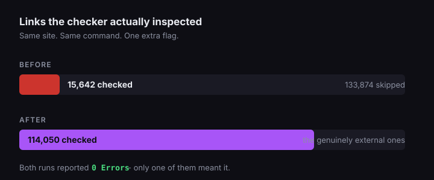

Our CI link checker reported zero broken links for months.

It was checking a tenth of the site.

Here is the number, from the run that caught it:

```
🔍 149516 Total  🔗 15642 Unique  ✅ 15642 OK  🚫 0 Errors  👻 133874 Excluded
```

**133,874 excluded.** That is not a filter doing its job - it is a green check mark attached to nothing, sitting on every pull request for as long as anyone on the team could remember seeing it any other way.

## The bug is one flag, and you probably have it too

We use [lychee](https://github.com/lycheeverse/lychee) with `--offline`, which is correct: internal link checking should not hit the network. The problem is what "internal" means after Hugo renders.

Production emits absolute URLs. Your `/blog/foo/` becomes `https://jetthoughts.com/blog/foo/` in the built HTML. And `--offline` drops every `http(s)` URI as external, by design.

So the crawler saw a page full of absolute links, classified all of them as "not my problem", and reported success on what remained - which on our homepage was a single skip-link anchor.

Adding `--remap` points the public origin back at the built tree:

```ruby
# Rakefile
task :links do
  dir  = ENV.fetch("OUTPUT_DIR", "_dest/public-linkcheck")
  root = File.expand_path(dir)

  sh("lychee", "--offline", "--no-progress",
    "--remap", "https://jetthoughts.com/(.*) file://#{root}/$1",
    "--root-dir", root, "#{dir}/**/*.html")
end
```

Same command, same flags, one addition. The next run:

```
🔍 149740 Total  🔗 31888 Unique  ✅ 114239 OK  🚫 0 Errors  👻 35501 Excluded
```

From 15,642 links checked to 114,239.



## Run this on your own repo before you keep reading

The diagnostic is cheap.

Whatever checker you run, it works the same way.

**Compare what your checker says it inspected against how many links your built site actually contains.**

```bash
# how many internal links does the built site actually contain?
grep -rhoE 'href="[^"]+"' public/ | wc -l

# now compare that to the "checked" number your CI prints
```

If your checker reports a few hundred links on a site that renders tens of thousands of them, it is not passing your build so much as abstaining from it.

## What it found the moment it could see

Five real defects, invisible until that flag changed:

- two wrong blog slugs, five links between them
- a post whose own `canonical_url` pointed at a 404
- a dead `/contact/` on a conversion page
- a closing section offering a downloadable ROI calculator - itemising five things inside it, promising "no email required, instant download" - for a spreadsheet that had never existed

That last one had been live long enough that nobody remembered writing it. It was a template ending nobody ever filled in, and every green run since had quietly confirmed that the page was in good shape.

## Then we went looking on purpose

The link checker was found by accident, which was the uncomfortable part. So we ran a deliberate exercise: **eight realistic defects, planted one at a time, with a prediction written down before each one about which check should catch it.**

Three of eight were caught.

Those written-down predictions mattered more than the score. Writing "the banned-phrase ratchet will catch this" before planting it turns a vague sense of coverage into a falsifiable claim - and two of those claims were wrong in a specific way.

One ratchet was carrying slack. It was set to fail above 14 hits when the tree actually had 11, so a planted phrase landed in the gap and the suite stayed green. A ratchet with three spare slots does not guard the last three defects.

```ruby
# The fix is boring: set the baseline to the MEASURED count,
# then prove it is exact by dropping it one lower and watching it fail.
RENDERED_BASELINE = 11   # was 14, against an actual 11

def test_rendered_pages_do_not_regress_on_banned_phrases
  violations = rendered_files.flat_map { |path| rendered_hits(path) }.sort

  assert_operator violations.size, :<=, RENDERED_BASELINE,
    "Banned phrases in BUILT HTML went up (baseline #{RENDERED_BASELINE}, " \
    "now #{violations.size}):\n  " + violations.join("\n  ")
end
```

Setting it to 10 and watching it fail takes fifteen seconds. It is the only thing separating a ratchet from a decoration.

## The one that should genuinely worry you

Our visual regression suite was passing because it compared screenshots against nothing.

Run from a git worktree, it lost its reference images and wrote fresh captures over them instead. Every run green. It had been green for a while.

Someone finally tested the tester: injected `body { background: red !important }`, confirmed the rule reached the built CSS bundle, confirmed the page referenced that fingerprinted file, then measured the captured PNG against the baseline.

Candidate `[255,0,0]` against a baseline of `[255,255,255]`, for a difference level of **0.68**.

The run reported `0 failures`.

Three earlier injections had failed to go red, and the person doing it had blamed their own injections each time. That is the honest shape of this problem: **when a check is broken, the evidence that it is broken is indistinguishable from everything being fine.**

## Say the number, not the name

Every one of these failures shared a tell, and it is cheap to look for: the check reported a verdict without ever reporting the size of the thing it had just examined.

A gate that reports `0 failures` is telling you about its exit code and nothing else. A gate that reports `114,239 links checked, 0 errors` is telling you what it actually inspected before it decided everything was fine. Only the second kind can be caught lying.

So: make every check print its denominator, and read it.

```
[snap_diff] 287 screenshots compared     # a real number you can watch move
lychee: 31,888 unique links checked      # not "link check passed"
```

If your CI output cannot distinguish "inspected everything and found nothing" from "inspected nothing", it is not a check. It is a green icon with a job title.

## What we do now, and what it costs

One rule, and it is not negotiable here.

A new test is not finished until someone has broken the thing it guards and watched it fail. Flaky failures do not count; this has to be deliberate, and someone has to be watching when it goes red.

That adds maybe two minutes to writing a test.

It is the highest-return two minutes in the suite, and worth more than a coverage percentage that cannot tell a working check apart from a decorative one.

If you want the exercise: pick your three most important checks, plant one realistic defect against each, and write down beforehand which one should catch it. You will learn more in an afternoon than a coverage report has told you all year.

## Sources

- [lychee](https://github.com/lycheeverse/lychee) - the link checker, and its `--offline` and `--remap` behaviour
- Tailscale, ["Tracking down the 16-year-old WAL-reset SQLite bug"](https://tailscale.com/blog/sqlite-wal-reset-bug) - SQLite carried a data-race bug for sixteen years, and its developers "had to add code to deliberately trigger it in their testing environments" before any test could see it
