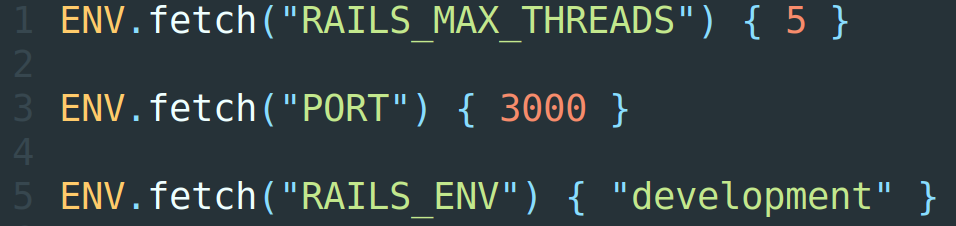

### The ENV variables should not be used outside the *config* folder. This rule will allow the developer to quickly find errors and places where they occurred and not keep in his head a bunch of dependency components.

What if the project has too many dependencies from the environment variables? This may lead to the formation of implicit dependencies, confuse the developer’s expectations.

For example, it could be a confusing logic when some components depend on other components, that depend on ENV variables. It is all not explicit, developers need to keep in mind that relations. This leads to increased development time, complicated onboarding process.

Finally, too many resources will be spent on supporting such code and its maintenance will become expensive.

One way to simplify this is to localize the use of ENV variables in a project.

### Restrict places of ENV variables usage

The *config* folder — is the only place, where the ENV variables are used for building the application state.

The configuration of the current working environment can be arranged in the *config* folder according to the following priorities:

 1. *initializers* subfolder

 2. *environments* subfolder

 3. *application.rb* file
>  The only exception is the test helpers. The ENV variables usage can greatly simplify or improve test execution.

By following this rule you can avoid problems with the implicit dependencies and your application behavior will be expected.

**Sergey Sviridov** is a Software Engineer at [JetThoughts](https://www.jetthoughts.com/). Follow him on [LinkedIn](https://www.linkedin.com/in/sergey-sviridov-83007199) or [GitHub](https://github.com/SviridovSV).
>  *If you enjoyed this story, we recommend reading our [latest tech stories](https://jtway.co/latest) and [trending tech stories](https://jtway.co/trending).*
