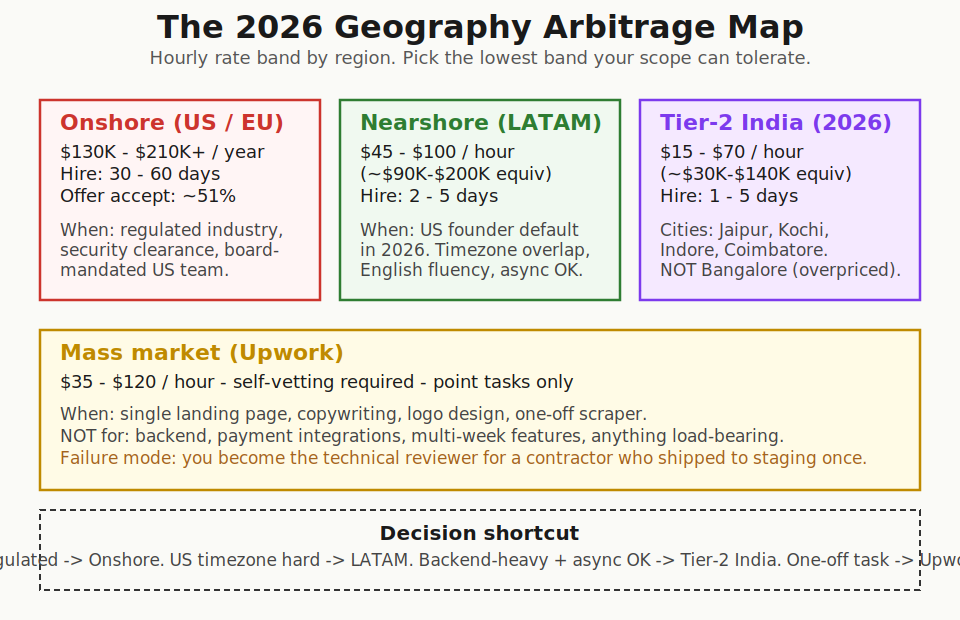
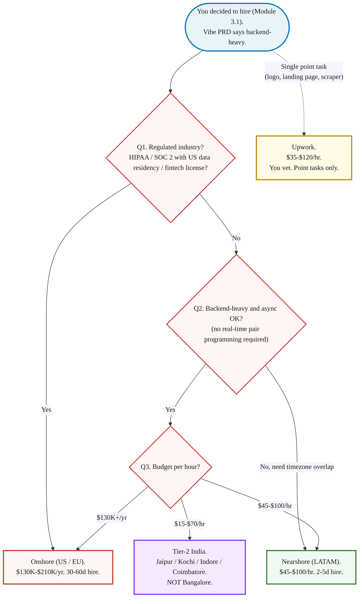

> **Module 4B · Step 1 of 4** · [Tech for Non-Technical Founders 2026](/blog/tech-for-non-technical-founders-2026/) free course.
> Input: a Module 3.1 decision to hire + a Vibe PRD with backend complexity above the self-serve ceiling. Output: a shortlist of 3-5 candidates from the right geography at the right rate, ready for the Module 4B.2 interview.

The Stanford CS grad is no longer the right hire for your pre-seed B2B SaaS. The right hire is a 7-year engineer in Indore making $40 an hour who directs Claude Code six hours a day. The 2026 [AI Job Disruption Report](https://www.aimagicx.com/blog/ai-job-disruption-report-roles-eliminated-created-2026) puts the AI-Augmented Developer at $85K-$120K Junior with Senior productivity, and the algorithm-interview specialist on the wrong side of a market the model now passes for free. This post tells you who to hire and where to find them.

## Why this matters in 2026

The developer hiring market reshaped between 2024 and 2026. Algorithm interviews stopped filtering for the skill that ships product because the model passes them. The new question is whether the candidate can own a system, direct AI tools, and put a thoughtful hand on the output before it merges. Most pre-seed founders are still hiring on the 2018 playbook. They post a job description that asks for "5+ years of React and Node.js," they pay a US recruiter to filter on Stanford and Google, and they spend $235K on a Senior who has never directed Cursor for a real shipped feature. The Russian-source ecosystem research summarised in [project research file 10.03](/blog/tech-for-non-technical-founders-2026/) puts the global Senior US salary at $235K with 51% offer-acceptance, while a Tier-2 India engineer with seven years of Rails ships the same feature at $40 an hour. The arbitrage is structural, not temporary.

## The 2026 AI-Augmented Developer profile

Pre-seed founders hire on resume signals that stopped predicting outcomes around 2024. The five criteria below are the new screen.

- **5 to 10 years of shipped engineering experience.** Not 0-3. The Junior who passes algorithm interviews is the Junior the model now replaces. The 5-10 year engineer is the one who knows where the load-bearing decisions live, which is the part the model still cannot do alone.
- **Daily user of at least one of Cursor, Claude Code, Aider, or Copilot.** Ask them to walk you through their `.cursorrules` file or their CLAUDE.md. If they cannot, they are not directing the tools, they are watching them.
- **Has shipped AI-generated code to production AND reviewed someone else's AI-generated code in pull request.** Both halves matter. Shipping alone produces the 45% security-flaw rate Veracode flagged in their [GenAI Code Security Report 2025](https://www.veracode.com/blog/genai-code-security-report/). Reviewing alone produces a senior who never tests the model's claims.
- **Can articulate where the AI is wrong.** A real AI-Augmented Developer will tell you, unprompted, that the model invents npm packages (the [slopsquatting](https://www.bleepingcomputer.com/news/security/ai-code-suggestions-sabotage-software-supply-chain/) attack vector), hallucinates database column names, and confidently rewrites authentication code that ships a CSRF hole. If they tell you the model is "amazing" and stop there, the screen is over.
- **Salary band: $85K-$120K Junior with Senior productivity, or $100K-$140K for the AI Integration Engineer specialty.** The market created two new roles in 2025-2026: [AI Integration Engineer](https://www.aimagicx.com/blog/ai-job-disruption-report-roles-eliminated-created-2026) at $100K-$140K (safe wiring of generative models into legacy stacks) and AI Quality Engineer at $90K-$120K (testing the code the model produces). The old Senior at $235K is a luxury, not a necessity for pre-seed.

A B2B SaaS founder we picked up in Q2 2026 had been paying $185K base for a San Francisco Senior the recruiter had pitched as "AI-native." The Senior wrote good code. He had also never opened Cursor for a real ship, did not know what an `.mdc` file was, and treated every contractor pull request as a code review on a junior. By month four the founder was shipping one feature every three weeks. Her fractional CTO ran the AI-Augmented Developer screen against the same role and the candidate she actually needed, a seven-year Rails engineer in Coimbatore at $42 an hour, was on a 3-day take-home test by the following Monday. The contractor shipped two features in his first sprint and caught a hallucinated Stripe webhook handler the SF Senior had nodded through in PR review the week before. The replacement cost was 22% of the original burn. The judgment was better.

## The 2026 geography arbitrage

The 2026 hire decision is not "remote vs in office." It is which of four regions the role belongs to.

### Onshore (US / EU)

$130K to $210K+ per year for a Senior. 30 to 60 day hire cycle. 51% offer-acceptance rate per [daily.dev's 2026 developer recruitment report](https://recruiter.daily.dev/resources/developer-recruitment-strategies-2026/). Pick this when the role demands it: regulated industry (HIPAA, SOC 2 with US-data-residency clauses, fintech with state licensing), security clearance, or a board mandate that the senior engineering hire sit in the US for fundraising optics. Otherwise the cost-to-output ratio is the worst on the map. Your nearshore engineer is going to ship the same feature for half the rate, and your Tier-2 India engineer for a quarter.

### Nearshore (LATAM)

$45 to $100 per hour, equivalent to $90K to $200K per year. 2 to 5 day hire cycle. Full timezone overlap with US Pacific through Eastern. The 2026 default for most US founders. English fluency at the level you need for daily standups and Slack discovery. The talent pool is dense in Argentina, Brazil, Mexico, and Colombia. Platforms like [LatHire](https://www.lathire.com/) pre-screen for engineering depth and English. The trade-off versus onshore is one phone call: instead of a US engineer who lives 30 minutes from your office, you get a Buenos Aires engineer who shares your business hours and ships the same backend at half the cost.

### Tier-2 offshore India (the 2026 frontier)

$15 to $70 per hour, equivalent to $30K to $140K per year. 1 to 5 day hire cycle. The Russian-source research summarised in the project's ecosystem study notes the structural shift away from overheated Bangalore (rates compressed by global hyperscaler offices) toward Tier-2 cities: Jaipur, Kochi, Indore, Coimbatore. Senior engineers with seven to ten years of production ships in these cities accept rates 20% to 30% below Bangalore because the local cost-of-living is lower and the local employer market is thinner. The catch: async-first culture. You will not get standups at 9am Pacific. You will get pull requests merged overnight, code reviewed against your CLAUDE.md by morning, and a Slack thread with answers to your async questions before you finish coffee. Pick this for backend-heavy work where async is acceptable. Avoid this for synchronous-pair-programming work or sales-engineering roles that need real-time customer calls.

### Mass-market (Upwork and equivalents)

$35 to $120 per hour. Self-vetting required: the marketplace does no quality screen, you become the technical interviewer. Acceptable for point tasks only. A single landing page. A logo. A one-off web scraper. A Notion-to-Slack bridge that runs nightly. Anything load-bearing (payments, auth, multi-tenant data, a third-party integration with retry logic) belongs on one of the three professional platforms above, not Upwork. Founders who skip this rule end up posting a [salvage or rebuild question](/blog/salvage-vs-rebuild-decision-tree/) about the auth system the Upwork contractor shipped in two weekends.

## The 7 platforms ranked

The hiring market for AI-Augmented Developers in 2026 lives across seven platforms. The ranking below assumes you have already chosen your geography from the section above.

- **[Toptal Fractional Executives](https://www.toptal.com/fractional/cto)** - Senior + screened, 3-5 day hire cycle, $90-$200/hr. Best for Senior fractional roles where the cost of a wrong hire would dwarf the platform markup.
- **[Bolster](https://bolster.com/marketplace/fractional-cto/)** - the largest curated fractional executive marketplace. Strong for fractional CTO and VP Engineering. Pricing data is transparent.
- **[GoCoFound](https://gocofound.com/)** - fractional CTO and fractional product specifically. Smaller pool, sharper match for pre-seed founders who already know the role they need.
- **[LatHire](https://www.lathire.com/)** - LATAM nearshore developers, full-time and contract. The default for US founders picking nearshore. Pre-screens for English fluency and engineering depth.
- **[AI People Agency](https://aipeople.agency/)** - AI-native engineer screening. Sub-48-hour candidate slates for AI Integration Engineer and AI Quality Engineer roles.
- **[Seedium](https://seedium.io/)** - AI-first software agency. Project work via SOW, not headcount. Pick this when you need a packaged delivery for a fixed scope, not a long-term engineer.
- **[Upwork](https://www.upwork.com/)** - mass-market freelance for point tasks only. Use it for the logo, the landing page, the scraper. Do not use it for the backend.

A non-technical founder reading this in 2026 should pick two platforms based on the geography decision above, post the role on both, and not waste a Friday on a tour of all seven.

## The Rails / Django / Laravel angle

Geography is the second filter. Framework experience is the first. Ask explicitly for engineers who have shipped multiple production apps in your framework. A 7-year Rails engineer in Tier-2 India at $40 an hour who has shipped 12 production Rails apps will outperform a 3-year React engineer in San Francisco at $180 an hour who has never shipped past staging. The framework experience is the load-bearing variable. The geography is what makes the rate work.

DHH calls Rails the [one-person framework](https://world.hey.com/dhh/the-one-person-framework-711e6318) for a reason: when the brief names the job and the framework hides the plumbing, one engineer ships in a week what the resume-driven path ships in a month. Django's batteries-included philosophy and Laravel's full-stack defaults follow the same logic. Pre-seed startups do not need microservices. They do not need a separate React frontend talking to a Node API talking to a Python ML service for a product with 18 paying users. They need one full-stack codebase that one engineer can understand end-to-end and deploy on a Tuesday afternoon. We covered the same shape in [Five Tech Words to Stop Nodding At](/blog/five-tech-words-stop-nodding-at/): the bigger the architecture word your contractor proposes, the smaller the validated problem they are usually building it for.

The fractional CTO from [Module 3.2](/blog/fractional-cto-bridge-5-hours-week/) is the person who runs the framework filter on your shortlist before you spend an hour on intro calls. Five minutes reading three GitHub PRs from the candidate's last Rails project filters faster than a 30-minute call. Your fractional CTO does this in their PR-review hour every week.

## What to do tomorrow

Three actions.

- **Pick 2 of the 7 platforms based on your geography choice.** If you picked nearshore, post on Toptal Fractional Executives and LatHire. If you picked Tier-2 India, post on AI People Agency and one direct LinkedIn search filtered to "Senior Engineer" + your framework + Jaipur OR Kochi OR Indore OR Coimbatore. Two platforms, not seven. Write the post once, reuse.
- **Post a job description with the AI-Augmented Developer profile criteria.** Five lines: (1) 5-10 years engineering, (2) daily Cursor or Claude Code or Aider user, (3) shipped Rails / Django / Laravel apps to production, (4) reviewed AI-generated code in pull request, (5) can articulate where the model is wrong. Skip "5+ years of React and Node." Skip "Big Tech experience preferred." Both screens filter against the wrong signal in 2026.
- **Schedule 5 intro calls this week.** Your goal is a 3-5 person shortlist by Friday. Use the same 4-question script for each call: (1) walk me through the last AI-augmented feature you shipped end to end, (2) show me your CLAUDE.md or `.cursorrules`, (3) when is the model most often wrong in your stack, (4) what is your current weekly availability. Reject any candidate who answers "the model is great, no issues" to question 3. That is the whole interview filter compressed into one question.

> Stop hiring the 2018 Senior at $235K. The 2026 hire is a 5-10 year engineer who directs Cursor or Claude Code six hours a day, costs $40-$80 an hour, and ships in async overnight. The arbitrage is structural, not temporary.

The companion artifact for this post is the [Where to Hire Developer 2026 Map](/blog/where-to-hire-developer-2026-map/). Print it, write your geography choice at the top, post the role to two platforms by Monday morning. The 4-region table, the 7-platform ranking, and a sample job description for the AI-Augmented Developer all live there in copy-pasteable form.

Founders who skip the AI-Augmented Developer screen and hire on Stanford-and-React signals are the founders who, six weeks later, post the [hiring interview question](/blog/should-you-hire-2026-decision-tree/) about why their $185K Senior takes three sprints to ship a Stripe webhook handler. The screen is cheaper than the wrong hire it prevents.

## Continue the course

This is **Module 4B · Step 1 of 4** in the free [Tech for Non-Technical Founders 2026](/blog/tech-for-non-technical-founders-2026/) course - 8 modules from idea to first paying users. Module 4B (Hire and Ship) starts here and ends with a signed SOW + kickoff scheduled.

| # | Module | Output you walk away with |
|---|---|---|
| 0 | Where Are You? | Self-assessment + your starting module |
| 1 | Validate the Problem | One-page validated problem statement |
| 2 | Design the Solution | One-page Product Brief (Vibe PRD) |
| 3 | Choose Your Build Path | Build decision: validate / self-serve / fractional CTO / hire |
| 4A | Ship Self-Serve (branch) | Live MVP at a staging URL |
| **4B** | **Hire & Ship (branch)** ← you are here | **Signed SOW, kickoff scheduled, code in YOUR GitHub org** |
| 5 | Manage Your Build | Weekly oversight rhythm |
| 6 | When Things Break | Salvage / rebuild decision |
| 7 | Manage AI-Era Risks | AI interrogation system |

**In Module 4B · Hire & Ship**: 4B.1 **Who You're Hiring in 2026 and Where to Find Them** ← you are here · 4B.2 The Hiring Interview That Catches AI Theater (next) · 4B.3 When Cheap Developers Get Expensive · 4B.4 [Reading the SOW Clause by Clause](/blog/reading-sow-clause-by-clause/).

The full course landing page (with all 11 artifacts) publishes after Module 5 ships. Until then, bookmark this post.

## Further reading

- AI Magic X, [The 2026 AI Job Disruption Report](https://www.aimagicx.com/blog/ai-job-disruption-report-roles-eliminated-created-2026) - new salary bands for AI-Augmented Developer ($85K-$120K Junior with Senior productivity), AI Integration Engineer ($100K-$140K), AI Quality Engineer ($90K-$120K). The data behind this post.
- daily.dev, [Developer Recruitment Strategies for 2026](https://recruiter.daily.dev/resources/developer-recruitment-strategies-2026/) - the structural numbers: 2M open roles, $235K Senior US salary, 51% offer-acceptance rate. Why the onshore market broke.
- Megha Verma, [Offshore Software Development in 2026: The No-BS Guide](https://medium.com/predict/offshore-software-development-in-2026-the-definitive-guide-d81f3e822c95) - the Tier-2 India hub shift (Jaipur, Kochi, Indore, Coimbatore) and the $15-$70/hr rate band.
- Stackademic, [How to Hire AI Developers: The Complete 2026 Guide](https://stackademic.com/blog/how-to-hire-ai-developers-the-complete-2026-guide) - vetting platforms, screening rubric, why generalists are the wrong AI hire.
- Veracode, [GenAI Code Security Report 2025](https://www.veracode.com/blog/genai-code-security-report/) - 45% of LLM-generated code shipped at least one exploitable security flaw. The data behind the "reviewed AI-gen code in PR" criterion.
- Langmeier Software, [Vibe coder vs. AI augmented developer comparison](https://www.langmeier-software.com/en/seiten/wissen/comparison-of-vibe-coder-vs-ai-augmented-developer) - a clean side-by-side of the two profiles, useful for distinguishing your candidate's actual mode of work.
- DHH, [The One-Person Framework](https://world.hey.com/dhh/the-one-person-framework-711e6318) - the Rails case for keeping the architecture small enough that one engineer ships outcomes end-to-end. The framework filter to apply before geography.
- Bleeping Computer, [AI code suggestions sabotage software supply chain](https://www.bleepingcomputer.com/news/security/ai-code-suggestions-sabotage-software-supply-chain/) - slopsquatting attack vector. The thing your candidate must spot in PR review.

---

Built by JetThoughts as part of the free Tech for Non-Technical Founders 2026 curriculum. See the full curriculum at [/blog/tech-for-non-technical-founders-2026/](/blog/tech-for-non-technical-founders-2026/).
