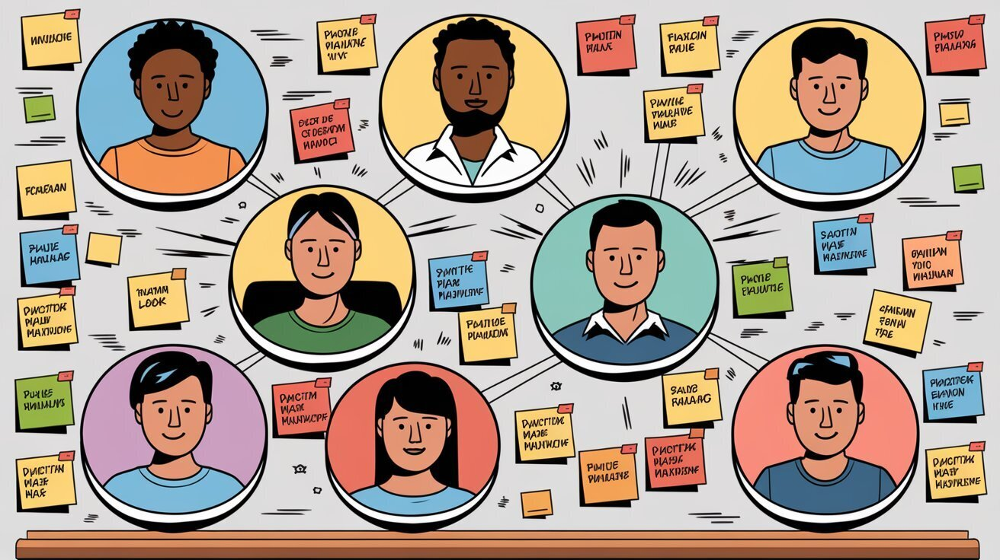
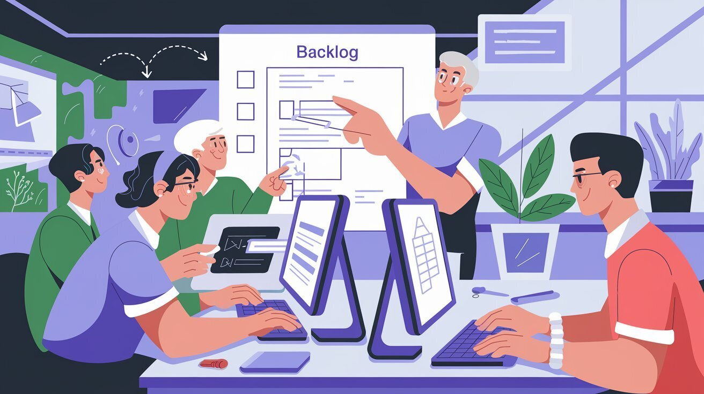

In the fast-paced world of startups, poor task management can cripple team productivity and drain profits. Many companies unknowingly harm their teams by assigning tasks directly from the backlog to individual developers. This practice can delay projects and increase costs by up to 50%.

In this article, we'll explore why this approach damages team collaboration and creates issues like code ownership. We'll also discuss how to enhance efficiency by fostering better teamwork.

### Individual Task Assignment Hurts Teamwork

Imagine a software startup called **TechFlow**. They assign tasks straight from the backlog to developers. Each person focuses only on their part. Developers lose sight of the big picture. The team stops working together and becomes a group of individuals.

**"Collaboration is key to how we work and we're here to help others. When we work together we know that we can achieve greater things."**  
— *GitLab Handbook, Collaboration Value*

Without shared responsibility, problems go unnoticed. Developers might think their job is done once they finish their task, even if it doesn't fit well with the rest of the project.

In Extreme Programming (XP), the principle of **Collective Ownership** encourages every developer to take responsibility for the entire codebase. This helps the team work faster and avoids bottlenecks caused by individual code ownership.

In business, this is like departments that don't communicate. Projects get delayed, decisions take longer, and the company loses time and money. In software development, this disconnection can be even more harmful. Problems in one part of the code can halt the entire project.

### The Problem with Code Ownership

At **TechFlow**, one developer, Alex, always works on the payment module. Only Alex understands that part of the code. One day, Alex goes on vacation. A critical bug appears in the payment system. The team can't fix it quickly because they aren't familiar with that code. The project gets delayed, and customers are unhappy.

**"At GitLab, we strive to avoid single points of failure. This means that no one team member should have exclusive knowledge or ownership over a particular area."**  
— *GitLab Handbook, Avoiding Single Points of Failure*

Code ownership like this hurts team morale. Developers focus only on their part and don't feel responsible for the project's success. They are less likely to help others. This damages collaboration and accountability, leading to slower progress and increased costs.

XP emphasizes that sharing responsibility for the codebase prevents these problems. When everyone can improve any part of the system, the team moves faster and works more efficiently.

### Lack of Team Support Lowers Productivity and Profits

When developers work alone, they miss chances to help each other. At **TechFlow**, Sarah struggles with a complex task but doesn't ask for help because everyone is focused on their own work. Her task takes much longer than it should. This lowers productivity and hurts the final product.

**"Collaboration is key to how we work and we're here to help others. When we work together we know that we can achieve greater things."**  
— *GitLab Handbook, Collaboration Value*

Without collaboration, mistakes go unnoticed. Bugs pile up, leading to delays that cost more money. Teams that don't collaborate miss out on learning from one another. Instead of growing together, they become weaker.

In a collaborative environment, developers share ideas and fix problems faster. When the whole team is involved, projects run smoother, the code improves, and everyone feels responsible for the outcome. This shortens development time and reduces costs.

### Individual Responsibility Increases Costs

Developers who are solely responsible for their tasks often feel isolated and overwhelmed. At **TechFlow**, Mark feels stressed because he's the only one handling database management. This leads to burnout. Burned-out employees are less productive, take longer to complete work, and make more mistakes. This delays the project and increases costs.

By implementing collective ownership, teams share the workload, reduce stress, and complete projects faster. Developers feel supported and can rely on each other for help.

**"It is important to distribute knowledge and responsibilities across team members to prevent over-reliance on a single individual."**  
— *GitLab Handbook, Avoiding Single Points of Failure*

Without effective collaboration, projects may take up to 50% more time to finish. More time means more money spent, which hurts the business.

### Solution: Use a Pull System for Task Management

A better way to manage tasks is to use a **pull system**. Instead of assigning tasks to developers, let them pull tasks from the backlog. This ensures that the most important work gets done first.

At **TechFlow**, they decide to implement a pull system. Developers pick the next highest-priority task from the backlog. This keeps work balanced and fair. It also reduces the risk of code ownership because anyone can work on any task. The team becomes more flexible and skilled.

**"By making information public, we can reduce the threshold to contribution and make collaboration easier."**  
— *GitLab Handbook, Transparency Value*

In XP, using a pull system helps prevent bottlenecks. When you avoid assigning tasks to specific people, the team works better together.

### Conclusion: Focus on Team Collaboration

To build a high-performing team, stop assigning tasks directly from the backlog to individual developers. This leads to isolated work, code ownership, and slower development. In the end, the business pays more for a project that takes too long.

Instead, create a system of collective ownership. Let developers work together to solve problems. Use a pull system for task management to keep work balanced and priorities clear. This improves team morale and increases productivity.

By fostering a collaborative environment and eliminating the siloed mentality, you create a team that is agile, effective, and invested in the project's success.

Your business will benefit from quicker project turnaround times, fewer delays, and reduced development costs—driving profitability and long-term growth.